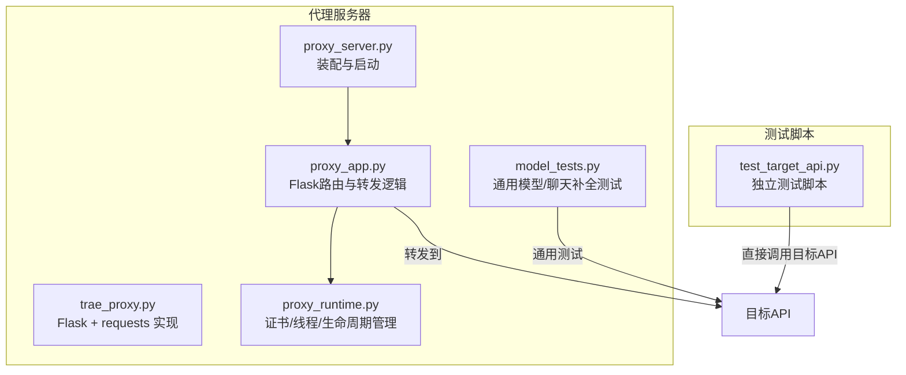
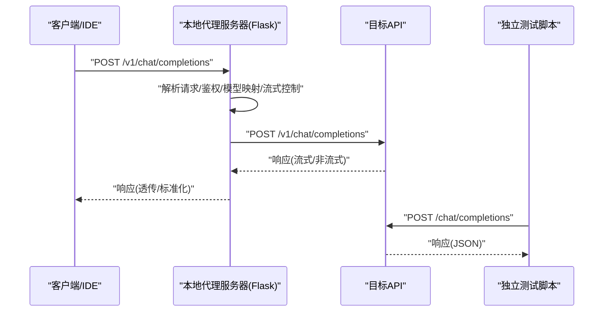
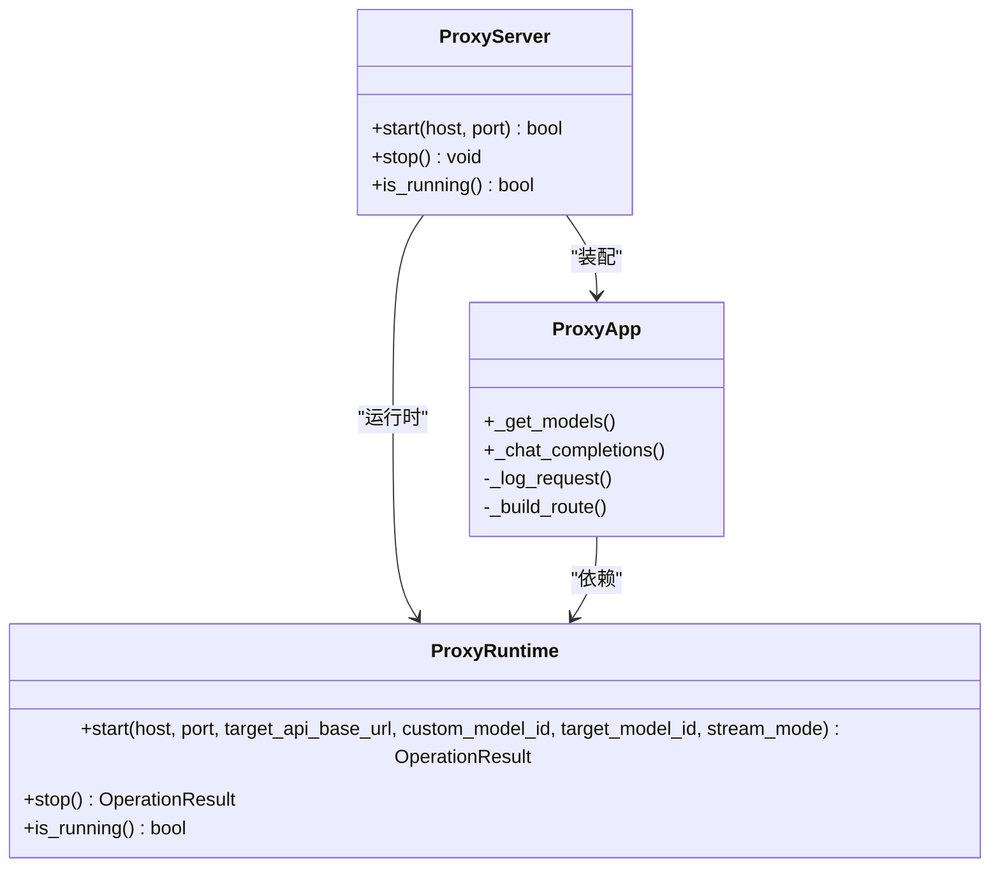
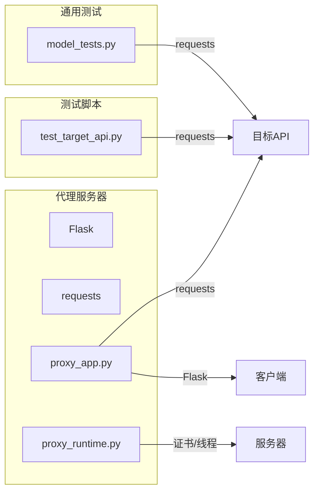

# 连接与API测试

<cite>
**本文引用的文件**
- [test_target_api.py](file://test_target_api.py)
- [README.md](file://README.md)
- [trae_proxy.py](file://archive/trae_proxy.py)
- [model_tests.py](file://modules/actions/model_tests.py)
- [proxy_server.py](file://modules/proxy/proxy_server.py)
- [proxy_app.py](file://modules/proxy/proxy_app.py)
- [proxy_runtime.py](file://modules/proxy/proxy_runtime.py)
</cite>

## 目录
1. [简介](#简介)
2. [项目结构](#项目结构)
3. [核心组件](#核心组件)
4. [架构总览](#架构总览)
5. [详细组件分析](#详细组件分析)
6. [依赖关系分析](#依赖关系分析)
7. [性能与超时配置](#性能与超时配置)
8. [故障排查指南](#故障排查指南)
9. [结论](#结论)
10. [附录](#附录)

## 简介
本指南面向需要验证目标API可达性与本地代理转发功能的用户，围绕独立测试脚本与图形化/脚本化代理服务器两条路径，提供从参数配置、执行测试到结果分析的完整流程。重点解释脚本输出的日志信息（请求头、响应状态码、错误详情），帮助区分网络问题、认证失败与模型不支持等问题类型；并扩展说明如何将测试结果与代理日志关联分析，验证请求是否正确通过本地代理转发。最后覆盖超时设置、流式响应测试与错误重试机制等高级场景，提升系统集成信心。

## 项目结构
本仓库包含两类测试与代理实现：
- 独立测试脚本：直接向目标API发起请求，便于快速验证连通性与基本行为。
- 本地代理服务器：将Trae IDE的请求转发至目标API，支持流式与非流式响应、调试日志与证书终止TLS。

图表来源
- [test_target_api.py](file://test_target_api.py#L1-L66)
- [trae_proxy.py](file://archive/trae_proxy.py#L1-L341)
- [model_tests.py](file://modules/actions/model_tests.py#L1-L228)
- [proxy_server.py](file://modules/proxy/proxy_server.py#L1-L65)
- [proxy_app.py](file://modules/proxy/proxy_app.py#L1-L462)
- [proxy_runtime.py](file://modules/proxy/proxy_runtime.py#L1-L218)

章节来源
- [README.md](file://README.md#L1-L306)

## 核心组件
- 独立测试脚本：提供最小化验证，支持设置基础URL、API密钥与模型ID，发送OpenAI格式请求，打印请求头、请求体与响应状态码、响应头与响应体。
- 本地代理服务器：提供与Trae IDE对接的完整链路，支持模型列表与聊天补全端点、流式/非流式响应、调试模式、证书加载与端口监听。
- 通用测试工具：模块化的模型列表与聊天补全测试，支持超时控制与错误分类，便于在UI或自动化流程中复用。

章节来源
- [test_target_api.py](file://test_target_api.py#L1-L66)
- [trae_proxy.py](file://archive/trae_proxy.py#L1-L341)
- [model_tests.py](file://modules/actions/model_tests.py#L1-L228)

## 架构总览
下面的序列图展示了从客户端到目标API的关键调用链，以及两种测试路径的差异。

图表来源
- [proxy_app.py](file://modules/proxy/proxy_app.py#L164-L458)
- [trae_proxy.py](file://archive/trae_proxy.py#L78-L301)
- [test_target_api.py](file://test_target_api.py#L15-L62)

## 详细组件分析

### 独立测试脚本：test_target_api.py
- 功能概述
  - 通过设置基础URL、API密钥与模型ID，构造OpenAI格式请求体，向目标API的聊天补全端点发起POST请求。
  - 输出请求头、请求体、响应状态码、响应头与响应体（JSON优先，否则文本）。
  - 包含超时控制与异常捕获，便于快速定位网络或目标API错误。
- 关键参数
  - TARGET_API_BASE_URL：目标API的基础URL（示例值见脚本注释）。
  - API_KEY：用于Authorization头的密钥（示例值见脚本注释）。
  - MODEL_ID：目标API所需的模型ID（示例值见脚本注释）。
- 输出解读
  - 请求头与请求体：用于确认是否携带正确的Authorization与模型信息。
  - 响应状态码：2xx表示成功，4xx/5xx表示目标API侧错误。
  - 响应头：可用于判断Content-Type与上游特性。
  - 响应体：JSON时打印美化输出；非JSON时打印原文，便于识别错误页面或非标准响应。
- 使用步骤
  1) 在脚本中填写TARGET_API_BASE_URL、API_KEY、MODEL_ID。
  2) 运行脚本，观察输出。
  3) 根据状态码与错误信息判断问题类型：网络超时/不可达、认证失败、模型不支持或上游错误。
- 高级场景
  - 超时：脚本使用固定超时，若上游响应较慢，可调整超时参数。
  - 流式响应：脚本默认非流式，便于调试；如需验证流式，可在目标API侧切换或使用代理服务器。

章节来源
- [test_target_api.py](file://test_target_api.py#L1-L66)

### 本地代理服务器：trae_proxy.py
- 功能概述
  - 提供/v1/models与/v1/chat/completions端点，接收Trae IDE请求并转发至目标API。
  - 支持流式/非流式响应，调试模式下记录请求与响应的详细日志。
  - 加载证书并监听443端口，配合hosts指向127.0.0.1 api.openai.com实现拦截。
- 关键参数
  - TARGET_API_BASE_URL：目标API基础URL。
  - CUSTOM_MODEL_ID：Trae中显示的模型ID。
  - TARGET_MODEL_ID：实际转发到上游的模型ID。
  - STREAM_MODE：None/True/False，强制控制上游请求的流式开关。
  - CERT_FILE/KEY_FILE：SSL证书与私钥路径。
- 调试模式
  - 启用--debug后，记录请求头、请求体、完整响应体与流式片段更新，并写入debug_request.log。
- 超时与错误处理
  - 上游POST请求设置较长超时，HTTP错误与网络异常分别返回相应状态码与错误信息。
- 使用步骤
  1) 准备证书与hosts，确保api.openai.com指向127.0.0.1。
  2) 配置TARGET_API_BASE_URL、CUSTOM_MODEL_ID、TARGET_MODEL_ID与证书路径。
  3) 运行脚本，观察启动日志与debug_request.log（调试模式）。
  4) 在Trae中配置OpenAI服务商与自定义模型ID，触发请求。
  5) 对比代理日志与debug_request.log，确认请求是否正确转发。

章节来源
- [trae_proxy.py](file://archive/trae_proxy.py#L1-L341)

### 通用测试工具：modules/actions/model_tests.py
- 功能概述
  - 提供模型列表与聊天补全的通用测试函数，支持超时、错误分类与内容预览。
  - 适合在UI或自动化流程中复用，快速验证目标API可用性与模型支持情况。
- 关键点
  - 超时：模型列表GET默认10秒，聊天补全POST默认30秒。
  - 错误分类：网络超时、网络错误、意外错误分别输出不同提示。
  - 内容预览：成功时输出响应内容前若干字符与tokens使用统计。

章节来源
- [model_tests.py](file://modules/actions/model_tests.py#L1-L228)

### 代理服务器装配与运行：modules/proxy/*
- ProxyServer：装配ProxyApp与ProxyRuntime，负责启动/停止与运行状态查询。
- ProxyApp：Flask路由与转发逻辑，支持模型映射、流式控制、调试日志与错误处理。
- ProxyRuntime：证书加载、线程管理、端口监听与错误码封装。

图表来源
- [proxy_server.py](file://modules/proxy/proxy_server.py#L1-L65)
- [proxy_app.py](file://modules/proxy/proxy_app.py#L1-L462)
- [proxy_runtime.py](file://modules/proxy/proxy_runtime.py#L1-L218)

章节来源
- [proxy_server.py](file://modules/proxy/proxy_server.py#L1-L65)
- [proxy_app.py](file://modules/proxy/proxy_app.py#L1-L462)
- [proxy_runtime.py](file://modules/proxy/proxy_runtime.py#L1-L218)

## 依赖关系分析
- 独立测试脚本仅依赖requests，直接调用目标API，适合快速验证。
- 本地代理服务器依赖Flask与requests，负责TLS终止、路由与转发，适合与IDE联调。
- 通用测试工具位于modules/actions，提供可复用的测试能力，便于集成到UI或自动化流程。

图表来源
- [test_target_api.py](file://test_target_api.py#L1-L66)
- [trae_proxy.py](file://archive/trae_proxy.py#L1-L341)
- [proxy_app.py](file://modules/proxy/proxy_app.py#L1-L462)
- [proxy_runtime.py](file://modules/proxy/proxy_runtime.py#L1-L218)
- [model_tests.py](file://modules/actions/model_tests.py#L1-L228)

章节来源
- [README.md](file://README.md#L160-L268)

## 性能与超时配置
- 独立测试脚本
  - 超时：脚本中使用固定超时，若上游响应较慢，可调整超时参数以避免早退。
  - 流式：默认非流式，便于调试；如需验证流式，可在目标API侧切换或使用代理服务器。
- 本地代理服务器
  - 超时：上游POST请求设置较长超时，适配大模型响应。
  - 流式：支持透传上游流式响应，调试模式下记录流式片段与完整响应体。
- 通用测试工具
  - 超时：模型列表GET默认10秒，聊天补全POST默认30秒，可根据网络状况调整。

章节来源
- [test_target_api.py](file://test_target_api.py#L40-L41)
- [trae_proxy.py](file://archive/trae_proxy.py#L172-L173)
- [model_tests.py](file://modules/actions/model_tests.py#L120-L191)

## 故障排查指南

### 一、独立测试脚本常见问题
- 网络问题
  - 现象：请求异常或超时。
  - 排查：确认TARGET_API_BASE_URL是否正确、网络可达、DNS解析正常。
- 认证失败
  - 现象：401/403状态码或明确的认证错误。
  - 排查：核对API_KEY是否正确、是否需要特定头部或签名。
- 模型不支持
  - 现象：400/422状态码或模型相关错误。
  - 排查：确认MODEL_ID是否为目标API支持的模型名。
- 响应非JSON
  - 现象：响应体为纯文本或HTML。
  - 排查：检查目标API是否返回非JSON错误页或中间件拦截。

章节来源
- [test_target_api.py](file://test_target_api.py#L58-L61)

### 二、本地代理服务器常见问题
- 端口占用
  - 现象：启动失败提示端口已被占用。
  - 排查：检查是否有其他服务占用443端口，必要时更换端口或停止占用进程。
- 证书问题
  - 现象：SSL/TLS握手失败或浏览器/IDE报错。
  - 排查：确认CA证书已安装到受信任的根证书颁发机构，CERT_FILE与KEY_FILE路径正确。
- 主机劫持
  - 现象：api.openai.com无法访问或被重定向。
  - 排查：确认hosts文件中存在指向127.0.0.1的条目且未被注释。
- 调试日志
  - 现象：日志过多或难以定位。
  - 排查：启用--debug模式，查看代理日志与debug_request.log，对比请求头、请求体与响应体。

章节来源
- [trae_proxy.py](file://archive/trae_proxy.py#L316-L341)
- [README.md](file://README.md#L209-L222)

### 三、结果与代理日志关联分析
- 确认请求是否到达代理
  - 在代理日志中查找收到请求的时间戳与路径（/v1/chat/completions）。
  - 若无日志，检查hosts与证书、端口占用与权限。
- 核对模型映射
  - 在代理日志中确认是否将客户端模型ID替换为目标模型ID。
  - 若未替换，检查CUSTOM_MODEL_ID与TARGET_MODEL_ID配置。
- 核对流式控制
  - 在代理日志中确认是否强制了流式模式（STREAM_MODE）。
  - 若客户端请求流式而代理返回非流式，检查STREAM_MODE配置。
- 核对上游响应
  - 在代理日志中确认上游响应状态码与Content-Type。
  - 若上游返回错误，结合目标API文档与错误信息定位问题。

章节来源
- [proxy_app.py](file://modules/proxy/proxy_app.py#L164-L458)
- [trae_proxy.py](file://archive/trae_proxy.py#L78-L301)

### 四、高级测试场景
- 超时设置
  - 独立测试脚本：根据上游响应特点调整超时参数。
  - 本地代理服务器：上游POST请求默认较长超时，适合大模型响应。
- 流式响应测试
  - 本地代理服务器：支持透传上游流式响应；调试模式下记录流式片段与完整响应体。
  - 独立测试脚本：默认非流式，便于调试；如需验证流式，可在目标API侧切换或使用代理服务器。
- 错误重试机制
  - 当前脚本未内置重试逻辑。建议在网络不稳定或上游偶发错误时，结合外部重试策略或在上层封装重试逻辑。

章节来源
- [test_target_api.py](file://test_target_api.py#L40-L41)
- [trae_proxy.py](file://archive/trae_proxy.py#L172-L173)
- [proxy_app.py](file://modules/proxy/proxy_app.py#L271-L458)

## 结论
- 独立测试脚本适合快速验证目标API的连通性与基本行为，便于区分网络、认证与模型层面的问题。
- 本地代理服务器提供与IDE对接的完整链路，支持流式/非流式响应与调试日志，便于深入分析请求与响应。
- 建议在集成初期先用独立测试脚本验证，再用代理服务器与IDE联调，最后结合调试日志与错误分类完善问题定位。

## 附录

### 使用步骤总览
- 独立测试脚本
  1) 在脚本中填写TARGET_API_BASE_URL、API_KEY、MODEL_ID。
  2) 运行脚本，观察输出。
  3) 根据状态码与错误信息判断问题类型。
- 本地代理服务器
  1) 准备证书与hosts，确保api.openai.com指向127.0.0.1。
  2) 配置TARGET_API_BASE_URL、CUSTOM_MODEL_ID、TARGET_MODEL_ID与证书路径。
  3) 运行脚本，观察启动日志与debug_request.log（调试模式）。
  4) 在Trae中配置OpenAI服务商与自定义模型ID，触发请求。
  5) 对比代理日志与debug_request.log，确认请求是否正确转发。

章节来源
- [README.md](file://README.md#L160-L268)
- [test_target_api.py](file://test_target_api.py#L1-L66)
- [trae_proxy.py](file://archive/trae_proxy.py#L1-L341)