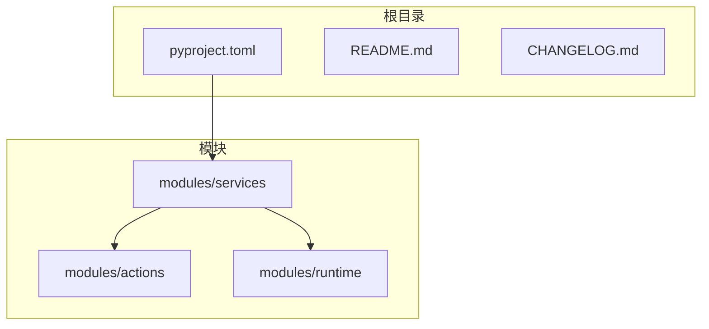
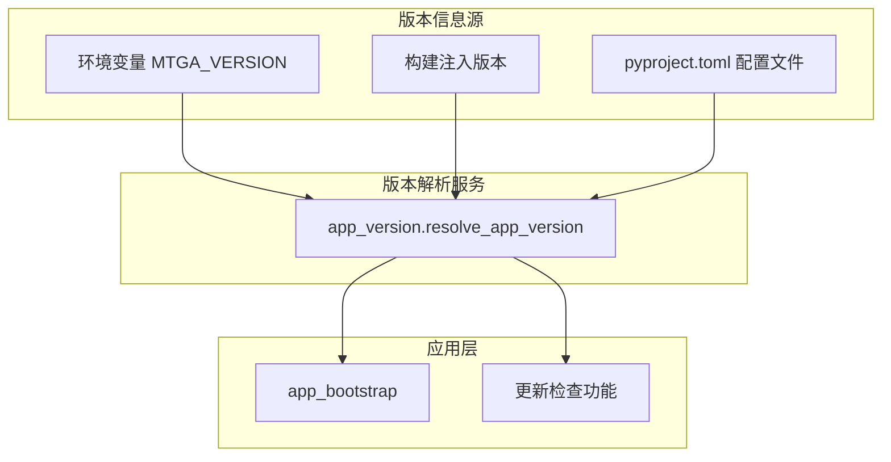
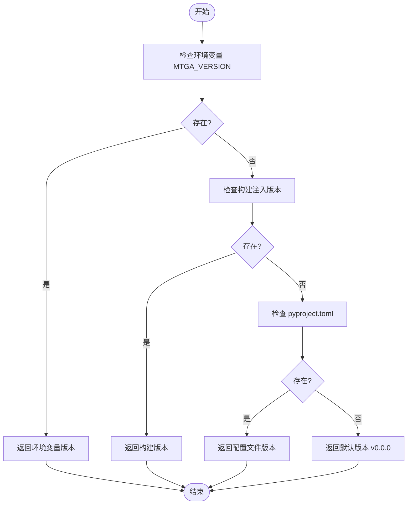
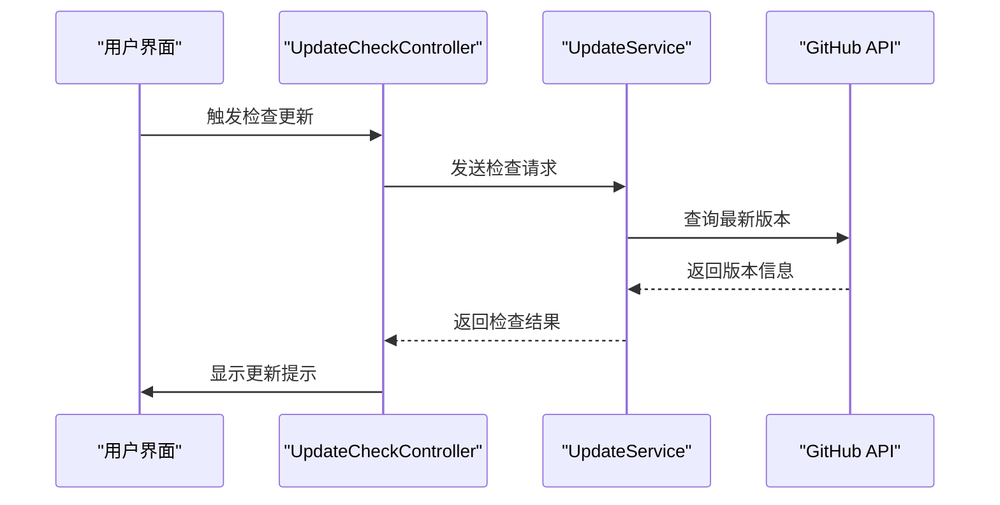
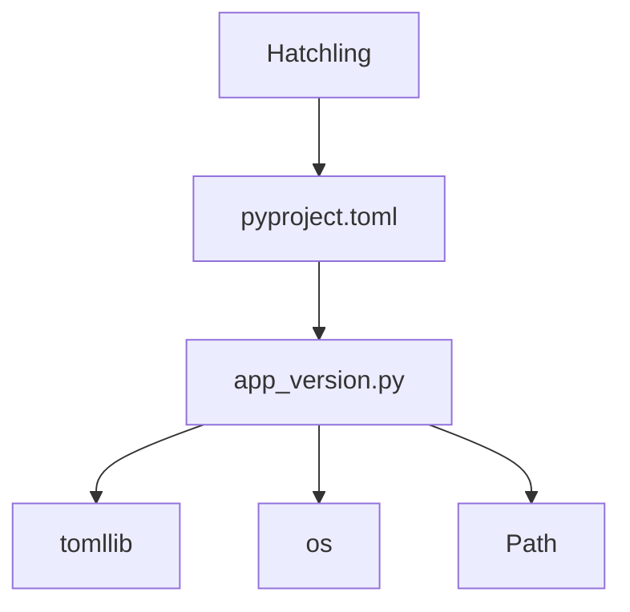

# 版本控制

<cite>
**本文档中引用的文件**   
- [pyproject.toml](file://pyproject.toml)
- [app_version.py](file://modules/services/app_version.py)
- [app_bootstrap.py](file://modules/services/app_bootstrap.py)
- [update_actions.py](file://modules/actions/update_actions.py)
- [CHANGELOG.md](file://CHANGELOG.md)
- [README.md](file://README.md)
</cite>

## 目录
1. [简介](#简介)
2. [项目结构](#项目结构)
3. [核心组件](#核心组件)
4. [架构概述](#架构概述)
5. [详细组件分析](#详细组件分析)
6. [依赖分析](#依赖分析)
7. [性能考虑](#性能考虑)
8. [故障排除指南](#故障排除指南)
9. [结论](#结论)
10. [附录](#附录)（如有必要）

## 简介
本文档详细说明了基于 `pyproject.toml` 文件中 `[project]` 字段的版本号管理机制，解释了如何遵循语义化版本控制（SemVer）规范进行主版本、次版本和修订号的递增。文档描述了版本号与 Git 标签的自动化同步策略，包括预发布版本（如 alpha、beta）的命名规则和分支管理策略。结合代码库中的实际配置示例，展示了版本元数据的定义方式及其在构建流程中的使用。同时，说明了版本变更对用户兼容性的影响，并提供了版本升级时的迁移指导建议。

## 项目结构
项目采用模块化分层架构，主要目录包括 `modules`（包含核心功能模块）、`docs`（文档）、`ca`（证书相关配置）和 `archive`（存档文件）。版本控制相关的核心配置位于项目根目录的 `pyproject.toml` 文件中，版本号信息通过 `modules/services/app_version.py` 模块进行解析和管理。

**图示来源**
- [pyproject.toml](file://pyproject.toml)
- [app_version.py](file://modules/services/app_version.py)

**本节来源**
- [pyproject.toml](file://pyproject.toml)
- [README.md](file://README.md)

## 核心组件
系统的核心版本管理机制基于 `pyproject.toml` 文件中的 `[project]` 字段，通过 `app_version.py` 模块实现版本号的解析和获取。版本号遵循语义化版本控制规范，支持从环境变量、构建注入和配置文件三个层级获取版本信息，确保版本管理的灵活性和可靠性。

**本节来源**
- [pyproject.toml](file://pyproject.toml#L5-L8)
- [app_version.py](file://modules/services/app_version.py#L12-L53)

## 架构概述
系统采用分层架构设计，版本管理作为基础服务层的一部分，为上层应用提供统一的版本信息访问接口。版本号的获取流程遵循优先级顺序：首先检查环境变量 `MTGA_VERSION`，其次尝试从构建时注入的模块获取，最后从 `pyproject.toml` 文件中读取。

**图示来源**
- [app_version.py](file://modules/services/app_version.py#L12-L53)
- [app_bootstrap.py](file://modules/services/app_bootstrap.py#L28-L32)

## 详细组件分析

### 版本号管理组件分析
版本号管理组件实现了灵活的版本信息获取策略，支持多种版本来源的优先级处理。组件通过 `resolve_app_version` 函数提供统一的接口，确保应用在不同运行环境下都能正确获取版本号。

#### 版本号解析逻辑

**图示来源**
- [app_version.py](file://modules/services/app_version.py#L12-L53)

**本节来源**
- [app_version.py](file://modules/services/app_version.py#L12-L53)
- [pyproject.toml](file://pyproject.toml#L7)

### 更新检查组件分析
更新检查组件利用版本号管理服务提供的信息，实现自动化的版本更新检测功能。组件通过 GitHub API 检查最新版本，并与当前版本进行比较，为用户提供更新提示。

#### 更新检查流程

**图示来源**
- [update_actions.py](file://modules/actions/update_actions.py#L47-L127)
- [app_bootstrap.py](file://modules/services/app_bootstrap.py#L32)

**本节来源**
- [update_actions.py](file://modules/actions/update_actions.py#L47-L127)
- [app_bootstrap.py](file://modules/services/app_bootstrap.py#L32)

## 依赖分析
版本管理组件依赖于 Python 标准库的 `tomllib` 模块来解析 TOML 格式的配置文件。在 Python 3.11 以下版本中，系统会自动降级处理，确保向后兼容性。构建系统依赖 Hatchling 工具来管理项目构建和发布流程。

**图示来源**
- [pyproject.toml](file://pyproject.toml#L2-L3)
- [app_version.py](file://modules/services/app_version.py#L7-L9)

**本节来源**
- [pyproject.toml](file://pyproject.toml#L2-L3)
- [app_version.py](file://modules/services/app_version.py#L7-L9)

## 性能考虑
版本号解析操作在应用启动时执行一次，结果被缓存以避免重复解析。对于性能敏感的场景，建议在构建时通过环境变量注入版本号，避免运行时文件 I/O 操作。版本检查功能采用异步执行模式，确保不会阻塞用户界面。

## 故障排除指南
当版本管理出现问题时，可参考以下常见问题及解决方案：

**本节来源**
- [error_codes.py](file://modules/runtime/error_codes.py#L11)
- [result_messages.py](file://modules/runtime/result_messages.py#L9)

### 常见问题
- **无法解析版本号**：检查 `pyproject.toml` 文件是否存在且格式正确，确认 `[project]` 字段中的 `version` 值有效。
- **更新检查失败**：检查网络连接是否正常，确认 GitHub API 访问不受防火墙限制。
- **版本显示异常**：检查环境变量 `MTGA_VERSION` 是否被意外设置，可能导致版本号显示不正确。

## 结论
本项目采用基于 `pyproject.toml` 的版本管理机制，遵循语义化版本控制规范，实现了灵活可靠的版本号管理。通过多层级的版本信息获取策略，确保了在不同部署环境下的兼容性。自动化更新检查功能为用户提供及时的版本升级提示，增强了用户体验。建议在发布新版本时，严格按照主版本、次版本、修订号的递增规则更新 `pyproject.toml` 文件中的版本号，并同步创建相应的 Git 标签。