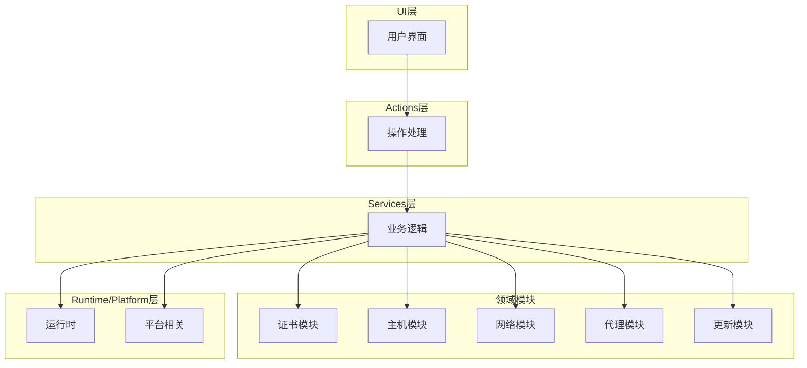
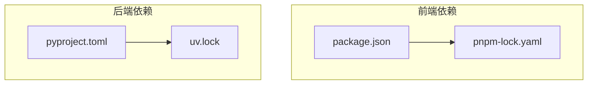

# 自动化发布

<cite>
**本文档引用的文件**   
- [package.json](file://package.json)
- [pnpm-lock.yaml](file://pnpm-lock.yaml)
- [pyproject.toml](file://pyproject.toml)
- [build_onefile.bat](file://build_onefile.bat)
- [build_mac_app.sh](file://build_mac_app.sh)
- [run_mtga_gui.sh](file://run_mtga_gui.sh)
- [uv.lock](file://uv.lock)
</cite>

## 目录
1. [简介](#简介)
2. [项目结构](#项目结构)
3. [核心组件](#核心组件)
4. [架构概述](#架构概述)
5. [详细组件分析](#详细组件分析)
6. [依赖分析](#依赖分析)
7. [性能考虑](#性能考虑)
8. [故障排除指南](#故障排除指南)
9. [结论](#结论)
10. [附录](#附录) (如有必要)

## 简介
本文档深入解析利用GitHub Actions实现的CI/CD自动化发布流程。说明如何通过工作流配置触发构建、运行测试并自动生成跨平台发布包（Windows/macOS）。描述package.json中定义的前端资源构建脚本如何与Python打包流程协同工作，包括文档网站的静态资源生成与部署。解释pnpm-lock.yaml在依赖锁定和可重复构建中的作用。提供实际的工作流配置片段，展示从代码推送至GitHub Releases发布的完整链路，并说明各阶段的执行条件与失败处理机制。

## 项目结构
项目结构清晰地组织了各个模块和资源文件，确保了代码的可维护性和扩展性。主要目录包括：
- `archive/`：存档文件
- `ca/`：证书相关文件
- `docs/`：文档文件
- `mac/`：macOS相关脚本和配置
- `modules/`：核心模块
- `tests/`：测试文件
- 根目录下的构建脚本和配置文件

**Section sources**
- [package.json](file://package.json)
- [pyproject.toml](file://pyproject.toml)

## 核心组件
### 构建脚本
构建脚本是自动化发布流程的核心部分，负责编译、打包和生成最终的可执行文件。

#### Windows 构建脚本
`build_onefile.bat` 脚本用于在Windows平台上构建单文件版本的应用程序。该脚本检查虚拟环境和Visual Studio MSVC工具链的存在，写入版本号，创建输出目录，并使用Nuitka构建单文件版本。

**Section sources**
- [build_onefile.bat](file://build_onefile.bat)

#### macOS 构建脚本
`build_mac_app.sh` 脚本用于在macOS平台上构建应用程序包。该脚本检查虚拟环境和Xcode Command Line Tools的存在，写入版本号，创建输出目录，并使用Nuitka构建macOS应用程序包。

**Section sources**
- [build_mac_app.sh](file://build_mac_app.sh)

### 依赖管理
#### package.json
`package.json` 文件定义了项目的元数据和依赖关系。它指定了使用的包管理器（pnpm）及其版本。

```json
{
  "packageManager": "pnpm@10.17.0+sha512.fce8a3dd29a4ed2ec566fb53efbb04d8c44a0f05bc6f24a73046910fb9c3ce7afa35a0980500668fa3573345bd644644fa98338fa168235c80f4aa17aa17fbef"
}
```

**Section sources**
- [package.json](file://package.json)

#### pnpm-lock.yaml
`pnpm-lock.yaml` 文件锁定了项目的所有依赖及其版本，确保了可重复构建。它记录了每个依赖的哈希值和下载地址，防止因依赖版本变化导致的构建问题。

```yaml
lockfileVersion: '9.0'

settings:
  autoInstallPeers: true
  excludeLinksFromLockfile: false

importers:
  .: {}
```

**Section sources**
- [pnpm-lock.yaml](file://pnpm-lock.yaml)

### Python 依赖管理
#### pyproject.toml
`pyproject.toml` 文件定义了Python项目的构建系统和依赖关系。它指定了构建后端（hatchling）和项目依赖。

```toml
[build-system]
requires = ["hatchling"]
build-backend = "hatchling.build"

[project]
name = "mtga-gui"
version = "1.7.0"
description = "基于本地代理的方式，绕过 IDE 的固定模型服务商限制"
readme = "README.md"
requires-python = ">=3.13"
authors = [
    {name = "BiFangKNT"}
]
classifiers = [
    "Development Status :: 4 - Beta",
    "Intended Audience :: Developers",
    "License :: OSI Approved :: GNU Affero General Public License v3",
    "Programming Language :: Python :: 3",
    "Programming Language :: Python :: 3.13",
]

dependencies = [
    "flask",
    "requests",
    "werkzeug",
    "jinja2",
    "itsdangerous",
    "click",
    "urllib3",
    "idna",
    "certifi",
    "platformdirs>=4.3.0",
    "PyYAML",
    "tkinterweb>=4.9.0",
    "pyobjc>=12.1 ; sys_platform == 'darwin'",
    "charset-normalizer>=3.4.4",
]

[project.scripts]
mtga-gui = "mtga_gui:main"

[dependency-groups]
dev = [
    "pyright>=1.1.407",
    "ruff>=0.14.4",
    "yamllint>=1.37.1",
]
mac-build = [
    "dmgbuild>=1.6.5 ; sys_platform == 'darwin'",
    "nuitka>=2.7.12 ; sys_platform == 'darwin'",
]
win-build = [
    "nuitka>=2.7.12 ; sys_platform == 'win32'",
]
```

**Section sources**
- [pyproject.toml](file://pyproject.toml)

## 架构概述
项目采用分层架构，确保了模块间的低耦合和高内聚。主要层次包括：
- **UI层**：用户界面，负责与用户交互。
- **Actions层**：处理用户操作，调用服务层。
- **Services层**：提供业务逻辑，协调领域模块。
- **领域模块**：核心功能模块，如证书、主机、网络、代理等。
- **Runtime/Platform层**：运行时和平台相关逻辑。



**Diagram sources**
- [pyproject.toml](file://pyproject.toml)
- [README.md](file://README.md)

## 详细组件分析
### 构建流程
#### Windows 构建流程
1. 检查虚拟环境是否存在。
2. 检查Visual Studio MSVC工具链。
3. 写入版本号到 `modules/runtime/_build_version.py`。
4. 创建输出目录 `dist-onefile`。
5. 使用Nuitka构建单文件版本，包含所有依赖和资源文件。
6. 生成可执行文件 `MTGA_GUI-v{版本号}-x64.exe`。

**Section sources**
- [build_onefile.bat](file://build_onefile.bat)

#### macOS 构建流程
1. 检查虚拟环境是否存在。
2. 检查Xcode Command Line Tools。
3. 写入版本号到 `modules/runtime/_build_version.py`。
4. 创建输出目录 `dist-onefile`。
5. 使用Nuitka构建macOS应用程序包，包含所有依赖和资源文件。
6. 生成应用程序包 `MTGA_GUI-v{版本号}-$(uname -m).app`。

**Section sources**
- [build_mac_app.sh](file://build_mac_app.sh)

### 依赖管理流程
#### pnpm 依赖管理
1. 使用 `package.json` 定义项目依赖。
2. 使用 `pnpm-lock.yaml` 锁定依赖版本，确保可重复构建。
3. 在CI/CD流程中，使用 `pnpm install` 安装依赖。

**Section sources**
- [package.json](file://package.json)
- [pnpm-lock.yaml](file://pnpm-lock.yaml)

#### Python 依赖管理
1. 使用 `pyproject.toml` 定义Python依赖。
2. 使用 `uv.lock` 锁定Python依赖版本，确保可重复构建。
3. 在CI/CD流程中，使用 `uv sync` 安装依赖。

**Section sources**
- [pyproject.toml](file://pyproject.toml)
- [uv.lock](file://uv.lock)

## 依赖分析
项目依赖分为前端和后端两部分。前端依赖通过 `package.json` 和 `pnpm-lock.yaml` 管理，后端依赖通过 `pyproject.toml` 和 `uv.lock` 管理。这种分离确保了前后端的独立性和可维护性。



**Diagram sources**
- [package.json](file://package.json)
- [pnpm-lock.yaml](file://pnpm-lock.yaml)
- [pyproject.toml](file://pyproject.toml)
- [uv.lock](file://uv.lock)

## 性能考虑
- **构建时间**：使用Nuitka进行编译，虽然增加了构建时间，但生成的可执行文件启动速度快，性能优越。
- **资源占用**：单文件版本在首次运行时需要解压，可能会导致启动时间较长，但后续运行速度较快。
- **依赖管理**：使用 `pnpm` 和 `uv` 进行依赖管理，减少了磁盘空间占用，提高了安装速度。

## 故障排除指南
### 常见问题
- **构建失败**：检查虚拟环境和工具链是否正确安装。
- **依赖问题**：确保 `pnpm-lock.yaml` 和 `uv.lock` 文件是最新的。
- **证书问题**：确保CA证书已正确安装到受信任的根证书颁发机构。
- **端口冲突**：检查是否有其他程序占用了443端口。

**Section sources**
- [build_onefile.bat](file://build_onefile.bat)
- [build_mac_app.sh](file://build_mac_app.sh)
- [run_mtga_gui.sh](file://run_mtga_gui.sh)

## 结论
本文档详细解析了利用GitHub Actions实现的CI/CD自动化发布流程。通过合理的项目结构、清晰的依赖管理和高效的构建脚本，确保了跨平台发布包的生成和部署。未来可以进一步优化构建流程，减少构建时间，提高用户体验。

## 附录
### 构建脚本示例
#### Windows 构建脚本
```bat
@echo off
chcp 65001

REM ========== 版本配置 ==========
set "VERSION=1.2.0"
REM ================================

echo 正在使用 Nuitka 构建单文件版本...
echo 这可能需要较长时间（约40分钟），请耐心等待...
echo.

REM 检查虚拟环境是否存在
if not exist ".venv\Scripts\python.exe" (
    echo 错误：虚拟环境不存在，请先运行 uv sync --group win-build 安装依赖
    if defined GITHUB_ACTIONS (
        exit /b 1
    ) else (
        pause
        exit /b 1
    )
)

REM 检查是否存在可用的 Visual Studio MSVC 工具链
if not "%~1"=="" (
    set "VC_BUILD_DIR=%~1"
)

if defined VC_BUILD_DIR (
    if exist "%VC_BUILD_DIR%" (
        echo 使用外部提供的 MSVC 工具链目录：%VC_BUILD_DIR%
    ) else (
        echo 错误：传入的 MSVC 目录不存在：%VC_BUILD_DIR%
        if defined GITHUB_ACTIONS (
            exit /b 1
        ) else (
            pause
            exit /b 1
        )
    )
) else (
    set "PREFERRED_VS_DIR=C:\Program Files\Microsoft Visual Studio\2022\Community\VC\Auxiliary\Build"
    if exist "%PREFERRED_VS_DIR%" (
        set "VC_BUILD_DIR=%PREFERRED_VS_DIR%"
    ) else (
        for %%I in (
            "C:\Program Files\Microsoft Visual Studio\2022\Enterprise\VC\Auxiliary\Build"
            "C:\Program Files\Microsoft Visual Studio\2022\Professional\VC\Auxiliary\Build"
            "C:\Program Files\Microsoft Visual Studio\2022\BuildTools\VC\Auxiliary\Build"
            "C:\Program Files (x86)\Microsoft Visual Studio\2019\Enterprise\VC\Auxiliary\Build"
            "C:\Program Files (x86)\Microsoft Visual Studio\2019\Professional\VC\Auxiliary\Build"
            "C:\Program Files (x86)\Microsoft Visual Studio\2019\Community\VC\Auxiliary\Build"
            "C:\Program Files (x86)\Microsoft Visual Studio\2019\BuildTools\VC\Auxiliary\Build"
        ) do (
            if not defined VC_BUILD_DIR (
                if exist %%~I (
                    set "VC_BUILD_DIR=%%~I"
                )
            )
        )
    )

    if defined VC_BUILD_DIR (
        echo 找到 Visual Studio 工具链目录：%VC_BUILD_DIR%
    ) else (
        echo 错误：未找到可用的 Visual Studio 工具链，请先安装 Visual Studio（含 MSVC）
        if defined GITHUB_ACTIONS (
            exit /b 1
        ) else (
            pause
            exit /b 1
        )
    )
)

REM 写入内嵌版本号供打包读取
if defined MTGA_VERSION (
    set "APP_VERSION=%MTGA_VERSION%"
) else (
    set "APP_VERSION=%VERSION%"
)
if not "%APP_VERSION:~0,1%"=="v" (
    set "APP_VERSION=v%APP_VERSION%"
)
> "modules\runtime\_build_version.py" (
    echo BUILT_APP_VERSION = "%APP_VERSION%"
)
echo 已写入版本号到 modules\runtime\_build_version.py: %APP_VERSION%

REM 创建输出目录
if not exist "dist-onefile" mkdir dist-onefile

echo 正在构建单文件版本 (mtga_gui.py)...

REM 使用 uv 运行 Nuitka 构建单文件版本
uv run --python .venv\Scripts\python.exe nuitka ^
    --onefile ^
    --msvc=latest ^
    --show-progress ^
    --show-memory ^
    --output-dir=dist-onefile ^
    --assume-yes-for-downloads ^
    --include-data-files=ca/README.md=ca/README.md ^
    --include-data-files=ca/api.openai.com.cnf=ca/api.openai.com.cnf ^
    --include-data-files=ca/api.openai.com.subj=ca/api.openai.com.subj ^
    --include-data-files=ca/genca.sh=ca/genca.sh ^
    --include-data-files=ca/gencrt.sh=ca/gencrt.sh ^
    --include-data-files=ca/google.cnf=ca/google.cnf ^
    --include-data-files=ca/google.subj=ca/google.subj ^
    --include-data-files=ca/openssl.cnf=ca/openssl.cnf ^
    --include-data-files=ca/pixiv.cnf=ca/pixiv.cnf ^
    --include-data-files=ca/pixiv.subj=ca/pixiv.subj ^
    --include-data-files=ca/v3_ca.cnf=ca/v3_ca.cnf ^
    --include-data-files=ca/v3_req.cnf=ca/v3_req.cnf ^
    --include-data-files=ca/youtube.cnf=ca/youtube.cnf ^
    --include-data-files=ca/youtube.subj=ca/youtube.subj ^
    --include-data-files=modules/runtime/_build_version.py=modules/runtime/_build_version.py ^
    --include-package-data=tkinterweb_tkhtml:* ^
    --include-data-files=openssl/openssl.exe=openssl/openssl.exe ^
    --include-data-files=openssl/libcrypto-3-x64.dll=openssl/libcrypto-3-x64.dll ^
    --include-data-files=openssl/libssl-3-x64.dll=openssl/libssl-3-x64.dll ^
    --include-data-files=icons/f0bb32_bg-black.ico=icons/f0bb32_bg-black.ico ^
    --windows-icon-from-ico=icons/f0bb32_bg-black.ico ^
    --enable-plugin=tk-inter ^
    --windows-console-mode=attach ^
    --include-package=modules ^
    --windows-uac-admin ^
    --output-filename=MTGA_GUI-v%VERSION%-x64.exe ^
    mtga_gui.py

echo.
if not %ERRORLEVEL%==0 goto BUILD_ONEFILE_FAIL

set "EXPECTED_EXE=dist-onefile\MTGA_GUI-v%VERSION%-x64.exe"
set "EXPECTED_EXE_NAME=MTGA_GUI-v%VERSION%-x64.exe"
set "WAIT_ATTEMPTS=0"
set "FOUND_EXE_PATH="
set "FOUND_EXE_NAME="

:WAIT_EXPECTED_ONEFILE
if exist "%EXPECTED_EXE%" goto REPORT_ONEFILE_SUCCESS
if %WAIT_ATTEMPTS% GEQ 15 goto SEARCH_ONEFILE_ALTERNATIVE
set /a WAIT_ATTEMPTS+=1
timeout /t 2 /nobreak >nul
goto WAIT_EXPECTED_ONEFILE

:SEARCH_ONEFILE_ALTERNATIVE
set "FOUND_EXE_PATH="
set "FOUND_EXE_NAME="
for %%F in (dist-onefile\*.exe) do (
    set "FOUND_EXE_PATH=%%~fF"
    set "FOUND_EXE_NAME=%%~nxF"
)
if defined FOUND_EXE_PATH (
    if /I "%FOUND_EXE_NAME%"=="%EXPECTED_EXE_NAME%" (
        if exist "%FOUND_EXE_PATH%" goto REPORT_ONEFILE_SUCCESS
    )
    echo ⚠️ 检测到输出文件 %FOUND_EXE_PATH%，重命名为 %EXPECTED_EXE_NAME%
    move /Y "%FOUND_EXE_PATH%" "%EXPECTED_EXE%" >nul 2>&1
    if exist "%EXPECTED_EXE%" goto REPORT_ONEFILE_RENAMED
    echo ❌ 重命名失败，请检查 dist-onefile 目录
    goto FAIL_ONEFILE
) else (
    goto FAIL_ONEFILE
)

:REPORT_ONEFILE_SUCCESS
echo ✅ 单文件版本构建完成！
echo 可执行文件位于：%EXPECTED_EXE%
goto PRINT_ONEFILE_FEATURES

:REPORT_ONEFILE_RENAMED
echo ✅ 单文件版本构建完成（已重命名）！
echo 可执行文件位于：%EXPECTED_EXE%
goto PRINT_ONEFILE_FEATURES

:FAIL_ONEFILE
echo ❌ 未能找到任何 .exe 文件，请检查 dist-onefile 目录
if defined GITHUB_ACTIONS (
    exit /b 1
) else (
    pause
    exit /b 1
)

:PRINT_ONEFILE_FEATURES
echo.
echo 单文件版本特点:
echo • ✅ 仅一个 .exe 文件，便于分发
echo • ✅ 启动时自动解压到临时目录
echo • ✅ 包含所有依赖，无需额外文件
echo • ✅ 自动请求管理员权限
echo • ⚠️  首次运行较慢（需要解压）
echo.

goto END_ONEFILE

:BUILD_ONEFILE_FAIL
echo ❌ 构建失败，返回码: %ERRORLEVEL%
if defined GITHUB_ACTIONS (
    exit /b %ERRORLEVEL%
) else (
    pause
    exit /b %ERRORLEVEL%
)

:END_ONEFILE

if defined GITHUB_ACTIONS (
    goto :EOF
)

pause
```

#### macOS 构建脚本
```sh
#!/bin/bash

# 设置UTF-8编码
export LC_ALL=en_US.UTF-8

# ========== 版本配置 ==========
VERSION="1.2.0"
# ================================

# 颜色定义
RED='\033[0;31m'
GREEN='\033[0;32m'
YELLOW='\033[1;33m'
BLUE='\033[0;34m'
NC='\033[0m' # No Color

# 打印带颜色的消息
print_info() {
    echo -e "${BLUE}[信息]${NC} $1"
}

print_success() {
    echo -e "${GREEN}[成功]${NC} $1"
}

print_warning() {
    echo -e "${YELLOW}[警告]${NC} $1"
}

print_error() {
    echo -e "${RED}[错误]${NC} $1"
}

echo "正在使用 Nuitka 构建 macOS 应用包..."
echo "这可能需要较长时间，请耐心等待..."
echo

# 检查虚拟环境是否存在
if [[ ! -f ".venv/bin/python" ]]; then
    print_error "虚拟环境不存在，请先运行 uv sync --group mac-build 安装依赖"
    exit 1
fi

print_success "找到虚拟环境: .venv/bin/python"

# 检查是否安装了 Xcode Command Line Tools
if ! command -v clang &> /dev/null; then
    print_error "未找到 clang，请先安装 Xcode Command Line Tools:"
    print_error "xcode-select --install"
    exit 1
fi

print_success "找到 clang 编译器"

# 检查是否安装了 Nuitka
if ! .venv/bin/python -c "import nuitka" &> /dev/null; then
    print_error "Nuitka 未安装，请先运行 uv sync --group mac-build 安装依赖"
    print_warning "如果仍然出现问题，请手动安装: uv add nuitka"
    exit 1
fi

print_success "找到 Nuitka"

BUILD_VERSION="${MTGA_VERSION:-$VERSION}"
if [[ "$BUILD_VERSION" != v* ]]; then
    BUILD_VERSION="v${BUILD_VERSION}"
fi
cat > modules/runtime/_build_version.py <<EOF
BUILT_APP_VERSION = "${BUILD_VERSION}"
EOF
print_success "已写入版本号到 modules/runtime/_build_version.py: ${BUILD_VERSION}"

# 创建输出目录
if [[ ! -d "dist-onefile" ]]; then
    mkdir dist-onefile
    print_success "创建输出目录: dist-onefile"
fi

print_info "正在构建 macOS 应用包 (mtga_gui.py)..."

# 使用 uv 运行 Nuitka 构建 macOS 应用包
# 设置编码环境变量，确保 UTF-8 处理
export LANG=zh_CN.UTF-8
export LC_ALL=zh_CN.UTF-8
export PYTHONIOENCODING=utf-8

uv run --python .venv/bin/python nuitka \
    --standalone \
    --macos-create-app-bundle \
    --show-progress \
    --show-memory \
    --output-dir=dist-onefile \
    --include-data-files=ca/README.md=ca/README.md \
    --include-data-files=ca/api.openai.com.cnf=ca/api.openai.com.cnf \
    --include-data-files=ca/api.openai.com.subj=ca/api.openai.com.subj \
    --include-data-files=ca/genca.sh=ca/genca.sh \
    --include-data-files=ca/gencrt.sh=ca/gencrt.sh \
    --include-data-files=ca/google.cnf=ca/google.cnf \
    --include-data-files=ca/google.subj=ca/google.subj \
    --include-data-files=ca/openssl.cnf=ca/openssl.cnf \
    --include-data-files=ca/pixiv.cnf=ca/pixiv.cnf \
    --include-data-files=ca/pixiv.subj=ca/pixiv.subj \
    --include-data-files=ca/v3_ca.cnf=ca/v3_ca.cnf \
    --include-data-files=ca/v3_req.cnf=ca/v3_req.cnf \
    --include-data-files=ca/youtube.cnf=ca/youtube.cnf \
    --include-data-files=ca/youtube.subj=ca/youtube.subj \
    --include-data-files=modules/runtime/_build_version.py=modules/runtime/_build_version.py \
    --include-data-files=.venv/lib/python3.13/site-packages/tkinterweb_tkhtml/tkhtml/libTkhtml3.0.dylib=tkinterweb_tkhtml/tkhtml/libTkhtml3.0.dylib \
    --macos-app-icon=mac/icon.icns \
    --enable-plugin=tk-inter \
    --macos-target-arch=arm64 \
    --remove-output \
    --include-package=modules \
    --macos-app-name="MTGA GUI" \
    --macos-signed-app-name="com.mtga.gui" \
    --macos-app-version="$VERSION" \
    --output-filename=MTGA_GUI-v$VERSION-$(uname -m) \
    mtga_gui.py

# 保存 Nuitka 构建的退出码
build_exit_code=$?

echo
if [[ $build_exit_code -eq 0 ]]; then
    print_success "✅ macOS 应用包构建完成！"

    app_path="dist-onefile/mtga_gui.app"
    
    # 修复权限问题 - 将应用包所有权改为当前用户
    # print_info "修复应用包权限..."
    # current_user=$(whoami)
    # if [[ -d "$app_path" && "$current_user" != "root" ]]; then
    #     sudo chown -R "$current_user:staff" "$app_path"
    #     print_success "权限修复完成"
    # fi

    # 修改 Info.plist 使用启动器作为主可执行文件（已不再需要）
    # 检查 .app 文件是否创建成功
    APP_PATH="dist-onefile/mtga_gui.app"
    if [ -d "$APP_PATH" ]; then
        # 修复 Info.plist 中的 CFBundleIdentifier（如果需要）
        INFO_PLIST="$APP_PATH/Contents/Info.plist"
        if [ -f "$INFO_PLIST" ]; then
            # 检查是否还是无效的 Bundle ID
            if grep -q '<string>MTGA GUI</string>' "$INFO_PLIST"; then
                # 使用 sed 替换无效的 Bundle ID
                sed -i '' 's/<string>MTGA GUI<\/string>/<string>com.mtga.gui<\/string>/' "$INFO_PLIST"
                print_success "已修复 Bundle ID 为标准格式: com.mtga.gui"
            fi
        fi
    fi
    
    print_success "应用包构建完成，无需额外配置"
    print_info "环境变量已在 Python 代码中设置"
    # 应用包构建完成，无需重新签名
    print_success "应用程序包位于：$app_path"
    echo
    print_success "macOS 应用包特点:"
    print_success "• ✅ 标准 macOS .app 应用程序包格式"
    print_success "• ✅ 独立运行，包含所有依赖"
    print_success "• ✅ 启动速度快，无需解压"
    print_success "• ✅ 可直接拖拽到 Applications 文件夹"
    print_success "• ✅ 支持 Spotlight 搜索和系统集成"
    echo
    print_info "安装方法:"
    print_info "1. 双击 .app 文件直接运行"
    print_info "2. 或将 .app 文件拖拽到 /Applications 文件夹"
    print_info "3. 首次运行可能需要在 系统偏好设置 > 安全性与隐私 中允许运行"
    echo
    print_info "创建 DMG 安装包（可选）:"
    print_info "uv run dmgbuild -s mac/dmg_settings.py \"MTGA GUI Installer\" MTGA_GUI-v$VERSION-$(uname -m).dmg"
    echo
else
    print_error "❌ 构建失败，返回码: $build_exit_code"
    print_error "请检查错误信息并确保所有依赖已正确安装"
    print_error "常见问题解决方案:"
    print_error "1. 确保已安装 Xcode Command Line Tools: xcode-select --install"
    print_error "2. 确保已安装 Nuitka: uv add nuitka"
    print_error "3. 检查 Python 版本兼容性"
fi
```

**Section sources**
- [build_onefile.bat](file://build_onefile.bat)
- [build_mac_app.sh](file://build_mac_app.sh)