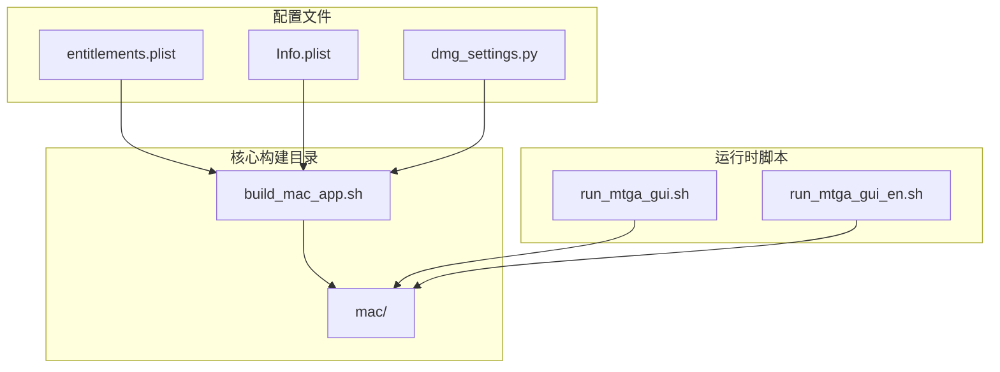
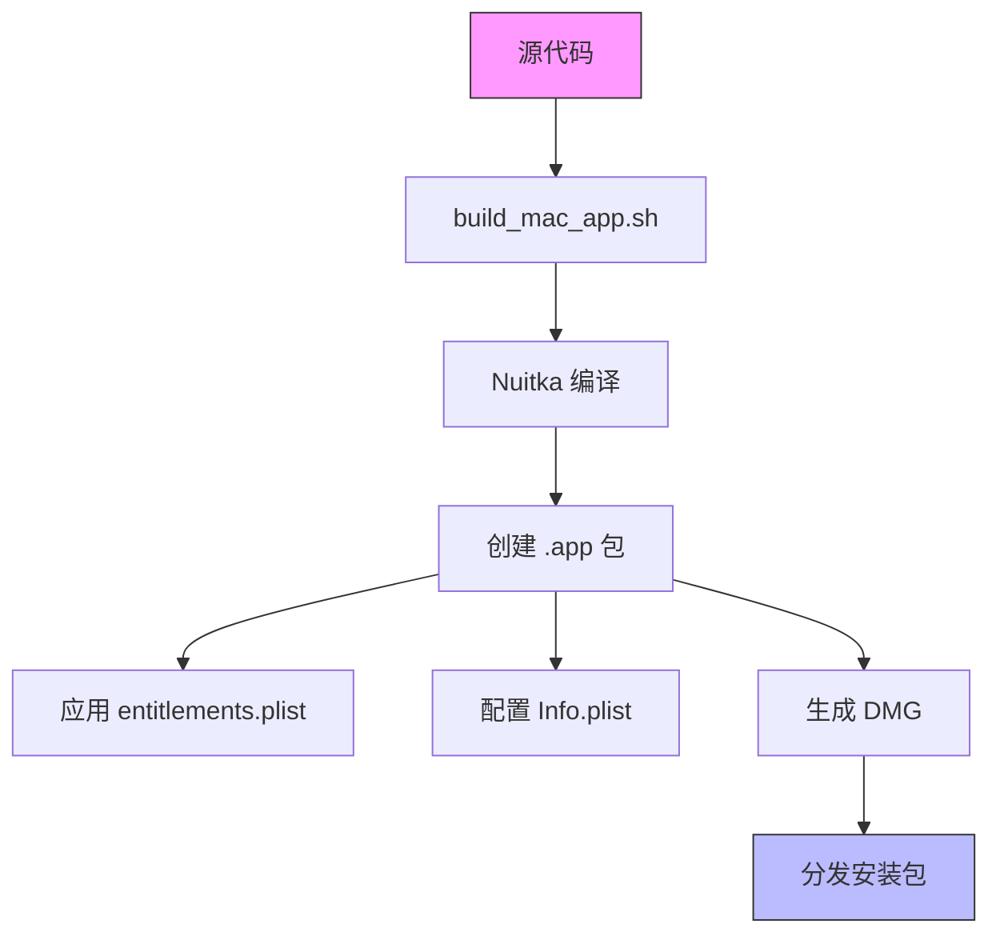
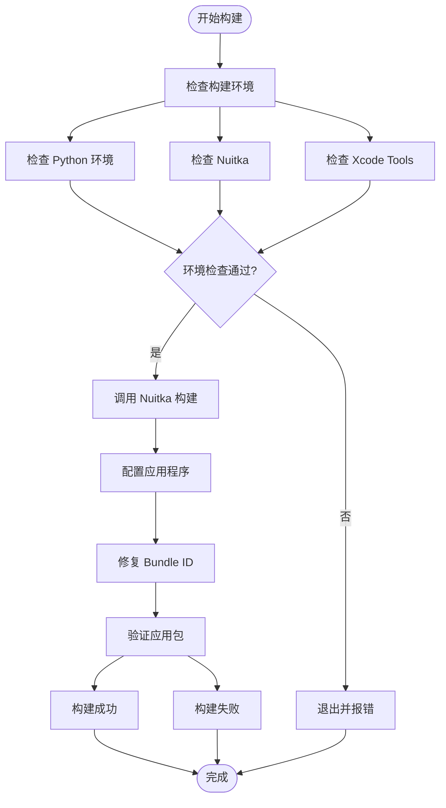
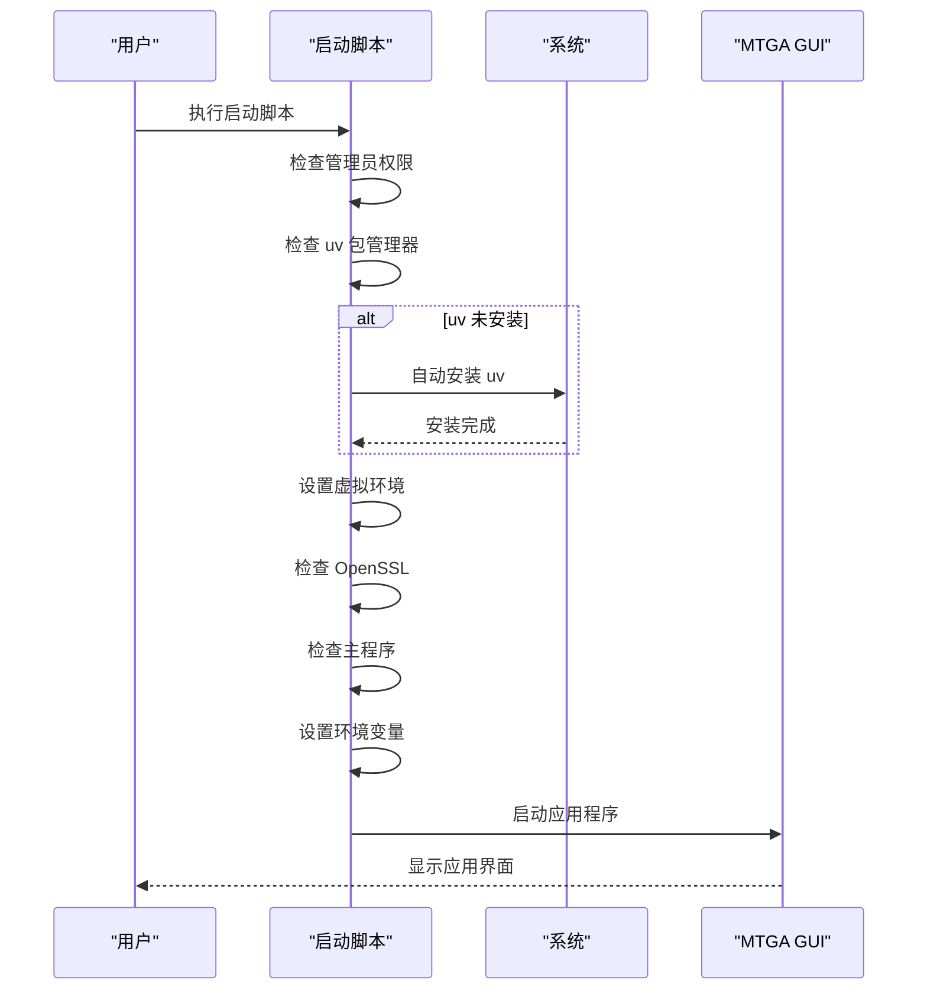
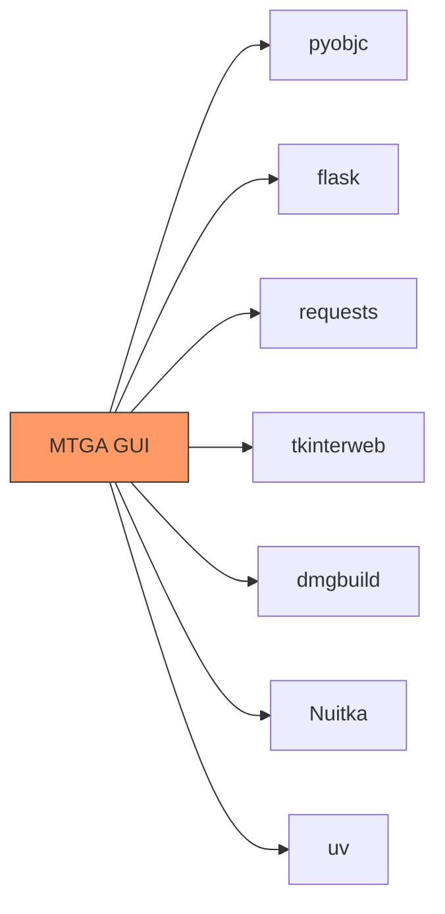

# 代码签名

<cite>
**本文档中引用的文件**   
- [entitlements.plist](file://mac/entitlements.plist)
- [create_mac_app.sh](file://mac/create_mac_app.sh)
- [build_mac_app.sh](file://build_mac_app.sh)
- [dmg_settings.py](file://mac/dmg_settings.py)
- [run_mtga_gui.sh](file://run_mtga_gui.sh)
- [run_mtga_gui_en.sh](file://run_mtga_gui_en.sh)
- [Info.plist](file://mac/Info.plist)
</cite>

## 目录
1. [介绍](#介绍)
2. [项目结构](#项目结构)
3. [核心组件](#核心组件)
4. [架构概述](#架构概述)
5. [详细组件分析](#详细组件分析)
6. [依赖分析](#依赖分析)
7. [性能考虑](#性能考虑)
8. [故障排除指南](#故障排除指南)
9. [结论](#结论)

## 介绍
本项目是一个为 macOS 系统构建和配置 MTGA GUI 应用程序的完整解决方案。它包含了一套完整的脚本和配置文件，用于创建符合 macOS 应用规范的 .app 包，并通过自动化流程处理依赖管理和应用分发。系统的核心安全机制依赖于代码签名和公证流程，通过 entitlements.plist 文件定义应用权限，使用 codesign 工具对应用程序进行签名，并通过 DMG 安装包实现安全分发。项目特别关注跨平台兼容性和用户友好性，提供了中英文双语启动脚本，确保在不同语言环境下的正常运行。

## 项目结构
该项目的目录结构清晰地划分了不同功能模块，其中与 macOS 应用构建和代码签名直接相关的文件主要集中在 `mac` 目录下。项目使用 Nuitka 将 Python 应用编译为独立的 macOS 应用程序包，并通过 dmgbuild 工具创建专业的 DMG 安装镜像。整个构建流程由 shell 脚本驱动，确保了构建过程的可重复性和自动化。



**Diagram sources **
- [mac](file://mac)
- [build_mac_app.sh](file://build_mac_app.sh)
- [run_mtga_gui.sh](file://run_mtga_gui.sh)
- [run_mtga_gui_en.sh](file://run_mtga_gui_en.sh)

**Section sources**
- [mac](file://mac)
- [build_mac_app.sh](file://build_mac_app.sh)

## 核心组件
项目的核心组件包括应用程序包构建脚本、权限配置文件和启动管理脚本。`build_mac_app.sh` 是主要的构建脚本，负责使用 Nuitka 编译独立的 macOS 应用程序包。`entitlements.plist` 文件定义了应用的沙盒权限，而 `Info.plist` 则包含了应用的元数据信息。`run_mtga_gui.sh` 和 `run_mtga_gui_en.sh` 是为不同语言用户提供的启动脚本，它们负责环境检测、依赖安装和应用启动。

**Section sources**
- [build_mac_app.sh](file://build_mac_app.sh)
- [entitlements.plist](file://mac/entitlements.plist)
- [Info.plist](file://mac/Info.plist)
- [run_mtga_gui.sh](file://run_mtga_gui.sh)
- [run_mtga_gui_en.sh](file://run_mtga_gui_en.sh)

## 架构概述
系统的整体架构围绕着 macOS 应用程序的构建、配置和分发展开。构建流程始于 `build_mac_app.sh` 脚本，该脚本调用 Nuitka 将 Python 代码编译为独立的可执行文件，并自动创建符合 macOS 规范的应用程序包结构。在此过程中，系统会应用 `entitlements.plist` 中定义的安全权限，并通过 `Info.plist` 配置应用的基本信息。最终，使用 `dmg_settings.py` 配置文件创建专业的 DMG 安装镜像，实现应用的安全分发。



**Diagram sources **
- [build_mac_app.sh](file://build_mac_app.sh)
- [entitlements.plist](file://mac/entitlements.plist)
- [Info.plist](file://mac/Info.plist)
- [dmg_settings.py](file://mac/dmg_settings.py)

## 详细组件分析

### 权限配置分析
`entitlements.plist` 文件是应用程序安全配置的核心，它定义了应用在 macOS 沙盒环境中的权限边界。该文件通过一系列键值对明确指定了应用可以访问的系统资源和功能。

```mermaid
classDiagram
class entitlements {
+com.apple.security.app-sandbox : Boolean
+com.apple.security.device.clipboard : Boolean
+com.apple.security.network.client : Boolean
+com.apple.security.files.user-selected.read-write : Boolean
+com.apple.security.files.all : Boolean
}
note right of entitlements
权限配置说明 :
- app-sandbox : false (禁用沙盒)
- clipboard : true (允许剪贴板访问)
- network.client : true (允许网络连接)
- files.user-selected : true (允许用户选择的文件读写)
- files.all : true (允许访问所有文件)
end note
```

**Diagram sources **
- [entitlements.plist](file://mac/entitlements.plist)

#### 构建脚本分析
`build_mac_app.sh` 脚本是整个构建流程的控制中心，它协调了从环境检查到应用打包的全过程。该脚本首先验证必要的构建工具和依赖项，然后调用 Nuitka 执行编译任务，最后对生成的应用程序包进行必要的配置和修复。



**Diagram sources **
- [build_mac_app.sh](file://build_mac_app.sh)

### 启动脚本分析
`run_mtga_gui.sh` 和 `run_mtga_gui_en.sh` 是为用户提供的启动脚本，它们确保了应用在不同系统环境下的顺利运行。这些脚本不仅负责启动应用，还承担了环境准备和依赖管理的职责。



**Diagram sources **
- [run_mtga_gui.sh](file://run_mtga_gui.sh)
- [run_mtga_gui_en.sh](file://run_mtga_gui_en.sh)

**Section sources**
- [run_mtga_gui.sh](file://run_mtga_gui.sh)
- [run_mtga_gui_en.sh](file://run_mtga_gui_en.sh)

## 依赖分析
项目依赖关系清晰，主要依赖于现代 Python 开发工具链。构建过程依赖于 Nuitka 和 dmgbuild，运行时依赖于 uv 包管理器和一系列 Python 库。通过 pyproject.toml 文件中的 dependency-groups，项目明确区分了开发依赖和平台特定的构建依赖，确保了构建环境的纯净和可重现性。



**Diagram sources **
- [pyproject.toml](file://pyproject.toml)

**Section sources**
- [pyproject.toml](file://pyproject.toml)

## 性能考虑
项目的性能主要体现在构建效率和应用启动速度上。使用 Nuitka 将 Python 代码编译为原生可执行文件，显著提高了应用的启动速度和运行性能。同时，通过合理的依赖管理和虚拟环境配置，确保了应用在不同系统上的稳定运行。DMG 安装包的使用也优化了应用分发和安装的用户体验。

## 故障排除指南
当遇到构建或运行问题时，应首先检查构建环境是否完整。常见问题包括 Xcode Command Line Tools 未安装、Nuitka 未正确安装或 Python 版本不兼容。对于启动问题，应确保 uv 包管理器已正确安装，并且虚拟环境已成功创建。如果遇到权限问题，可能需要以管理员身份运行启动脚本。

**Section sources**
- [build_mac_app.sh](file://build_mac_app.sh)
- [run_mtga_gui.sh](file://run_mtga_gui.sh)
- [run_mtga_gui_en.sh](file://run_mtga_gui_en.sh)

## 结论
本项目提供了一个完整的 macOS 应用程序构建和分发解决方案，通过自动化脚本和配置文件实现了高效的开发流程。代码签名和公证流程的集成确保了应用的安全性和可信度，而详细的权限配置和启动脚本则保证了良好的用户体验。该架构设计合理，易于维护和扩展，为类似项目的开发提供了有价值的参考。