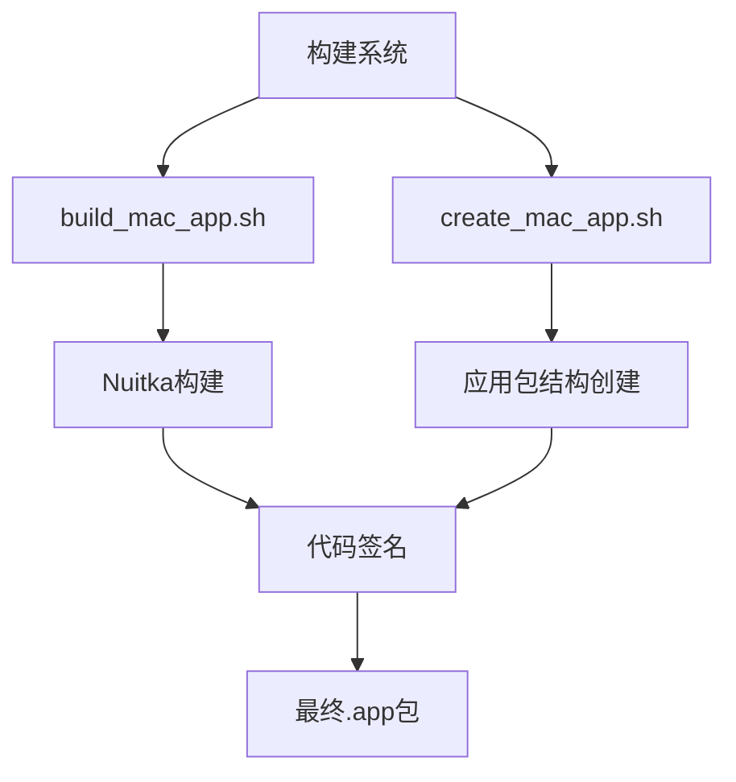
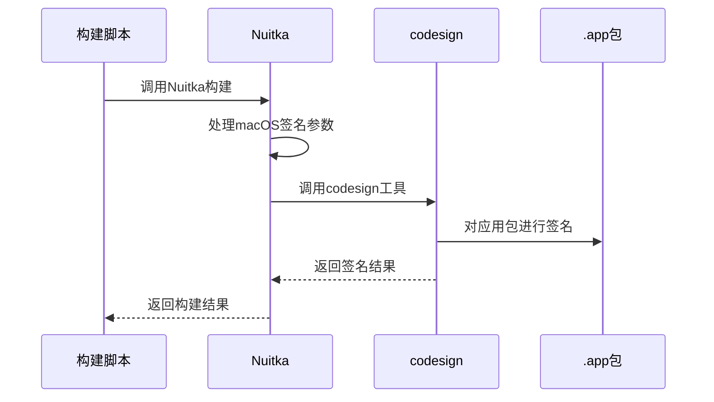
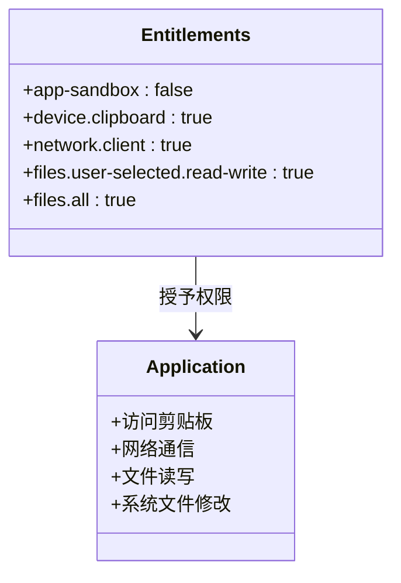
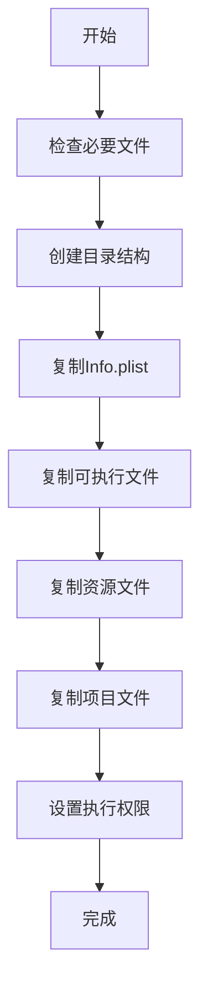

# 代码签名流程

<cite>
**本文档引用的文件**  
- [build_mac_app.sh](file://build_mac_app.sh)
- [mac/entitlements.plist](file://mac/entitlements.plist)
- [mac/Info.plist](file://mac/Info.plist)
- [mac/create_mac_app.sh](file://mac/create_mac_app.sh)
- [mac/dmg_settings.py](file://mac/dmg_settings.py)
- [run_mtga_gui.sh](file://run_mtga_gui.sh)
- [modules/platform/macos_privileged_helper.py](file://modules/platform/macos_privileged_helper.py)
</cite>

## 目录
1. [项目结构](#项目结构)
2. [核心构建流程](#核心构建流程)
3. [代码签名机制](#代码签名机制)
4. [权限配置分析](#权限配置分析)
5. [构建脚本详解](#构建脚本详解)
6. [应用包结构](#应用包结构)
7. [常见问题与解决方案](#常见问题与解决方案)

## 项目结构
项目包含完整的macOS应用构建体系，主要目录包括：
- `mac/`：包含macOS专用的构建脚本、配置文件和资源
- `build_mac_app.sh`：主构建脚本，使用Nuitka构建macOS应用包
- `run_mtga_gui.sh`：macOS启动脚本，处理依赖和权限
- `modules/platform/`：包含macOS特权操作辅助模块



**图表来源**
- [build_mac_app.sh](file://build_mac_app.sh#L1-L180)
- [mac/create_mac_app.sh](file://mac/create_mac_app.sh#L1-L220)

## 核心构建流程
项目通过`build_mac_app.sh`脚本使用Nuitka构建独立的macOS应用程序包。构建过程包括：
1. 环境检查（虚拟环境、Xcode命令行工具、Nuitka）
2. 版本信息写入
3. 使用Nuitka构建独立应用包
4. 应用包后处理和验证

构建完成后生成标准的`.app`包，可直接运行或打包为DMG安装包。

**章节来源**
- [build_mac_app.sh](file://build_mac_app.sh#L1-L180)

## 代码签名机制
项目使用开发者ID证书对`.app`包进行代码签名，确保应用的完整性和来源可信。签名过程通过Nuitka的`--macos-signed-app-name`参数指定签名标识符。

在`build_mac_app.sh`脚本中，通过以下参数配置代码签名：
- `--macos-signed-app-name="com.mtga.gui"`：指定应用的签名标识符
- 结合`Info.plist`中的`CFBundleIdentifier`实现完整的代码签名配置



**图表来源**
- [build_mac_app.sh](file://build_mac_app.sh#L115)
- [mac/Info.plist](file://mac/Info.plist#L8)

**章节来源**
- [build_mac_app.sh](file://build_mac_app.sh#L115)
- [mac/Info.plist](file://mac/Info.plist)

## 权限配置分析
项目的权限配置通过`entitlements.plist`文件定义，该文件与代码签名过程集成，为应用授予必要的系统权限。

`mac/entitlements.plist`文件中定义的关键权限包括：

| 权限标识符 | 作用 | 是否启用 |
|-----------|------|---------|
| com.apple.security.app-sandbox | 应用沙箱 | 禁用 (false) |
| com.apple.security.device.clipboard | 剪贴板访问 | 启用 (true) |
| com.apple.security.network.client | 网络客户端访问 | 启用 (true) |
| com.apple.security.files.user-selected.read-write | 用户选择文件读写 | 启用 (true) |
| com.apple.security.files.all | 所有文件访问 | 启用 (true) |

这些权限配置允许应用：
- 访问剪贴板进行数据交换
- 建立网络连接与服务器通信
- 读写用户选择的文件
- 修改系统hosts文件等特殊文件



**图表来源**
- [mac/entitlements.plist](file://mac/entitlements.plist#L1-L25)

**章节来源**
- [mac/entitlements.plist](file://mac/entitlements.plist#L1-L25)

## 构建脚本详解
`build_mac_app.sh`脚本是项目的主要构建工具，负责创建macOS应用包。脚本使用Nuitka的多种参数来配置构建过程：

### Nuitka构建参数
```bash
uv run --python .venv/bin/python nuitka \
    --standalone \
    --macos-create-app-bundle \
    --show-progress \
    --show-memory \
    --output-dir=dist-onefile \
    --include-data-files=ca/README.md=ca/README.md \
    --include-data-files=ca/api.openai.com.cnf=ca/api.openai.com.cnf \
    --macos-app-icon=mac/icon.icns \
    --enable-plugin=tk-inter \
    --macos-target-arch=arm64 \
    --remove-output \
    --include-package=modules \
    --macos-app-name="MTGA GUI" \
    --macos-signed-app-name="com.mtga.gui" \
    --macos-app-version="$VERSION" \
    --output-filename=MTGA_GUI-v$VERSION-$(uname -m) \
    mtga_gui.py
```

关键参数说明：
- `--macos-create-app-bundle`：创建标准的macOS应用包
- `--macos-app-name`：设置应用显示名称
- `--macos-signed-app-name`：设置代码签名的应用标识符
- `--macos-target-arch=arm64`：指定目标架构为Apple Silicon
- `--enable-plugin=tk-inter`：启用Tkinter插件支持GUI应用

构建完成后，脚本会自动修复`Info.plist`中的`CFBundleIdentifier`，确保与签名标识符一致。

**章节来源**
- [build_mac_app.sh](file://build_mac_app.sh#L87-L118)

## 应用包结构
项目提供了两种创建macOS应用包的方式：通过Nuitka直接构建或使用`create_mac_app.sh`脚本创建。

### 应用包目录结构
```
MTGA_GUI.app/
├── Contents/
│   ├── Info.plist
│   ├── MacOS/
│   │   └── MTGA_GUI
│   └── Resources/
│       ├── icon.png
│       └── mtga_project/
│           ├── mtga_gui.py
│           ├── modules/
│           ├── ca/
│           └── openssl/
```

`create_mac_app.sh`脚本负责创建此结构，包括：
- 复制`Info.plist`配置文件
- 复制可执行文件到`MacOS`目录
- 复制资源文件到`Resources`目录
- 复制项目文件到应用包内



**图表来源**
- [mac/create_mac_app.sh](file://mac/create_mac_app.sh#L97-L209)

**章节来源**
- [mac/create_mac_app.sh](file://mac/create_mac_app.sh#L1-L220)

## 常见问题与解决方案
### 证书缺失问题
当开发者ID证书缺失时，构建会失败。解决方案：
1. 确保Apple开发者账户已创建
2. 在Xcode中配置代码签名证书
3. 或使用`--no-sign`参数跳过签名（仅用于开发）

### 权限冲突问题
当`entitlements.plist`中的权限与应用实际需求冲突时：
1. 检查`entitlements.plist`文件的权限配置
2. 确保`com.apple.security.app-sandbox`设置正确
3. 根据应用需求调整网络和文件访问权限

### 构建依赖问题
常见构建问题及解决方案：
```bash
# 问题1: clang未找到
xcode-select --install

# 问题2: Nuitka未安装
uv add nuitka

# 问题3: 虚拟环境不存在
uv sync --group mac-build
```

### 应用运行问题
首次运行时可能遇到的安全限制：
1. 在"系统偏好设置" > "安全性与隐私"中允许应用运行
2. 对于企业分发的应用，可能需要手动授权
3. 确保应用具有必要的文件系统访问权限

**章节来源**
- [build_mac_app.sh](file://build_mac_app.sh#L38-L60)
- [run_mtga_gui.sh](file://run_mtga_gui.sh#L47-L94)
- [modules/platform/macos_privileged_helper.py](file://modules/platform/macos_privileged_helper.py#L1-L487)