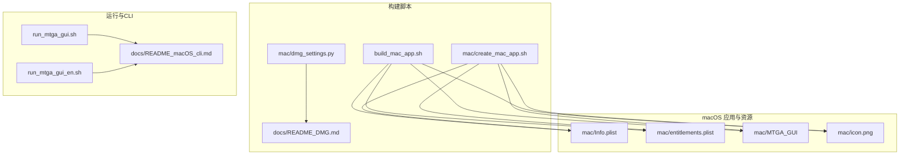
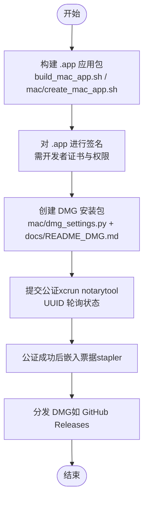
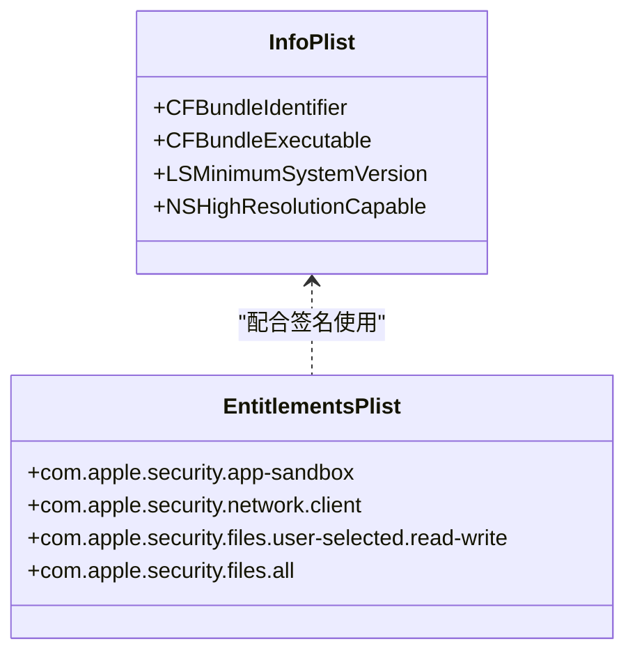
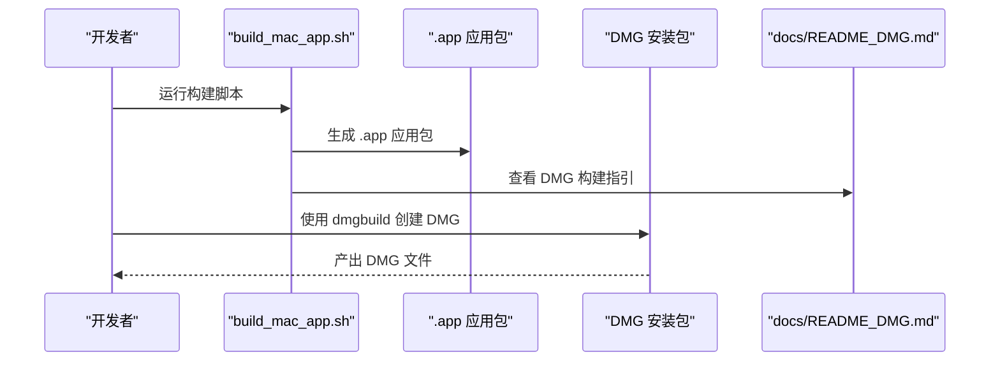
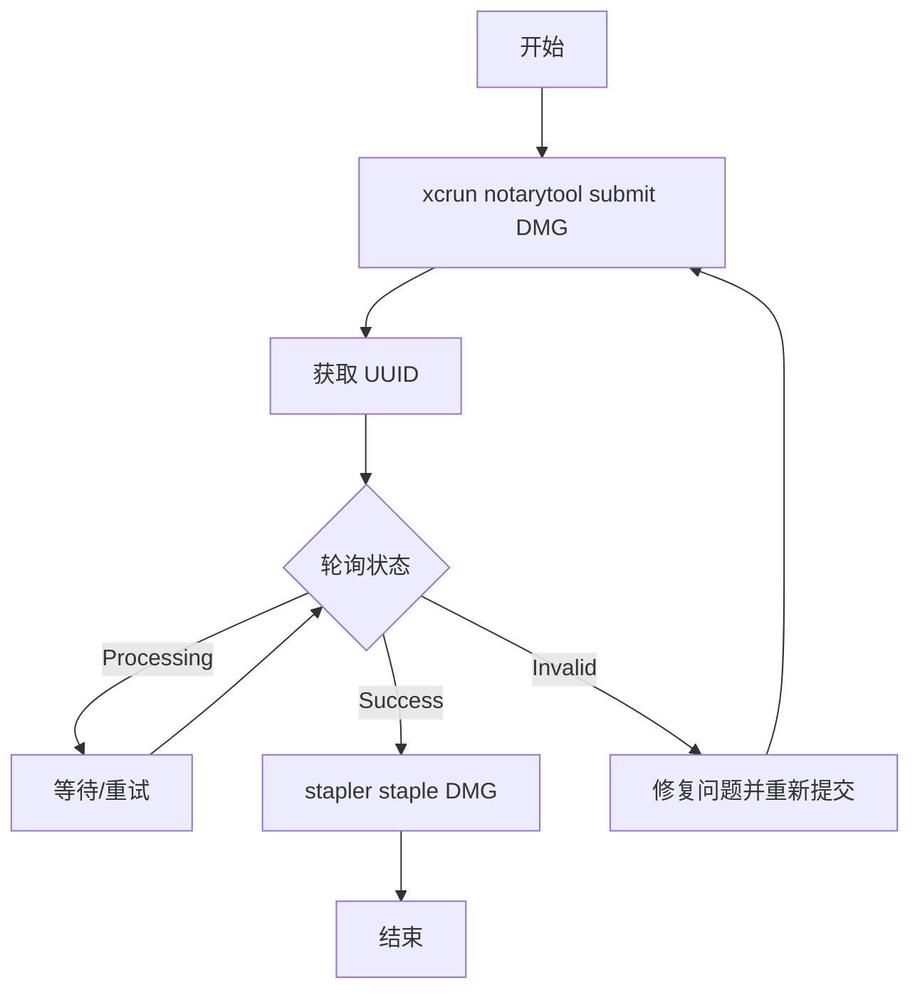
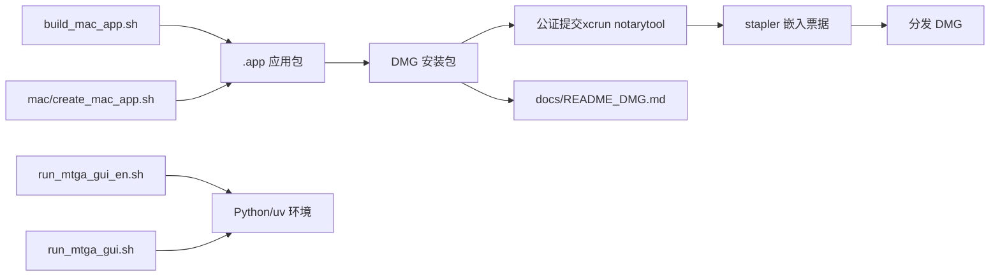

# 公证服务流程

<cite>
**本文引用的文件**
- [build_mac_app.sh](file://build_mac_app.sh)
- [mac/create_mac_app.sh](file://mac/create_mac_app.sh)
- [mac/dmg_settings.py](file://mac/dmg_settings.py)
- [mac/entitlements.plist](file://mac/entitlements.plist)
- [mac/Info.plist](file://mac/Info.plist)
- [docs/README_DMG.md](file://docs/README_DMG.md)
- [docs/README_macOS_cli.md](file://docs/README_macOS_cli.md)
- [run_mtga_gui.sh](file://run_mtga_gui.sh)
- [run_mtga_gui_en.sh](file://run_mtga_gui_en.sh)
</cite>

## 目录
1. [简介](#简介)
2. [项目结构](#项目结构)
3. [核心组件](#核心组件)
4. [架构总览](#架构总览)
5. [详细组件分析](#详细组件分析)
6. [依赖关系分析](#依赖关系分析)
7. [性能考虑](#性能考虑)
8. [故障排查指南](#故障排查指南)
9. [结论](#结论)
10. [附录](#附录)

## 简介
本文件面向需要在 macOS 上发布应用的开发者，系统性说明应用公证（Notarization）服务的完整流程，涵盖：
- 如何将已签名的 .dmg 安装包提交到 Apple 公证服务器
- 使用 xcrun notarytool 提交的具体步骤
- 在构建脚本中集成公证流程的方法
- 通过 UUID 轮询检查公证状态
- 公证成功后使用 stapler 嵌入公证票据（Staple）以避免首次运行安全警告
- CI/CD 自动化集成最佳实践（含 Apple ID 与应用专用密码的安全存储）
- 常见拒绝原因与修复方法

说明：当前仓库中未包含实际的 notarytool 提交流程脚本，本文在“概念性概述”部分提供通用流程；在“详细组件分析”中给出与现有脚本的对接建议与最佳实践。

## 项目结构
本项目包含 macOS 应用打包与 DMG 安装包构建所需的关键文件与脚本，便于在本地或 CI 环境中完成公证前的最终产物准备。

图表来源
- [build_mac_app.sh](file://build_mac_app.sh#L87-L118)
- [mac/create_mac_app.sh](file://mac/create_mac_app.sh#L47-L78)
- [mac/dmg_settings.py](file://mac/dmg_settings.py#L1-L70)
- [docs/README_DMG.md](file://docs/README_DMG.md#L1-L162)
- [docs/README_macOS_cli.md](file://docs/README_macOS_cli.md#L1-L147)

章节来源
- [build_mac_app.sh](file://build_mac_app.sh#L1-L180)
- [mac/create_mac_app.sh](file://mac/create_mac_app.sh#L1-L220)
- [mac/dmg_settings.py](file://mac/dmg_settings.py#L1-L70)
- [docs/README_DMG.md](file://docs/README_DMG.md#L1-L162)
- [docs/README_macOS_cli.md](file://docs/README_macOS_cli.md#L1-L147)

## 核心组件
- 应用清单与权限
  - Info.plist：定义 Bundle ID、可执行文件名、最低系统版本等
  - entitlements.plist：声明应用权限（如网络访问、剪贴板、用户选择文件等）
- 构建脚本
  - build_mac_app.sh：使用 Nuitka 生成 .app 应用包，并输出 DMG 构建指引
  - mac/create_mac_app.sh：手动构建 .app 应用包结构
- DMG 打包
  - mac/dmg_settings.py：dmgbuild 配置，定义 DMG 外观、布局、目标应用等
  - docs/README_DMG.md：DMG 打包说明与自定义选项
- CLI 启动器
  - run_mtga_gui.sh / run_mtga_gui_en.sh：macOS 启动脚本，提供依赖检测与运行流程

章节来源
- [mac/Info.plist](file://mac/Info.plist#L1-L30)
- [mac/entitlements.plist](file://mac/entitlements.plist#L1-L25)
- [build_mac_app.sh](file://build_mac_app.sh#L87-L118)
- [mac/create_mac_app.sh](file://mac/create_mac_app.sh#L47-L78)
- [mac/dmg_settings.py](file://mac/dmg_settings.py#L1-L70)
- [docs/README_DMG.md](file://docs/README_DMG.md#L1-L162)
- [run_mtga_gui.sh](file://run_mtga_gui.sh#L1-L250)
- [run_mtga_gui_en.sh](file://run_mtga_gui_en.sh#L1-L235)

## 架构总览
下图展示从应用构建到 DMG 产出、公证提交与票据嵌入的整体流程。该图为概念性示意，帮助理解各阶段职责与交互。

## 详细组件分析

### 组件一：应用清单与权限（Info.plist 与 entitlements.plist）
- Info.plist
  - 关键字段：CFBundleIdentifier、CFBundleExecutable、LSMinimumSystemVersion、NSHighResolutionCapable 等
  - 作用：标识应用身份、可执行入口与系统兼容性
- entitlements.plist
  - 关键权限：com.apple.security.app-sandbox、com.apple.security.network.client、com.apple.security.files.user-selected.read-write、com.apple.security.files.all 等
  - 作用：声明应用所需的系统权限，影响公证审核结果

图表来源
- [mac/Info.plist](file://mac/Info.plist#L1-L30)
- [mac/entitlements.plist](file://mac/entitlements.plist#L1-L25)

章节来源
- [mac/Info.plist](file://mac/Info.plist#L1-L30)
- [mac/entitlements.plist](file://mac/entitlements.plist#L1-L25)

### 组件二：应用构建与 DMG 打包
- build_mac_app.sh
  - 使用 Nuitka 生成 .app 应用包，包含数据文件与图标
  - 输出 DMG 构建指引（调用 dmgbuild）
- mac/create_mac_app.sh
  - 手动构建 .app 结构，复制 Info.plist、可执行文件、图标与项目文件
- mac/dmg_settings.py
  - 定义 DMG 名称、格式、包含的应用、图标位置、背景图等
- docs/README_DMG.md
  - DMG 打包说明、自定义选项与故障排查

图表来源
- [build_mac_app.sh](file://build_mac_app.sh#L87-L118)
- [docs/README_DMG.md](file://docs/README_DMG.md#L56-L74)

章节来源
- [build_mac_app.sh](file://build_mac_app.sh#L87-L118)
- [mac/create_mac_app.sh](file://mac/create_mac_app.sh#L47-L78)
- [mac/dmg_settings.py](file://mac/dmg_settings.py#L1-L70)
- [docs/README_DMG.md](file://docs/README_DMG.md#L1-L162)

### 组件三：公证提交与状态轮询（概念性流程）
- 提交公证
  - 使用 xcrun notarytool submit 将 DMG 提交至 Apple 公证服务器
  - 返回 UUID
- 轮询状态
  - 使用 UUID 轮询 notarytool history 或 status，直到成功或失败
- 嵌入票据
  - 使用 stapler 将公证票据嵌入 DMG，避免首次运行安全警告

（本图为概念性流程，不对应具体源码）

### 组件四：与现有脚本的对接建议
- 在 build_mac_app.sh 中增加公证环节
  - 在 DMG 产出后插入 notarytool 提交与 stapler 嵌入逻辑
  - 使用 UUID 轮询，成功后再进行分发
- 在 mac/create_mac_app.sh 中保持 .app 结构一致性，确保后续公证与 stapler 流程可用

（本节为对接建议，不对应具体源码）

## 依赖关系分析
- 构建阶段
  - build_mac_app.sh 依赖 Nuitka、Xcode 命令行工具与 Python 环境
  - mac/create_mac_app.sh 依赖系统文件与目录结构
- DMG 打包阶段
  - mac/dmg_settings.py 依赖 dmgbuild 与背景图资源
- 运行阶段
  - run_mtga_gui.sh / run_mtga_gui_en.sh 依赖 uv、Python 虚拟环境与 OpenSSL

图表来源
- [build_mac_app.sh](file://build_mac_app.sh#L87-L118)
- [mac/create_mac_app.sh](file://mac/create_mac_app.sh#L47-L78)
- [mac/dmg_settings.py](file://mac/dmg_settings.py#L1-L70)
- [docs/README_DMG.md](file://docs/README_DMG.md#L56-L74)
- [run_mtga_gui.sh](file://run_mtga_gui.sh#L1-L250)
- [run_mtga_gui_en.sh](file://run_mtga_gui_en.sh#L1-L235)

章节来源
- [build_mac_app.sh](file://build_mac_app.sh#L87-L118)
- [mac/create_mac_app.sh](file://mac/create_mac_app.sh#L47-L78)
- [mac/dmg_settings.py](file://mac/dmg_settings.py#L1-L70)
- [docs/README_DMG.md](file://docs/README_DMG.md#L1-L162)
- [run_mtga_gui.sh](file://run_mtga_gui.sh#L1-L250)
- [run_mtga_gui_en.sh](file://run_mtga_gui_en.sh#L1-L235)

## 性能考虑
- 构建阶段
  - 使用 Nuitka 的 --remove-output 与 --show-progress 有助于快速定位问题
  - 合理设置 --macos-target-arch 以减少交叉编译开销
- DMG 打包阶段
  - 选择 UDZO 压缩格式以获得更好的压缩比
  - 控制 DMG 内容数量，避免不必要的资源文件进入镜像
- 公证阶段
  - 提交前确保签名完整、权限最小化，减少审核时间
  - 使用 UUID 轮询时设置合理的重试间隔与超时上限

（本节为通用建议，不对应具体源码）

## 故障排查指南
- 构建失败
  - 检查 Xcode 命令行工具与 Nuitka 是否安装
  - 确认 Python 版本与依赖环境
- DMG 构建失败
  - 确认 .app 存在且完整
  - 检查背景图与图标资源可读性
- 公证失败
  - 常见原因：硬编码路径、不安全权限、沙箱限制不足
  - 修复方法：移除硬编码路径、调整权限、精简 entitlements.plist
- 分发后首次运行安全警告
  - 未嵌入公证票据导致
  - 解决：使用 stapler staple DMG

章节来源
- [build_mac_app.sh](file://build_mac_app.sh#L173-L180)
- [docs/README_DMG.md](file://docs/README_DMG.md#L119-L136)

## 结论
- 本项目提供了成熟的 .app 与 DMG 构建能力，可作为公证前的最终产物准备
- 公证流程建议在 DMG 产出后接入，使用 UUID 轮询与 stapler 嵌入票据
- CI/CD 集成需安全存储 Apple ID 与应用专用密码，并最小化权限暴露
- 常见拒绝原因可通过精简权限与移除硬编码路径解决

（本节为总结，不对应具体源码）

## 附录

### A. 公证服务流程（概念性说明）
- 提交公证
  - 使用 xcrun notarytool submit 将 DMG 提交至 Apple 公证服务器
  - 返回 UUID
- 轮询状态
  - 使用 UUID 轮询 notarytool history 或 status，直到成功或失败
- 嵌入票据
  - 使用 stapler 将公证票据嵌入 DMG，避免首次运行安全警告

（本节为概念性说明，不对应具体源码）

### B. CI/CD 自动化集成最佳实践
- 安全存储
  - Apple ID 与应用专用密码放入 CI 密钥管理（如 GitHub Secrets）
  - 限制密钥可见范围与使用权限
- 最小化权限
  - 使用最小权限的 Apple Developer 账户
  - 仅授予必要的 App Store Connect 权限
- 自动化脚本
  - 在 DMG 产出后自动触发公证提交与轮询
  - 成功后嵌入票据并触发分发

（本节为通用实践，不对应具体源码）

### C. 常见拒绝原因与修复方法
- 硬编码路径
  - 现象：应用内包含硬编码的绝对路径
  - 修复：使用相对路径或动态解析
- 不安全的权限设置
  - 现象：过度开放文件系统或网络权限
  - 修复：精简 entitlements.plist，仅保留必要权限
- 沙箱限制不足
  - 现象：需要访问系统资源但未声明相应权限
  - 修复：根据需求补充 entitlements.plist 条目

（本节为通用实践，不对应具体源码）