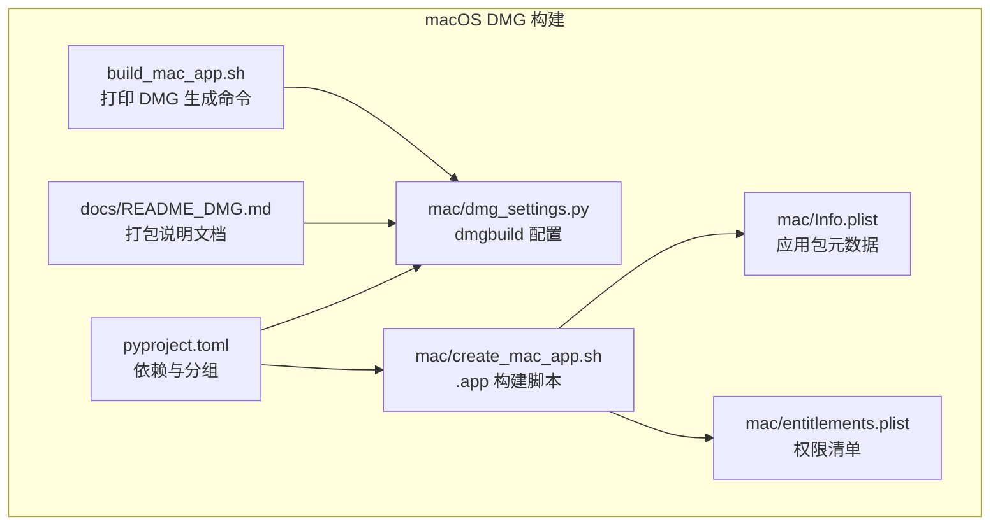
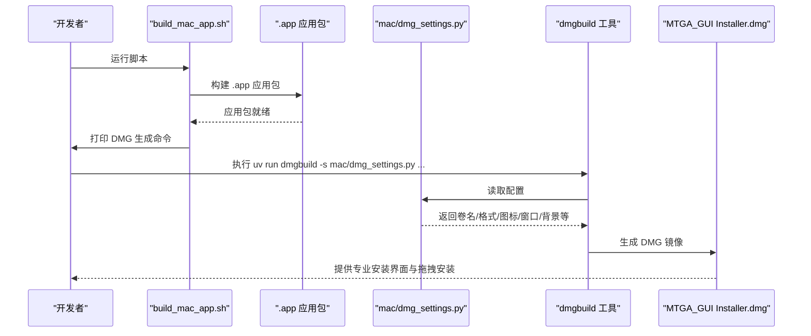
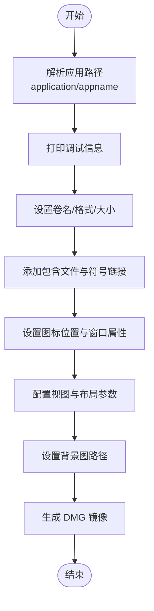
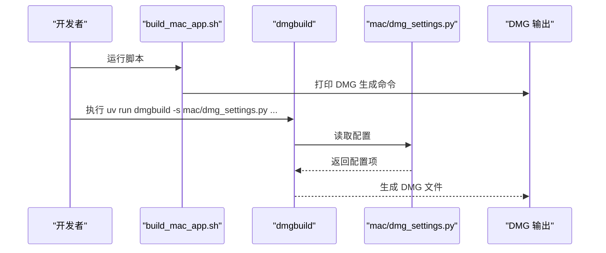
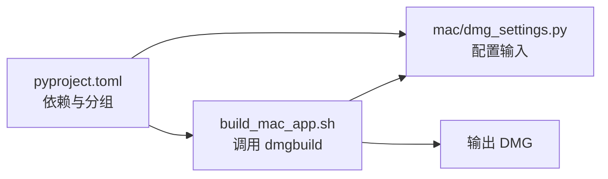

# 安装介质

<cite>
**本文引用的文件**
- [mac/dmg_settings.py](file://mac/dmg_settings.py)
- [build_mac_app.sh](file://build_mac_app.sh)
- [docs/README_DMG.md](file://docs/README_DMG.md)
- [mac/create_mac_app.sh](file://mac/create_mac_app.sh)
- [mac/Info.plist](file://mac/Info.plist)
- [mac/entitlements.plist](file://mac/entitlements.plist)
- [pyproject.toml](file://pyproject.toml)
</cite>

## 目录
1. [简介](#简介)
2. [项目结构](#项目结构)
3. [核心组件](#核心组件)
4. [架构总览](#架构总览)
5. [详细组件分析](#详细组件分析)
6. [依赖关系分析](#依赖关系分析)
7. [性能考量](#性能考量)
8. [故障排除指南](#故障排除指南)
9. [结论](#结论)
10. [附录](#附录)

## 简介
本章节面向希望为 macOS 平台生成专业级 DMG 安装镜像的开发者与运维人员。文档围绕项目中的 DMG 构建流程展开，重点说明：
- 如何通过 dmgbuild 工具读取 mac/dmg_settings.py 配置文件，定义 DMG 的视觉布局与交互行为
- 关键配置项（如 volume_name、format、background、icon_locations 等）的技术含义与影响
- build_mac_app.sh 脚本末尾提供的 DMG 生成命令及其执行流程
- DMG 的用户友好特性（自动对齐、拖拽安装引导、自定义背景等）
- 配置调试技巧与常见问题排查

## 项目结构
与 DMG 安装介质相关的关键文件与职责如下：
- mac/dmg_settings.py：dmgbuild 的配置文件，定义 DMG 的卷名、压缩格式、包含文件、图标位置、窗口属性、背景图等
- build_mac_app.sh：macOS 应用包构建脚本，最终打印出 DMG 生成命令提示
- docs/README_DMG.md：DMG 打包说明文档，包含使用步骤、特性与故障排除
- mac/create_mac_app.sh：另一种构建 .app 应用包的脚本（与 DMG 无直接依赖，但同属 macOS 打包流程）
- mac/Info.plist：应用包元数据，定义可执行文件、标识符、最低系统版本等
- mac/entitlements.plist：应用权限清单，决定沙箱策略与系统权限
- pyproject.toml：项目依赖与分组，其中包含 macOS 构建所需的 dmgbuild 与 nuitka

图表来源
- [mac/dmg_settings.py](file://mac/dmg_settings.py#L1-L70)
- [build_mac_app.sh](file://build_mac_app.sh#L169-L171)
- [docs/README_DMG.md](file://docs/README_DMG.md#L1-L162)
- [mac/create_mac_app.sh](file://mac/create_mac_app.sh#L1-L220)
- [mac/Info.plist](file://mac/Info.plist#L1-L30)
- [mac/entitlements.plist](file://mac/entitlements.plist#L1-L25)
- [pyproject.toml](file://pyproject.toml#L42-L51)

章节来源
- [mac/dmg_settings.py](file://mac/dmg_settings.py#L1-L70)
- [build_mac_app.sh](file://build_mac_app.sh#L169-L171)
- [docs/README_DMG.md](file://docs/README_DMG.md#L1-L162)
- [mac/create_mac_app.sh](file://mac/create_mac_app.sh#L1-L220)
- [mac/Info.plist](file://mac/Info.plist#L1-L30)
- [mac/entitlements.plist](file://mac/entitlements.plist#L1-L25)
- [pyproject.toml](file://pyproject.toml#L42-L51)

## 核心组件
- dmg_settings.py：定义 DMG 卷名、压缩格式、包含文件、符号链接、图标位置、窗口属性、视图设置、背景图等
- build_mac_app.sh：在应用包构建完成后，打印 DMG 生成命令，便于一键执行
- README_DMG.md：提供 DMG 打包的使用步骤、特性说明与故障排除
- create_mac_app.sh：另一种 .app 应用包构建脚本，负责应用包目录结构与资源复制
- Info.plist/entitlements.plist：应用包元数据与权限配置
- pyproject.toml：声明 macOS 构建所需依赖（dmgbuild、nuitka）

章节来源
- [mac/dmg_settings.py](file://mac/dmg_settings.py#L27-L70)
- [build_mac_app.sh](file://build_mac_app.sh#L169-L171)
- [docs/README_DMG.md](file://docs/README_DMG.md#L56-L74)
- [mac/create_mac_app.sh](file://mac/create_mac_app.sh#L30-L220)
- [mac/Info.plist](file://mac/Info.plist#L1-L30)
- [mac/entitlements.plist](file://mac/entitlements.plist#L1-L25)
- [pyproject.toml](file://pyproject.toml#L42-L51)

## 架构总览
下图展示了 DMG 生成的整体流程：应用包构建完成后，通过 dmgbuild 读取配置文件，生成压缩的 DMG 镜像，并提供专业的安装界面与拖拽安装体验。

图表来源
- [build_mac_app.sh](file://build_mac_app.sh#L169-L171)
- [mac/dmg_settings.py](file://mac/dmg_settings.py#L27-L70)

## 详细组件分析

### dmg_settings.py 配置详解
该文件是 dmgbuild 的核心配置入口，定义了 DMG 的卷名、压缩格式、包含文件、符号链接、图标位置、窗口属性、视图设置与背景图等。以下为关键配置项的解读与影响：

- 卷名与格式
  - volume_name：DMG 卷名，用于访达中显示的标题
  - format：镜像压缩格式，例如 UDZO（压缩 gzip），影响体积与生成速度
  - size：镜像大小，None 表示自动计算，避免浪费空间

- 包含文件与符号链接
  - files：要包含在 DMG 中的文件列表（通常为应用包路径）
  - symlinks：创建符号链接，如将 “Applications” 指向 /Applications，实现拖拽到应用的便捷体验

- 图标位置与窗口属性
  - icon_locations：字典形式定义每个文件/文件夹的图标坐标，用于“图标视图”
  - window_rect：窗口左上角与右下角坐标，控制 DMG 访达窗口的初始大小与位置
  - show_status_bar/show_tab_view/show_toolbar/show_pathbar/show_sidebar：控制访达界面元素的可见性，保持简洁专业

- 视图与布局
  - default_view：默认视图为图标视图
  - arrange_by/grid_offset/grid_spacing/scroll_position/label_pos/text_size/icon_size：控制图标排列、标签位置、字体大小与图标尺寸
  - include_icon_view_settings/include_list_view_settings：启用图标视图或列表视图的设置

- 背景图
  - background：指定背景图路径，通常为 PNG，尺寸需与窗口大小匹配，提供专业的安装引导图

- 应用路径解析与调试
  - application：支持通过环境变量 MTGA_APP_NAME 指定应用路径，若为绝对路径则转换为相对路径
  - appname：从 application 解析出应用名称
  - 包含调试输出，打印环境变量、应用路径、存在性等信息，便于定位问题

图表来源
- [mac/dmg_settings.py](file://mac/dmg_settings.py#L7-L26)
- [mac/dmg_settings.py](file://mac/dmg_settings.py#L27-L70)

章节来源
- [mac/dmg_settings.py](file://mac/dmg_settings.py#L7-L26)
- [mac/dmg_settings.py](file://mac/dmg_settings.py#L27-L70)

### build_mac_app.sh 中的 DMG 生成命令
脚本在应用包构建完成后，打印 DMG 生成命令，便于快速执行。命令格式如下：
- uv run dmgbuild -s mac/dmg_settings.py "MTGA GUI Installer" MTGA_GUI-v$VERSION-$(uname -m).dmg

该命令的执行流程：
- uv run：在虚拟环境中运行 dmgbuild
- -s mac/dmg_settings.py：指定配置文件路径
- "MTGA GUI Installer"：作为卷名传给 dmgbuild
- MTGA_GUI-v$VERSION-$(uname -m).dmg：输出 DMG 文件名，包含版本与架构信息

图表来源
- [build_mac_app.sh](file://build_mac_app.sh#L169-L171)
- [mac/dmg_settings.py](file://mac/dmg_settings.py#L27-L70)

章节来源
- [build_mac_app.sh](file://build_mac_app.sh#L169-L171)

### DMG 用户友好特性
- 自动对齐到 Applications：通过 symlinks 将 “Applications” 指向 /Applications，访达中显示的应用程序图标可直接拖拽到系统应用目录
- 拖拽安装引导：配合背景图与图标位置，访达打开 DMG 后即呈现清晰的安装指导
- 自定义背景图：背景图尺寸与窗口大小匹配，提供品牌化与专业感
- 精确布局：通过 icon_locations、window_rect、label_pos、text_size、icon_size 等参数，实现稳定的视觉布局

章节来源
- [mac/dmg_settings.py](file://mac/dmg_settings.py#L35-L65)

### DMG 配置调试技巧
- 使用 -C 参数预览配置效果：在命令行中加入 -C 选项，可让 dmgbuild 在生成前展示 DMG 的外观与布局，便于快速验证配置
- 检查背景图路径与尺寸：确保 background 指向的 PNG 存在且与 window_rect 匹配
- 验证应用包存在性：确认应用包路径存在于 files 列表中
- 查看调试输出：dmg_settings.py 中包含调试打印，可帮助定位环境变量与路径问题

章节来源
- [docs/README_DMG.md](file://docs/README_DMG.md#L119-L136)
- [mac/dmg_settings.py](file://mac/dmg_settings.py#L20-L26)

## 依赖关系分析
- pyproject.toml 中的 mac-build 组包含 dmgbuild 与 nuitka，分别用于 DMG 构建与应用包构建
- build_mac_app.sh 依赖 uv 虚拟环境与 dmgbuild，确保在受控环境下执行
- mac/dmg_settings.py 作为 dmgbuild 的输入，其配置项直接影响 DMG 的外观与行为

图表来源
- [pyproject.toml](file://pyproject.toml#L42-L51)
- [build_mac_app.sh](file://build_mac_app.sh#L169-L171)
- [mac/dmg_settings.py](file://mac/dmg_settings.py#L27-L70)

章节来源
- [pyproject.toml](file://pyproject.toml#L42-L51)
- [build_mac_app.sh](file://build_mac_app.sh#L169-L171)
- [mac/dmg_settings.py](file://mac/dmg_settings.py#L27-L70)

## 性能考量
- 压缩格式：format 使用 UDZO（压缩 gzip）可获得较大的体积节省，但生成时间较长；如需更快的构建速度，可考虑其他格式
- 自动尺寸：size=None 由 dmgbuild 自动估算镜像大小，避免浪费空间
- 窗口与视图：合理设置 window_rect、icon_size、text_size 等参数，可在保证可读性的同时减少不必要的渲染开销

## 故障排除指南
- 依赖安装问题：若 uv sync --group mac-build 失败，检查 uv 是否安装、网络连通性以及虚拟环境权限
- 背景图问题：确保 dmg_background.png 存在且可读，尺寸与窗口大小匹配；SVG 修改后需重新转换为 PNG
- DMG 构建失败：检查应用包是否存在且完整，确保有足够磁盘空间，必要时检查应用包内文件权限
- 配置调试：使用 -C 参数预览配置效果，查看 dmg_settings.py 的调试输出，核对环境变量与路径

章节来源
- [docs/README_DMG.md](file://docs/README_DMG.md#L119-L136)

## 结论
通过 mac/dmg_settings.py 对 DMG 的可视化与交互进行精细配置，结合 build_mac_app.sh 提供的 DMG 生成命令，可快速产出专业级的 macOS 安装镜像。借助 symlinks、背景图与图标位置等特性，用户可获得直观、便捷的拖拽安装体验。配合调试技巧与故障排除建议，能够高效定位并解决构建过程中的常见问题。

## 附录
- DMG 打包说明文档：docs/README_DMG.md
- .app 应用包构建脚本：mac/create_mac_app.sh
- 应用包元数据：mac/Info.plist
- 权限清单：mac/entitlements.plist
- 项目依赖与分组：pyproject.toml