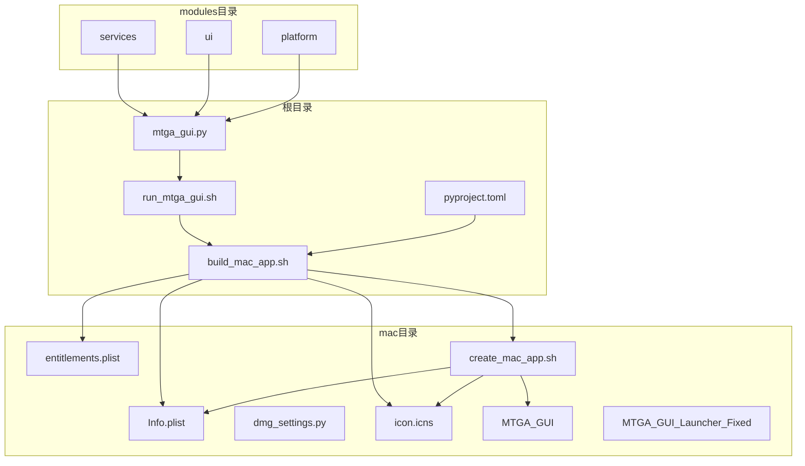
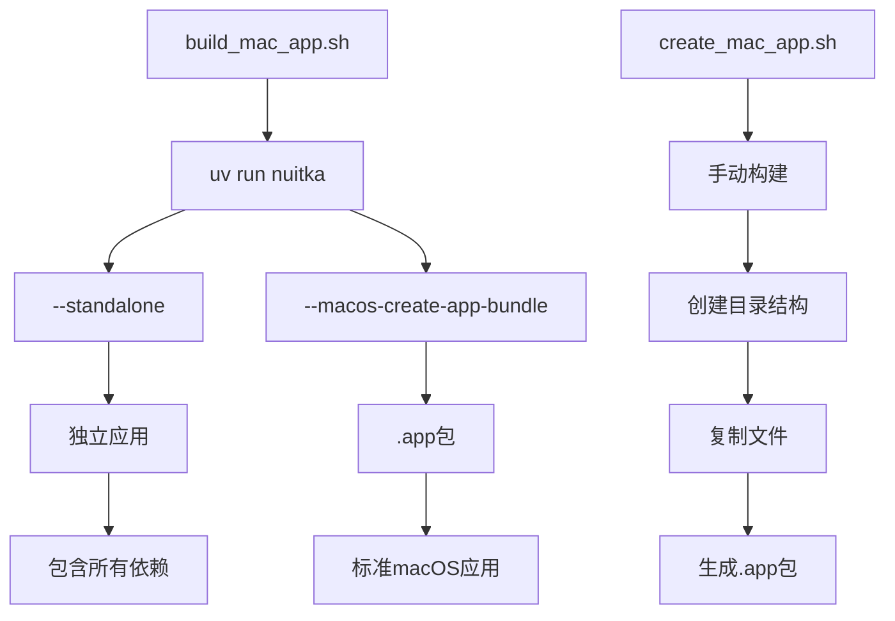
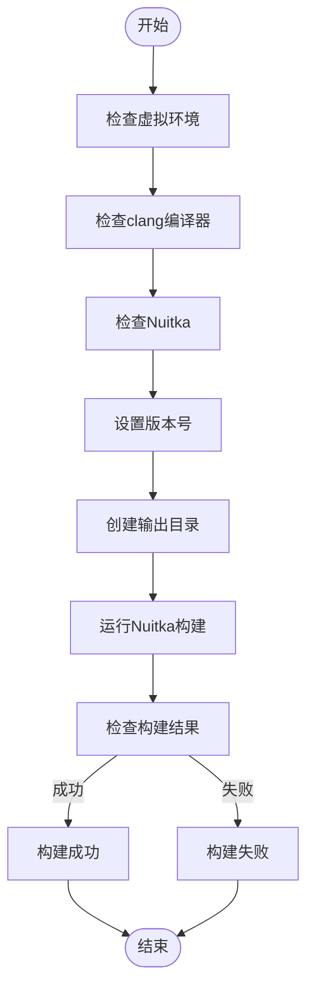
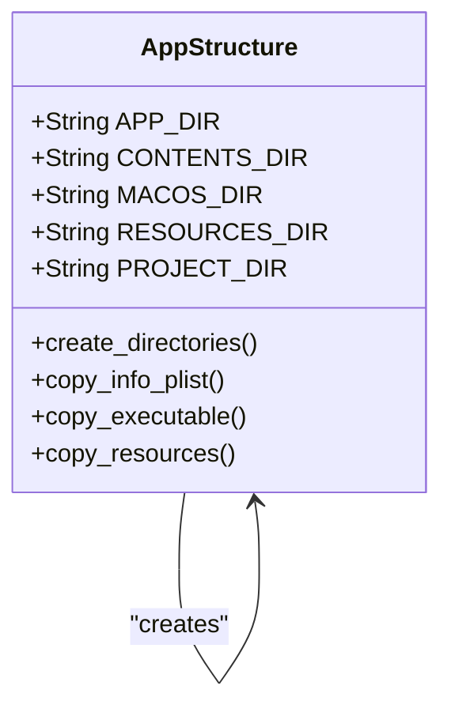
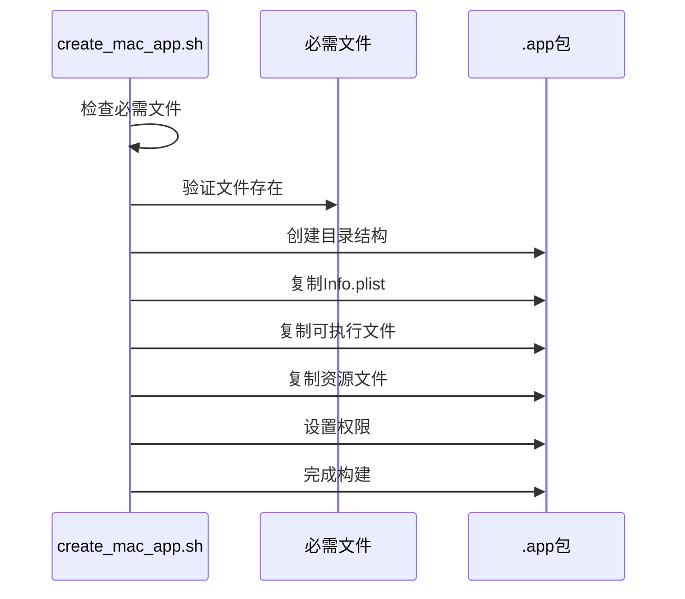
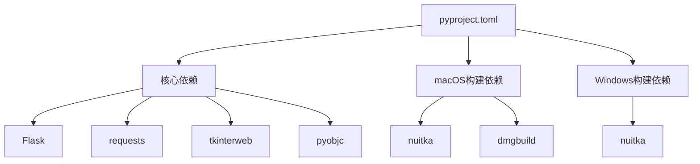
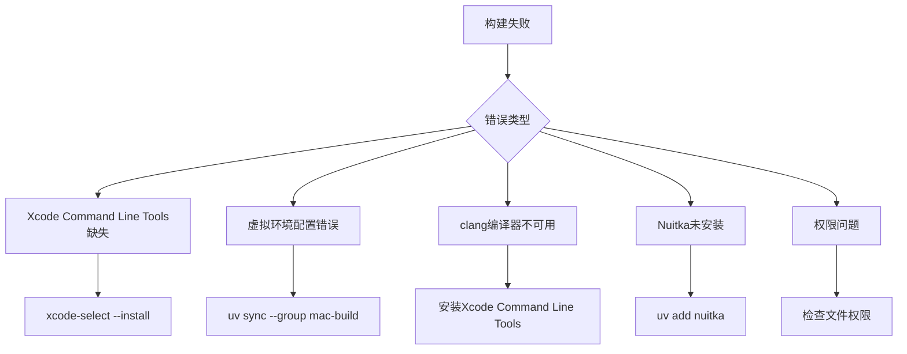

# macOS应用封装

<cite>
**本文档中引用的文件**   
- [build_mac_app.sh](file://build_mac_app.sh)
- [mac/create_mac_app.sh](file://mac/create_mac_app.sh)
- [mac/Info.plist](file://mac/Info.plist)
- [mac/entitlements.plist](file://mac/entitlements.plist)
- [mac/dmg_settings.py](file://mac/dmg_settings.py)
- [mac/MTGA_GUI](file://mac/MTGA_GUI)
- [mac/MTGA_GUI_Launcher_Fixed](file://mac/MTGA_GUI_Launcher_Fixed)
- [run_mtga_gui.sh](file://run_mtga_gui.sh)
- [mtga_gui.py](file://mtga_gui.py)
- [pyproject.toml](file://pyproject.toml)
- [mac/icon.icns](file://mac/icon.icns)
</cite>

## 目录
1. [简介](#简介)
2. [项目结构](#项目结构)
3. [核心组件](#核心组件)
4. [架构概述](#架构概述)
5. [详细组件分析](#详细组件分析)
6. [依赖分析](#依赖分析)
7. [性能考虑](#性能考虑)
8. [故障排除指南](#故障排除指南)
9. [结论](#结论)

## 简介
本文档详细说明如何使用`build_mac_app.sh`脚本将Python应用封装为macOS标准.app应用程序包。重点解析脚本中通过uv run调用Nuitka的--standalone和--macos-create-app-bundle参数实现独立应用打包的机制，阐述--macos-app-name、--macos-signed-app-name和--macos-app-version等参数对应用标识和版本控制的影响。解释如何通过--include-data-files将CA证书模板、OpenSSL配置文件和tkinterweb依赖库嵌入应用包内，确保运行时资源完整性。描述create_mac_app.sh作为替代方案的手动.app包构建流程，包括Contents/MacOS、Contents/Resources和Contents/Info.plist等关键目录与文件的组织结构。涵盖macOS特定的代码签名、权限配置（entitlements.plist）和图标集成（icon.icns）方法。提供构建失败的常见问题排查指南，如Xcode Command Line Tools缺失、虚拟环境配置错误、clang编译器不可用等，并说明如何通过dmgbuild创建DMG安装包。

## 项目结构
项目结构包含多个关键目录和文件，用于支持macOS应用的构建和运行。主要目录包括`mac`目录，其中包含构建脚本、配置文件和资源文件；`modules`目录，包含应用的核心功能模块；以及根目录下的构建和运行脚本。



**图示来源**
- [build_mac_app.sh](file://build_mac_app.sh#L1-L180)
- [mac/create_mac_app.sh](file://mac/create_mac_app.sh#L1-L220)
- [mac/Info.plist](file://mac/Info.plist#L1-L30)
- [mac/entitlements.plist](file://mac/entitlements.plist#L1-L25)
- [mac/dmg_settings.py](file://mac/dmg_settings.py#L1-L70)
- [mac/MTGA_GUI](file://mac/MTGA_GUI#L1-L40)
- [mac/MTGA_GUI_Launcher_Fixed](file://mac/MTGA_GUI_Launcher_Fixed#L1-L55)
- [run_mtga_gui.sh](file://run_mtga_gui.sh#L1-L250)
- [mtga_gui.py](file://mtga_gui.py#L1-L145)
- [pyproject.toml](file://pyproject.toml#L1-L85)

**本节来源**
- [build_mac_app.sh](file://build_mac_app.sh#L1-L180)
- [mac/create_mac_app.sh](file://mac/create_mac_app.sh#L1-L220)

## 核心组件
核心组件包括`build_mac_app.sh`脚本，用于自动化构建macOS应用包；`create_mac_app.sh`脚本，作为手动构建的替代方案；以及`run_mtga_gui.sh`脚本，用于启动应用。这些脚本协同工作，确保应用能够正确打包和运行。

**本节来源**
- [build_mac_app.sh](file://build_mac_app.sh#L1-L180)
- [mac/create_mac_app.sh](file://mac/create_mac_app.sh#L1-L220)
- [run_mtga_gui.sh](file://run_mtga_gui.sh#L1-L250)

## 架构概述
系统架构基于Nuitka将Python应用打包为独立的macOS应用包。`build_mac_app.sh`脚本使用uv运行Nuitka，通过`--standalone`和`--macos-create-app-bundle`参数生成标准的.app包。应用包包含所有依赖，确保在目标机器上独立运行。



**图示来源**
- [build_mac_app.sh](file://build_mac_app.sh#L87-L118)
- [mac/create_mac_app.sh](file://mac/create_mac_app.sh#L97-L220)

## 详细组件分析

### build_mac_app.sh分析
`build_mac_app.sh`脚本是自动化构建macOS应用包的核心。它首先检查虚拟环境、clang编译器和Nuitka的安装情况，然后使用uv运行Nuitka进行打包。

#### 构建流程


**图示来源**
- [build_mac_app.sh](file://build_mac_app.sh#L38-L180)

#### 参数配置
脚本使用多个Nuitka参数来配置应用包：
- `--standalone`: 生成独立应用，包含所有依赖
- `--macos-create-app-bundle`: 创建标准的macOS .app包
- `--macos-app-name`: 设置应用显示名称
- `--macos-signed-app-name`: 设置应用的Bundle ID
- `--macos-app-version`: 设置应用版本号
- `--include-data-files`: 包含必要的数据文件

**本节来源**
- [build_mac_app.sh](file://build_mac_app.sh#L87-L118)

### create_mac_app.sh分析
`create_mac_app.sh`脚本提供手动构建.app包的替代方案。它创建标准的.app目录结构，并复制必要的文件。

#### 目录结构创建


**图示来源**
- [mac/create_mac_app.sh](file://mac/create_mac_app.sh#L97-L108)

#### 文件复制流程


**图示来源**
- [mac/create_mac_app.sh](file://mac/create_mac_app.sh#L109-L220)

**本节来源**
- [mac/create_mac_app.sh](file://mac/create_mac_app.sh#L1-L220)

### 应用配置分析

#### Info.plist配置
`Info.plist`文件定义了macOS应用的基本属性，包括：
- `CFBundleExecutable`: 可执行文件名称
- `CFBundleIdentifier`: 应用Bundle ID
- `CFBundleName`: 应用名称
- `CFBundleVersion`: 应用版本
- `CFBundleIconFile`: 图标文件

```xml
<dict>
    <key>CFBundleExecutable</key>
    <string>MTGA_GUI</string>
    <key>CFBundleIdentifier</key>
    <string>com.mtga.gui</string>
    <key>CFBundleName</key>
    <string>MTGA GUI</string>
    <key>CFBundleVersion</key>
    <string>1.0</string>
    <key>CFBundleIconFile</key>
    <string>icon</string>
</dict>
```

**本节来源**
- [mac/Info.plist](file://mac/Info.plist#L1-L30)

#### 权限配置
`entitlements.plist`文件定义了应用的权限，包括：
- 禁用应用沙箱
- 允许剪贴板访问
- 允许网络访问
- 允许读写用户选择的文件
- 允许访问系统hosts文件

```xml
<dict>
    <key>com.apple.security.app-sandbox</key>
    <false/>
    <key>com.apple.security.device.clipboard</key>
    <true/>
    <key>com.apple.security.network.client</key>
    <true/>
    <key>com.apple.security.files.user-selected.read-write</key>
    <true/>
    <key>com.apple.security.files.all</key>
    <true/>
</dict>
```

**本节来源**
- [mac/entitlements.plist](file://mac/entitlements.plist#L1-L25)

## 依赖分析
应用依赖通过`pyproject.toml`文件定义，包括核心Python包和平台特定依赖。



**图示来源**
- [pyproject.toml](file://pyproject.toml#L22-L54)

**本节来源**
- [pyproject.toml](file://pyproject.toml#L1-L85)

## 性能考虑
构建过程的性能主要受以下因素影响：
1. 虚拟环境的创建和依赖同步
2. Nuitka的编译时间
3. 文件复制和权限设置
4. DMG包的创建

优化建议：
- 确保虚拟环境已预先创建
- 使用SSD存储以加快文件操作
- 在构建前清理不必要的文件
- 使用增量构建策略

## 故障排除指南
构建过程中可能遇到的常见问题及解决方案：

### 常见问题


**本节来源**
- [build_mac_app.sh](file://build_mac_app.sh#L47-L51)
- [build_mac_app.sh](file://build_mac_app.sh#L176-L179)

### DMG包创建
使用`dmgbuild`创建DMG安装包：

```bash
uv run dmgbuild -s mac/dmg_settings.py "MTGA GUI Installer" MTGA_GUI-v1.2.0-arm64.dmg
```

**本节来源**
- [build_mac_app.sh](file://build_mac_app.sh#L171)
- [mac/dmg_settings.py](file://mac/dmg_settings.py#L1-L70)

## 结论
本文档详细介绍了如何使用`build_mac_app.sh`和`create_mac_app.sh`脚本将Python应用封装为macOS标准.app应用程序包。通过分析脚本的实现机制、配置文件的作用以及构建过程中的关键步骤，为开发者提供了完整的构建指南。同时，文档还涵盖了常见问题的排查方法，确保构建过程的顺利进行。