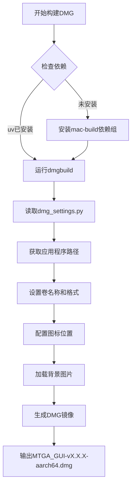

# 打包说明

<cite>
**本文档引用的文件**  
- [create_mac_app.sh](file://mac/create_mac_app.sh)
- [dmg_settings.py](file://mac/dmg_settings.py)
- [Info.plist](file://mac/Info.plist)
- [entitlements.plist](file://mac/entitlements.plist)
- [build_mac_app.sh](file://build_mac_app.sh)
- [build_onefile.bat](file://build_onefile.bat)
- [run_mtga_gui.sh](file://run_mtga_gui.sh)
- [run_mtga_gui.bat](file://run_mtga_gui.bat)
- [README_DMG.md](file://docs/README_DMG.md)
- [Windows_Onefile_Build.md](file://docs/Windows_Onefile_Build.md)
</cite>

## 目录
1. [macOS应用打包流程](#macos应用打包流程)  
2. [DMG镜像生成与配置](#dmg镜像生成与配置)  
3. [Info.plist配置规范](#infoplist配置规范)  
4. [沙盒权限与entitlements.plist](#沙盒权限与entitlementsplist)  
5. [Windows单文件打包机制](#windows单文件打包机制)  
6. [自动化构建脚本分析](#自动化构建脚本分析)  
7. [代码签名与公证服务](#代码签名与公证服务)  

## macOS应用打包流程

macOS应用打包通过`create_mac_app.sh`脚本实现，该脚本构建标准的`.app`应用程序包结构。脚本首先验证必要文件和目录的存在性，包括`Info.plist`、启动脚本、图标文件和主程序文件。随后创建应用程序包的目录结构，遵循macOS标准布局：`Contents/MacOS`存放可执行文件，`Contents/Resources`存放资源文件。

脚本复制`Info.plist`到`Contents`目录，并将`MTGA_GUI`启动脚本复制到`MacOS`目录，同时设置执行权限。应用程序图标`icon.png`被复制到`Resources`目录。项目核心文件如`mtga_gui.py`、`pyproject.toml`和`uv.lock`被复制到`Resources/mtga_project`子目录中。`modules`模块目录被完整复制以确保所有功能组件可用。

对于需要特殊权限的`ca`和`openssl`目录，脚本尝试普通复制，若失败则使用`sudo`提升权限进行复制，确保SSL证书和加密工具的完整性。整个过程通过彩色输出提供详细的构建状态反馈，最终生成符合macOS应用规范的`.app`包，可直接拖拽安装到`Applications`文件夹。

**本节来源**  
- [create_mac_app.sh](file://mac/create_mac_app.sh#L1-L220)
- [README_DMG.md](file://docs/README_DMG.md#L1-L162)

## DMG镜像生成与配置

DMG安装镜像通过`dmgbuild`工具和`mac/dmg_settings.py`配置文件生成。`dmg_settings.py`是一个Python脚本，定义了DMG镜像的外观和行为。配置文件通过环境变量`MTGA_APP_NAME`获取应用程序名称，支持灵活的构建参数传递。

DMG镜像设置包括卷名称`MTGA GUI Installer`和UDZO压缩格式，实现高压缩比。镜像包含应用程序文件和指向`/Applications`的符号链接，引导用户进行拖拽安装。`icon_locations`字典精确控制图标位置：应用程序图标位于(160, 140)，Applications链接位于(440, 135)，提供专业的安装界面布局。

窗口设置`window_rect`定义了安装窗口的大小和位置为600x400像素。通过禁用状态栏、标签视图、工具栏、路径栏和侧边栏，创建简洁的安装界面。背景图片`mac/dmg_background.png`来自SVG源文件，提供高质量的视觉体验。图标视图设置包括96x96像素的图标大小、100像素的网格间距和16号字体，确保清晰可读。

该配置支持精确的视觉控制，无需图形界面即可生成专业DMG镜像，适合CI/CD集成。开发者可轻松修改背景图、窗口尺寸和图标位置，实现品牌定制化安装体验。

**本节来源**  
- [dmg_settings.py](file://mac/dmg_settings.py#L1-L70)
- [README_DMG.md](file://docs/README_DMG.md#L1-L162)

## Info.plist配置规范

`Info.plist`是macOS应用程序的核心配置文件，采用XML Property List格式。`CFBundleExecutable`指定主可执行文件为`MTGA_GUI`，与`MacOS`目录中的启动脚本对应。`CFBundleIdentifier`设置为`com.mtga.gui`，遵循反向域名命名规范，确保应用的唯一性，这对应用商店提交和系统识别至关重要。

`CFBundleName`和`CFBundleDisplayName`均设置为`MTGA GUI`，定义应用在系统中的显示名称。版本控制通过`CFBundleVersion`和`CFBundleShortVersionString`实现，当前版本为`1.0`，支持独立的构建版本和用户可见版本。`CFBundlePackageType`设为`APPL`，标识这是一个应用程序包。

`CFBundleIconFile`指定图标文件为`icon`，系统会自动查找`icon.png`或`icon.icns`。`LSMinimumSystemVersion`设置为`10.15`，声明应用需要macOS Catalina或更高版本。`NSHighResolutionCapable`启用，确保应用在Retina显示屏上清晰显示。`LSUIElement`设为`false`，使应用出现在Dock中，具有完整的用户界面元素。

这些配置直接影响应用在macOS系统中的行为和兼容性。正确的`CFBundleIdentifier`是应用更新、数据共享和系统集成的基础。版本字段的正确设置对于应用商店审核和用户更新提示至关重要。

**本节来源**  
- [Info.plist](file://mac/Info.plist#L1-L30)
- [build_mac_app.sh](file://build_mac_app.sh#L1-L180)

## 沙盒权限与entitlements.plist

`entitlements.plist`文件定义了应用的沙盒权限，平衡安全性和功能性。`com.apple.security.app-sandbox`设为`false`，禁用应用沙箱，这允许应用访问系统级资源，如hosts文件和网络接口，但降低了安全性。此配置适用于需要系统级权限的网络代理工具。

`com.apple.security.device.clipboard`启用，允许应用读写剪贴板，支持配置复制粘贴功能。`com.apple.security.network.client`启用，授予应用出站网络访问权限，使其能够连接OpenAI等远程服务。`com.apple.security.files.user-selected.read-write`允许应用读写用户通过文件对话框选择的文件，支持配置导入导出。

最关键的权限是`com.apple.security.files.all`，它允许应用访问所有用户文件，包括系统级的`/etc/hosts`文件。这对于修改hosts以实现流量重定向是必需的，但也是安全审查的重点。在应用商店提交时，此类广泛权限需要充分的理由说明。

该权限配置反映了应用作为系统级代理工具的需求：必须突破常规沙盒限制以实现核心功能。开发者应在文档中明确说明权限需求，帮助用户理解安全权衡。

**本节来源**  
- [entitlements.plist](file://mac/entitlements.plist#L1-L25)
- [run_mtga_gui.sh](file://run_mtga_gui.sh#L1-L250)

## Windows单文件打包机制

Windows单文件打包通过`build_onefile.bat`脚本实现，使用Nuitka的`--onefile`模式将整个应用编译为单一`.exe`文件。构建过程将Python解释器、所有依赖库、脚本文件和资源打包到一个可执行文件中，极大简化了分发。

单文件.exe在运行时自动解压到系统临时目录（如`%TEMP%`），创建一个临时的工作环境。解压过程导致首次启动较慢，但后续运行会更快，除非临时目录被清理。解压后，应用在临时环境中执行，行为与独立版本相同。

用户数据持久化通过特殊目录实现：配置文件、CA证书和备份存储在`%APPDATA%\MTGA\`目录中，确保即使临时文件被删除，用户设置也能保留。`build_onefile.bat`脚本通过`--include-data-files`参数将所有必要资源嵌入可执行文件，并使用`--windows-uac-admin`确保应用自动请求管理员权限。

与独立版本相比，单文件版本牺牲了启动速度以换取分发便利性。它适合生产发行，而独立版本更适合开发测试。构建脚本自动包含OpenSSL二进制文件、证书配置和TkinterWeb库，确保功能完整。

**本节来源**  
- [build_onefile.bat](file://build_onefile.bat#L1-L212)
- [Windows_Onefile_Build.md](file://docs/Windows_Onefile_Build.md#L1-L172)

## 自动化构建脚本分析

构建流程由多个脚本协调完成，形成自动化流水线。`build_mac_app.sh`是macOS构建的入口脚本，使用`uv`运行`Nuitka`进行编译。它首先验证虚拟环境和Xcode命令行工具，确保构建环境完整。脚本动态生成`_build_version.py`文件，将版本号嵌入应用。

`create_mac_app.sh`在编译后执行，构建`.app`包结构。它复制编译后的文件，组织目录，并处理权限问题。对于`ca`和`openssl`目录，脚本智能地尝试`sudo`复制，确保关键组件可用。`run_mtga_gui.sh`和`run_mtga_gui.bat`是跨平台启动器，负责环境准备和权限提升。

macOS启动器检查并自动安装`uv`包管理器，创建Python虚拟环境，同步依赖，并设置TCL/TK库路径以修复GUI问题。它使用`sudo`运行主程序，因为修改网络设置需要管理员权限。Windows启动器通过PowerShell自动提权，确保以管理员身份运行。

这种分层构建策略将编译、打包和运行分离，每个脚本职责单一。`uv`作为统一的包管理器，简化了依赖管理。整个流程支持从源码到可分发包的完整自动化，适合CI/CD集成。

**本节来源**  
- [build_mac_app.sh](file://build_mac_app.sh#L1-L180)
- [create_mac_app.sh](file://mac/create_mac_app.sh#L1-L220)
- [run_mtga_gui.sh](file://run_mtga_gui.sh#L1-L250)
- [run_mtga_gui.bat](file://run_mtga_gui.bat#L1-L132)

## 代码签名与公证服务

项目当前的构建流程未集成代码签名和公证服务，这可能导致macOS Gatekeeper的安全警告。生产环境发布应使用`codesign`工具对`.app`包进行签名，使用开发者ID证书证明应用来源。

代码签名命令示例：`codesign --sign "Developer ID Application: XXX" --deep --force MTGA_GUI.app`。`--deep`确保所有嵌套组件都被签名，`--force`覆盖现有签名。签名后，应使用`notarytool`提交公证：`xcrun notarytool submit MTGA_GUI.app --keychain-profile "AC_PASSWORD"`。

公证服务将应用上传到Apple服务器进行恶意软件扫描。通过后，Apple会返回一个公证票证，使用`stapler staple MTGA_GUI.app`将其钉在应用上。这使应用在首次运行时不会触发"来自未知开发者"的警告。

Windows版本应使用代码签名证书对`.exe`文件进行签名，防止杀毒软件误报。可通过`signtool sign /fd SHA256 /a MTGA_GUI.exe`命令实现。开发者ID和代码签名证书需从Apple Developer Program和证书颁发机构获取。

**本节来源**  
- [build_mac_app.sh](file://build_mac_app.sh#L1-L180)
- [build_onefile.bat](file://build_onefile.bat#L1-L212)