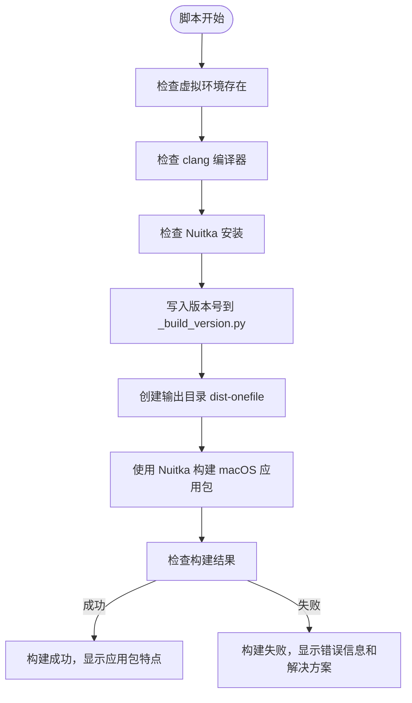
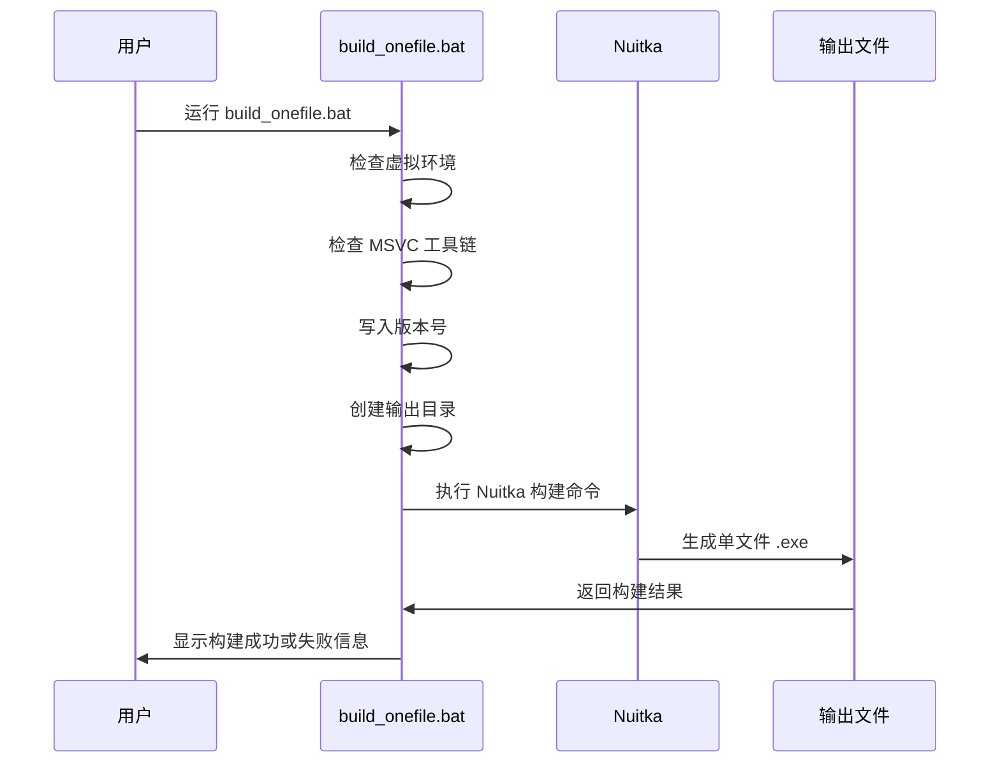

# 构建与发布

<cite>
**本文档引用的文件**   
- [build_mac_app.sh](file://build_mac_app.sh)
- [build_onefile.bat](file://build_onefile.bat)
- [pyproject.toml](file://pyproject.toml)
- [mac/dmg_settings.py](file://mac/dmg_settings.py)
- [mac/create_mac_app.sh](file://mac/create_mac_app.sh)
- [run_mtga_gui.sh](file://run_mtga_gui.sh)
- [run_mtga_gui_en.sh](file://run_mtga_gui_en.sh)
- [build_standalone.bat](file://build_standalone.bat)
- [build_probe_onefile.bat](file://build_probe_onefile.bat)
- [uv.lock](file://uv.lock)
</cite>

## 目录
1. [构建环境配置](#构建环境配置)
2. [build_mac_app.sh 执行逻辑分析](#build_mac_appsh-执行逻辑分析)
3. [build_onefile.bat 执行逻辑分析](#build_onefilebat-执行逻辑分析)
4. [pyproject.toml 配置要点](#pyprojecttoml-配置要点)
5. [版本管理与发布规范](#版本管理与发布规范)
6. [自动化构建最佳实践](#自动化构建最佳实践)
7. [常见构建错误解决方案](#常见构建错误解决方案)

## 构建环境配置

本项目采用现代化的 Python 构建工具链，确保跨平台构建的一致性和可靠性。构建环境的核心组件包括 Python 3.13、Nuitka 编译器和平台特定的开发工具。

### Python 版本与依赖管理

项目要求 Python 3.13 或更高版本，通过 `pyproject.toml` 文件中的 `requires-python` 字段明确指定。依赖管理采用 `uv` 作为包管理器，它提供了比传统 `pip` 更快的依赖解析和安装速度。

构建依赖通过 `pyproject.toml` 中的 `dependency-groups` 进行分组管理：
- `dev` 组包含开发工具（如 `pyright`、`ruff`）
- `mac-build` 组包含 macOS 构建所需的 `dmgbuild` 和 `nuitka`
- `win-build` 组包含 Windows 构建所需的 `nuitka`

使用 `uv sync --group <group-name>` 命令可以安装特定组的依赖，例如 `uv sync --group mac-build` 用于安装 macOS 构建依赖。

**Section sources**
- [pyproject.toml](file://pyproject.toml#L10)
- [pyproject.toml](file://pyproject.toml#L42-L54)

### Nuitka 安装与配置

Nuitka 是一个 Python 到 C++ 的编译器，能够将 Python 应用程序编译为独立的可执行文件。在本项目中，Nuitka 用于构建 macOS 应用包和 Windows 单文件可执行程序。

Nuitka 通过 `uv` 包管理器安装，版本要求为 `>=2.7.12`。安装命令为 `uv add nuitka`，或通过 `uv sync --group <platform>-build` 自动安装。

**Section sources**
- [pyproject.toml](file://pyproject.toml#L50)
- [pyproject.toml](file://pyproject.toml#L53)

### macOS Xcode 命令行工具

在 macOS 上构建应用程序需要 Xcode 命令行工具，特别是 `clang` 编译器。`build_mac_app.sh` 脚本在执行时会检查 `clang` 是否可用。

如果未安装，可以通过以下命令安装：
```bash
xcode-select --install
```

**Section sources**
- [build_mac_app.sh](file://build_mac_app.sh#L47-L51)

## build_mac_app.sh 执行逻辑分析

`build_mac_app.sh` 是用于构建 macOS 应用程序包的 Bash 脚本。它利用 Nuitka 将 Python 应用程序编译为标准的 `.app` 包，便于在 macOS 系统上分发和安装。

### 脚本执行流程



**Diagram sources**
- [build_mac_app.sh](file://build_mac_app.sh#L38-L67)

### 依赖安装与环境检查

脚本首先检查必要的构建环境：
1. **虚拟环境**：检查 `.venv/bin/python` 是否存在，确保依赖已安装。
2. **编译器**：通过 `command -v clang` 检查 `clang` 是否可用。
3. **Nuitka**：尝试导入 `nuitka` 模块，确保已正确安装。

这些检查确保了构建过程在正确的环境中进行，避免了因环境缺失导致的构建失败。

**Section sources**
- [build_mac_app.sh](file://build_mac_app.sh#L38-L63)

### 资源复制与应用打包

Nuitka 构建过程中，通过 `--include-data-files` 参数将必要的资源文件打包到应用程序中。这些文件包括：
- CA 证书配置文件（如 `api.openai.com.cnf`）
- 运行时版本信息文件（`_build_version.py`）
- TkinterWeb 的动态链接库（`libTkhtml3.0.dylib`）

应用打包使用 `--macos-create-app-bundle` 参数，生成标准的 macOS 应用程序包结构。

**Section sources**
- [build_mac_app.sh](file://build_mac_app.sh#L93-L108)

### 代码签名与 DMG 镜像生成

虽然 `build_mac_app.sh` 本身不直接进行代码签名，但它为后续的 DMG 镜像生成做好了准备。生成的 `.app` 包可以通过 `dmgbuild` 工具进一步打包为 DMG 镜像。

DMG 镜像的生成命令在脚本的注释中提供：
```bash
uv run dmgbuild -s mac/dmg_settings.py "MTGA GUI Installer" MTGA_GUI-v$VERSION-$(uname -m).dmg
```

**Section sources**
- [build_mac_app.sh](file://build_mac_app.sh#L170-L171)
- [mac/dmg_settings.py](file://mac/dmg_settings.py)

## build_onefile.bat 执行逻辑分析

`build_onefile.bat` 是用于构建 Windows 单文件可执行程序的批处理脚本。它利用 Nuitka 的 `--onefile` 模式，将整个应用程序及其所有依赖打包为一个独立的 `.exe` 文件。

### 脚本执行流程



**Diagram sources**
- [build_onefile.bat](file://build_onefile.bat)

### 排除项配置与启动性能优化

脚本通过一系列 `--include-*` 参数精确控制打包内容，确保只包含必要的文件：
- **包含资源文件**：CA 证书、OpenSSL 可执行文件和库、应用程序图标。
- **排除项**：通过不包含不必要的文件来减小最终文件大小。

启动性能方面，单文件模式在首次运行时需要解压到临时目录，这会导致启动较慢。但后续运行会更快，因为解压后的文件会被缓存。

**Section sources**
- [build_onefile.bat](file://build_onefile.bat#L102-L122)

### Nuitka 配置参数详解

脚本使用了多个关键的 Nuitka 参数：
- `--onefile`：将应用打包为单个可执行文件。
- `--msvc=latest`：使用最新的 MSVC 编译器。
- `--windows-uac-admin`：请求管理员权限，这对于修改 hosts 文件和监听 443 端口是必需的。
- `--enable-plugin=tk-inter`：启用 Tkinter 插件支持。
- `--windows-console-mode=attach`：附加控制台窗口，便于调试。

**Section sources**
- [build_onefile.bat](file://build_onefile.bat#L96-L127)

## pyproject.toml 配置要点

`pyproject.toml` 是 Python 项目的现代配置文件，取代了传统的 `setup.py`。它定义了项目的元数据、依赖关系和构建系统。

### [build-system] 配置

```toml
[build-system]
requires = ["hatchling"]
build-backend = "hatchling.build"
```

此配置指定了构建系统依赖 `hatchling`，这是一个现代的 Python 构建后端，支持 PEP 517 和 PEP 518 标准。

**Section sources**
- [pyproject.toml](file://pyproject.toml#L1-L3)

### [project.scripts] 配置

```toml
[project.scripts]
mtga-gui = "mtga_gui:main"
```

此配置定义了项目的可执行脚本。安装后，用户可以直接通过 `mtga-gui` 命令启动应用程序，而无需指定 Python 解释器。

**Section sources**
- [pyproject.toml](file://pyproject.toml#L39-L40)

## 版本管理与发布规范

### 版本号管理

项目版本号在 `pyproject.toml` 中定义：
```toml
version = "1.7.0"
```

构建脚本（如 `build_onefile.bat` 和 `build_mac_app.sh`）中的版本号应与 `pyproject.toml` 保持同步。脚本会自动将版本号写入 `modules/runtime/_build_version.py` 文件，供应用程序在运行时读取。

**Section sources**
- [pyproject.toml](file://pyproject.toml#L7)
- [build_onefile.bat](file://build_onefile.bat#L5)
- [build_mac_app.sh](file://build_mac_app.sh#L7)

### 发布包命名规范

- **Windows 单文件**：`MTGA_GUI-v{版本号}-x64.exe`
- **macOS DMG**：`MTGA_GUI-v{版本号}-{架构}.dmg`（如 `aarch64`）

### 校验和生成与发布渠道

发布时应生成 SHA256 校验和，以确保文件完整性。发布渠道为 GitHub Releases，开发者需将构建好的包上传至仓库的 Releases 页面。

**Section sources**
- [docs/Windows_Onefile_Build.md](file://docs/Windows_Onefile_Build.md#L73-L75)
- [docs/README_DMG.md](file://docs/README_DMG.md#L107-L111)

## 自动化构建最佳实践

1. **版本发布流程**：
   - 更新 `pyproject.toml` 和构建脚本中的版本号。
   - 在干净的环境中执行完整构建和测试。
   - 生成校验和并上传到 GitHub Releases。

2. **测试建议**：
   - 在目标操作系统上进行测试。
   - 验证管理员权限提升功能。
   - 测试用户数据持久化和代理服务器功能。

3. **分发注意事项**：
   - 单文件可执行程序通常较大（50-100MB）。
   - 杀毒软件可能误报，需向用户说明。

## 常见构建错误解决方案

### 构建失败 - Visual Studio 未找到

**错误信息**：
```
错误：未找到 Visual Studio 2022
```

**解决方案**：安装 Visual Studio 2022 Community 版本，并确保包含 C++ 构建工具。

**Section sources**
- [docs/Windows_Onefile_Build.md](file://docs/Windows_Onefile_Build.md#L116-L120)

### 构建失败 - 虚拟环境问题

**错误信息**：
```
错误：虚拟环境不存在
```

**解决方案**：运行 `uv sync --group win-build` 或 `uv sync --group mac-build` 安装依赖。

**Section sources**
- [docs/Windows_Onefile_Build.md](file://docs/Windows_Onefile_Build.md#L122-L126)

### 构建时间过长

单文件构建通常需要 30-40 分钟。建议在构建过程中避免进行其他高 CPU 占用任务。

**Section sources**
- [docs/Windows_Onefile_Build.md](file://docs/Windows_Onefile_Build.md#L128-L131)