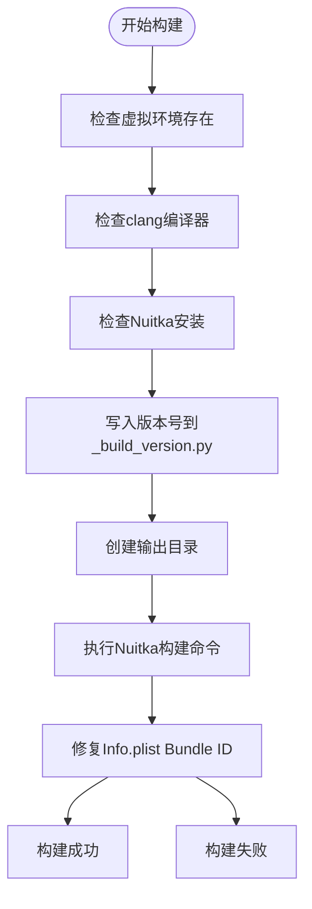
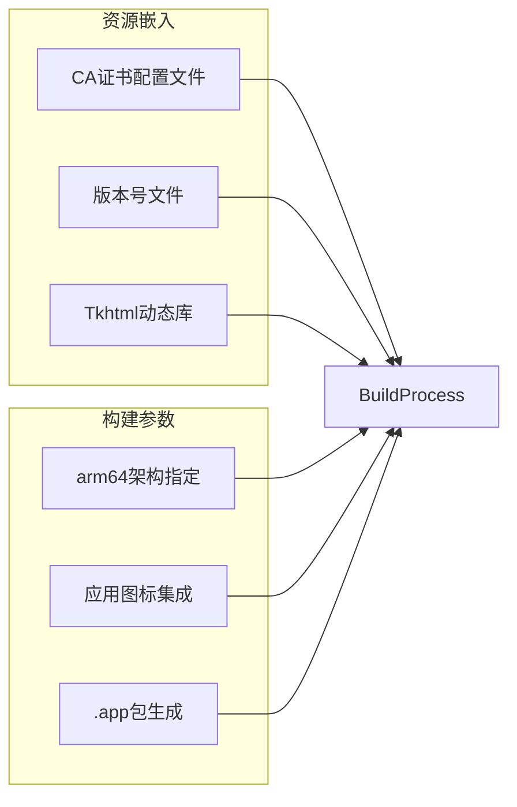
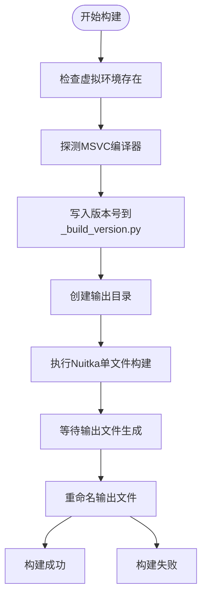
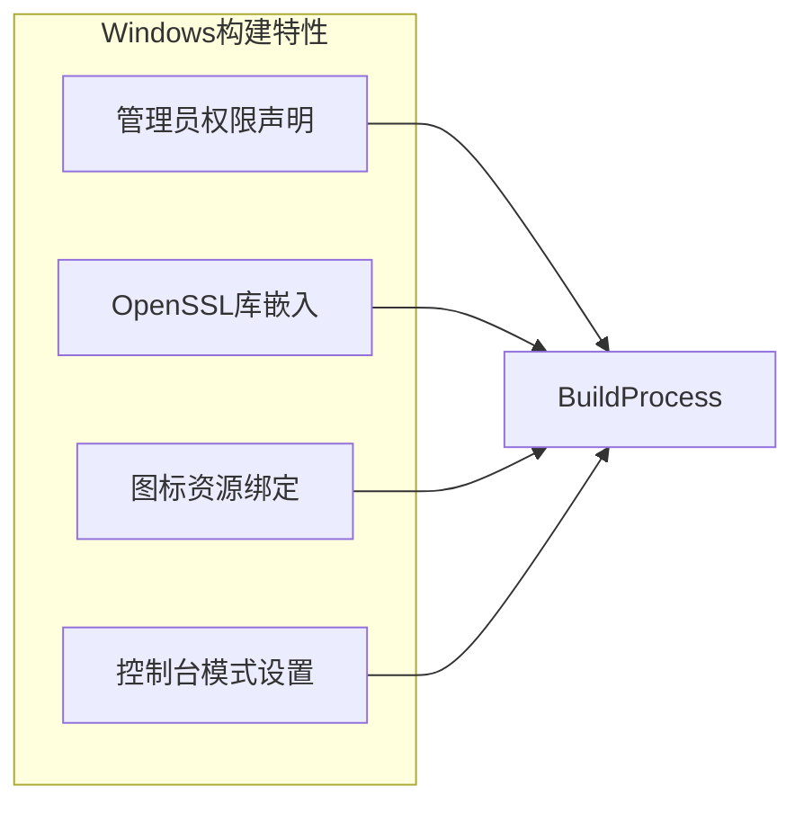
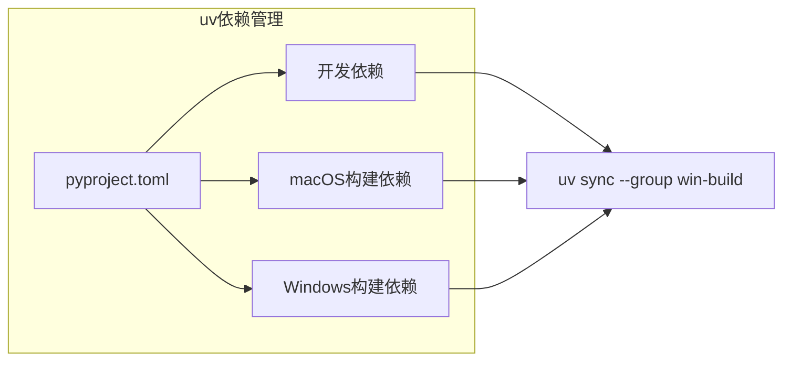

# 构建流程

<cite>
**本文档引用的文件**  
- [build_mac_app.sh](file://build_mac_app.sh)
- [build_onefile.bat](file://build_onefile.bat)
- [build_standalone.bat](file://build_standalone.bat)
- [pyproject.toml](file://pyproject.toml)
- [mac/Info.plist](file://mac/Info.plist)
- [mac/entitlements.plist](file://mac/entitlements.plist)
- [docs/Windows_Onefile_Build.md](file://docs/Windows_Onefile_Build.md)
- [docs/README_DMG.md](file://docs/README_DMG.md)
- [run_mtga_gui.bat](file://run_mtga_gui.bat)
- [run_mtga_gui.sh](file://run_mtga_gui.sh)
- [mtga_gui.py](file://mtga_gui.py)
</cite>

## 目录
1. [跨平台构建概述](#跨平台构建概述)
2. [macOS平台构建机制](#macos平台构建机制)
3. [Windows平台构建机制](#windows平台构建机制)
4. [版本号内嵌实现](#版本号内嵌实现)
5. [构建模式对比分析](#构建模式对比分析)
6. [构建环境最佳实践](#构建环境最佳实践)

## 跨平台构建概述

本项目采用Nuitka作为核心打包工具，实现跨平台的可执行文件构建。构建系统针对macOS和Windows平台分别设计了不同的构建策略，以适应各平台的技术特性和用户需求。项目通过uv作为依赖管理工具，确保Python环境的一致性，并支持Python 3.13版本。

构建流程主要分为两种模式：macOS平台采用`--standalone`模式生成标准的应用程序包（.app），而Windows平台则主要采用`--onefile`模式生成单文件可执行程序（.exe）。两种构建模式均通过shell脚本（macOS）和批处理脚本（Windows）自动化执行，确保构建过程的可重复性和可靠性。

**Section sources**
- [pyproject.toml](file://pyproject.toml#L10)
- [build_mac_app.sh](file://build_mac_app.sh#L1)
- [build_onefile.bat](file://build_onefile.bat#L1)

## macOS平台构建机制

macOS平台的构建流程由`build_mac_app.sh`脚本驱动，采用Nuitka的`--standalone`模式生成独立的应用程序包。该流程首先验证构建环境的完整性，包括检查虚拟环境、Xcode命令行工具和Nuitka的安装状态。

构建脚本通过一系列环境检查确保构建过程的稳定性。首先验证`.venv/bin/python`虚拟环境是否存在，然后检查`clang`编译器是否可用，最后确认Nuitka已正确安装。这些检查确保了构建环境的完备性，避免了因依赖缺失导致的构建失败。

**Diagram sources**
- [build_mac_app.sh](file://build_mac_app.sh#L38-L180)

**Section sources**
- [build_mac_app.sh](file://build_mac_app.sh#L1-L180)

### 资源嵌入与架构指定

构建脚本通过`--include-data-files`参数将CA证书配置文件和相关资源嵌入到应用程序包中。这些资源包括`ca/`目录下的所有证书配置文件（如`api.openai.com.cnf`、`google.cnf`等），确保应用程序在运行时能够访问必要的证书生成配置。

脚本明确指定`--macos-target-arch=arm64`参数，确保生成的应用程序针对Apple Silicon架构进行优化。同时，通过`--macos-app-icon=mac/icon.icns`参数将应用程序图标集成到包中，提升用户体验。

**Diagram sources**
- [build_mac_app.sh](file://build_mac_app.sh#L93-L110)

### Info.plist自动修复

构建完成后，脚本会自动修复生成的应用程序包中的`Info.plist`文件。原始构建过程中，`CFBundleIdentifier`可能被设置为无效的"MTGA GUI"字符串，脚本通过`sed`命令将其替换为符合macOS规范的反向域名格式"com.mtga.gui"。

这一修复步骤确保了应用程序包的合规性，使其能够正确地与macOS系统集成，避免因Bundle ID格式错误导致的安装或运行问题。修复后的应用程序包可以直接拖拽到Applications文件夹进行安装。

**Section sources**
- [build_mac_app.sh](file://build_mac_app.sh#L139-L151)
- [mac/Info.plist](file://mac/Info.plist#L1-L30)

## Windows平台构建机制

Windows平台的构建流程由`build_onefile.bat`脚本驱动，采用Nuitka的`--onefile`模式生成单个可执行文件。该流程首先检查虚拟环境是否存在，然后自动探测MSVC编译器工具链，确保构建环境的完备性。

构建脚本实现了智能的MSVC编译器探测机制，按照预定义的路径列表搜索Visual Studio的安装目录。脚本优先查找Visual Studio 2022 Community版本，若未找到则依次检查Enterprise、Professional和BuildTools版本。这种设计确保了在不同开发环境下的兼容性。

**Diagram sources**
- [build_onefile.bat](file://build_onefile.bat#L1-L212)

**Section sources**
- [build_onefile.bat](file://build_onefile.bat#L1-L212)

### 单文件打包与性能权衡

`--onefile`模式将整个应用程序及其所有依赖打包到单个`.exe`文件中，极大地方便了分发。然而，这种模式在启动时需要将所有内容解压到临时目录，导致首次启动速度较慢。构建脚本通过`--assume-yes-for-downloads`参数自动处理依赖下载，避免了交互式提示。

与`--standalone`模式相比，单文件模式牺牲了启动性能以换取分发便利性。`build_standalone.bat`脚本提供了`--standalone`模式的构建选项，生成的程序启动速度快，但需要分发整个目录，适合开发测试场景。

**Section sources**
- [build_onefile.bat](file://build_onefile.bat#L96)
- [build_standalone.bat](file://build_standalone.bat#L33)

### 管理员权限与资源绑定

Windows构建脚本通过`--windows-uac-admin`参数声明应用程序需要管理员权限，确保程序能够修改系统hosts文件和监听443端口。这一声明在程序启动时会触发UAC权限提升对话框，保障了系统的安全性。

脚本通过`--include-data-files`参数将OpenSSL动态链接库（`libcrypto-3-x64.dll`和`libssl-3-x64.dll`）嵌入到可执行文件中，确保程序在没有OpenSSL环境的系统上也能正常运行。同时，通过`--windows-icon-from-ico`参数将`icons/f0bb32_bg-black.ico`图标绑定到可执行文件中，提升程序的视觉识别度。

**Diagram sources**
- [build_onefile.bat](file://build_onefile.bat#L126-L122)

## 版本号内嵌实现

构建系统通过动态生成`modules/runtime/_build_version.py`文件实现版本号的内嵌。在构建过程中，脚本首先读取环境变量`MTGA_VERSION`或脚本内定义的`VERSION`常量，然后将其格式化为"vX.X.X"的形式。

**Diagram sources**
- [build_mac_app.sh](file://build_mac_app.sh#L64-L71)
- [build_onefile.bat](file://build_onefile.bat#L76-L87)

该文件被包含在构建过程中，使得最终的可执行文件能够访问编译时的版本信息。这种方法避免了硬编码版本号，实现了版本信息的动态管理和一致性维护。

**Section sources**
- [build_mac_app.sh](file://build_mac_app.sh#L64-L71)
- [build_onefile.bat](file://build_onefile.bat#L76-L87)
- [mtga_gui.py](file://mtga_gui.py#L78)

## 构建模式对比分析

| 特性 | macOS独立应用模式 | Windows单文件模式 |
|------|------------------|------------------|
| **启动速度** | ✅ 快速（无需解压） | ⚠️ 首次较慢（需要解压） |
| **分发便利性** | ⚠️ 需要整个.app包 | ✅ 仅一个.exe文件 |
| **反病毒软件兼容性** | ✅ 较好 | ⚠️ 可能误报（打包程序） |
| **调试便利性** | ⚠️ 一般 | ❌ 困难 |
| **推荐用途** | 生产发行 | 生产发行 |

macOS的`--standalone`模式生成标准的`.app`包，启动速度快，与系统集成度高，但文件体积较大。Windows的`--onefile`模式生成单个可执行文件，分发极为便利，但首次启动需要解压过程，且可能被反病毒软件误报为恶意软件。

**Section sources**
- [build_mac_app.sh](file://build_mac_app.sh#L158-L163)
- [build_onefile.bat](file://build_onefile.bat#L186-L192)
- [docs/Windows_Onefile_Build.md](file://docs/Windows_Onefile_Build.md#L148-L154)

## 构建环境最佳实践

### uv依赖管理

项目采用uv作为Python包管理器，通过`pyproject.toml`中的`[dependency-groups]`定义了不同平台的构建依赖组。macOS平台使用`mac-build`组，包含`dmgbuild`和`nuitka`；Windows平台使用`win-build`组，仅包含`nuitka`。

**Diagram sources**
- [pyproject.toml](file://pyproject.toml#L42-L54)

**Section sources**
- [pyproject.toml](file://pyproject.toml#L42-L54)

### Python版本要求

项目明确要求Python 3.13版本，这在`pyproject.toml`的`requires-python`字段和`tool.pyright`配置中均有声明。构建脚本通过uv的`python install 3.13`命令确保使用正确的Python版本创建虚拟环境，避免了版本不兼容问题。

### 代码签名配置

macOS构建通过`entitlements.plist`文件配置应用权限，禁用了应用沙箱以允许访问剪贴板、网络和系统hosts文件。这种配置确保了应用程序的功能完整性，同时通过明确的权限声明提升了安全性。

**Section sources**
- [pyproject.toml](file://pyproject.toml#L10)
- [mac/entitlements.plist](file://mac/entitlements.plist#L1-L25)
- [run_mtga_gui.bat](file://run_mtga_gui.bat#L67)
- [run_mtga_gui.sh](file://run_mtga_gui.sh#L113)