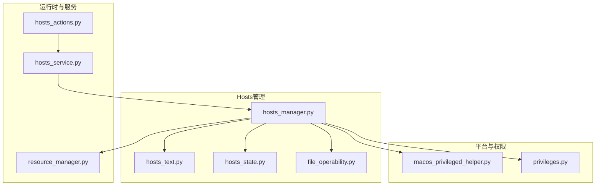
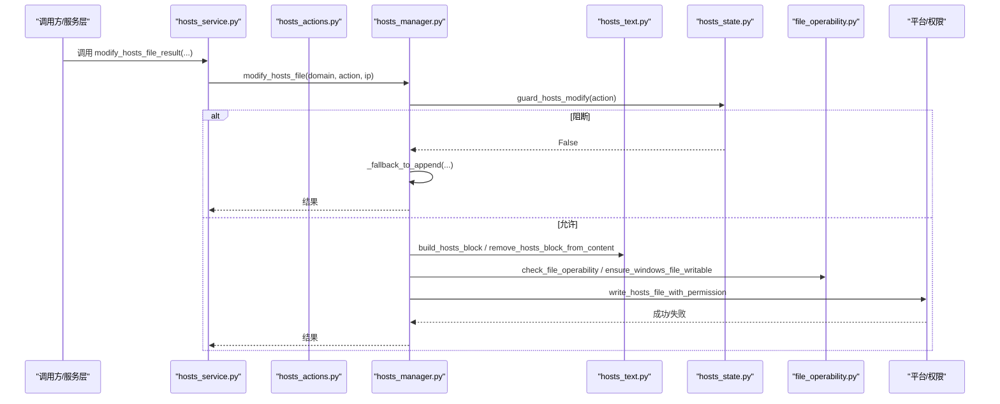
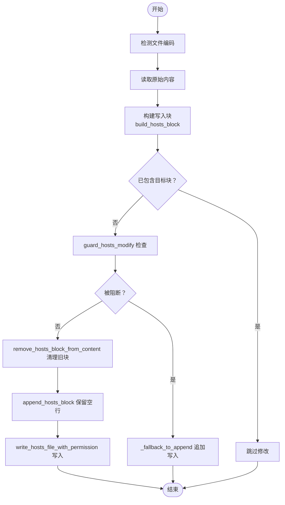
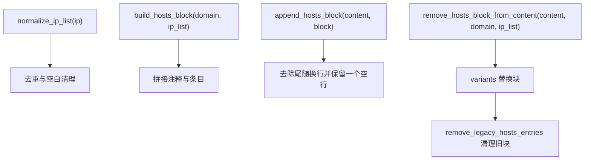
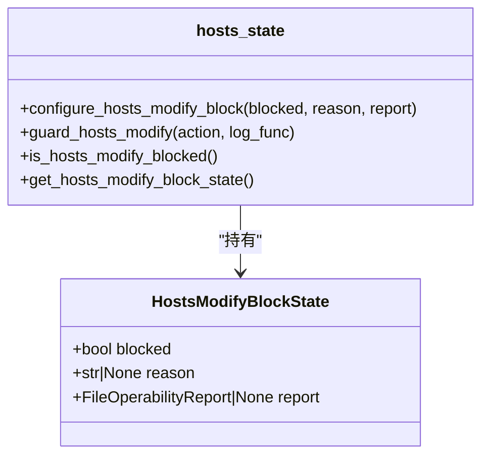
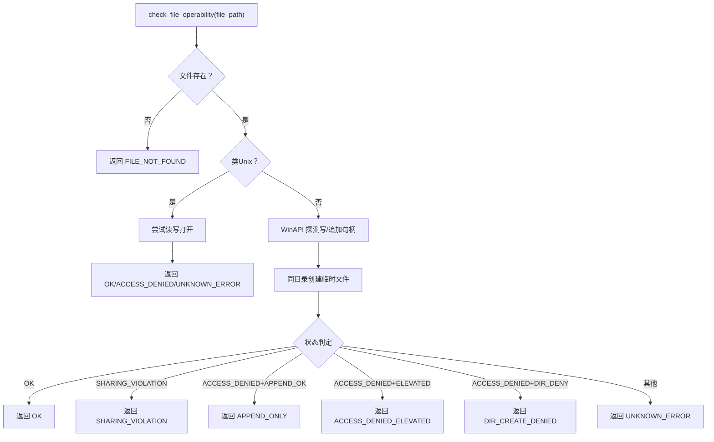
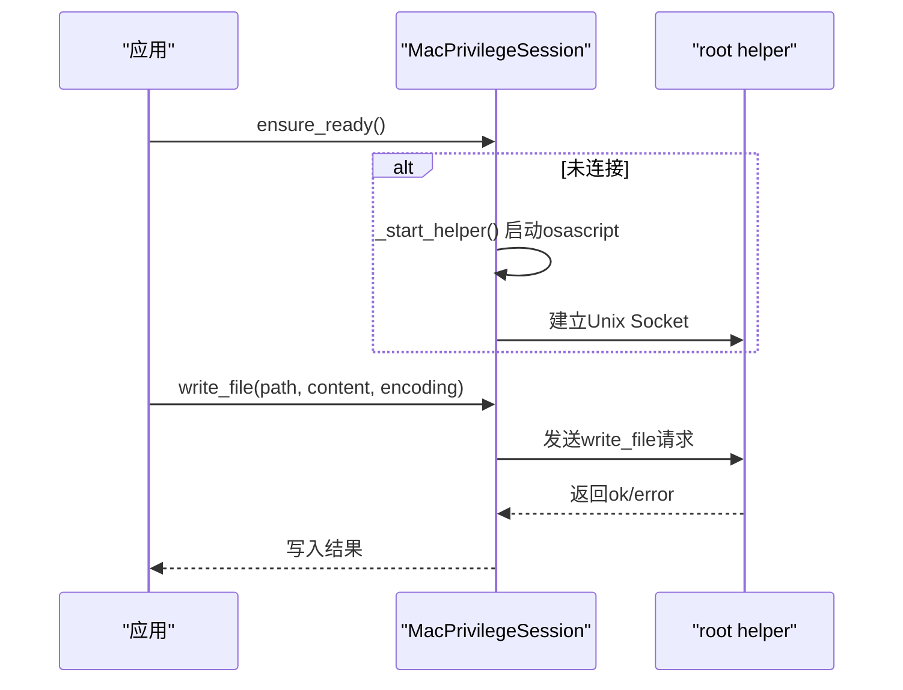
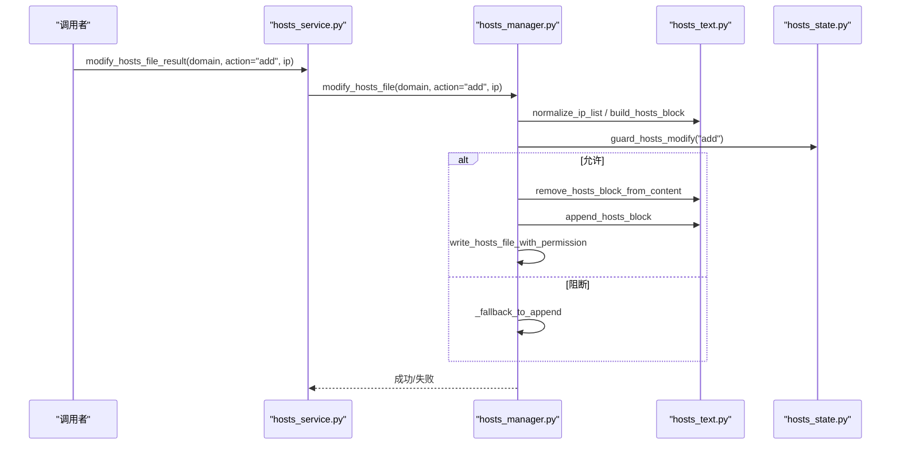
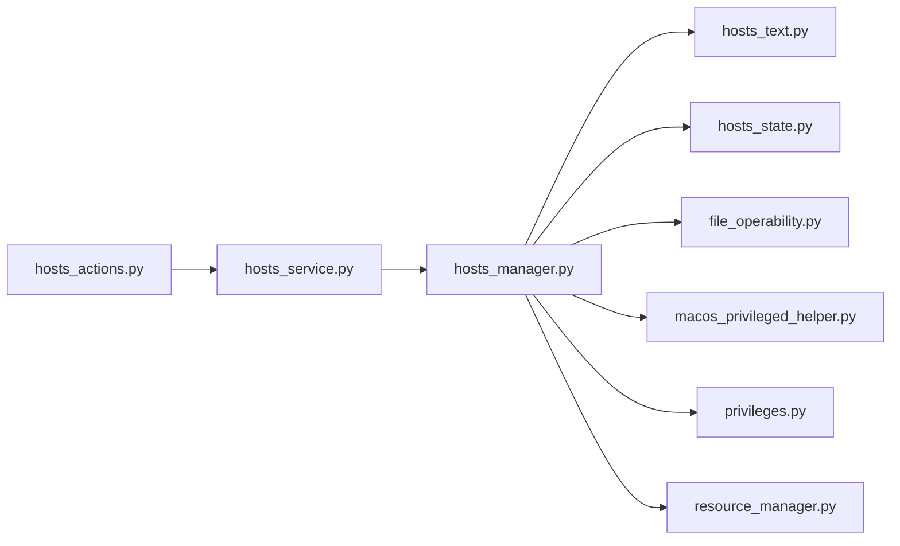

# Hosts文件管理

<cite>
**本文引用的文件**
- [hosts_manager.py](file://modules/hosts/hosts_manager.py)
- [hosts_text.py](file://modules/hosts/hosts_text.py)
- [hosts_state.py](file://modules/hosts/hosts_state.py)
- [file_operability.py](file://modules/hosts/file_operability.py)
- [macos_privileged_helper.py](file://modules/platform/macos_privileged_helper.py)
- [privileges.py](file://modules/platform/privileges.py)
- [resource_manager.py](file://modules/runtime/resource_manager.py)
- [hosts_service.py](file://modules/services/hosts_service.py)
- [hosts_actions.py](file://modules/actions/hosts_actions.py)
</cite>

## 目录
1. [简介](#简介)
2. [项目结构](#项目结构)
3. [核心组件](#核心组件)
4. [架构总览](#架构总览)
5. [详细组件分析](#详细组件分析)
6. [依赖关系分析](#依赖关系分析)
7. [性能考量](#性能考量)
8. [故障排查指南](#故障排查指南)
9. [结论](#结论)

## 简介
本文件面向“Hosts文件管理模块”的设计与实现，围绕以下目标展开：
- 通过读取系统Hosts文件（Windows位于C:\Windows\System32\drivers\etc\hosts，类Unix位于/etc/hosts），解析现有条目并安全地插入或移除指定的域名映射（如将api.openai.com指向127.0.0.1）。
- 解析与构建Hosts文本格式：注释标记、空行保留、条目去重与块级替换。
- 维护Hosts修改状态，防止重复操作或冲突。
- 跨平台文件操作兼容性：文件权限检查、备份机制、Windows UAC与macOS特权助手。
- 提供add_hosts_entry()与remove_hosts_entry()的调用流程说明，并覆盖异常处理（文件锁定、权限拒绝等）。

## 项目结构
Hosts文件管理功能由以下模块协同实现：
- hosts_manager：对外暴露的入口，负责路径解析、编码检测、备份、写入、回退策略、平台差异处理。
- hosts_text：负责Hosts文本格式的构建与解析，包括注释标记、IP归一化、块级增删。
- hosts_state：维护修改阻断状态，避免在不安全环境下进行原子性覆写。
- file_operability：跨平台文件可操作性检查，Windows侧通过WinAPI探测句柄可写性与只读属性。
- macos_privileged_helper：macOS持久化管理员会话，用于写入/复制/运行命令。
- privileges：通用权限判定工具（Windows管理员/提升态、POSIX root）。
- resource_manager：用户数据目录与备份文件路径管理。
- hosts_service、hosts_actions：服务层与任务调度层，封装结果与线程管理。

图表来源
- [hosts_manager.py](file://modules/hosts/hosts_manager.py#L1-L492)
- [hosts_text.py](file://modules/hosts/hosts_text.py#L1-L110)
- [hosts_state.py](file://modules/hosts/hosts_state.py#L1-L76)
- [file_operability.py](file://modules/hosts/file_operability.py#L1-L211)
- [macos_privileged_helper.py](file://modules/platform/macos_privileged_helper.py#L1-L487)
- [privileges.py](file://modules/platform/privileges.py#L1-L113)
- [resource_manager.py](file://modules/runtime/resource_manager.py#L200-L294)
- [hosts_service.py](file://modules/services/hosts_service.py#L1-L60)
- [hosts_actions.py](file://modules/actions/hosts_actions.py#L1-L61)

章节来源
- [hosts_manager.py](file://modules/hosts/hosts_manager.py#L1-L492)
- [hosts_text.py](file://modules/hosts/hosts_text.py#L1-L110)
- [hosts_state.py](file://modules/hosts/hosts_state.py#L1-L76)
- [file_operability.py](file://modules/hosts/file_operability.py#L1-L211)
- [macos_privileged_helper.py](file://modules/platform/macos_privileged_helper.py#L1-L487)
- [privileges.py](file://modules/platform/privileges.py#L1-L113)
- [resource_manager.py](file://modules/runtime/resource_manager.py#L200-L294)
- [hosts_service.py](file://modules/services/hosts_service.py#L1-L60)
- [hosts_actions.py](file://modules/actions/hosts_actions.py#L1-L61)

## 核心组件
- hosts_manager：提供add_hosts_entry/remove_hosts_entry/backup/restore/open等高层接口，内置回退策略与平台差异处理。
- hosts_text：提供IP归一化、块级文本构建、块级增删与旧格式兼容清理。
- hosts_state：维护阻断状态，保护在不安全环境下的原子性覆写。
- file_operability：Windows侧通过WinAPI探测句柄可写性、只读属性与目录可写性，返回可断言的状态码。
- macos_privileged_helper：首次提权后建立Unix Socket会话，后续复用，支持写文件、复制、运行命令。
- privileges：统一的权限判定与提权入口。
- resource_manager：统一用户数据目录与备份文件路径，便于持久化。

章节来源
- [hosts_manager.py](file://modules/hosts/hosts_manager.py#L264-L407)
- [hosts_text.py](file://modules/hosts/hosts_text.py#L7-L98)
- [hosts_state.py](file://modules/hosts/hosts_state.py#L10-L63)
- [file_operability.py](file://modules/hosts/file_operability.py#L117-L196)
- [macos_privileged_helper.py](file://modules/platform/macos_privileged_helper.py#L52-L178)
- [privileges.py](file://modules/platform/privileges.py#L13-L103)
- [resource_manager.py](file://modules/runtime/resource_manager.py#L255-L257)

## 架构总览
下图展示了从UI/服务层到具体实现的调用链路与关键决策点。

图表来源
- [hosts_service.py](file://modules/services/hosts_service.py#L31-L40)
- [hosts_actions.py](file://modules/actions/hosts_actions.py#L23-L48)
- [hosts_manager.py](file://modules/hosts/hosts_manager.py#L459-L491)
- [hosts_text.py](file://modules/hosts/hosts_text.py#L28-L98)
- [hosts_state.py](file://modules/hosts/hosts_state.py#L49-L63)
- [file_operability.py](file://modules/hosts/file_operability.py#L117-L196)

## 详细组件分析

### hosts_manager：文件路径、编码、备份、写入与回退策略
- 路径解析：Windows通过环境变量或WinAPI获取System32路径；类Unix默认/etc/hosts。
- 编码检测：按utf-8/gbk/gb2312/latin1/utf-16顺序尝试，失败时以替换错误字符继续。
- 备份：若无备份文件则自动复制一次；恢复时可选择macOS特权会话或直接复制。
- 写入：macOS通过特权会话写入；Windows先预检可写性并尝试清除只读属性，再写入。
- 回退策略：当环境不满足原子性覆写（如被阻断或写入失败）时，降级为追加写入，不保证去重与原子性，给出明确警告。

图表来源
- [hosts_manager.py](file://modules/hosts/hosts_manager.py#L264-L357)
- [hosts_text.py](file://modules/hosts/hosts_text.py#L28-L98)
- [hosts_state.py](file://modules/hosts/hosts_state.py#L49-L63)

章节来源
- [hosts_manager.py](file://modules/hosts/hosts_manager.py#L99-L128)
- [hosts_manager.py](file://modules/hosts/hosts_manager.py#L137-L147)
- [hosts_manager.py](file://modules/hosts/hosts_manager.py#L150-L175)
- [hosts_manager.py](file://modules/hosts/hosts_manager.py#L178-L214)
- [hosts_manager.py](file://modules/hosts/hosts_manager.py#L217-L261)
- [hosts_manager.py](file://modules/hosts/hosts_manager.py#L264-L357)
- [hosts_manager.py](file://modules/hosts/hosts_manager.py#L360-L406)

### hosts_text：Hosts文本格式解析与构建
- 归一化IP：支持None/字符串/列表/元组/集合，去重与空白清理。
- 构建块：以统一注释标记开头，每行一个“IP 域名”，形成块级文本。
- 块级增删：通过多种边界变体匹配并一次性替换，保证原子性。
- 旧格式清理：兼容旧版逐条记录，识别注释标记后跳过对应行块，保留尾随空行一致性。

图表来源
- [hosts_text.py](file://modules/hosts/hosts_text.py#L7-L25)
- [hosts_text.py](file://modules/hosts/hosts_text.py#L28-L35)
- [hosts_text.py](file://modules/hosts/hosts_text.py#L38-L43)
- [hosts_text.py](file://modules/hosts/hosts_text.py#L79-L98)
- [hosts_text.py](file://modules/hosts/hosts_text.py#L46-L76)

章节来源
- [hosts_text.py](file://modules/hosts/hosts_text.py#L7-L25)
- [hosts_text.py](file://modules/hosts/hosts_text.py#L28-L35)
- [hosts_text.py](file://modules/hosts/hosts_text.py#L38-L43)
- [hosts_text.py](file://modules/hosts/hosts_text.py#L46-L76)
- [hosts_text.py](file://modules/hosts/hosts_text.py#L79-L98)

### hosts_state：修改阻断状态与安全策略
- 阻断状态：通过configure_hosts_modify_block配置，记录blocked/reason/report。
- 行为保护：guard_hosts_modify在remove/restore动作上进行阻断提示，允许通过启动参数覆盖。
- 安全提示：明确告知无法原子性覆写，建议手动编辑或使用启动参数。

图表来源
- [hosts_state.py](file://modules/hosts/hosts_state.py#L10-L42)
- [hosts_state.py](file://modules/hosts/hosts_state.py#L20-L63)

章节来源
- [hosts_state.py](file://modules/hosts/hosts_state.py#L10-L42)
- [hosts_state.py](file://modules/hosts/hosts_state.py#L49-L63)

### file_operability：跨平台文件可操作性检查
- Windows：通过WinAPI探测GENERIC_WRITE/FILE_APPEND_DATA句柄打开能力，判断共享冲突、只读属性、目录可写性等，返回可断言的状态码。
- 类Unix：直接尝试读写打开，返回相应状态。
- 辅助：ensure_windows_file_writable尝试清除只读属性，减少写入失败概率。

图表来源
- [file_operability.py](file://modules/hosts/file_operability.py#L117-L196)
- [file_operability.py](file://modules/hosts/file_operability.py#L199-L210)

章节来源
- [file_operability.py](file://modules/hosts/file_operability.py#L117-L196)
- [file_operability.py](file://modules/hosts/file_operability.py#L199-L210)

### macOS特权助手：持久化管理员会话
- 首次需要提权时，通过osascript请求管理员权限，启动root helper并通过Unix Socket通信。
- 支持写文件、复制文件、运行命令等操作，失败时返回错误信息。
- GUI退出时主动释放helper，避免残留权限会话。

图表来源
- [macos_privileged_helper.py](file://modules/platform/macos_privileged_helper.py#L73-L91)
- [macos_privileged_helper.py](file://modules/platform/macos_privileged_helper.py#L180-L228)
- [macos_privileged_helper.py](file://modules/platform/macos_privileged_helper.py#L257-L285)
- [macos_privileged_helper.py](file://modules/platform/macos_privileged_helper.py#L287-L310)
- [macos_privileged_helper.py](file://modules/platform/macos_privileged_helper.py#L422-L428)

章节来源
- [macos_privileged_helper.py](file://modules/platform/macos_privileged_helper.py#L52-L178)
- [macos_privileged_helper.py](file://modules/platform/macos_privileged_helper.py#L180-L228)
- [macos_privileged_helper.py](file://modules/platform/macos_privileged_helper.py#L257-L310)
- [macos_privileged_helper.py](file://modules/platform/macos_privileged_helper.py#L422-L428)

### Windows UAC提升：权限判定与回退
- 权限判定：is_windows_admin/is_windows_elevated通过WinAPI查询当前进程权限。
- 写入失败处理：捕获PermissionError，提示以管理员运行或解除只读属性。
- 文件可写性：ensure_windows_file_writable尝试清除只读属性。

章节来源
- [privileges.py](file://modules/platform/privileges.py#L13-L56)
- [privileges.py](file://modules/platform/privileges.py#L84-L103)
- [file_operability.py](file://modules/hosts/file_operability.py#L199-L210)
- [hosts_manager.py](file://modules/hosts/hosts_manager.py#L247-L261)

### 调用流程示例：add_hosts_entry() 与 remove_hosts_entry()
- add_hosts_entry(domain, ip=DEFAULT_HOSTS_IPS, log_func=print)
  - 归一化IP -> 构建块 -> 检查是否已包含 -> guard_hosts_modify -> 去重旧块 -> 追加块 -> 写入（平台差异）-> 成功/回退。
- remove_hosts_entry(domain, log_func=print, ip=None)
  - guard_hosts_modify -> 去重旧块 -> 写入新内容（如删除了条目）-> 成功/失败。

图表来源
- [hosts_service.py](file://modules/services/hosts_service.py#L31-L40)
- [hosts_manager.py](file://modules/hosts/hosts_manager.py#L459-L491)
- [hosts_text.py](file://modules/hosts/hosts_text.py#L7-L35)
- [hosts_text.py](file://modules/hosts/hosts_text.py#L79-L98)
- [hosts_state.py](file://modules/hosts/hosts_state.py#L49-L63)

章节来源
- [hosts_manager.py](file://modules/hosts/hosts_manager.py#L264-L357)
- [hosts_manager.py](file://modules/hosts/hosts_manager.py#L360-L406)
- [hosts_service.py](file://modules/services/hosts_service.py#L31-L40)

## 依赖关系分析
- hosts_manager依赖hosts_text进行块级文本处理，依赖hosts_state进行阻断控制，依赖file_operability进行可写性检查，依赖macos_privileged_helper与privileges进行平台差异处理。
- hosts_service与hosts_actions提供结果封装与线程调度，向上层UI/业务提供稳定接口。
- resource_manager提供用户数据目录与备份文件路径，确保跨平台持久化。

图表来源
- [hosts_manager.py](file://modules/hosts/hosts_manager.py#L12-L27)
- [hosts_service.py](file://modules/services/hosts_service.py#L3-L9)
- [hosts_actions.py](file://modules/actions/hosts_actions.py#L8-L21)

章节来源
- [hosts_manager.py](file://modules/hosts/hosts_manager.py#L12-L27)
- [hosts_service.py](file://modules/services/hosts_service.py#L3-L9)
- [hosts_actions.py](file://modules/actions/hosts_actions.py#L8-L21)

## 性能考量
- 编码检测采用多候选顺序尝试，时间复杂度与文件大小线性相关，通常开销较小。
- 块级替换通过多次变体匹配一次性完成，避免多次遍历。
- Windows可写性探测使用WinAPI句柄探测，避免实际写入，降低IO成本。
- macOS特权会话复用，避免频繁弹窗与重复提权。

## 故障排查指南
- 文件不存在：检查get_hosts_file_path返回路径是否正确，Windows环境变量缺失时会回退到默认路径。
- 权限不足（Windows）：确认以管理员运行，检查只读属性与安全软件锁定；可使用ensure_windows_file_writable尝试清除只读。
- 权限不足（类Unix/macOS）：使用sudo或在macOS下通过特权助手；确认用户对/etc/hosts有写权限。
- 文件被占用/锁定：Windows常见于共享冲突或杀软占用；可重启相关进程或暂时关闭冲突软件。
- 回退为追加写入：当环境不满足原子性覆写时，系统会提示无法保证去重与原子性，建议手动清理重复条目。
- 备份/还原失败：检查用户数据目录权限与磁盘空间；macOS通过特权助手复制时关注helper日志。

章节来源
- [hosts_manager.py](file://modules/hosts/hosts_manager.py#L99-L128)
- [hosts_manager.py](file://modules/hosts/hosts_manager.py#L150-L175)
- [hosts_manager.py](file://modules/hosts/hosts_manager.py#L178-L214)
- [hosts_manager.py](file://modules/hosts/hosts_manager.py#L247-L261)
- [file_operability.py](file://modules/hosts/file_operability.py#L117-L196)
- [macos_privileged_helper.py](file://modules/platform/macos_privileged_helper.py#L257-L285)

## 结论
Hosts文件管理模块通过清晰的职责划分与跨平台适配，实现了安全、可靠且可回退的Hosts修改流程。其核心特性包括：
- 块级文本构建与去重，保证原子性与一致性；
- 状态阻断与回退策略，避免在不安全环境下造成不可逆影响；
- 跨平台文件可操作性检查与权限处理，最大化兼容性；
- macOS特权助手与Windows UAC的集成，确保在受限环境下也能完成关键操作。