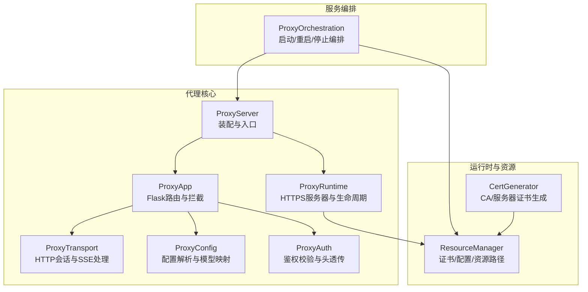
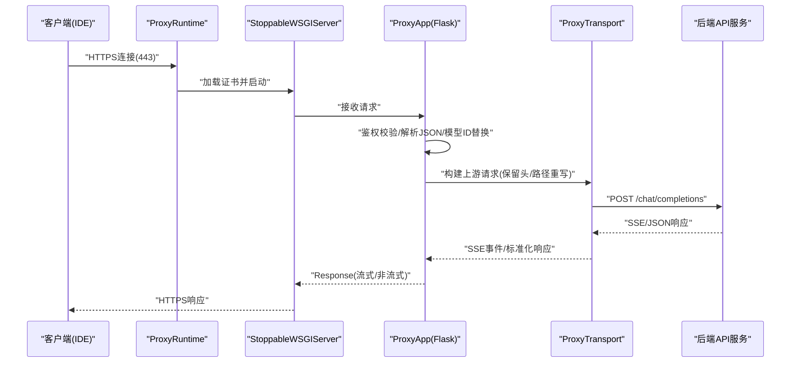
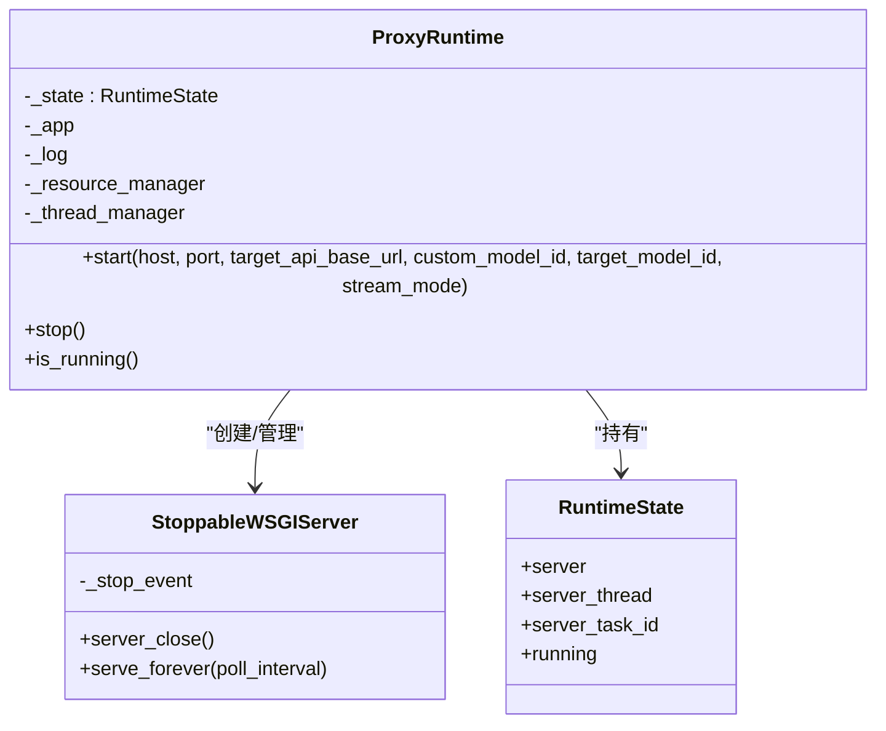
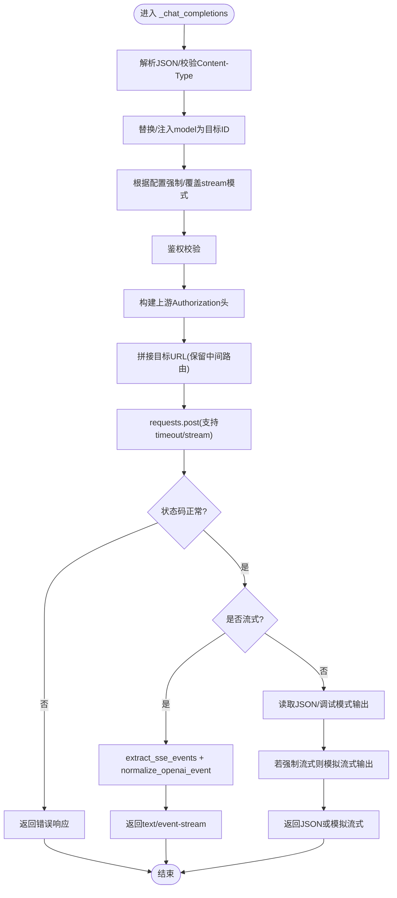
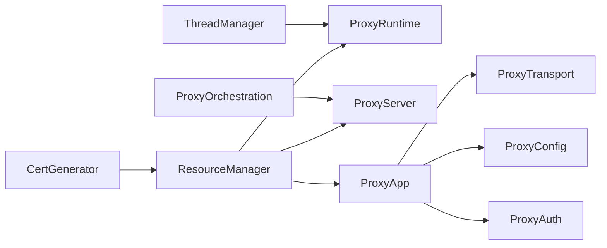

# 代理服务

<cite>
**本文引用的文件**
- [modules/proxy/proxy_server.py](file://modules/proxy/proxy_server.py)
- [modules/proxy/proxy_app.py](file://modules/proxy/proxy_app.py)
- [modules/proxy/proxy_transport.py](file://modules/proxy/proxy_transport.py)
- [modules/proxy/proxy_runtime.py](file://modules/proxy/proxy_runtime.py)
- [modules/proxy/proxy_config.py](file://modules/proxy/proxy_config.py)
- [modules/proxy/proxy_auth.py](file://modules/proxy/proxy_auth.py)
- [modules/services/proxy_orchestration.py](file://modules/services/proxy_orchestration.py)
- [modules/runtime/resource_manager.py](file://modules/runtime/resource_manager.py)
- [modules/cert/cert_generator.py](file://modules/cert/cert_generator.py)
- [README.md](file://README.md)
</cite>

## 目录
1. [简介](#简介)
2. [项目结构](#项目结构)
3. [核心组件](#核心组件)
4. [架构总览](#架构总览)
5. [详细组件分析](#详细组件分析)
6. [依赖关系分析](#依赖关系分析)
7. [性能与连接池优化](#性能与连接池优化)
8. [日志与监控](#日志与监控)
9. [故障排查指南](#故障排查指南)
10. [结论](#结论)

## 简介
本项目是一个基于 Flask 的本地 HTTPS 代理服务，用于将 IDE（如 Trae）对 OpenAI 兼容 API 的请求，透明地转发到私有化模型网关或第三方服务。其核心特性包括：
- 启动 HTTPS 服务器（默认监听 443 端口），使用自签 CA 证书完成 TLS 握手，使客户端（IDE）建立可信连接
- 请求拦截与转发：解析 Incoming Request，提取目标 URL，保留请求头并进行路径重写，转发至后端 API
- 流式响应处理：支持 SSE（Server-Sent Events）事件的解析与归一化，将上游响应转换为标准的流式格式
- 生命周期管理：启动、停止、状态监控与错误恢复
- 配置与证书：集中配置解析、模型 ID 映射、认证头透传与自定义 SSL 上下文

## 项目结构
- 代理核心模块位于 modules/proxy，包含代理服务器装配、领域逻辑、传输层、运行时与配置
- 服务编排位于 modules/services，负责启动/停止代理实例、网络环境检查与 hosts 修改
- 运行时与资源管理位于 modules/runtime，提供线程管理、资源路径与证书文件定位
- 证书生成位于 modules/cert，提供 CA 与服务器证书的自动化生成流程
- 文档与使用说明位于根目录 README.md

图表来源
- [modules/proxy/proxy_server.py](file://modules/proxy/proxy_server.py#L14-L65)
- [modules/proxy/proxy_app.py](file://modules/proxy/proxy_app.py#L18-L112)
- [modules/proxy/proxy_transport.py](file://modules/proxy/proxy_transport.py#L33-L163)
- [modules/proxy/proxy_runtime.py](file://modules/proxy/proxy_runtime.py#L46-L218)
- [modules/proxy/proxy_config.py](file://modules/proxy/proxy_config.py#L14-L107)
- [modules/proxy/proxy_auth.py](file://modules/proxy/proxy_auth.py#L6-L36)
- [modules/services/proxy_orchestration.py](file://modules/services/proxy_orchestration.py#L13-L200)
- [modules/runtime/resource_manager.py](file://modules/runtime/resource_manager.py#L201-L294)
- [modules/cert/cert_generator.py](file://modules/cert/cert_generator.py#L125-L446)

章节来源
- [modules/proxy/proxy_server.py](file://modules/proxy/proxy_server.py#L14-L65)
- [modules/proxy/proxy_app.py](file://modules/proxy/proxy_app.py#L18-L112)
- [modules/proxy/proxy_transport.py](file://modules/proxy/proxy_transport.py#L33-L163)
- [modules/proxy/proxy_runtime.py](file://modules/proxy/proxy_runtime.py#L46-L218)
- [modules/proxy/proxy_config.py](file://modules/proxy/proxy_config.py#L14-L107)
- [modules/proxy/proxy_auth.py](file://modules/proxy/proxy_auth.py#L6-L36)
- [modules/services/proxy_orchestration.py](file://modules/services/proxy_orchestration.py#L13-L200)
- [modules/runtime/resource_manager.py](file://modules/runtime/resource_manager.py#L201-L294)
- [modules/cert/cert_generator.py](file://modules/cert/cert_generator.py#L125-L446)

## 核心组件
- ProxyServer：装配 ProxyApp 与 ProxyRuntime，对外提供 start/stop/is_running 接口
- ProxyApp：Flask 应用，注册 /models 与 /chat/completions 路由，实现请求拦截、模型 ID 替换、流式/非流式响应处理
- ProxyTransport：HTTP 会话封装、SSE 事件提取与 OpenAI 事件归一化、可选自定义 SSL 上下文
- ProxyRuntime：HTTPS 服务器启动（Werkzeug/StoppableWSGIServer）、证书加载、线程管理与生命周期控制
- ProxyConfig：配置解析、中间路由规范化、模型 ID 映射与调试开关
- ProxyAuth：鉴权校验与上游 Authorization 头构建
- ProxyOrchestration：启动/重启/停止代理的高层编排，含网络环境检查与 hosts 修改
- ResourceManager：证书/配置/资源路径管理，支持打包与开发环境差异
- CertGenerator：CA 与服务器证书生成，配合 OpenSSL

章节来源
- [modules/proxy/proxy_server.py](file://modules/proxy/proxy_server.py#L14-L65)
- [modules/proxy/proxy_app.py](file://modules/proxy/proxy_app.py#L18-L112)
- [modules/proxy/proxy_transport.py](file://modules/proxy/proxy_transport.py#L33-L163)
- [modules/proxy/proxy_runtime.py](file://modules/proxy/proxy_runtime.py#L46-L218)
- [modules/proxy/proxy_config.py](file://modules/proxy/proxy_config.py#L14-L107)
- [modules/proxy/proxy_auth.py](file://modules/proxy/proxy_auth.py#L6-L36)
- [modules/services/proxy_orchestration.py](file://modules/services/proxy_orchestration.py#L13-L200)
- [modules/runtime/resource_manager.py](file://modules/runtime/resource_manager.py#L201-L294)
- [modules/cert/cert_generator.py](file://modules/cert/cert_generator.py#L125-L446)

## 架构总览
代理服务采用“装配-运行时-领域逻辑”的分层设计：
- ProxyServer 负责装配 ProxyApp 与 ProxyRuntime
- ProxyRuntime 负责 HTTPS 服务器的创建与生命周期管理
- ProxyApp 负责请求拦截、模型 ID 映射、流式/非流式响应处理
- ProxyTransport 提供 HTTP 会话与 SSE 处理
- ProxyConfig/ProxyAuth/ResourceManager 提供配置、鉴权与资源路径支撑

图表来源
- [modules/proxy/proxy_runtime.py](file://modules/proxy/proxy_runtime.py#L66-L171)
- [modules/proxy/proxy_app.py](file://modules/proxy/proxy_app.py#L164-L460)
- [modules/proxy/proxy_transport.py](file://modules/proxy/proxy_transport.py#L81-L160)

## 详细组件分析

### ProxyServer：装配与入口
- 职责：将 ProxyApp 与 ProxyRuntime 组装为可运行的代理服务；对外暴露 start/stop/is_running
- 关键点：
  - 通过 ResourceManager 提供资源上下文
  - 通过 ThreadManager 管理运行线程
  - 启动时将 ProxyApp 的目标 API 基础 URL、模型 ID、流式模式等参数传递给 ProxyRuntime

章节来源
- [modules/proxy/proxy_server.py](file://modules/proxy/proxy_server.py#L14-L65)

### ProxyRuntime：HTTPS 服务器与生命周期
- 职责：创建并启动 HTTPS 服务器，管理线程与运行状态，提供优雅停止
- 关键点：
  - 使用 ResourceManager 获取证书与私钥路径
  - 加载 SSLContext 并创建 StoppableWSGIServer
  - 通过 ThreadManager 启动服务器线程，支持超时与错误码返回
  - 提供 is_running/stop 接口，支持清理与日志输出

图表来源
- [modules/proxy/proxy_runtime.py](file://modules/proxy/proxy_runtime.py#L16-L218)

章节来源
- [modules/proxy/proxy_runtime.py](file://modules/proxy/proxy_runtime.py#L46-L218)

### ProxyApp：请求拦截与转发
- 职责：注册 /models 与 /chat/completions 路由，实现请求拦截、模型 ID 替换、流式/非流式响应处理
- 关键点：
  - 路由构建：支持 inbound_route 与 middle_route 的组合，形成最终转发路径
  - 鉴权：通过 ProxyAuth 校验 Authorization，支持透传或配置组 API Key
  - 模型 ID 映射：将客户端请求中的 model 字段替换为目标模型 ID；支持强制流模式
  - 流式处理：使用 ProxyTransport.extract_sse_events 逐块读取 SSE，normalize_openai_event 归一化为标准 chunk
  - 非流式到流式：当客户端请求非流式但代理强制流式时，模拟分片输出
  - 错误处理：捕获 HTTPError/RequestException/Exception 并返回标准化错误响应

图表来源
- [modules/proxy/proxy_app.py](file://modules/proxy/proxy_app.py#L164-L460)
- [modules/proxy/proxy_transport.py](file://modules/proxy/proxy_transport.py#L81-L160)

章节来源
- [modules/proxy/proxy_app.py](file://modules/proxy/proxy_app.py#L18-L462)

### ProxyTransport：HTTP 会话与 SSE 处理
- 职责：提供 HTTP 会话、SSE 事件提取、OpenAI 事件归一化、可选自定义 SSL 上下文
- 关键点：
  - 自定义 SSLContextAdapter：在 mount "https://" 时注入自定义 ssl_context，支持关闭严格 X509 校验
  - extract_sse_events：迭代响应内容，按双换行符切分事件，支持可选写入 SSE 日志文件
  - normalize_openai_event：将上游事件解析为标准 OpenAI chunk，填充缺失字段并归一 finish_reason

章节来源
- [modules/proxy/proxy_transport.py](file://modules/proxy/proxy_transport.py#L17-L163)

### ProxyConfig 与 ProxyAuth：配置与鉴权
- ProxyConfig：解析全局与本地配置，计算中间路由、模型 ID 映射、调试与 SSL 选项
- ProxyAuth：校验 Authorization（支持 Bearer 与明文），构建上游 Authorization 头（优先使用配置组 API Key）

章节来源
- [modules/proxy/proxy_config.py](file://modules/proxy/proxy_config.py#L14-L107)
- [modules/proxy/proxy_auth.py](file://modules/proxy/proxy_auth.py#L6-L36)

### ProxyOrchestration：启动/重启/停止编排
- 职责：检查网络环境、修改 hosts、启动/重启/停止代理实例，统一日志与错误码
- 关键点：
  - 依赖注入 StartProxyDeps/RestartProxyDeps，解耦 UI/服务层
  - 端口占用检查（443）
  - 通过 ProxyServer 实例控制启动/停止

章节来源
- [modules/services/proxy_orchestration.py](file://modules/services/proxy_orchestration.py#L13-L200)

### ResourceManager：证书与资源路径
- 职责：跨平台资源路径管理，支持打包与开发环境差异；提供证书/配置/图标等路径
- 关键点：
  - get_cert_file/get_key_file：按域名返回证书与私钥路径
  - get_user_config_file：用户配置文件路径
  - check_resources：输出调试信息并检查缺失资源

章节来源
- [modules/runtime/resource_manager.py](file://modules/runtime/resource_manager.py#L201-L294)

### CertGenerator：证书生成
- 职责：生成 CA 与服务器证书，合并配置文件，调用 OpenSSL，处理序列号文件与权限问题
- 关键点：
  - create_default_config_files：生成 openssl.cnf、v3_ca.cnf、v3_req.cnf、域名配置与主题文件
  - generate_ca_cert/generate_server_cert：生成 CA 与服务器证书，转换私钥格式，使用 CA 签署
  - generate_certificates：一键生成并输出摘要

章节来源
- [modules/cert/cert_generator.py](file://modules/cert/cert_generator.py#L125-L446)

## 依赖关系分析
- 组件耦合与内聚：
  - ProxyServer 仅负责装配，耦合度低
  - ProxyApp 依赖 ProxyTransport/ProxyAuth/ProxyConfig，职责清晰
  - ProxyRuntime 依赖 ResourceManager/ThreadManager，关注运行时细节
  - ProxyOrchestration 作为服务编排层，依赖 ProxyServer 与网络环境工具
- 外部依赖：
  - Flask/Werkzeug：提供 Web 服务器与请求处理
  - requests：提供 HTTP 会话与连接池
  - OpenSSL：用于证书生成与自定义 SSL 上下文

图表来源
- [modules/proxy/proxy_server.py](file://modules/proxy/proxy_server.py#L17-L33)
- [modules/proxy/proxy_runtime.py](file://modules/proxy/proxy_runtime.py#L49-L61)
- [modules/proxy/proxy_app.py](file://modules/proxy/proxy_app.py#L21-L63)
- [modules/services/proxy_orchestration.py](file://modules/services/proxy_orchestration.py#L7-L28)
- [modules/cert/cert_generator.py](file://modules/cert/cert_generator.py#L402-L446)

章节来源
- [modules/proxy/proxy_server.py](file://modules/proxy/proxy_server.py#L17-L33)
- [modules/proxy/proxy_runtime.py](file://modules/proxy/proxy_runtime.py#L49-L61)
- [modules/proxy/proxy_app.py](file://modules/proxy/proxy_app.py#L21-L63)
- [modules/services/proxy_orchestration.py](file://modules/services/proxy_orchestration.py#L7-L28)
- [modules/cert/cert_generator.py](file://modules/cert/cert_generator.py#L402-L446)

## 性能与连接池优化
- 连接池与会话复用：
  - ProxyTransport 使用 requests.Session，内部复用连接，减少 TCP/TLS 握手开销
  - 支持自定义 SSLContextAdapter，便于在高并发场景下统一 SSL 配置
- 流式处理：
  - 使用 iter_content 分块读取响应，避免一次性加载大响应
  - SSE 事件按块切分，边读边写，降低内存峰值
- 超时与重试：
  - 当前实现未内置重试逻辑，可在 ProxyTransport.session.post 的调用处增加 retry 策略（建议指数退避与最大重试次数）
- 并发与线程：
  - 通过 ThreadManager 控制服务器线程，避免重复启动
  - 建议在高并发场景下结合连接池参数（如 pool_connections/pool_maxsize）与上游限流策略

章节来源
- [modules/proxy/proxy_transport.py](file://modules/proxy/proxy_transport.py#L56-L67)
- [modules/proxy/proxy_app.py](file://modules/proxy/proxy_app.py#L259-L266)

## 日志与监控
- 日志输出：
  - ProxyApp 使用 log_func 输出请求 ID、时间戳、调试模式下的请求头与响应详情
  - ProxyTransport 在 SSE 日志写入失败时降级并记录告警
  - ProxyRuntime 在启动/停止/错误时输出详细日志
- 监控建议：
  - 可扩展为结构化日志（JSON），便于集中收集与分析
  - 增加指标埋点：请求量、成功率、平均/95% 延迟、上游错误码分布
  - 建议集成外部监控系统（如 Prometheus/OpenTelemetry）

章节来源
- [modules/proxy/proxy_app.py](file://modules/proxy/proxy_app.py#L82-L84)
- [modules/proxy/proxy_transport.py](file://modules/proxy/proxy_transport.py#L88-L96)
- [modules/proxy/proxy_runtime.py](file://modules/proxy/proxy_runtime.py#L99-L105)

## 故障排查指南
- 证书与信任链问题：
  - 确认 ResourceManager 能找到证书与私钥文件
  - 确认 CA 证书已导入系统受信存储（Windows：受信任的根证书颁发机构；macOS：钥匙串）
- 端口占用：
  - 确保 443 端口未被其他进程占用（如 IIS、Skype、浏览器等）
- 配置错误：
  - 检查 ProxyConfig 的 api_url/middle_route/custom_model_id/target_model_id 是否正确
  - 确认 ProxyAuth 的 mtga_auth_key 与上游 API Key 配置
- 流式响应异常：
  - 检查上游是否返回标准 SSE；如非标准，normalize_openai_event 会回退为透传
- 启动失败：
  - 查看 ProxyRuntime 的错误码与日志，常见原因包括权限不足、证书不存在、端口被占用

章节来源
- [modules/runtime/resource_manager.py](file://modules/runtime/resource_manager.py#L259-L294)
- [modules/proxy/proxy_runtime.py](file://modules/proxy/proxy_runtime.py#L159-L171)
- [modules/proxy/proxy_config.py](file://modules/proxy/proxy_config.py#L71-L74)
- [modules/proxy/proxy_auth.py](file://modules/proxy/proxy_auth.py#L10-L16)

## 结论
本代理服务通过清晰的分层设计与模块化实现，提供了从 HTTPS 服务器、请求拦截、流式处理到生命周期管理的完整能力。结合 ResourceManager 与 CertGenerator，能够快速完成证书生成与部署；通过 ProxyOrchestration，可与 UI/服务层无缝对接，实现一键启动与运维。建议在生产环境中进一步完善重试策略、监控与日志体系，并根据业务流量规模优化连接池与并发控制。