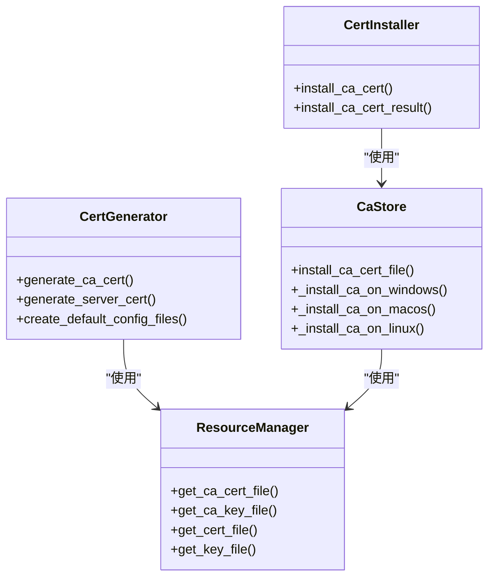
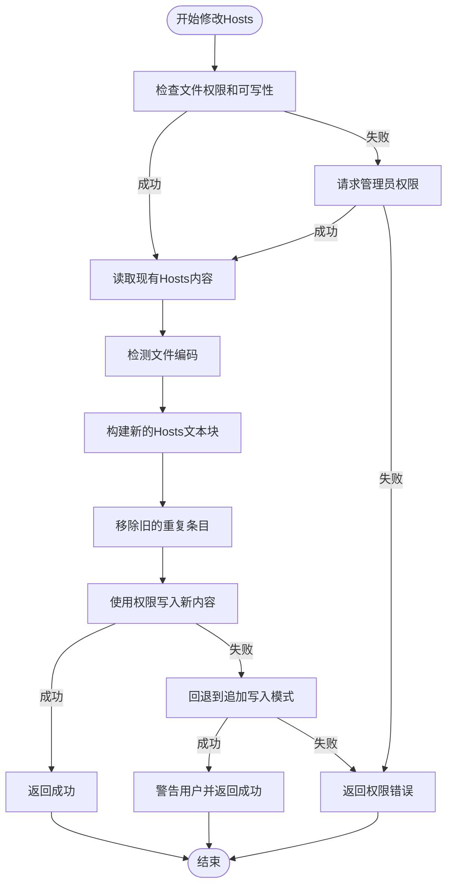
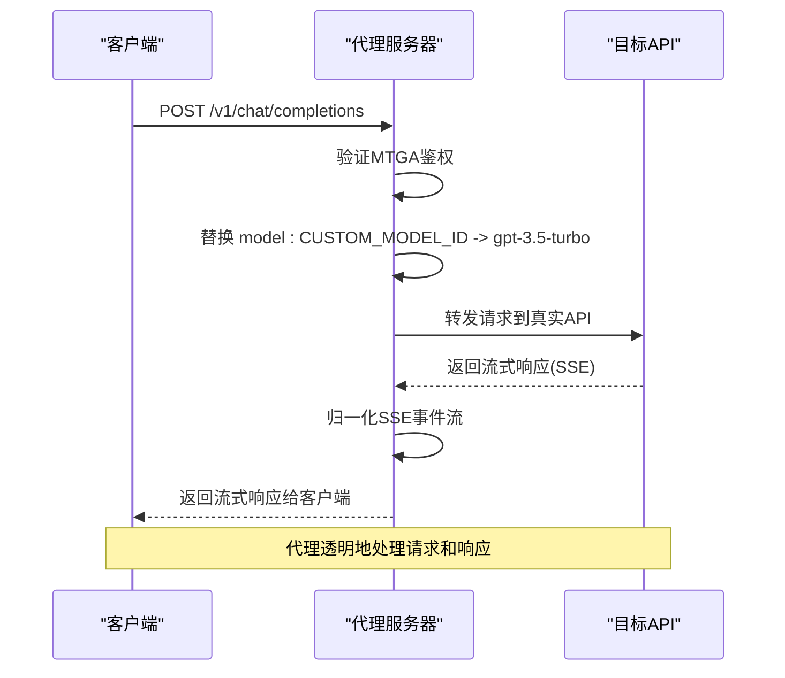

# 核心功能详解

<cite>
**本文档引用的文件**  
- [cert_generator.py](file://modules/cert/cert_generator.py)
- [cert_installer.py](file://modules/cert/cert_installer.py)
- [ca_store.py](file://modules/cert/ca_store.py)
- [hosts_manager.py](file://modules/hosts/hosts_manager.py)
- [proxy_server.py](file://modules/proxy/proxy_server.py)
- [proxy_app.py](file://modules/proxy/proxy_app.py)
- [proxy_runtime.py](file://modules/proxy/proxy_runtime.py)
- [proxy_config.py](file://modules/proxy/proxy_config.py)
- [proxy_transport.py](file://modules/proxy/proxy_transport.py)
- [macos_privileged_helper.py](file://modules/platform/macos_privileged_helper.py)
- [privileges.py](file://modules/platform/privileges.py)
- [resource_manager.py](file://modules/runtime/resource_manager.py)
- [README.md](file://ca/README.md)
- [api.openai.com.cnf](file://ca/api.openai.com.cnf)
- [api.openai.com.subj](file://ca/api.openai.com.subj)
- [openssl.cnf](file://ca/openssl.cnf)
- [v3_ca.cnf](file://ca/v3_ca.cnf)
- [v3_req.cnf](file://ca/v3_req.cnf)
</cite>

## 目录
1. [证书管理](#证书管理)
2. [Hosts文件管理](#hosts文件管理)
3. [本地代理服务](#本地代理服务)
4. [功能协同工作机制](#功能协同工作机制)

## 证书管理

本项目通过模块化方式实现证书的生成、安装与系统集成，确保代理服务能够建立可信的HTTPS连接。核心流程包括CA证书生成、私钥保护、平台证书存储集成及信任安装。

### CA证书生成与OpenSSL配置模板

证书生成模块 `cert_generator.py` 基于OpenSSL配置模板实现自动化证书创建。系统在首次运行时会检查并创建必要的配置文件，包括：

- `openssl.cnf`：定义证书的基本属性，如密钥长度（2048位）、哈希算法（SHA256）和主体名称字段。
- `v3_ca.cnf`：定义CA证书的扩展属性，包括关键的CA标识（`CA:TRUE`）、路径长度限制（`pathlen:3`）和密钥用途（`keyCertSign`）。
- `v3_req.cnf`：定义服务器证书请求的扩展属性，如基本约束（`CA:FALSE`）和主题备用名称（`subjectAltName`）。

对于特定域名（如`api.openai.com`），系统使用`.cnf`和`.subj`文件进行配置。`.cnf`文件定义了证书的扩展属性，而`.subj`文件则包含证书的主体信息（如`/C=CN/ST=X/L=X/O=X/OU=X/CN=api.openai.com`）。这些模板文件位于`ca/`目录下，确保生成的证书符合目标服务的SSL/TLS要求。

CA证书生成过程首先合并`openssl.cnf`和`v3_ca.cnf`配置，然后使用`openssl genrsa`命令生成2048位的私钥（`ca.key`），再通过`openssl req`命令生成自签名的CA证书（`ca.crt`），有效期长达100年。

**Section sources**
- [cert_generator.py](file://modules/cert/cert_generator.py#L125-L203)
- [ca/README.md](file://ca/README.md#L5-L9)
- [openssl.cnf](file://ca/openssl.cnf#L1-L83)
- [v3_ca.cnf](file://ca/v3_ca.cnf#L1-L9)

### 私钥保护与平台证书存储集成

私钥在生成后会立即转换为PKCS#8格式以增强兼容性，并通过文件系统权限进行保护。CA私钥（`ca.key`）和服务器私钥（如`api.openai.com.key`）均存储在用户数据目录下的`ca/`子目录中，该目录具有严格的访问控制。

平台证书存储集成通过`ca_store.py`模块实现，支持Windows、macOS和Linux三大操作系统：

- **Windows**：使用`certutil -addstore`命令将CA证书安装到“受信任的根证书颁发机构”存储中。
- **macOS**：通过`security add-trusted-cert`命令将CA证书安装到系统钥匙串（System.keychain）并设为完全信任。
- **Linux**：将证书复制到`/usr/local/share/ca-certificates/`目录并执行`update-ca-certificates`命令更新信任库。

此过程确保操作系统和浏览器能够信任由该CA签发的任何服务器证书。

**Diagram sources**
- [cert_generator.py](file://modules/cert/cert_generator.py#L125-L203)
- [cert_installer.py](file://modules/cert/cert_installer.py#L15-L47)
- [ca_store.py](file://modules/cert/ca_store.py#L28-L39)
- [resource_manager.py](file://modules/runtime/resource_manager.py#L201-L258)

### 信任安装流程

信任安装流程由`cert_installer.py`模块驱动。`install_ca_cert`函数首先在用户数据目录中搜索CA证书文件（优先级为`ca.crt`、`rootCA.crt`等），然后调用`ca_store.py`中的`install_ca_cert_file`函数执行跨平台安装。

在macOS上，由于修改系统钥匙串需要管理员权限，系统通过`macos_privileged_helper.py`模块启动一个持久化的管理员权限辅助进程。该进程通过Unix Socket与主程序通信，安全地执行`security`命令，避免了频繁弹出权限请求对话框。

**Section sources**
- [cert_installer.py](file://modules/cert/cert_installer.py#L15-L50)
- [ca_store.py](file://modules/cert/ca_store.py#L28-L39)
- [macos_privileged_helper.py](file://modules/platform/macos_privileged_helper.py#L48-L338)

## Hosts文件管理

Hosts文件管理模块负责安全地读写系统`hosts`文件，实现域名到本地代理的映射。其核心功能包括权限提升、状态检测、冲突处理和备份还原。

### 安全读写与权限提升机制

`hosts_manager.py`模块通过`write_hosts_file_with_permission`函数实现安全写入。在不同平台上，权限提升机制如下：

- **Windows**：检查当前进程是否为管理员（通过`is_windows_admin`），若不是，则提示用户以管理员身份运行。同时，使用`ensure_windows_file_writable`确保文件可写。
- **macOS**：与证书安装类似，通过`macos_privileged_helper.py`获取管理员权限，然后使用`session.write_file`或`session.copy_file`方法安全地操作`/etc/hosts`。
- **Linux**：依赖`sudo`权限，通过`run_command`执行`cp`和`update-ca-certificates`等命令。

### 状态检测与冲突处理

模块实现了精细的状态检测和冲突处理逻辑。`get_hosts_modify_block_state`函数检查当前环境是否允许修改hosts文件。如果检测到写入受限（如文件被锁定或权限不足），系统会自动回退到追加写入模式（`_append_hosts_block_fallback`），并发出警告。

在添加条目时，`add_hosts_entry`函数会先读取现有内容，使用`remove_hosts_block_from_content`移除任何旧的重复条目，然后通过`append_hosts_block`添加新的统一文本块，确保操作的原子性。如果原子写入失败，同样会回退到追加模式。

**Diagram sources**
- [hosts_manager.py](file://modules/hosts/hosts_manager.py#L264-L358)
- [macos_privileged_helper.py](file://modules/platform/macos_privileged_helper.py#L48-L338)
- [privileges.py](file://modules/platform/privileges.py#L13-L63)

**Section sources**
- [hosts_manager.py](file://modules/hosts/hosts_manager.py#L1-L492)
- [file_operability.py](file://modules/hosts/file_operability.py#L1-L50)
- [hosts_text.py](file://modules/hosts/hosts_text.py#L1-L50)

## 本地代理服务

本地代理服务是项目的核心，基于Flask框架实现HTTPS请求的拦截、转发和重加密。它由领域逻辑（`ProxyApp`）和运行时（`ProxyRuntime`）两部分构成。

### Flask服务器实现与请求拦截

`proxy_app.py`中的`ProxyApp`类是代理服务的领域逻辑中心。它使用Flask创建一个HTTPS服务器，监听`/v1/models`和`/v1/chat/completions`等路由。当客户端请求到达时，`_chat_completions`方法会拦截请求，进行鉴权、模型ID映射和请求转发。

### 请求转发与TLS解密重加密

`proxy_server.py`中的`ProxyServer`类负责装配`ProxyApp`和`ProxyRuntime`。`start`方法启动代理，`ProxyRuntime`则负责创建一个支持TLS的WSGI服务器（`StoppableWSGIServer`），并加载由`cert_generator.py`生成的证书和私钥。

请求转发逻辑在`_chat_completions`方法中实现。代理首先验证客户端的鉴权头，然后将请求中的`model`字段从自定义模型ID（如`CUSTOM_MODEL_ID`）替换为目标模型ID（如`gpt-3.5-turbo`）。接着，使用`requests`库将修改后的请求转发到真实的目标API（如`https://api.openai.com`）。

在TLS处理方面，`proxy_runtime.py`使用`ssl.SSLContext`加载证书链，实现HTTPS监听。`proxy_transport.py`中的`SSLContextAdapter`允许禁用严格的X509验证（`disable_ssl_strict_mode`），以兼容某些非标准的SSL配置。

### 模型ID映射规则与配置

模型ID映射规则由`proxy_config.py`中的`ProxyConfig`数据类定义。`build_proxy_config`函数从配置文件（`mtga_config.yaml`）中读取`custom_model_id`和`target_model_id`。当`get_models`路由被访问时，代理会返回一个包含`custom_model_id`的虚拟模型列表，使客户端认为该模型可用。实际请求时，该ID会被透明地映射到`target_model_id`。

**Diagram sources**
- [proxy_server.py](file://modules/proxy/proxy_server.py#L14-L64)
- [proxy_app.py](file://modules/proxy/proxy_app.py#L18-L461)
- [proxy_runtime.py](file://modules/proxy/proxy_runtime.py#L46-L217)
- [proxy_config.py](file://modules/proxy/proxy_config.py#L14-L106)

**Section sources**
- [proxy_server.py](file://modules/proxy/proxy_server.py#L1-L65)
- [proxy_app.py](file://modules/proxy/proxy_app.py#L1-L462)
- [proxy_runtime.py](file://modules/proxy/proxy_runtime.py#L1-L218)
- [proxy_config.py](file://modules/proxy/proxy_config.py#L1-L107)
- [proxy_transport.py](file://modules/proxy/proxy_transport.py#L1-L163)

## 功能协同工作机制

三大核心技术支柱——证书管理、Hosts文件管理和本地代理服务——通过一个清晰的协同工作流程紧密集成，确保整个系统能够无缝运行。

### 协同工作流程

1.  **证书生成**：`cert_generator.generate_certificates()`函数首先生成CA证书和服务器证书（如`api.openai.com.crt`和`.key`）。
2.  **证书安装**：`cert_installer.install_ca_cert()`函数将CA证书安装到系统信任库。只有安装成功，操作系统才会信任代理服务器的HTTPS连接。
3.  **Hosts修改**：`hosts_manager.modify_hosts_file()`函数修改系统`hosts`文件，将目标域名（如`api.openai.com`）指向`127.0.0.1`，将流量重定向到本地代理。
4.  **代理启动**：`proxy_server.start()`函数启动Flask服务器，使用之前生成的证书监听443端口。此时，代理已准备好处理HTTPS请求。

### 关键函数调用链示例

一个典型的功能调用链如下：
`cert_generator.generate_ca()` → `cert_installer.install()` → `proxy_server.start()`

- `generate_ca()` 创建了`ca.crt`和`ca.key`。
- `install()` 将`ca.crt`安装到系统信任库。
- `start()` 启动代理服务器，加载`ca.crt`和`api.openai.com.key`来解密和重新加密HTTPS流量。

这个链条清晰地表明，**证书安装成功是建立可信代理连接的先决条件**。如果CA证书未被系统信任，浏览器或客户端会因证书不受信任而拒绝连接，导致代理服务无法正常工作。

**Diagram sources**
- [cert_generator.py](file://modules/cert/cert_generator.py#L386-L445)
- [cert_installer.py](file://modules/cert/cert_installer.py#L15-L47)
- [hosts_manager.py](file://modules/hosts/hosts_manager.py#L459-L492)
- [proxy_server.py](file://modules/proxy/proxy_server.py#L57-L64)

**Section sources**
- [cert_service.py](file://modules/services/cert_service.py#L10-L37)
- [proxy_orchestration.py](file://modules/services/proxy_orchestration.py#L1-L50)
- [startup_checks.py](file://modules/services/startup_checks.py#L1-L50)