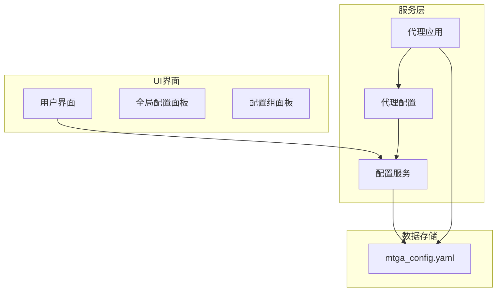
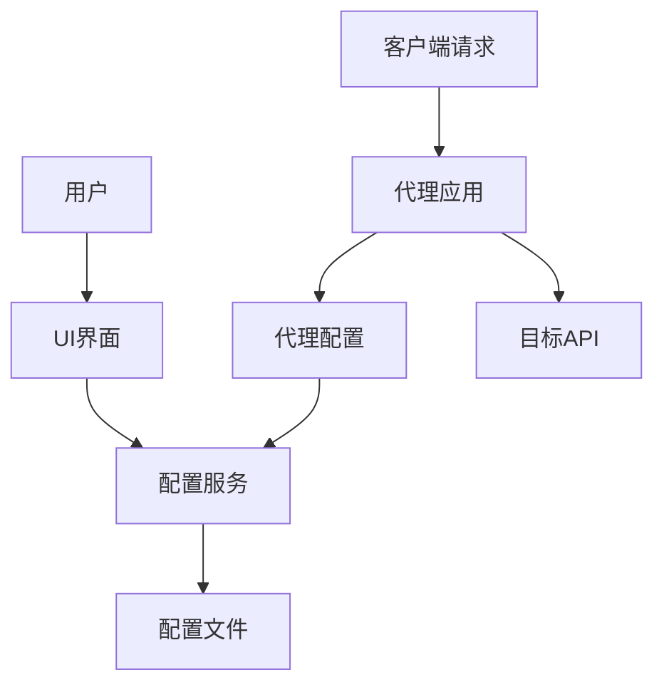
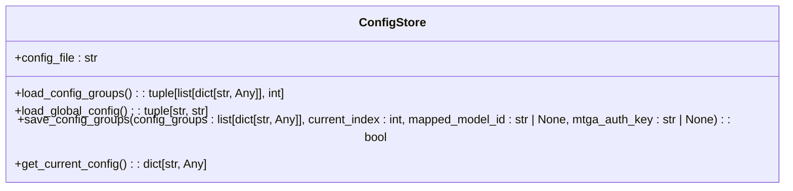
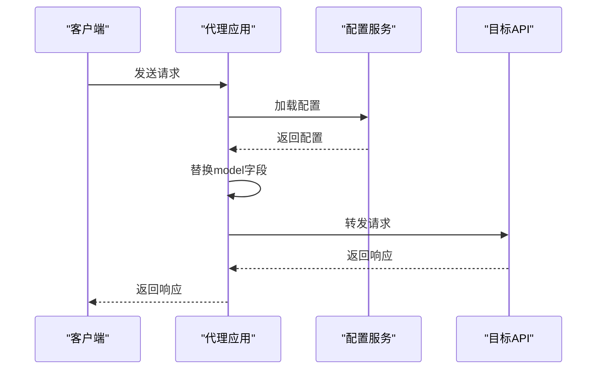
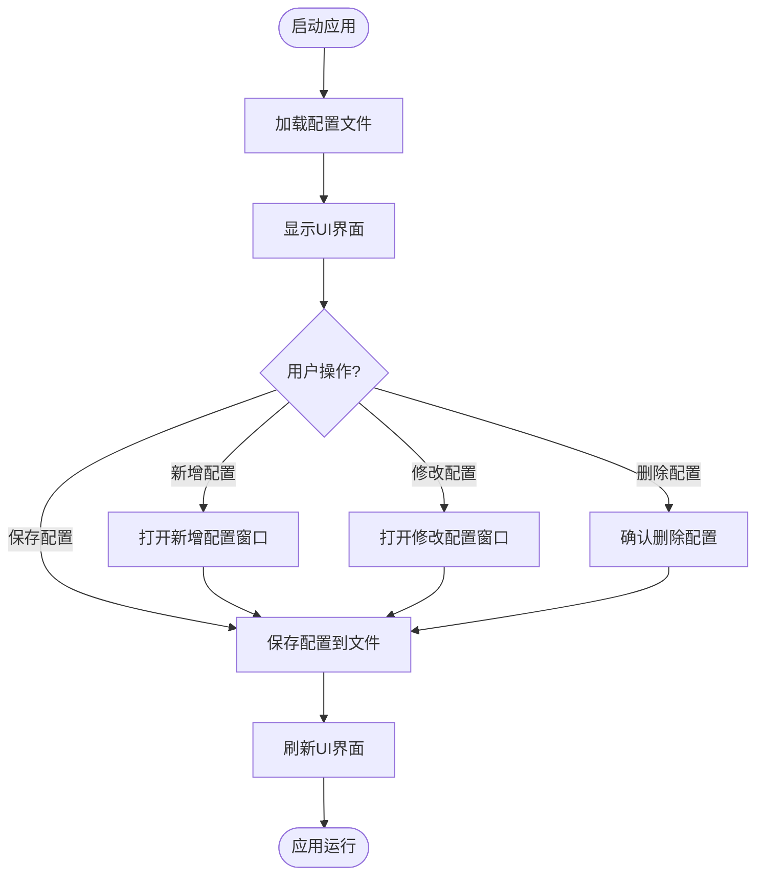
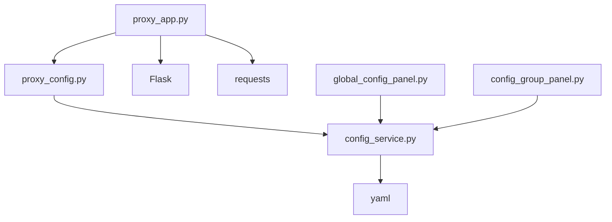

# 模型映射

<cite>
**本文档引用文件**   
- [proxy_config.py](file://modules/proxy/proxy_config.py)
- [config_service.py](file://modules/services/config_service.py)
- [proxy_app.py](file://modules/proxy/proxy_app.py)
- [global_config_panel.py](file://modules/ui/global_config_panel.py)
- [config_group_panel.py](file://modules/ui/config_group_panel.py)
- [resource_manager.py](file://modules/runtime/resource_manager.py)
</cite>

## 目录
1. [简介](#简介)
2. [项目结构](#项目结构)
3. [核心组件](#核心组件)
4. [架构概述](#架构概述)
5. [详细组件分析](#详细组件分析)
6. [依赖分析](#依赖分析)
7. [性能考虑](#性能考虑)
8. [故障排除指南](#故障排除指南)
9. [结论](#结论)

## 简介
本文档详细解释了模型ID映射功能的实现原理与配置方式。该功能允许用户将原始请求中的模型名称（如gpt-4）映射到后端支持的模型ID（如my-private-gpt-4-turbo），从而实现无缝兼容。文档涵盖了proxy_config.py中模型映射规则的定义、config_service.py中配置的加载与管理、proxy_app.py中请求处理流程的实现，以及通过UI界面动态管理映射规则的方法。同时，还包括映射冲突处理、默认模型fallback机制及调试日志输出等高级功能。

## 项目结构
模型ID映射功能主要涉及以下几个核心模块：
- `modules/proxy/`：包含代理服务的核心逻辑，包括配置解析、请求处理和转发。
- `modules/services/`：提供配置管理服务，负责加载和保存配置文件。
- `modules/ui/`：提供用户界面，允许用户通过图形界面管理配置和映射规则。

**图示来源**
- [proxy_config.py](file://modules/proxy/proxy_config.py)
- [config_service.py](file://modules/services/config_service.py)
- [proxy_app.py](file://modules/proxy/proxy_app.py)
- [global_config_panel.py](file://modules/ui/global_config_panel.py)
- [config_group_panel.py](file://modules/ui/config_group_panel.py)

**本节来源**
- [proxy_config.py](file://modules/proxy/proxy_config.py)
- [config_service.py](file://modules/services/config_service.py)
- [proxy_app.py](file://modules/proxy/proxy_app.py)

## 核心组件
模型ID映射功能的核心组件包括：
- **ProxyConfig**：定义代理配置的数据结构，包含目标API基础URL、中间路由、自定义模型ID、目标模型ID等属性。
- **ConfigStore**：提供配置存储服务，支持从YAML文件加载和保存配置组及全局配置。
- **ProxyApp**：代理应用主类，负责解析配置、创建Flask应用、处理请求并转发到目标API。

**本节来源**
- [proxy_config.py](file://modules/proxy/proxy_config.py#L14-L25)
- [config_service.py](file://modules/services/config_service.py#L10-L13)
- [proxy_app.py](file://modules/proxy/proxy_app.py#L18-L39)

## 架构概述
模型ID映射功能的架构分为三层：UI界面层、服务层和数据存储层。UI界面层提供用户友好的图形界面，允许用户添加、编辑和删除配置组及全局配置。服务层负责加载和管理配置，提供统一的API供其他组件调用。数据存储层使用YAML格式的文件存储配置信息，确保配置的持久化。

**图示来源**
- [proxy_app.py](file://modules/proxy/proxy_app.py#L18-L39)
- [config_service.py](file://modules/services/config_service.py#L10-L13)
- [proxy_config.py](file://modules/proxy/proxy_config.py#L14-L25)

## 详细组件分析

### 配置服务分析
配置服务（ConfigService）负责加载和管理配置文件。它提供了加载配置组、加载全局配置和保存配置组的方法。配置文件采用YAML格式，支持灵活的配置管理。

#### 配置服务类图

**图示来源**
- [config_service.py](file://modules/services/config_service.py#L10-L81)

### 代理应用分析
代理应用（ProxyApp）是模型ID映射功能的核心。它负责解析配置、创建Flask应用、处理请求并转发到目标API。在处理请求时，代理应用会根据配置替换model字段，实现模型ID的映射。

#### 代理应用序列图

**图示来源**
- [proxy_app.py](file://modules/proxy/proxy_app.py#L18-L462)
- [config_service.py](file://modules/services/config_service.py#L10-L81)

### UI界面分析
UI界面提供了用户友好的图形界面，允许用户通过图形界面管理配置和映射规则。全局配置面板允许用户设置映射模型ID和MTGA鉴权Key，配置组面板允许用户添加、编辑和删除配置组。

#### UI界面流程图

**图示来源**
- [global_config_panel.py](file://modules/ui/global_config_panel.py#L1-L88)
- [config_group_panel.py](file://modules/ui/config_group_panel.py#L1-L514)

**本节来源**
- [config_service.py](file://modules/services/config_service.py#L10-L81)
- [proxy_app.py](file://modules/proxy/proxy_app.py#L18-L462)
- [global_config_panel.py](file://modules/ui/global_config_panel.py#L1-L88)
- [config_group_panel.py](file://modules/ui/config_group_panel.py#L1-L514)

## 依赖分析
模型ID映射功能的各个组件之间存在紧密的依赖关系。代理应用依赖于配置服务来加载配置，配置服务依赖于YAML库来解析和生成配置文件，UI界面依赖于配置服务来获取和更新配置。

**图示来源**
- [proxy_app.py](file://modules/proxy/proxy_app.py#L13-L14)
- [proxy_config.py](file://modules/proxy/proxy_config.py#L6-L7)
- [config_service.py](file://modules/services/config_service.py#L7-L8)
- [global_config_panel.py](file://modules/ui/global_config_panel.py#L8-L9)
- [config_group_panel.py](file://modules/ui/config_group_panel.py#L10-L11)

**本节来源**
- [proxy_app.py](file://modules/proxy/proxy_app.py#L13-L14)
- [proxy_config.py](file://modules/proxy/proxy_config.py#L6-L7)
- [config_service.py](file://modules/services/config_service.py#L7-L8)

## 性能考虑
模型ID映射功能在设计时考虑了性能因素。配置文件的加载和解析在应用启动时完成，避免了每次请求时重复加载。请求处理过程中，模型ID的替换操作非常轻量，不会显著影响性能。此外，代理应用使用了requests.Session来复用HTTP连接，提高了转发请求的效率。

## 故障排除指南
当模型ID映射功能出现问题时，可以通过以下步骤进行排查：
1. 检查配置文件是否正确加载。
2. 检查日志输出，查看是否有错误信息。
3. 确认目标API的URL和模型ID是否正确。
4. 检查网络连接是否正常。

**本节来源**
- [proxy_app.py](file://modules/proxy/proxy_app.py#L445-L458)
- [config_service.py](file://modules/services/config_service.py#L23-L24)

## 结论
模型ID映射功能通过灵活的配置管理和高效的请求处理，实现了模型名称的无缝映射。用户可以通过UI界面轻松管理配置，确保请求能够正确转发到目标API。该功能的设计考虑了性能和可维护性，为用户提供了一个稳定可靠的代理服务。