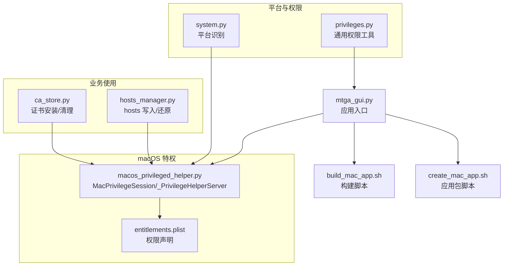
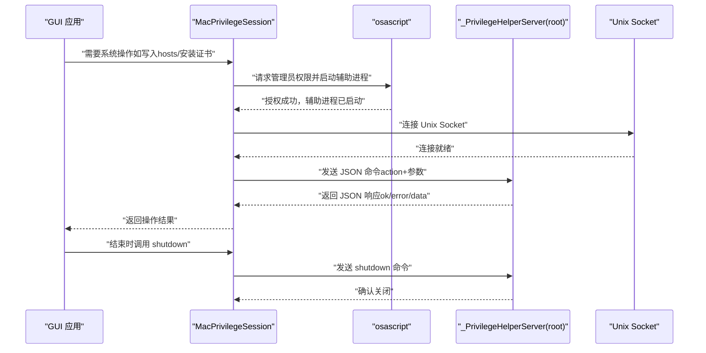
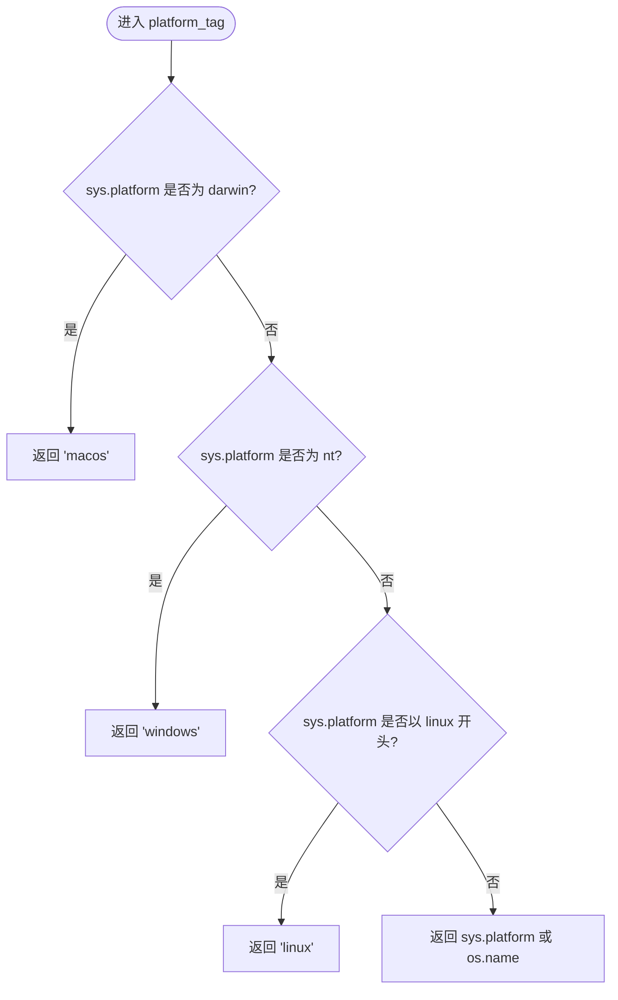
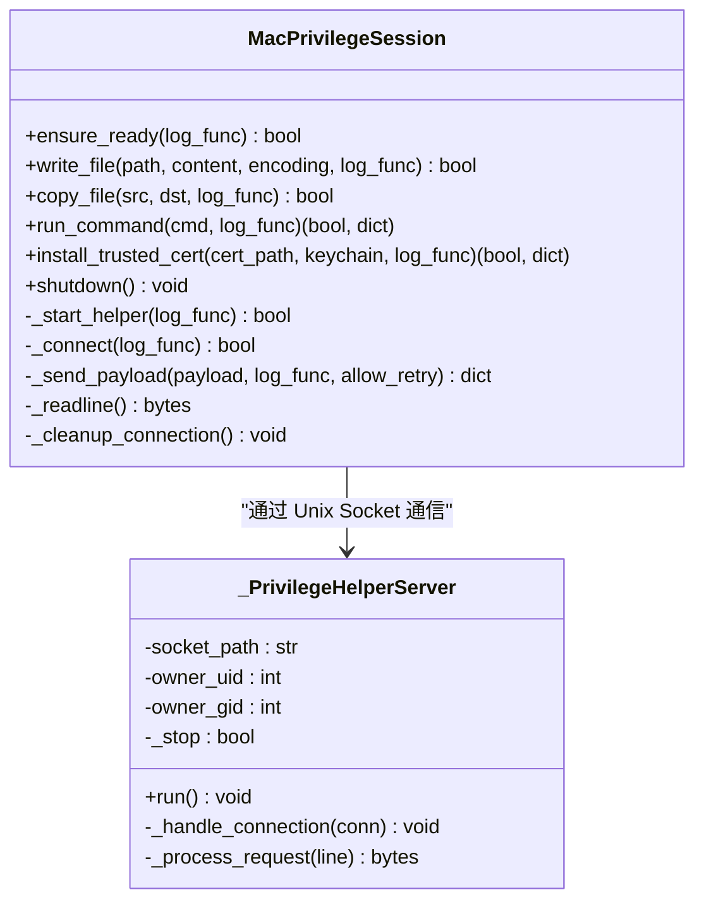
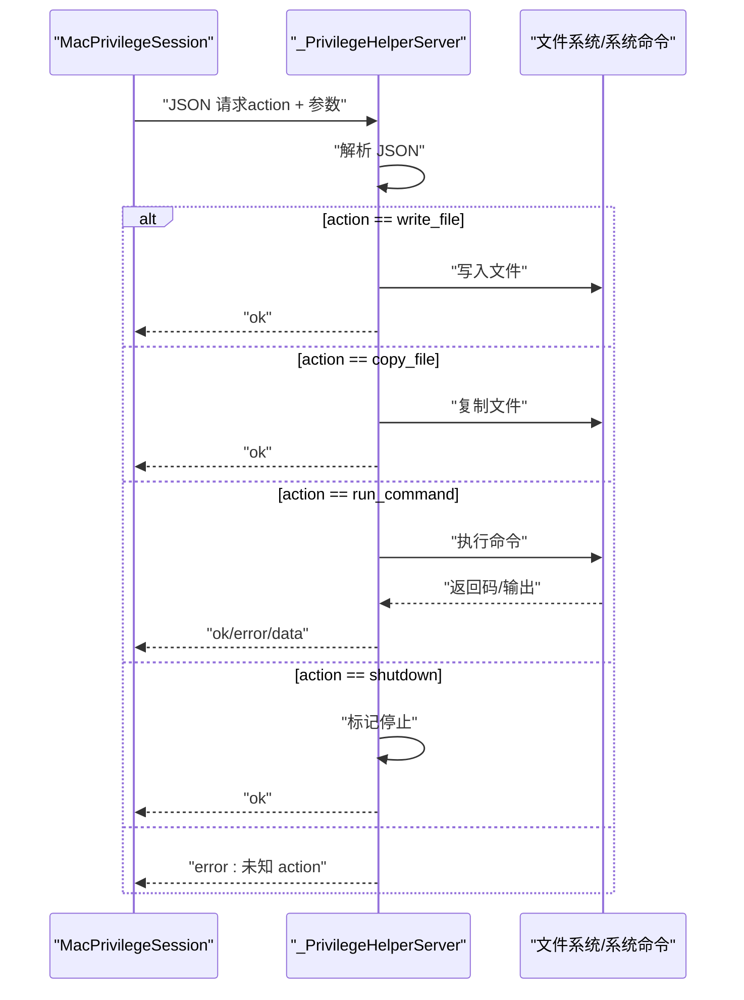
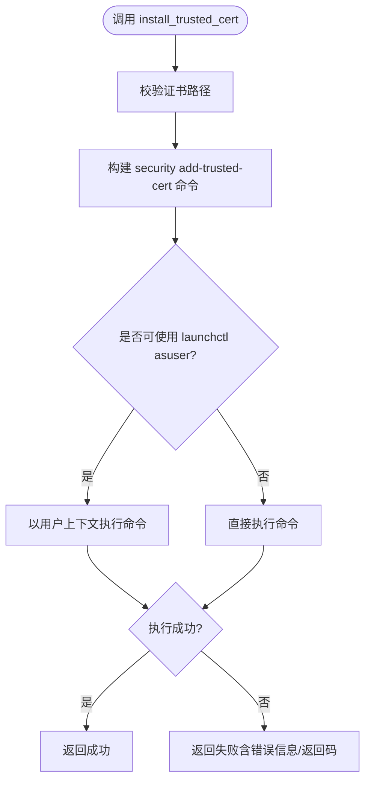
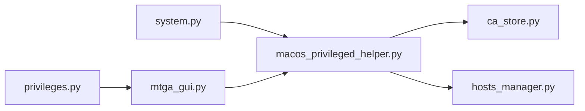

# macOS集成

<cite>
**本文引用的文件**
- [modules/platform/system.py](file://modules/platform/system.py)
- [modules/platform/macos_privileged_helper.py](file://modules/platform/macos_privileged_helper.py)
- [modules/platform/privileges.py](file://modules/platform/privileges.py)
- [mac/entitlements.plist](file://mac/entitlements.plist)
- [modules/cert/ca_store.py](file://modules/cert/ca_store.py)
- [modules/hosts/hosts_manager.py](file://modules/hosts/hosts_manager.py)
- [mtga_gui.py](file://mtga_gui.py)
- [build_mac_app.sh](file://build_mac_app.sh)
- [mac/create_mac_app.sh](file://mac/create_mac_app.sh)
</cite>

## 目录
1. [简介](#简介)
2. [项目结构](#项目结构)
3. [核心组件](#核心组件)
4. [架构总览](#架构总览)
5. [详细组件分析](#详细组件分析)
6. [依赖关系分析](#依赖关系分析)
7. [性能考量](#性能考量)
8. [故障排查指南](#故障排查指南)
9. [结论](#结论)

## 简介
本文件面向在 macOS 上运行的应用，系统性阐述其特权操作机制与安全设计。重点包括：
- 平台识别：is_macos() 与 platform_tag() 的实现与用途
- XPC 风格通信架构：MacPrivilegeSession 如何通过 osascript 请求管理员权限并启动 root 进程；_PrivilegeHelperServer 如何通过 Unix Socket 接收指令；二者通过 JSON 消息协议通信
- 安全执行方法：write_file、copy_file、install_trusted_cert 等如何在最小权限原则下完成系统级操作
- 权限声明：entitlements.plist 中的特殊权限如何支撑辅助进程创建
- 安全优势：GUI 应用全程非管理员运行，仅在需要时临时提权，降低攻击面

## 项目结构
围绕 macOS 特权操作的关键文件分布如下：
- 平台识别与通用权限工具：modules/platform/system.py、modules/platform/privileges.py
- macOS 特权助手与通信：modules/platform/macos_privileged_helper.py
- 实际使用点：modules/cert/ca_store.py、modules/hosts/hosts_manager.py
- 应用入口与构建：mtga_gui.py、build_mac_app.sh、mac/create_mac_app.sh
- 权限声明：mac/entitlements.plist

图表来源
- [modules/platform/system.py](file://modules/platform/system.py#L15-L30)
- [modules/platform/macos_privileged_helper.py](file://modules/platform/macos_privileged_helper.py#L52-L358)
- [mac/entitlements.plist](file://mac/entitlements.plist#L1-L25)
- [modules/cert/ca_store.py](file://modules/cert/ca_store.py#L142-L178)
- [modules/hosts/hosts_manager.py](file://modules/hosts/hosts_manager.py#L200-L237)
- [mtga_gui.py](file://mtga_gui.py#L65-L68)
- [build_mac_app.sh](file://build_mac_app.sh#L87-L118)
- [mac/create_mac_app.sh](file://mac/create_mac_app.sh#L110-L130)

章节来源
- [modules/platform/system.py](file://modules/platform/system.py#L15-L30)
- [modules/platform/macos_privileged_helper.py](file://modules/platform/macos_privileged_helper.py#L52-L358)
- [mac/entitlements.plist](file://mac/entitlements.plist#L1-L25)
- [modules/cert/ca_store.py](file://modules/cert/ca_store.py#L142-L178)
- [modules/hosts/hosts_manager.py](file://modules/hosts/hosts_manager.py#L200-L237)
- [mtga_gui.py](file://mtga_gui.py#L65-L68)
- [build_mac_app.sh](file://build_mac_app.sh#L87-L118)
- [mac/create_mac_app.sh](file://mac/create_mac_app.sh#L110-L130)

## 核心组件
- 平台识别与标签生成：is_macos() 与 platform_tag() 用于在多平台环境中精准识别 macOS，并输出统一的平台标签
- MacPrivilegeSession：GUI 侧客户端，负责首次提权、建立 Unix Socket 连接、发送 JSON 命令、接收响应
- _PrivilegeHelperServer：以 root 身份运行的守护端，监听 Unix Socket，解析 JSON 命令并执行系统级操作
- get_mac_privileged_session：全局会话工厂，按需创建并缓存 MacPrivilegeSession
- entitlements.plist：声明应用所需系统权限，确保辅助进程具备访问系统资源的能力

章节来源
- [modules/platform/system.py](file://modules/platform/system.py#L15-L30)
- [modules/platform/macos_privileged_helper.py](file://modules/platform/macos_privileged_helper.py#L52-L358)
- [mac/entitlements.plist](file://mac/entitlements.plist#L1-L25)

## 架构总览
整体采用“GUI 常规运行 + 需求时提权”的设计。GUI 应用以普通用户身份启动，仅在需要写入系统 hosts、安装系统证书等场景时，通过 osascript 弹出授权对话框，请求管理员权限并启动 root 辅助进程。辅助进程通过 Unix Socket 与 GUI 通信，双方以 JSON 协议交换命令与结果。任务完成后，GUI 主动关闭辅助进程，避免长期持有高权限。

图表来源
- [modules/platform/macos_privileged_helper.py](file://modules/platform/macos_privileged_helper.py#L73-L91)
- [modules/platform/macos_privileged_helper.py](file://modules/platform/macos_privileged_helper.py#L180-L228)
- [modules/platform/macos_privileged_helper.py](file://modules/platform/macos_privileged_helper.py#L369-L413)
- [modules/platform/macos_privileged_helper.py](file://modules/platform/macos_privileged_helper.py#L414-L455)

## 详细组件分析

### 平台识别：is_macos() 与 platform_tag()
- is_macos()：基于 sys.platform 判断是否为 darwin，简洁可靠
- platform_tag()：根据 is_macos()/is_windows()/is_linux() 输出统一标签，便于跨平台分支逻辑

图表来源
- [modules/platform/system.py](file://modules/platform/system.py#L15-L30)

章节来源
- [modules/platform/system.py](file://modules/platform/system.py#L15-L30)

### macOS 特权助手：MacPrivilegeSession 与 _PrivilegeHelperServer
- MacPrivilegeSession
  - 生命周期管理：ensure_ready() 负责首次启动与连接复健；shutdown() 主动释放
  - 通信协议：以 JSON 文本行（以特定终止符分隔）进行请求/响应
  - 操作方法：write_file、copy_file、run_command、install_trusted_cert
  - 启动流程：通过 osascript 弹出授权对话框，随后以 root 身份启动辅助进程
- _PrivilegeHelperServer
  - 监听 Unix Socket，解析 JSON 命令并执行对应系统级操作
  - 支持 action：write_file、copy_file、run_command、shutdown
  - 安全绑定：socket 文件属主与权限严格控制，仅允许原用户访问

图表来源
- [modules/platform/macos_privileged_helper.py](file://modules/platform/macos_privileged_helper.py#L52-L358)
- [modules/platform/macos_privileged_helper.py](file://modules/platform/macos_privileged_helper.py#L360-L455)

章节来源
- [modules/platform/macos_privileged_helper.py](file://modules/platform/macos_privileged_helper.py#L52-L358)
- [modules/platform/macos_privileged_helper.py](file://modules/platform/macos_privileged_helper.py#L360-L455)

### JSON 消息协议与命令流
- 请求格式：JSON 对象，包含 action 与必要参数
- 响应格式：JSON 对象，包含 ok、error、data（含 returncode、stdout、stderr 等）
- 典型命令：
  - write_file：写入文本文件
  - copy_file：复制文件（如 hosts 备份/还原）
  - run_command：执行任意命令（如 security add-trusted-cert）
  - shutdown：优雅关闭辅助进程

图表来源
- [modules/platform/macos_privileged_helper.py](file://modules/platform/macos_privileged_helper.py#L414-L455)

章节来源
- [modules/platform/macos_privileged_helper.py](file://modules/platform/macos_privileged_helper.py#L414-L455)

### 安全执行方法详解
- write_file
  - 作用：以管理员权限向系统受保护路径写入文本内容（如 hosts）
  - 安全性：仅在需要时临时提权，写入完成后立即断开
- copy_file
  - 作用：复制文件，典型用于 hosts 备份/还原
  - 安全性：通过 root 进程执行，避免 GUI 权限不足导致的失败
- install_trusted_cert
  - 作用：安装并信任 CA 证书到系统钥匙串
  - 安全性：优先使用 launchctl asuser 方式在用户上下文中执行 security 命令，失败时回退直接执行，确保兼容性与安全性

图表来源
- [modules/platform/macos_privileged_helper.py](file://modules/platform/macos_privileged_helper.py#L133-L165)
- [modules/cert/ca_store.py](file://modules/cert/ca_store.py#L142-L178)

章节来源
- [modules/platform/macos_privileged_helper.py](file://modules/platform/macos_privileged_helper.py#L93-L165)
- [modules/cert/ca_store.py](file://modules/cert/ca_store.py#L142-L178)

### 权限声明与辅助进程创建
- entitlements.plist
  - 禁用沙箱：允许访问系统资源
  - 剪贴板访问：允许读写剪贴板
  - 网络访问：允许客户端网络请求
  - 用户选择文件读写：允许读写用户选择的文件
  - 系统文件访问：允许读写系统 hosts 等关键文件
- 辅助进程创建
  - GUI 通过 osascript 弹出授权对话框
  - 授权后以 root 身份启动 _PrivilegeHelperServer
  - 通过 Unix Socket 与 GUI 通信，socket 文件权限严格限制

章节来源
- [mac/entitlements.plist](file://mac/entitlements.plist#L1-L25)
- [modules/platform/macos_privileged_helper.py](file://modules/platform/macos_privileged_helper.py#L180-L228)
- [modules/platform/macos_privileged_helper.py](file://modules/platform/macos_privileged_helper.py#L369-L382)

### 实际使用场景
- 证书安装/清理
  - 证书安装：在 macOS 上通过 install_trusted_cert 将 CA 证书安装到系统钥匙串并设为信任
  - 证书清理：通过 run_command 执行系统命令清理指定证书
- hosts 文件写入/还原
  - 写入：在 macOS 上通过 write_file 将内容写入系统 hosts
  - 还原：通过 copy_file 将备份文件复制回系统 hosts

章节来源
- [modules/cert/ca_store.py](file://modules/cert/ca_store.py#L142-L178)
- [modules/cert/ca_store.py](file://modules/cert/ca_store.py#L269-L300)
- [modules/hosts/hosts_manager.py](file://modules/hosts/hosts_manager.py#L200-L237)
- [modules/hosts/hosts_manager.py](file://modules/hosts/hosts_manager.py#L217-L262)

## 依赖关系分析
- 平台识别依赖：system.py 为 macOS 特权模块提供平台判断基础
- 通用权限工具：privileges.py 提供跨平台管理员状态检查与提升入口（Windows/Linux），macOS 采用专用的特权助手
- 业务依赖：ca_store.py、hosts_manager.py 通过 get_mac_privileged_session 获取会话实例，按需发起特权操作
- 应用入口：mtga_gui.py 在启动时检查是否为特权助手模式，若是则直接运行辅助进程

图表来源
- [modules/platform/system.py](file://modules/platform/system.py#L15-L30)
- [modules/platform/macos_privileged_helper.py](file://modules/platform/macos_privileged_helper.py#L344-L358)
- [modules/platform/privileges.py](file://modules/platform/privileges.py#L65-L82)
- [modules/cert/ca_store.py](file://modules/cert/ca_store.py#L142-L178)
- [modules/hosts/hosts_manager.py](file://modules/hosts/hosts_manager.py#L200-L237)
- [mtga_gui.py](file://mtga_gui.py#L65-L68)

章节来源
- [modules/platform/system.py](file://modules/platform/system.py#L15-L30)
- [modules/platform/macos_privileged_helper.py](file://modules/platform/macos_privileged_helper.py#L344-L358)
- [modules/platform/privileges.py](file://modules/platform/privileges.py#L65-L82)
- [modules/cert/ca_store.py](file://modules/cert/ca_store.py#L142-L178)
- [modules/hosts/hosts_manager.py](file://modules/hosts/hosts_manager.py#L200-L237)
- [mtga_gui.py](file://mtga_gui.py#L65-L68)

## 性能考量
- 连接延迟：首次启动辅助进程与建立 Unix Socket 连接存在等待时间，建议在 UI 中提供明确提示
- 通信开销：JSON 文本行协议简单高效，适合短小命令；对于大文件传输，建议采用一次性复制策略而非逐字节写入
- 会话复用：get_mac_privileged_session 提供单例缓存，减少重复启动成本
- 退出清理：GUI 退出时主动 shutdown，避免残留进程占用系统资源

## 故障排查指南
- 无法获取管理员权限
  - 现象：osascript 启动失败或返回错误
  - 排查：确认系统弹窗是否被拦截；检查 entitlements.plist 权限声明；查看辅助进程日志路径
- 通信失败
  - 现象：连接超时、连接被拒绝、JSON 解析错误
  - 排查：确认 socket 文件存在且权限正确；检查辅助进程是否异常退出；验证请求/响应格式
- 操作失败
  - 现象：写入 hosts 失败、证书安装失败
  - 排查：查看返回的错误信息与返回码；确认目标路径权限；在 macOS 上检查钥匙串访问权限

章节来源
- [modules/platform/macos_privileged_helper.py](file://modules/platform/macos_privileged_helper.py#L257-L285)
- [modules/platform/macos_privileged_helper.py](file://modules/platform/macos_privileged_helper.py#L414-L455)
- [modules/platform/macos_privileged_helper.py](file://modules/platform/macos_privileged_helper.py#L180-L228)

## 结论
该 macOS 集成方案通过“GUI 常规运行 + 需求时提权”的模式，实现了最小权限原则下的系统级操作。平台识别与特权助手分离、严格的 socket 权限控制、以及细粒度的 JSON 协议，共同构成了安全、稳定且易于维护的特权操作体系。配合 entitlements.plist 的权限声明，既满足功能需求，又避免了 GUI 应用全程以管理员身份运行带来的安全风险。