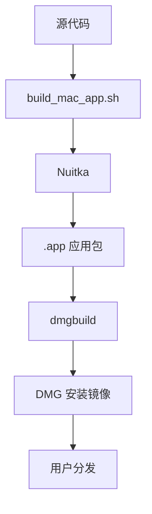
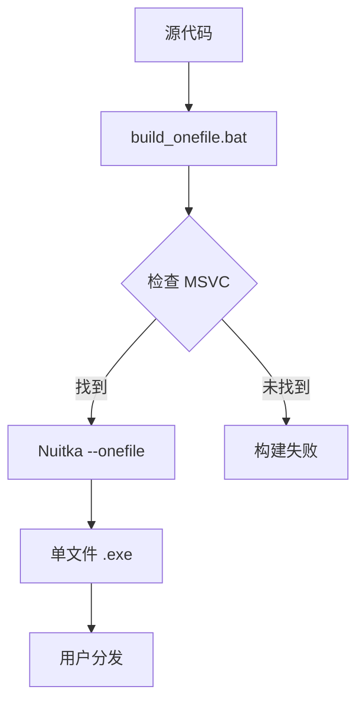
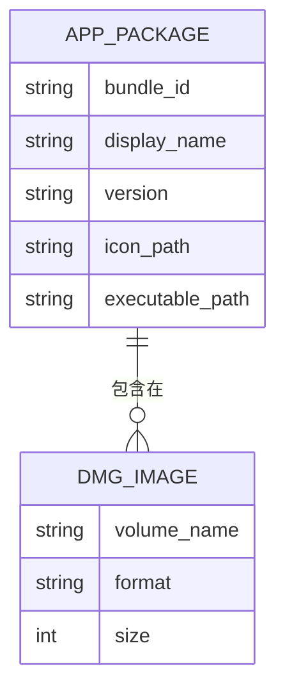

# 构建与发布

<cite>
**本文档引用的文件**  
- [build_mac_app.sh](file://build_mac_app.sh)
- [build_onefile.bat](file://build_onefile.bat)
- [build_standalone.bat](file://build_standalone.bat)
- [build_probe_onefile.bat](file://build_probe_onefile.bat)
- [mac/create_mac_app.sh](file://mac/create_mac_app.sh)
- [mac/dmg_settings.py](file://mac/dmg_settings.py)
- [mac/Info.plist](file://mac/Info.plist)
- [mac/entitlements.plist](file://mac/entitlements.plist)
- [run_mtga_gui.sh](file://run_mtga_gui.sh)
- [run_mtga_gui_en.sh](file://run_mtga_gui_en.sh)
- [run_mtga_gui.bat](file://run_mtga_gui.bat)
- [run_mtga_gui_en.bat](file://run_mtga_gui_en.bat)
- [pyproject.toml](file://pyproject.toml)
- [docs/README_DMG.md](file://docs/README_DMG.md)
- [docs/Windows_Onefile_Build.md](file://docs/Windows_Onefile_Build.md)
</cite>

## 目录
1. [简介](#简介)
2. [macOS 构建流程](#macos-构建流程)
3. [Windows 构建流程](#windows-构建流程)
4. [发布格式对比](#发布格式对比)
5. [版本号与代码签名](#版本号与代码签名)
6. [防病毒软件兼容性](#防病毒软件兼容性)
7. [常见构建问题解决方案](#常见构建问题解决方案)
8. [结论](#结论)

## 简介
本文档系统性地对比了 Windows 和 macOS 平台的构建与发布流程。对于 macOS，详细说明了 `build_mac_app.sh` 如何调用 Nuitka 生成 `.app` 应用包，包括 `--macos-create-app-bundle`、`--macos-app-icon` 和 `--macos-signed-app-name` 等关键参数的使用，以及如何通过 `dmgbuild` 创建 DMG 安装镜像。对于 Windows，解析了 `build_onefile.bat` 如何配置 `--onefile` 模式生成单一可执行文件，并处理 MSVC 编译器集成。文档还对比了两种发布格式的优劣，涵盖了版本号注入、代码签名、防病毒软件兼容性等发布考量，并提供了构建失败的常见解决方案。

## macOS 构建流程

### build_mac_app.sh 脚本分析
`build_mac_app.sh` 脚本是 macOS 平台的主要构建脚本，负责使用 Nuitka 将 Python 应用程序打包为标准的 `.app` 应用包。该脚本首先检查虚拟环境、clang 编译器和 Nuitka 的安装情况，然后设置版本号并调用 Nuitka 进行构建。

脚本通过 `--standalone` 模式创建独立的应用程序包，使用 `--macos-create-app-bundle` 参数生成标准的 macOS 应用包结构。`--macos-app-icon` 参数指定应用图标为 `mac/icon.icns`，`--macos-app-name` 设置应用显示名称为 "MTGA GUI"，而 `--macos-signed-app-name` 则设置签名的应用程序标识符为 "com.mtga.gui"。

此外，脚本还通过 `--include-data-files` 参数将必要的配置文件（如 CA 证书配置）和运行时版本信息包含在应用包中，并使用 `--macos-target-arch=arm64` 指定目标架构为 ARM64，以支持 Apple Silicon 芯片。

**Section sources**
- [build_mac_app.sh](file://build_mac_app.sh#L1-L180)

### 应用包结构创建
除了使用 Nuitka 直接生成应用包外，项目还提供了 `mac/create_mac_app.sh` 脚本，用于手动创建 macOS 应用程序包结构。该脚本创建标准的 `.app` 目录结构，包括 `Contents/MacOS`、`Contents/Resources` 等目录，并复制必要的文件如 `Info.plist`、启动脚本和图标。

`Info.plist` 文件定义了应用程序的元数据，包括可执行文件名、包标识符、显示名称、版本号等。`CFBundleIdentifier` 设置为 `com.mtga.gui`，这是应用程序的唯一标识符。`CFBundleExecutable` 指定主可执行文件为 `MTGA_GUI`，这是一个 shell 脚本，负责在运行时设置环境并启动 Python 应用程序。

**Section sources**
- [mac/create_mac_app.sh](file://mac/create_mac_app.sh#L1-L220)
- [mac/Info.plist](file://mac/Info.plist#L1-L30)

### DMG 安装镜像创建
构建完成后，可以使用 `dmgbuild` 工具创建专业的 DMG 安装镜像。`mac/dmg_settings.py` 配置文件定义了 DMG 的外观和布局，包括窗口大小、图标位置、背景图像等。

DMG 镜像包含应用程序包和指向 `/Applications` 的快捷方式，用户可以轻松地将应用程序拖拽到 Applications 文件夹。`dmg_settings.py` 中的 `icon_locations` 字典精确控制了应用程序图标和 Applications 快捷方式的位置，确保安装界面的专业性和一致性。

**Diagram sources**
- [build_mac_app.sh](file://build_mac_app.sh#L1-L180)
- [mac/dmg_settings.py](file://mac/dmg_settings.py#L1-L70)

**Section sources**
- [docs/README_DMG.md](file://docs/README_DMG.md#L1-L162)

## Windows 构建流程

### build_onefile.bat 脚本分析
`build_onefile.bat` 是 Windows 平台的主要构建脚本，负责生成单文件可执行版本。该脚本首先检查虚拟环境和 Visual Studio MSVC 工具链的安装情况，然后设置版本号并调用 Nuitka 进行构建。

与 macOS 构建不同，Windows 构建使用 `--onefile` 模式，将整个应用程序打包为单个 `.exe` 文件。`--msvc=latest` 参数确保使用最新的 MSVC 编译器进行编译，`--windows-uac-admin` 参数配置应用程序在运行时自动请求管理员权限，这对于修改 hosts 文件和监听 443 端口等操作是必需的。

脚本通过 `--include-data-files` 参数将所有必要的资源文件（如 CA 证书配置、OpenSSL 可执行文件和库）包含在可执行文件中，并使用 `--windows-icon-from-ico` 参数设置应用程序图标。

**Section sources**
- [build_onefile.bat](file://build_onefile.bat#L1-L212)

### MSVC 编译器集成
Windows 构建流程的关键是 MSVC 编译器的集成。`build_onefile.bat` 脚本会自动搜索已安装的 Visual Studio 版本，优先查找 Visual Studio 2022 Community 版本的 MSVC 工具链。如果未找到，脚本会按顺序检查其他版本和安装路径。

脚本支持通过命令行参数传入自定义的 MSVC 工具链目录，这在 CI/CD 环境中非常有用。MSVC 编译器用于编译 Python 解释器和所有 C 扩展模块，确保生成的可执行文件在目标系统上能够正确运行。

**Diagram sources**
- [build_onefile.bat](file://build_onefile.bat#L1-L212)

**Section sources**
- [docs/Windows_Onefile_Build.md](file://docs/Windows_Onefile_Build.md#L1-L172)

### 其他 Windows 构建模式
除了单文件构建，项目还提供了其他构建模式。`build_standalone.bat` 脚本使用 `--standalone` 模式生成独立版本，输出为包含多个文件的目录，启动速度更快但分发不便。`build_probe_onefile.bat` 是一个用于测试的构建脚本，用于验证构建环境和流程。

这些不同的构建模式满足了开发、测试和生产发布等不同场景的需求。单文件版本适合最终用户分发，而独立版本更适合开发和调试，因为可以更快地迭代和测试。

**Section sources**
- [build_standalone.bat](file://build_standalone.bat#L1-L80)
- [build_probe_onefile.bat](file://build_probe_onefile.bat#L1-L168)

## 发布格式对比

### .app 包的优势
macOS 的 `.app` 包格式具有显著的系统集成优势。作为标准的 macOS 应用程序包，`.app` 文件可以被系统完全识别，支持 Spotlight 搜索、Launchpad 集成和系统级的权限管理。用户可以像安装其他 macOS 应用一样，将 `.app` 文件拖拽到 Applications 文件夹。

`.app` 包在启动时无需解压，因此启动速度快。它还支持更精细的权限控制，通过 `entitlements.plist` 文件可以声明应用程序需要的特定权限，如网络访问、剪贴板访问和系统文件修改权限。

**Diagram sources**
- [mac/Info.plist](file://mac/Info.plist#L1-L30)
- [mac/entitlements.plist](file://mac/entitlements.plist#L1-L25)

### 单文件.exe的优势
Windows 单文件 `.exe` 格式的主要优势在于分发的便利性。整个应用程序被打包为单个可执行文件，用户只需下载一个文件即可运行，无需解压或安装复杂的目录结构。这对于通过网络分发和快速部署非常有利。

单文件版本包含所有依赖项，确保在任何 Windows 系统上都能运行，无需预先安装 Python 或其他依赖。然而，首次运行时需要将内容解压到临时目录，这会导致启动时间较长。后续运行会更快，除非临时目录被清理。

**Section sources**
- [docs/Windows_Onefile_Build.md](file://docs/Windows_Onefile_Build.md#L1-L172)

## 版本号与代码签名

### 版本号注入
项目采用动态版本号注入机制。构建脚本（`build_mac_app.sh` 和 `build_onefile.bat`）在构建过程中会生成一个 `modules/runtime/_build_version.py` 文件，其中包含当前的版本号。这个版本号在运行时被主应用程序读取并显示。

版本号可以从环境变量 `MTGA_VERSION` 获取，如果未设置则使用脚本中定义的默认版本号。这种机制允许在 CI/CD 流程中动态设置版本号，而无需修改源代码。

**Section sources**
- [build_mac_app.sh](file://build_mac_app.sh#L64-L71)
- [build_onefile.bat](file://build_onefile.bat#L76-L87)

### 代码签名
macOS 应用程序需要代码签名才能在现代 macOS 系统上顺利运行。虽然当前构建流程未包含代码签名步骤，但 `entitlements.plist` 文件已经配置了必要的权限声明，为代码签名做好了准备。

代码签名可以防止应用程序被篡改，并允许系统验证应用程序的来源。对于分发到 Mac App Store 或通过其他渠道分发的应用程序，代码签名是必需的。Windows 应用程序也可以进行代码签名，以减少防病毒软件的误报。

**Section sources**
- [mac/entitlements.plist](file://mac/entitlements.plist#L1-L25)

## 防病毒软件兼容性
单文件可执行文件经常被防病毒软件误报为恶意软件，因为它们的打包方式与许多恶意软件相似。这是使用 Nuitka 等工具打包 Python 应用程序时常见的挑战。

为了减少误报，建议对 Windows 可执行文件进行代码签名，并向主要防病毒厂商提交白名单申请。同时，在发布时提供文件的 SHA256 校验和，让用户可以验证文件的完整性。

**Section sources**
- [docs/Windows_Onefile_Build.md](file://docs/Windows_Onefile_Build.md#L170-L172)

## 常见构建问题解决方案

### macOS 构建问题
- **Xcode Command Line Tools 未安装**：运行 `xcode-select --install` 安装必要的开发工具。
- **Nuitka 未安装**：运行 `uv sync --group mac-build` 安装构建依赖。
- **clang 未找到**：确保已安装 Xcode 或 Command Line Tools。

### Windows 构建问题
- **Visual Studio 未找到**：安装 Visual Studio 2022 Community 版本，并确保包含 C++ 构建工具。
- **虚拟环境问题**：运行 `uv sync --group win-build` 重新安装依赖。
- **构建时间过长**：单文件构建通常需要 30-40 分钟，建议在构建过程中避免高 CPU 占用任务。

**Section sources**
- [build_mac_app.sh](file://build_mac_app.sh#L174-L179)
- [build_onefile.bat](file://build_onefile.bat#L196-L203)

## 结论
macOS 和 Windows 平台的构建与发布流程各有特点。macOS 使用 `.app` 包格式，具有更好的系统集成和启动性能，而 Windows 单文件 `.exe` 格式则在分发便利性上具有优势。两种流程都使用 Nuitka 作为核心打包工具，但配置和依赖有所不同。通过理解这些差异和最佳实践，可以有效地为两个平台构建和发布高质量的应用程序。