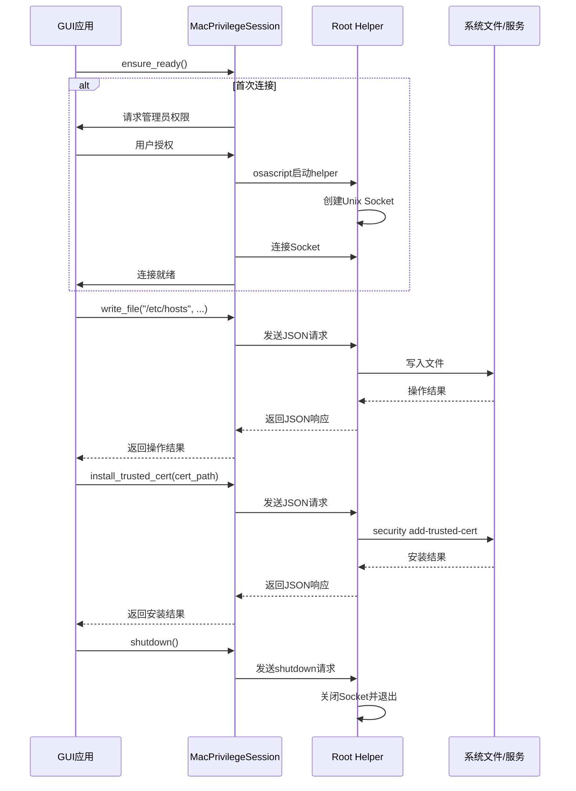
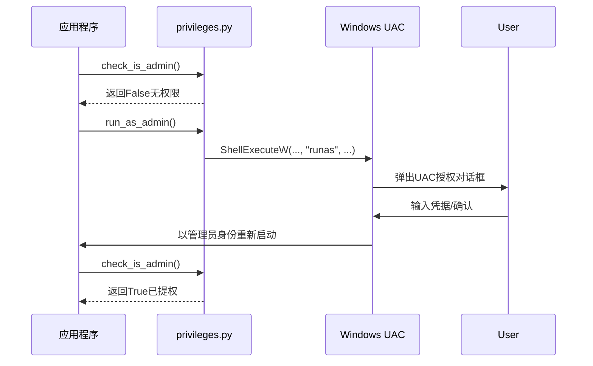
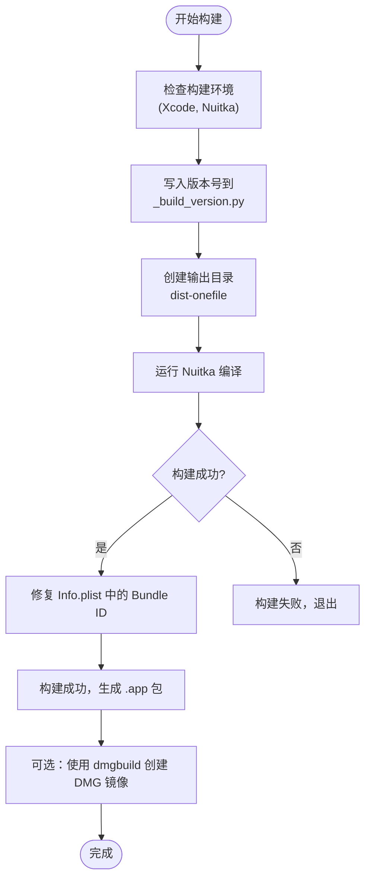
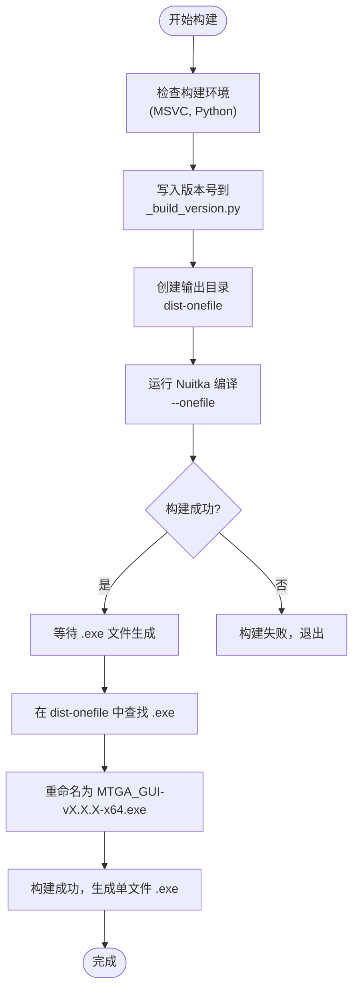

# 跨平台支持

<cite>
**本文档中引用的文件**  
- [system.py](file://modules/platform/system.py)
- [macos_privileged_helper.py](file://modules/platform/macos_privileged_helper.py)
- [privileges.py](file://modules/platform/privileges.py)
- [build_mac_app.sh](file://build_mac_app.sh)
- [build_onefile.bat](file://build_onefile.bat)
- [create_mac_app.sh](file://mac/create_mac_app.sh)
- [dmg_settings.py](file://mac/dmg_settings.py)
- [entitlements.plist](file://mac/entitlements.plist)
- [hosts_actions.py](file://modules/actions/hosts_actions.py)
- [cert_actions.py](file://modules/actions/cert_actions.py)
- [network_environment.py](file://modules/network/network_environment.py)
- [process_utils.py](file://modules/runtime/process_utils.py)
- [privilege_service.py](file://modules/services/privilege_service.py)
</cite>

## 目录
1. [系统抽象与平台检测](#系统抽象与平台检测)  
2. [macOS特权助手机制](#macos特权助手机制)  
3. [Windows UAC提权实现](#windows-uac提权实现)  
4. [macOS应用构建流程](#macos应用构建流程)  
5. [Windows单文件构建流程](#windows单文件构建流程)  
6. [发布考量](#发布考量)  
7. [总结](#总结)

## 系统抽象与平台检测

项目通过 `modules/platform/system.py` 模块提供统一的跨平台抽象接口，用于检测当前运行的操作系统环境。该模块定义了多个布尔函数来判断操作系统类型，包括 `is_windows()`、`is_posix()`、`is_macos()` 和 `is_linux()`。这些函数基于 Python 标准库中的 `os.name` 和 `sys.platform` 进行判断，为上层逻辑提供一致的平台识别能力。

此外，`platform_tag()` 函数返回一个标准化的平台标识字符串（如 "macos"、"windows"、"linux"），便于在配置和日志中使用。这种抽象层的设计使得核心业务逻辑无需关心底层操作系统的差异，提高了代码的可维护性和可移植性。

**Section sources**  
- [system.py](file://modules/platform/system.py#L1-L34)

## macOS特权助手机制

在 macOS 上，项目采用了一种安全的特权提升机制，避免 GUI 应用全程以管理员身份运行。该机制的核心是 `modules/platform/macos_privileged_helper.py` 模块，它实现了基于 Unix Socket 的持久化提权通信。

当需要执行需要 root 权限的操作（如修改 `/etc/hosts` 文件或安装证书）时，GUI 应用会通过 `osascript` 命令请求用户输入管理员密码，并启动一个以 root 身份运行的 Python 辅助进程（helper）。这个 helper 进程通过 Unix Socket 与主应用通信，接收并执行具体的提权操作请求。

`MacPrivilegeSession` 类封装了与 helper 的通信逻辑，提供了 `write_file`、`copy_file`、`run_command` 和 `install_trusted_cert` 等安全接口。主应用通过这些接口发送 JSON 格式的请求，helper 进程在收到请求后执行相应的操作并返回结果。这种设计将提权操作限制在最小必要范围内，显著提升了应用的安全性。

**Diagram sources**  
- [macos_privileged_helper.py](file://modules/platform/macos_privileged_helper.py#L48-L487)

**Section sources**  
- [macos_privileged_helper.py](file://modules/platform/macos_privileged_helper.py#L1-L487)
- [hosts_actions.py](file://modules/actions/hosts_actions.py#L1-L61)
- [cert_actions.py](file://modules/actions/cert_actions.py#L1-L66)

## Windows UAC提权实现

在 Windows 平台上，项目通过 `modules/platform/privileges.py` 模块实现 UAC（用户账户控制）提权。该模块提供了 `run_as_admin()` 函数，当检测到当前进程没有管理员权限时，会调用 Windows Shell API 的 `ShellExecuteW` 函数，以 "runas" 动词重新启动当前脚本。

与 macOS 的持久化 helper 不同，Windows 的提权是针对整个进程的。一旦用户授权，整个应用将以管理员身份运行。`is_windows_admin()` 和 `is_windows_elevated()` 函数用于检测当前进程是否具有管理员权限或已提升权限。

`privilege_service.py` 模块对这些功能进行了封装，提供了 `check_is_admin` 和 `run_as_admin` 接口供上层调用。这种实现方式符合 Windows 平台的安全模型，确保了需要管理员权限的操作能够顺利执行。

**Diagram sources**  
- [privileges.py](file://modules/platform/privileges.py#L1-L113)

**Section sources**  
- [privileges.py](file://modules/platform/privileges.py#L1-L113)
- [privilege_service.py](file://modules/services/privilege_service.py#L1-L6)

## macOS应用构建流程

macOS 应用的构建由 `build_mac_app.sh` 和 `create_mac_app.sh` 两个脚本协同完成。`build_mac_app.sh` 是主要的构建入口，它首先检查必要的构建环境（如 Xcode Command Line Tools 和 Nuitka），然后使用 `uv run` 调用 Nuitka 将 Python 代码编译成独立的 `.app` 包。

Nuitka 的构建命令包含了多个关键参数：
- `--macos-create-app-bundle`：创建标准的 macOS 应用程序包结构。
- `--macos-app-icon`：指定应用图标。
- `--macos-target-arch=arm64`：为目标架构（ARM64）编译。
- `--include-data-files`：将 CA 证书、配置文件等资源包含在应用包内。

构建完成后，`create_mac_app.sh` 脚本可以用来手动创建 `.app` 包结构，它会复制 `Info.plist`、可执行文件、图标和项目文件到正确的目录中，形成一个符合 macOS 应用规范的 Bundle。

最终，可以使用 `dmgbuild` 工具和 `mac/dmg_settings.py` 配置文件将 `.app` 包打包成 DMG 镜像，提供给用户下载安装。`dmg_settings.py` 定义了 DMG 的窗口大小、背景图片、图标位置等视觉元素。

**Diagram sources**  
- [build_mac_app.sh](file://build_mac_app.sh#L1-L180)
- [create_mac_app.sh](file://mac/create_mac_app.sh#L1-L220)
- [dmg_settings.py](file://mac/dmg_settings.py#L1-L70)

**Section sources**  
- [build_mac_app.sh](file://build_mac_app.sh#L1-L180)
- [create_mac_app.sh](file://mac/create_mac_app.sh#L1-L220)
- [dmg_settings.py](file://mac/dmg_settings.py#L1-L70)

## Windows单文件构建流程

Windows 平台的构建由 `build_onefile.bat` 批处理脚本完成。该脚本首先检查虚拟环境和 Visual Studio MSVC 工具链的存在，然后使用 `uv run` 调用 Nuitka 将整个 Python 项目编译成一个独立的 `.exe` 可执行文件。

与 macOS 的 `.app` 包不同，Windows 的构建模式是 `--onefile`，这意味着所有代码和依赖都会被打包进一个单一的 `.exe` 文件中。当用户运行该文件时，它会自动解压到临时目录并执行。

构建脚本的关键配置包括：
- `--onefile`：生成单个可执行文件。
- `--windows-uac-admin`：设置应用程序请求管理员权限（UAC）。
- `--windows-icon-from-ico`：从 `.ico` 文件设置应用图标。
- `--include-data-files`：将必要的资源文件（如 OpenSSL 二进制文件）包含在可执行文件中。

构建完成后，脚本会检查输出目录并重命名生成的 `.exe` 文件，确保其名称符合预期。

**Diagram sources**  
- [build_onefile.bat](file://build_onefile.bat#L1-L212)

**Section sources**  
- [build_onefile.bat](file://build_onefile.bat#L1-L212)

## 发布考量

项目的发布流程充分考虑了现代操作系统的安全要求。

在 macOS 上，应用包的 `entitlements.plist` 文件明确声明了所需的权限，包括禁用应用沙箱（`com.apple.security.app-sandbox=false`）、访问剪贴板、网络客户端权限以及读写用户选择文件和系统 hosts 文件的权限。虽然当前构建流程未包含代码签名和公证（notarization），但 `.plist` 文件的配置为后续实现这些安全特性奠定了基础。

在 Windows 上，通过 `--windows-uac-admin` 参数，确保应用在需要时能正确触发 UAC 对话框，提示用户进行权限提升。

防病毒软件兼容性方面，由于使用 Nuitka 将 Python 代码编译为原生可执行文件，可能会被某些防病毒软件误报为潜在威胁。建议在发布前进行广泛的测试，并考虑向主要防病毒厂商提交白名单申请。

**Section sources**  
- [entitlements.plist](file://mac/entitlements.plist#L1-L25)

## 总结

该项目通过精心设计的跨平台架构，实现了在 Windows 和 macOS 上的安全系统集成。在 macOS 上，利用基于 Unix Socket 的特权助手模式，实现了最小权限原则，避免了 GUI 应用全程以管理员身份运行。在 Windows 上，则通过标准的 UAC 机制进行提权。构建流程利用 Nuitka 将 Python 应用打包成原生可执行文件，分别生成 macOS 的 `.app` 包和 Windows 的单文件 `.exe`，并提供了完整的构建和打包脚本。整体设计兼顾了功能性、安全性和用户体验。