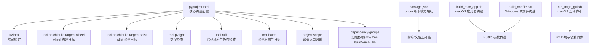
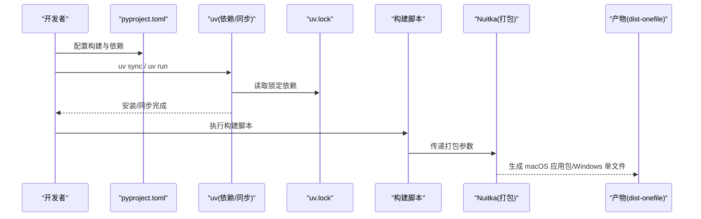
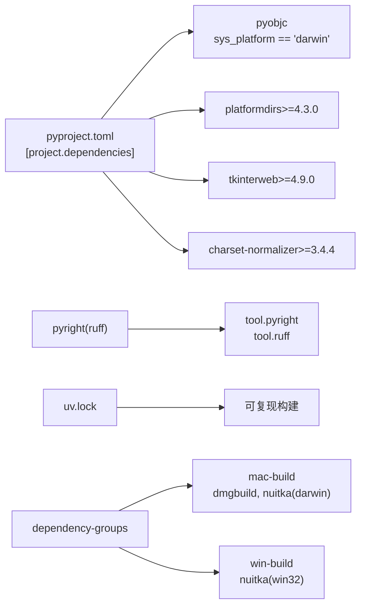

# 构建配置

<cite>
**本文引用的文件**
- [pyproject.toml](file://pyproject.toml)
- [package.json](file://package.json)
- [uv.lock](file://uv.lock)
- [build_mac_app.sh](file://build_mac_app.sh)
- [build_onefile.bat](file://build_onefile.bat)
- [run_mtga_gui.sh](file://run_mtga_gui.sh)
- [README.md](file://README.md)
- [docs/Windows_Onefile_Build.md](file://docs/Windows_Onefile_Build.md)
- [docs/README_macOS_cli.md](file://docs/README_macOS_cli.md)
</cite>

## 目录
1. [简介](#简介)
2. [项目结构](#项目结构)
3. [核心组件](#核心组件)
4. [架构总览](#架构总览)
5. [详细组件分析](#详细组件分析)
6. [依赖关系分析](#依赖关系分析)
7. [性能考量](#性能考量)
8. [故障排查指南](#故障排查指南)
9. [结论](#结论)
10. [附录](#附录)

## 简介
本文件围绕项目的构建配置体系展开，以 pyproject.toml 为核心，系统解析 [build-system]、[project]、[project.scripts]、[dependency-groups] 与 [tool.*] 等配置段落，阐明依赖声明与平台条件表达式、开发工具链（pyright、ruff、hatch）的作用范围与影响，结合 package.json 的辅助角色，以及 build_mac_app.sh 与 build_onefile.bat 的打包流程，说明 Nuitka 打包选项的传递机制与最佳实践。

## 项目结构
该项目采用现代 Python 包管理与构建范式，核心配置集中在 pyproject.toml，配合 uv.lock（锁定依赖）、package.json（pnpm 版本锁定辅助）、以及多平台构建脚本（macOS 应用包与 Windows 单文件）形成完整的构建与分发闭环。

图表来源
- [pyproject.toml](file://pyproject.toml#L1-L85)
- [uv.lock](file://uv.lock#L1-L30)
- [package.json](file://package.json#L1-L4)
- [build_mac_app.sh](file://build_mac_app.sh#L1-L180)
- [build_onefile.bat](file://build_onefile.bat#L1-L212)
- [run_mtga_gui.sh](file://run_mtga_gui.sh#L1-L250)

章节来源
- [pyproject.toml](file://pyproject.toml#L1-L85)
- [uv.lock](file://uv.lock#L1-L30)
- [package.json](file://package.json#L1-L4)

## 核心组件
- 构建后端与目标
  - [build-system] 使用 hatchling 作为构建后端，确保与现代 Python 包生态兼容。
  - [tool.hatch.build.targets.wheel] 与 [tool.hatch.build.targets.sdist] 定义打包目标与包含清单。
- 项目元数据与依赖
  - [project] 定义名称、版本、描述、作者、分类器、依赖列表与 Python 版本要求。
  - [project.scripts] 将命令行入口 mtga-gui 映射到模块入口点 mtga_gui:main。
  - [dependency-groups] 将开发与平台构建依赖按环境分组管理。
- 开发工具链
  - [tool.pyright] 类型检查与虚拟环境配置。
  - [tool.ruff] 代码风格、静态检查与自动修复策略。
  - [tool.hatch] 构建后端与目标配置。
- 包管理与版本锁定
  - package.json 用于 pnpm 版本锁定，辅助前端/文档工具链一致性。
  - uv.lock 由 uv 生成，记录精确依赖版本与哈希，保证可复现构建。

章节来源
- [pyproject.toml](file://pyproject.toml#L1-L85)
- [uv.lock](file://uv.lock#L1-L30)
- [package.json](file://package.json#L1-L4)

## 架构总览
下图展示从配置到构建产物的关键路径：pyproject.toml 定义构建与依赖，uv.lock 提供可复现依赖，脚本驱动 Nuitka 打包，最终产出 macOS 应用包或 Windows 单文件可执行文件。

图表来源
- [pyproject.toml](file://pyproject.toml#L1-L85)
- [uv.lock](file://uv.lock#L1-L30)
- [build_mac_app.sh](file://build_mac_app.sh#L87-L118)
- [build_onefile.bat](file://build_onefile.bat#L95-L128)

## 详细组件分析

### [build-system] 与构建后端
- requires = ["hatchling"]：声明构建后端为 hatchling，确保与现代 Python 包生态兼容。
- build-backend = "hatchling.build"：指定具体后端实现，由 hatchling 提供打包能力。

章节来源
- [pyproject.toml](file://pyproject.toml#L1-L3)

### [project] 元数据与依赖组织
- 名称、版本、描述、README、Python 版本要求与作者信息清晰定义，便于发布与分发。
- 依赖声明集中于 dependencies 数组，包含 flask、requests、werkzeug、jinja2、itsdangerous、click、urllib3、idna、certifi、platformdirs、PyYAML、tkinterweb、charset-normalizer 等。
- 平台特定依赖使用条件表达式 sys_platform 控制：
  - pyobjc>=12.1 ; sys_platform == 'darwin'：仅在 macOS 生效。
- 依赖版本约束示例：
  - platformdirs>=4.3.0
  - tkinterweb>=4.9.0
  - charset-normalizer>=3.4.4

章节来源
- [pyproject.toml](file://pyproject.toml#L5-L37)

### [project.scripts] 命令入口映射
- [project.scripts] 将命令 mtga-gui 映射到模块入口点 mtga_gui:main，便于用户通过命令行直接运行。

章节来源
- [pyproject.toml](file://pyproject.toml#L39-L40)

### [dependency-groups] 分组依赖与环境策略
- dev：开发期工具集合，包含 pyright、ruff、yamllint，用于类型检查、代码风格与 YAML 校验。
- mac-build：macOS 应用包构建所需依赖，包含 dmgbuild、Nuitka，限定 sys_platform == 'darwin'。
- win-build：Windows 单文件构建所需依赖，包含 Nuitka，限定 sys_platform == 'win32'。
- 使用策略：
  - macOS 构建：uv sync --group mac-build
  - Windows 构建：uv sync --group win-build
  - 开发：uv sync --group dev

章节来源
- [pyproject.toml](file://pyproject.toml#L42-L54)

### [tool.*] 开发工具配置与影响
- tool.pyright
  - pythonVersion = "3.13"：统一类型检查的 Python 版本。
  - exclude = ["archive", ".uv_cache", ".venv"]：排除无关目录。
  - venvPath = "." 与 venv = ".venv"：指定虚拟环境路径。
- tool.ruff
  - line-length = 100：行长限制。
  - target-version = "py313"：目标 Python 版本。
  - extend-exclude = ["archive"]：扩展排除目录。
  - lint.select = ["E", "F", "I", "B", "UP", "SIM", "PL"]：启用常见错误、导入、bugbear、升级、简化与 Pylint 子集规则。
  - fixable = ["ALL"]：尽可能自动修复。
  - format.line-ending = "auto"：自动换行符。
- tool.hatch.build.targets.wheel 与 sdist
  - wheel 包含 src 目录。
  - sdist 包含 src、README.md、requirements.txt（若存在）。

章节来源
- [pyproject.toml](file://pyproject.toml#L56-L84)

### package.json 的辅助作用
- package.json 仅用于 pnpm 包管理器的版本锁定，确保前端/文档工具链版本一致，不直接影响 Python 依赖解析与打包。

章节来源
- [package.json](file://package.json#L1-L4)

### 与实际打包流程的集成
- macOS 应用包构建脚本 build_mac_app.sh
  - 通过 uv run --python .venv/bin/python nuitka ... 传递 Nuitka 参数，包含：
    - --standalone、--macos-create-app-bundle、--show-progress、--show-memory
    - --output-dir=dist-onefile
    - --include-data-files=ca/*、modules/runtime/_build_version.py、tkinterweb_tkhtml 动态库
    - --macos-app-icon=mac/icon.icns、--enable-plugin=tk-inter、--macos-target-arch=arm64
    - --remove-output、--include-package=modules、--macos-app-name="MTGA GUI"、--macos-signed-app-name="com.mtga.gui"、--macos-app-version="$VERSION"、--output-filename=MTGA_GUI-v$VERSION-$(uname -m)
  - 退出码检查与错误提示，确保构建结果可追踪。
- Windows 单文件构建脚本 build_onefile.bat
  - 通过 uv run --python .venv\Scripts\python.exe nuitka ... 传递 Nuitka 参数，包含：
    - --onefile、--msvc=latest、--show-progress、--show-memory、--output-dir=dist-onefile、--assume-yes-for-downloads
    - --include-data-files=ca/*、modules/runtime/_build_version.py、openssl/*、icons/*
    - --windows-icon-from-ico=icons/*、--enable-plugin=tk-inter、--windows-console-mode=attach、--include-package=modules、--windows-uac-admin、--output-filename=MTGA_GUI-v%VERSION%-x64.exe
  - 输出文件命名规范与后续重命名逻辑，确保产物一致性。

章节来源
- [build_mac_app.sh](file://build_mac_app.sh#L87-L118)
- [build_onefile.bat](file://build_onefile.bat#L95-L128)

### 与启动脚本的关系
- run_mtga_gui.sh（macOS 启动脚本）
  - 自动检测/安装 uv，创建 Python 3.13 虚拟环境，同步依赖，设置环境变量与 OpenSSL 路径，使用 sudo uv run python 启动主程序。
  - 与构建脚本互补：启动脚本负责开发/调试环境，构建脚本负责发行产物。

章节来源
- [run_mtga_gui.sh](file://run_mtga_gui.sh#L1-L250)

## 依赖关系分析
- 依赖锁定与可复现性
  - uv.lock 记录精确版本与哈希，确保不同环境的一致性。
  - 依赖分组 mac-build 与 win-build 通过 sys_platform 条件表达式隔离平台差异。
- 平台特定依赖
  - pyobjc 仅在 macOS 生效，dmgbuild、Nuitka 在 macOS 生效，Nuitka 在 Windows 生效。
- 开发工具链
  - pyright 与 ruff 通过 tool.* 配置，保障类型与风格一致性，减少 CI/CD 成本。

图表来源
- [pyproject.toml](file://pyproject.toml#L22-L54)
- [uv.lock](file://uv.lock#L1-L30)

章节来源
- [pyproject.toml](file://pyproject.toml#L22-L54)
- [uv.lock](file://uv.lock#L1-L30)

## 性能考量
- Nuitka 打包参数对性能的影响
  - macOS：--macos-target-arch=arm64、--enable-plugin=tk-inter、--include-package=modules 等参数影响包体积与启动速度。
  - Windows：--onefile、--windows-uac-admin、--windows-console-mode=attach 等参数影响用户体验与运行时行为。
- 代码质量工具对开发效率的影响
  - ruff 的 fixable = ["ALL"] 可显著减少手动修复成本。
  - pyright 的 venv 配置与排除项有助于提升类型检查效率。

章节来源
- [build_mac_app.sh](file://build_mac_app.sh#L87-L118)
- [build_onefile.bat](file://build_onefile.bat#L95-L128)
- [pyproject.toml](file://pyproject.toml#L56-L84)

## 故障排查指南
- macOS 构建
  - 缺少 Xcode Command Line Tools：执行 xcode-select --install。
  - 未安装 Nuitka：执行 uv add nuitka 或 uv sync --group mac-build。
  - 版本号写入：脚本会生成 modules/runtime/_build_version.py，确保版本号格式。
- Windows 构建
  - 未找到 Visual Studio 2022：安装 Community 版本并包含 C++ 构建工具。
  - 虚拟环境不存在：执行 uv sync --group win-build。
  - 输出文件命名：脚本包含重命名逻辑，确保输出文件名符合预期。
- 启动脚本
  - uv 未安装：脚本会自动安装并刷新 PATH。
  - OpenSSL 问题：优先使用系统/ Homebrew 版本，否则回退到项目目录下的 openssl。

章节来源
- [build_mac_app.sh](file://build_mac_app.sh#L46-L62)
- [build_onefile.bat](file://build_onefile.bat#L23-L73)
- [run_mtga_gui.sh](file://run_mtga_gui.sh#L47-L95)

## 结论
本项目的构建配置以 pyproject.toml 为中心，结合 uv.lock 与分组依赖策略，实现了跨平台、可复现的构建与分发。通过 tool.* 工具链保障代码质量，借助 Nuitka 脚本完成 macOS 应用包与 Windows 单文件产物的生成。配合启动脚本与文档，形成了从开发到发布的完整闭环。

## 附录

### 修改依赖或构建参数的最佳实践
- 依赖变更
  - 优先在 pyproject.toml 的 dependencies 中声明，必要时使用条件表达式限定平台。
  - 更新后执行 uv sync，确保 uv.lock 同步更新。
- 构建参数
  - macOS：通过 build_mac_app.sh 的 Nuitka 参数调整，注意 --macos-target-arch、--include-data-files 与 --include-package。
  - Windows：通过 build_onefile.bat 的 Nuitka 参数调整，注意 --onefile、--msvc、--windows-uac-admin。
- 版本管理
  - macOS：脚本顶部 VERSION 变量与输出文件名联动。
  - Windows：脚本顶部 VERSION 变量与输出文件名联动。
- 文档与脚本
  - 参考 docs/Windows_Onefile_Build.md 与 docs/README_macOS_cli.md 的构建与启动指南，确保流程一致。

章节来源
- [pyproject.toml](file://pyproject.toml#L22-L54)
- [build_mac_app.sh](file://build_mac_app.sh#L64-L71)
- [build_onefile.bat](file://build_onefile.bat#L5-L8)
- [docs/Windows_Onefile_Build.md](file://docs/Windows_Onefile_Build.md#L57-L76)
- [docs/README_macOS_cli.md](file://docs/README_macOS_cli.md#L37-L54)