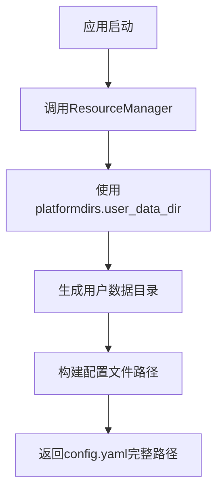
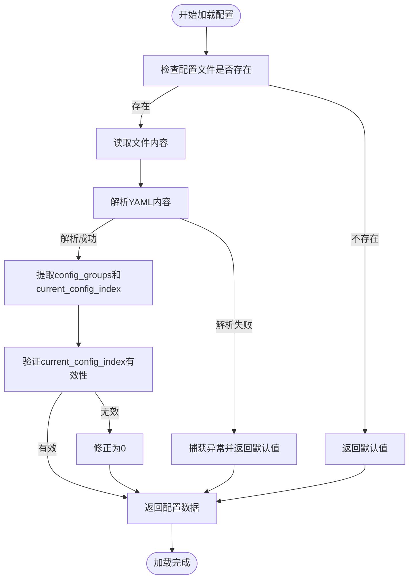
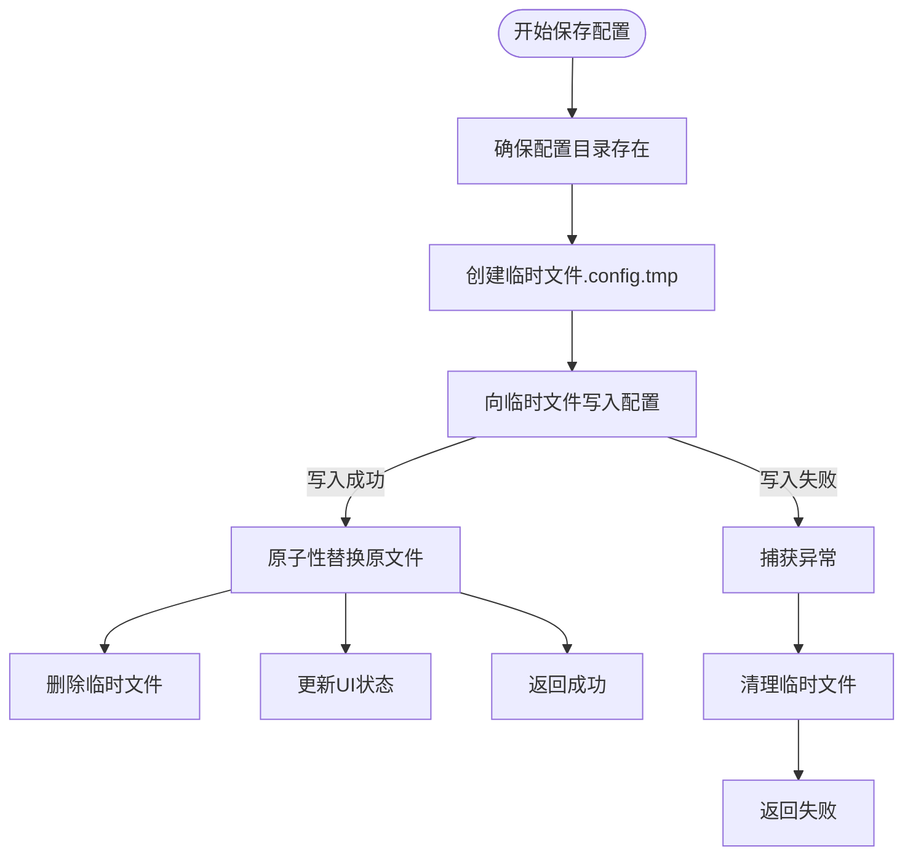
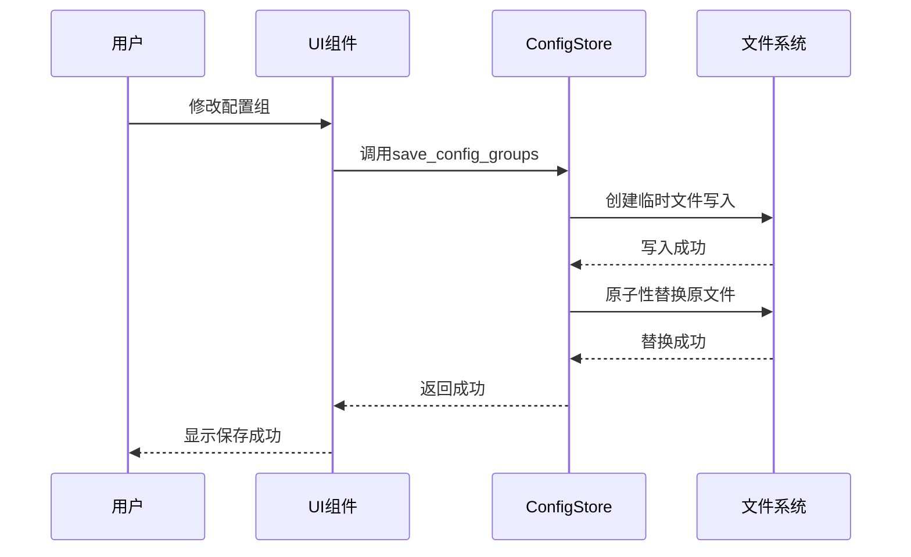

# 运行时配置

<cite>
**本文档中引用的文件**  
- [config_service.py](file://modules/services/config_service.py)
- [proxy_config.py](file://modules/proxy/proxy_config.py)
- [config_group_panel.py](file://modules/ui/config_group_panel.py)
- [global_config_panel.py](file://modules/ui/global_config_panel.py)
- [resource_manager.py](file://modules/runtime/resource_manager.py)
- [mtga_gui.py](file://archive/mtga_gui.py)
- [ARCHITECTURE.md](file://docs/ARCHITECTURE.md)
</cite>

## 目录
1. [引言](#引言)
2. [配置存储机制](#配置存储机制)
3. [配置数据结构设计](#配置数据结构设计)
4. [配置加载流程](#配置加载流程)
5. [配置保存机制](#配置保存机制)
6. [多配置组管理](#多配置组管理)
7. [YAML配置文件示例](#yaml配置文件示例)
8. [运行时配置与用户界面联动](#运行时配置与用户界面联动)
9. [错误处理与异常恢复](#错误处理与异常恢复)
10. [结论](#结论)

## 引言
本系统采用基于YAML的运行时配置机制，通过`ConfigStore`类实现对配置文件的统一管理。该机制支持多配置组管理、全局参数设置和安全持久化，确保用户配置在应用重启后仍能保持一致。配置系统遵循分层架构设计，通过`services`层与UI层解耦，保证了配置逻辑的可维护性和可测试性。

## 配置存储机制
系统的配置文件存储路径由`platformdirs`库动态确定，确保在不同操作系统平台上的兼容性和规范性。`platformdirs.user_data_dir()`函数用于获取操作系统推荐的用户数据目录，如Windows上的`%APPDATA%`、macOS上的`~/Library/Application Support`、Linux上的`~/.local/share`等。

配置文件的实际路径通过`ResourceManager`类的`get_user_config_file()`方法获取，该方法结合应用名称和版本信息生成唯一的配置目录，避免不同应用或版本间的配置冲突。这种设计遵循了跨平台应用的最佳实践，确保配置文件存储在符合各平台惯例的位置。



**图示来源**
- [resource_manager.py](file://modules/runtime/resource_manager.py)
- [proxy_config.py](file://modules/proxy/proxy_config.py)

## 配置数据结构设计
系统配置采用分层数据结构，主要包含两个核心部分：配置组（config_groups）和全局配置参数。

### 配置组结构
`config_groups`字段是一个对象数组，每个对象代表一个独立的代理配置，包含以下关键字段：
- `api_url`: 目标API的基础URL
- `model_id`: 实际模型ID
- `api_key`: API密钥
- `name`: 配置组名称（可选）
- `middle_route`: 中间路由路径

### 全局配置参数
系统还维护两个全局级别的配置参数：
- `mapped_model_id`: 映射模型ID，用于Trae客户端识别
- `mtga_auth_key`: MTGA鉴权密钥，作为代理服务的全局访问密钥
- `current_config_index`: 当前激活的配置组索引

这种设计将可变的代理配置与固定的全局参数分离，既支持多环境快速切换，又保证了关键认证信息的一致性。`current_config_index`字段的设计避免了在配置文件中直接存储"当前选中"状态的冗余，通过索引引用实现了高效的状态管理。

**节来源**
- [config_service.py](file://modules/services/config_service.py#L10-L81)
- [proxy_config.py](file://modules/proxy/proxy_config.py#L14-L25)

## 配置加载流程
配置加载过程遵循安全、健壮的设计原则，确保在各种异常情况下都能提供合理的默认行为。

### 加载流程分析
配置加载主要通过`ConfigStore`类的`load_config_groups`和`load_global_config`方法实现。加载流程如下：



**图示来源**
- [config_service.py](file://modules/services/config_service.py#L14-L25)
- [mtga_gui.py](file://archive/mtga_gui.py#L692-L722)

### 方法实现细节
`load_config_groups`方法首先检查配置文件是否存在，若存在则尝试读取并解析YAML内容。解析成功后，从配置数据中提取`config_groups`数组和`current_config_index`值，若后者不存在则默认为0。任何异常（文件读取失败、YAML格式错误等）都会被捕获并静默处理，方法最终返回空数组和索引0作为安全默认值。

`load_global_config`方法采用类似逻辑，专门用于加载`mapped_model_id`和`mtga_auth_key`两个全局参数，为系统提供必要的认证信息。

## 配置保存机制
配置保存机制设计注重数据完整性和写入安全性，防止因写入中断导致配置文件损坏。

### 原子性写入策略
`save_config_groups`方法实现了一套完整的原子性写入策略：



**图示来源**
- [config_service.py](file://modules/services/config_service.py#L40-L74)
- [mtga_gui.py](file://archive/mtga_gui.py#L724-L777)

### 安全特性
该机制包含多个安全特性：
1. **临时文件写入**：先写入`.tmp`临时文件，避免直接修改原文件
2. **原子性替换**：只有临时文件写入成功后，才通过`os.rename`原子性地替换原文件
3. **异常清理**：任何写入异常都会触发临时文件清理，防止垃圾文件积累
4. **目录预创建**：使用`os.makedirs(exist_ok=True)`确保配置目录存在

YAML序列化时采用`default_flow_style=False`、`allow_unicode=True`、`indent=2`和`sort_keys=False`等选项，确保配置文件格式清晰、可读且保持键的原始顺序。

## 多配置组管理
系统支持多配置组管理，允许用户定义和切换多个代理配置，满足不同场景的需求。

### UI映射关系
`ConfigGroupPanel`类负责在UI中展示和管理配置组。其核心逻辑包括：

- **列表展示**：使用`ttk.Treeview`以表格形式展示所有配置组
- **索引同步**：`_current_config_index`字段与配置文件中的`current_config_index`保持同步
- **选择反馈**：当用户选择配置组时，立即更新`current_config_index`并持久化
- **操作支持**：提供新增、修改、删除、上下移动等完整管理功能

### 索引维护逻辑
当用户执行影响配置组顺序的操作时，系统会智能维护当前索引：

- **删除操作**：若删除的配置组位于当前索引之前，当前索引减1；若删除的是当前配置组，索引指向新的前一个配置组
- **移动操作**：当配置组上移或下移时，若涉及当前配置组，同步更新`current_config_index`
- **新增操作**：新配置组添加到末尾，不影响当前索引

这种设计确保了用户界面状态与配置文件数据的一致性，提供了流畅的用户体验。

**节来源**
- [config_group_panel.py](file://modules/ui/config_group_panel.py#L28-L514)
- [config_service.py](file://modules/services/config_service.py#L76-L81)

## YAML配置文件示例
以下是一个完整的YAML配置文件示例，展示了实际的结构格式：

```yaml
config_groups:
  - name: OpenAI官方
    api_url: https://api.openai.com
    model_id: gpt-4-turbo
    api_key: sk-xxxxxxxxxxxxxxxxxxxxxxxxxxxxxxxxxxxxxxxx
    middle_route: /v1
  - name: 自建模型
    api_url: https://my-llm-server.com
    model_id: my-custom-model
    api_key: my-secret-key-12345
    middle_route: /api/v1
current_config_index: 0
mapped_model_id: gpt-5
mtga_auth_key: 111
```

该示例包含两个配置组，分别对应OpenAI官方服务和自建模型服务，当前激活的是第一个配置组。全局配置中设置了映射模型ID为"gpt-5"，MTGA鉴权密钥为"111"。

## 运行时配置与用户界面联动
系统实现了配置数据与用户界面的双向绑定，确保用户操作能够实时反映到持久化存储中。

### 配置变更流程
当用户通过GUI修改配置时，触发以下联动流程：



**图示来源**
- [config_group_panel.py](file://modules/ui/config_group_panel.py#L202-L205)
- [global_config_panel.py](file://modules/ui/global_config_panel.py#L58-L76)

### 实时同步机制
- **配置组选择**：当用户在列表中选择不同配置组时，`_on_config_select`事件处理器立即调用`save_config_groups`更新`current_config_index`
- **全局配置保存**：`GlobalConfigPanel`中的保存按钮直接调用`save_config_groups`，同时更新`mapped_model_id`和`mtga_auth_key`
- **外部修改检测**：通过"刷新"按钮可重新加载配置文件，同步外部修改

这种设计实现了配置的实时持久化，避免了传统"编辑-保存"模式中可能的数据丢失风险。

## 错误处理与异常恢复
系统配置机制内置了多层次的错误处理和异常恢复策略，确保配置系统的健壮性。

### 错误处理策略
1. **静默降级**：配置加载失败时返回安全默认值（空配置组、索引0），避免应用崩溃
2. **异常隔离**：所有文件I/O操作都包裹在try-catch块中，防止异常传播到上层
3. **资源清理**：写入失败时确保临时文件被清理，防止磁盘空间浪费
4. **用户反馈**：通过日志函数向用户报告关键错误，如"保存配置组失败"

### 异常恢复机制
- **配置文件丢失**：若配置文件不存在，系统自动创建新文件，使用默认配置
- **YAML格式错误**：解析失败时，系统记录错误日志并使用默认配置，避免数据丢失
- **写入中断**：通过临时文件机制，即使写入过程中断，原配置文件仍保持完整
- **索引越界**：`get_current_config`方法验证索引有效性，越界时返回空配置

这些策略共同构成了一个高可用的配置管理系统，能够在各种异常情况下保持系统稳定运行。

## 结论
本系统的运行时配置机制通过`ConfigStore`类实现了安全、可靠和用户友好的配置管理。基于YAML的存储格式提供了良好的可读性和可编辑性，`platformdirs`库确保了跨平台兼容性。多配置组设计支持灵活的环境切换，而原子性写入策略保障了数据完整性。通过与UI层的紧密集成，实现了配置的实时持久化，为用户提供了流畅的操作体验。整体设计遵循了分层架构原则，将配置逻辑封装在`services`层，保证了系统的可维护性和可扩展性。