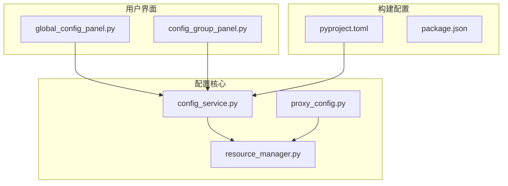
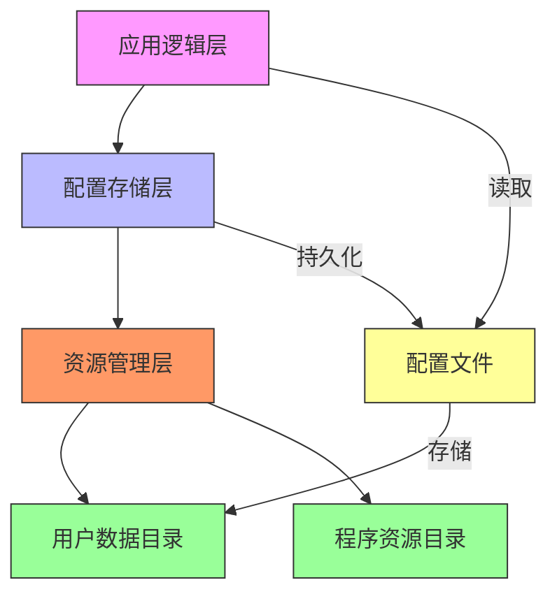
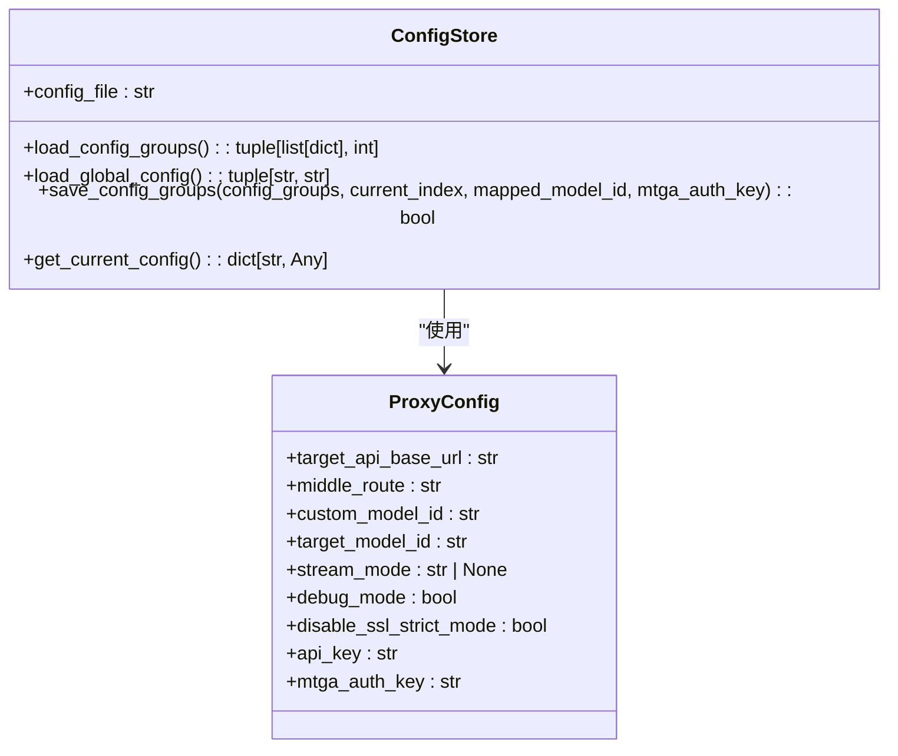
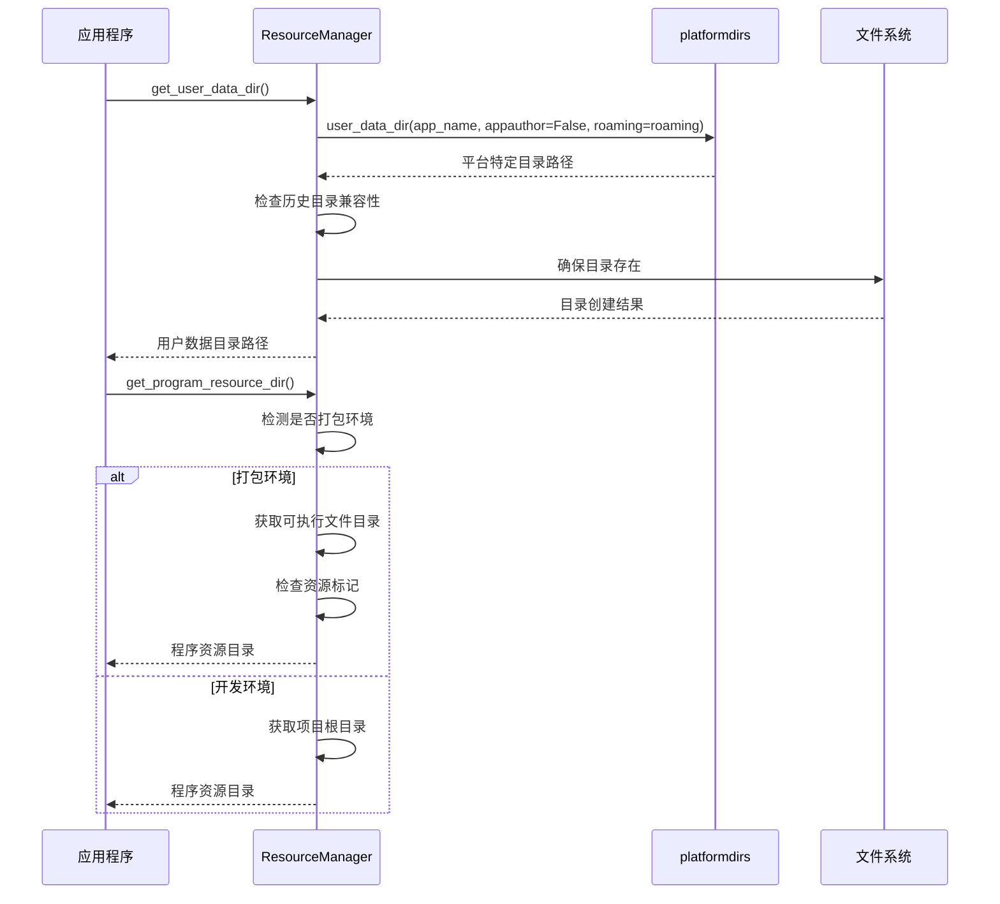
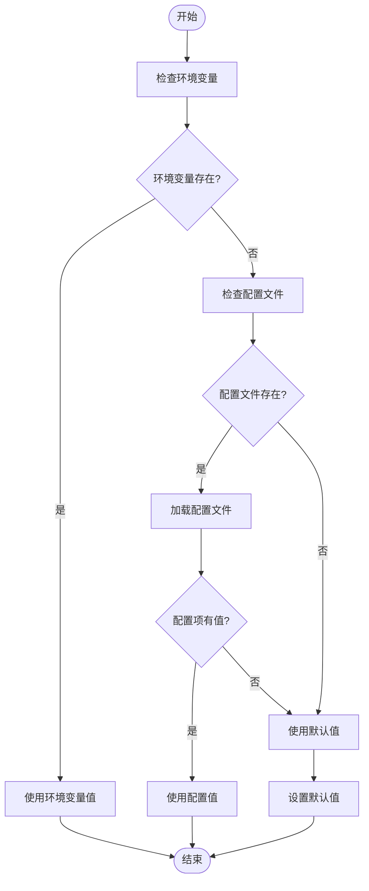
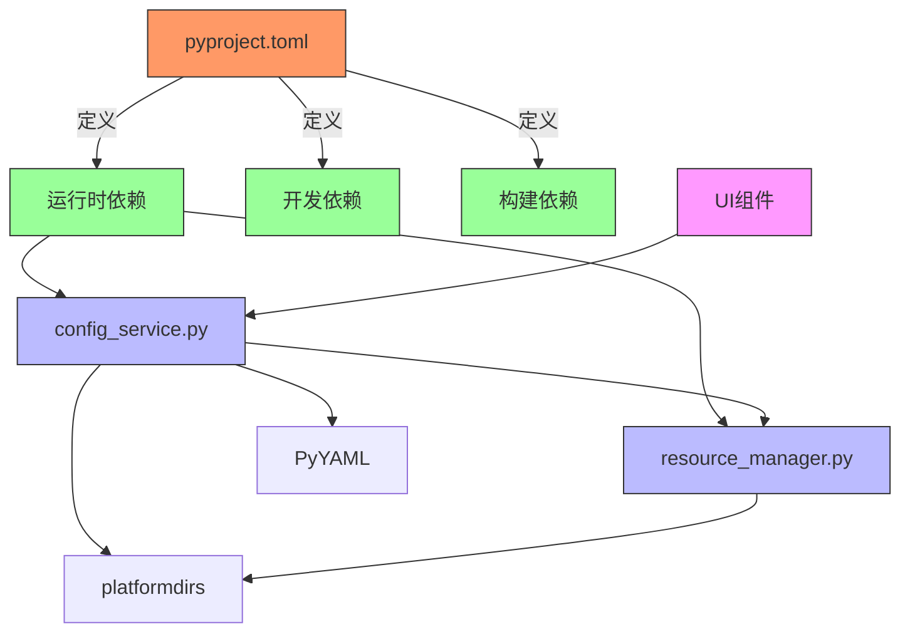

# 配置管理

<cite>
**本文档中引用的文件**   
- [config_service.py](file://modules/services/config_service.py)
- [resource_manager.py](file://modules/runtime/resource_manager.py)
- [proxy_config.py](file://modules/proxy/proxy_config.py)
- [pyproject.toml](file://pyproject.toml)
- [package.json](file://package.json)
- [app_metadata.py](file://modules/services/app_metadata.py)
- [global_config_panel.py](file://modules/ui/global_config_panel.py)
- [config_group_panel.py](file://modules/ui/config_group_panel.py)
- [mtga_gui.py](file://mtga_gui.py)
</cite>

## 目录
1. [简介](#简介)
2. [项目结构](#项目结构)
3. [核心组件](#核心组件)
4. [架构概述](#架构概述)
5. [详细组件分析](#详细组件分析)
6. [依赖分析](#依赖分析)
7. [性能考虑](#性能考虑)
8. [故障排除指南](#故障排除指南)
9. [结论](#结论)

## 简介
本项目实现了一个完整的配置管理系统，支持用户级配置和构建级配置。系统使用YAML格式存储用户配置，通过platformdirs库确定用户数据目录，并实现了配置的持久化存储、加载优先级、默认值机制和运行时更新策略。构建配置通过pyproject.toml文件管理，支持不同平台的打包需求。

## 项目结构
项目采用模块化结构，配置相关功能分布在多个模块中。核心配置服务位于`modules/services`目录，资源管理在`modules/runtime`目录，用户界面在`modules/ui`目录。

**Diagram sources**
- [config_service.py](file://modules/services/config_service.py#L1-L81)
- [resource_manager.py](file://modules/runtime/resource_manager.py#L1-L294)
- [pyproject.toml](file://pyproject.toml#L1-L85)

**Section sources**
- [config_service.py](file://modules/services/config_service.py#L1-L81)
- [resource_manager.py](file://modules/runtime/resource_manager.py#L1-L294)

## 核心组件
系统的核心配置组件包括配置存储服务、资源管理器和代理配置处理器。`ConfigStore`类负责配置的加载和保存，`ResourceManager`类管理用户数据目录和资源路径，`ProxyConfig`类处理代理配置的解析和验证。

**Section sources**
- [config_service.py](file://modules/services/config_service.py#L1-L81)
- [resource_manager.py](file://modules/runtime/resource_manager.py#L1-L294)
- [proxy_config.py](file://modules/proxy/proxy_config.py#L1-L107)

## 架构概述
配置管理系统采用分层架构，从下到上分别为资源管理层、配置存储层和应用逻辑层。资源管理层使用platformdirs库确定用户数据目录，配置存储层提供YAML文件的读写接口，应用逻辑层处理配置的解析和验证。

**Diagram sources**
- [resource_manager.py](file://modules/runtime/resource_manager.py#L1-L294)
- [config_service.py](file://modules/services/config_service.py#L1-L81)

## 详细组件分析

### 配置服务分析
`ConfigStore`类是配置系统的核心，负责配置的持久化存储。它使用YAML格式存储配置，支持配置组和全局配置的分离管理。

#### 类图

**Diagram sources**
- [config_service.py](file://modules/services/config_service.py#L1-L81)
- [proxy_config.py](file://modules/proxy/proxy_config.py#L1-L107)

### 资源管理分析
`ResourceManager`类负责管理应用程序的资源路径，包括用户数据目录和程序资源目录。它使用platformdirs库来确定符合平台规范的用户数据目录。

#### 序列图

**Diagram sources**
- [resource_manager.py](file://modules/runtime/resource_manager.py#L1-L294)

### 配置加载分析
系统实现了复杂的配置加载逻辑，包括默认值机制、环境变量覆盖和配置优先级。

#### 流程图

**Diagram sources**
- [proxy_config.py](file://modules/proxy/proxy_config.py#L1-L107)
- [config_service.py](file://modules/services/config_service.py#L1-L81)

## 依赖分析
系统依赖关系清晰，核心配置服务依赖于资源管理器，用户界面组件依赖于配置服务，构建配置独立于运行时配置。

**Diagram sources**
- [pyproject.toml](file://pyproject.toml#L1-L85)
- [config_service.py](file://modules/services/config_service.py#L1-L81)
- [resource_manager.py](file://modules/runtime/resource_manager.py#L1-L294)

## 性能考虑
配置管理系统在设计时考虑了性能因素，包括配置缓存、延迟加载和资源预加载等策略。系统在启动时只加载必要的配置，其他配置按需加载，减少了启动时间和内存占用。

## 故障排除指南
配置相关问题通常与文件权限、路径错误或格式问题有关。系统提供了详细的错误日志和调试信息，帮助用户诊断和解决问题。

**Section sources**
- [resource_manager.py](file://modules/runtime/resource_manager.py#L1-L294)
- [config_service.py](file://modules/services/config_service.py#L1-L81)
- [mtga_gui.py](file://mtga_gui.py#L1-L145)

## 结论
本配置管理系统设计合理，功能完整，支持用户级和构建级配置管理。系统使用标准库和第三方库的组合，确保了跨平台兼容性和可维护性。通过清晰的分层架构和模块化设计，系统易于扩展和维护。