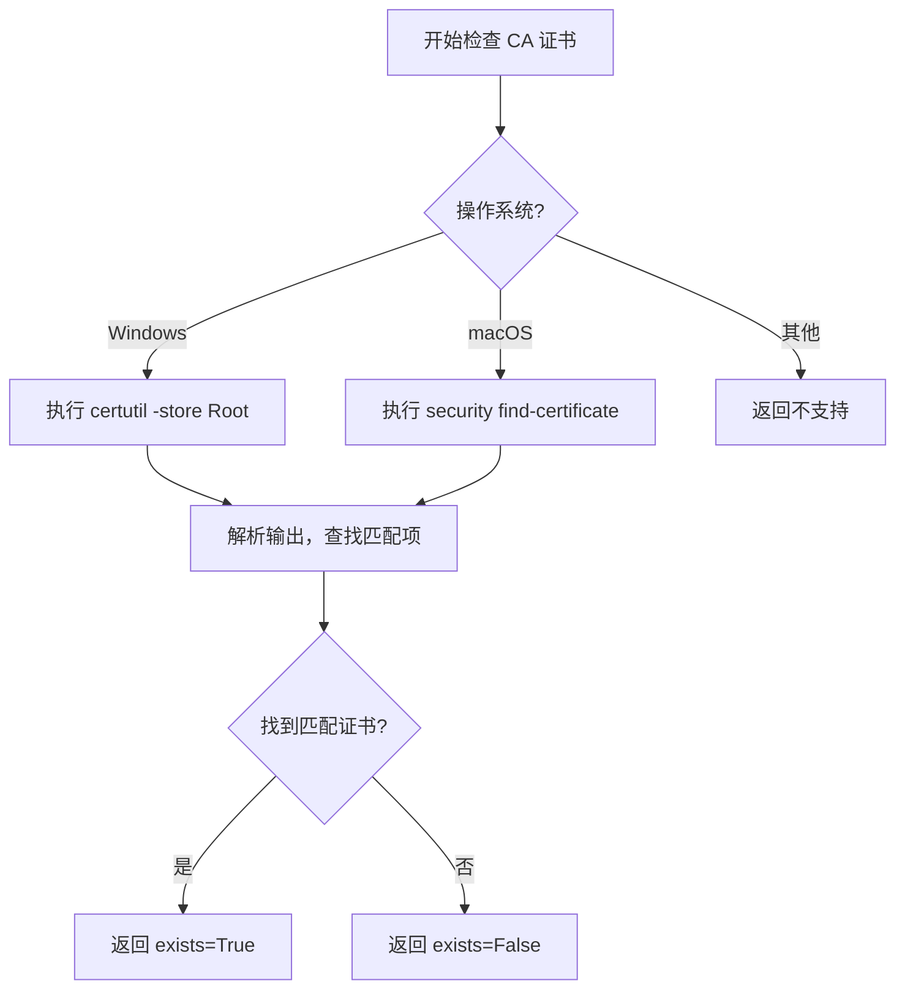
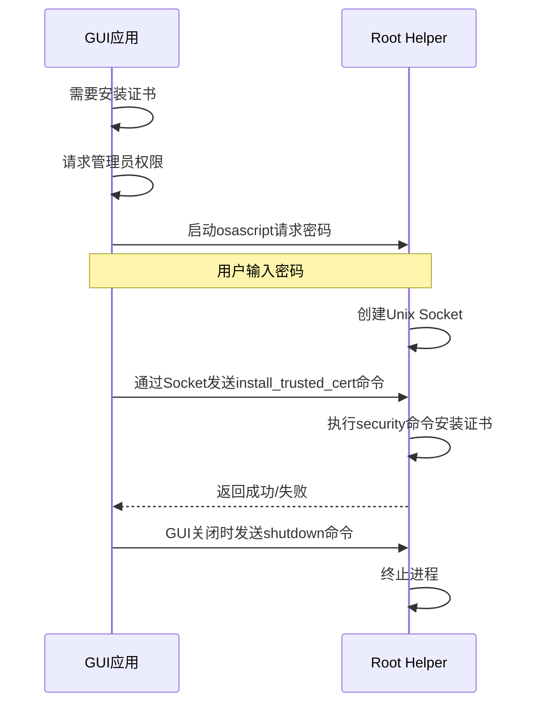

# 安全注意事项

<cite>
**本文档引用的文件**  
- [cert_checker.py](file://modules/cert/cert_checker.py)
- [cert_cleaner.py](file://modules/cert/cert_cleaner.py)
- [macos_privileged_helper.py](file://modules/platform/macos_privileged_helper.py)
- [cert_generator.py](file://modules/cert/cert_generator.py)
- [ca_store.py](file://modules/cert/ca_store.py)
- [cert_installer.py](file://modules/cert/cert_installer.py)
- [cert_utils.py](file://modules/cert/cert_utils.py)
- [resource_manager.py](file://modules/runtime/resource_manager.py)
- [system.py](file://modules/platform/system.py)
- [privileges.py](file://modules/platform/privileges.py)
- [logging_service.py](file://modules/services/logging_service.py)
- [process_utils.py](file://modules/runtime/process_utils.py)
</cite>

## 目录
1. [私钥保护](#私钥保护)  
2. [证书有效期与轮换策略](#证书有效期与轮换策略)  
3. [CA证书安装的安全影响](#ca证书安装的安全影响)  
4. [证书校验机制](#证书校验机制)  
5. [最小权限原则的应用](#最小权限原则的应用)  
6. [证书误用的应急措施](#证书误用的应急措施)  
7. [日志审计建议](#日志审计建议)

## 私钥保护

私钥（private key）是整个证书体系中最敏感的组成部分，必须严格保护，防止泄露。在本系统中，私钥文件（如 `ca.key` 和 `domain.key`）由 `cert_generator.py` 模块生成，并存储在用户数据目录下的 `ca` 子目录中。这些私钥用于签署和加密通信，一旦泄露，攻击者可伪造合法证书，实施中间人攻击（MITM），窃取敏感数据。

为防止私钥泄露，系统采取以下措施：
- 私钥文件不包含在版本控制系统中，避免意外提交。
- 生成过程中通过日志明确提示用户妥善保管私钥，切勿泄露。
- 文件存储路径由 `resource_manager.py` 管理，确保其位于用户专属的数据目录中，限制其他用户访问。

**Section sources**
- [cert_generator.py](file://modules/cert/cert_generator.py#L435-L437)
- [resource_manager.py](file://modules/runtime/resource_manager.py#L239-L241)

## 证书有效期与轮换策略

证书的有效期管理是降低长期安全风险的关键。本系统生成的CA证书默认有效期为100年（36500天），而服务器证书的有效期为1年（365天）。虽然长有效期减少了管理负担，但也增加了长期暴露的风险。

建议的安全实践是定期轮换证书：
- **定期轮换**：即使证书未过期，也应定期生成新的CA和服务器证书，以减少私钥长期暴露的可能性。
- **过期处理**：当服务器证书接近或达到有效期时，必须重新生成并安装新证书，否则客户端将因证书过期而拒绝连接，导致服务中断。
- **自动化管理**：可通过脚本定期调用 `generate_certificates` 函数来实现证书的自动化轮换。

**Section sources**
- [cert_generator.py](file://modules/cert/cert_generator.py#L186-L187)
- [cert_generator.py](file://modules/cert/cert_generator.py#L347)

## CA证书安装的安全影响

将CA证书安装到系统信任存储中，意味着系统将信任该CA签发的所有下级证书。这赋予了本软件极大的权力，同时也带来了安全风险。

- **信任来源**：用户必须仅从可信来源运行本软件。如果软件被篡改，恶意代码可利用此机制生成并安装伪造的CA证书，从而监控所有HTTPS流量。
- **系统级影响**：在Windows上，证书被添加到“受信任的根证书颁发机构”存储；在macOS上，证书被添加到系统钥匙串并设为完全信任。这会影响系统上所有应用程序的证书验证行为。
- **权限要求**：安装CA证书需要管理员权限。在macOS上，系统通过 `macos_privileged_helper.py` 模块请求用户输入密码以获取临时的root权限，确保操作的透明性和可控性。

**Section sources**
- [ca_store.py](file://modules/cert/ca_store.py#L142-L155)
- [macos_privileged_helper.py](file://modules/platform/macos_privileged_helper.py#L133-L165)

## 证书校验机制

为防止无效或过期的证书导致安全漏洞，系统实现了 `cert_checker.py` 模块，提供跨平台的证书存在性检查功能。

该机制的工作流程如下：
1. **检查请求**：调用 `has_existing_ca_cert` 函数，传入CA证书的通用名称（Common Name）。
2. **平台适配**：根据操作系统，调用相应的检查函数（如Windows的 `certutil -store Root` 或macOS的 `security find-certificate`）。
3. **结果解析**：解析命令输出，判断指定名称的CA证书是否已存在于系统信任存储中。
4. **返回结果**：返回一个布尔值或 `OperationResult` 对象，指示证书是否存在。

此机制确保在生成或安装新证书前，能够检测到已存在的同名证书，避免重复操作，并为用户提供清晰的状态反馈。

**Diagram sources**
- [cert_checker.py](file://modules/cert/cert_checker.py#L11-L21)
- [ca_store.py](file://modules/cert/ca_store.py#L14-L25)

**Section sources**
- [cert_checker.py](file://modules/cert/cert_checker.py#L1-L25)
- [ca_store.py](file://modules/cert/ca_store.py#L14-L117)

## 最小权限原则的应用

系统严格遵循最小权限原则，特别是在需要执行特权操作时。`macos_privileged_helper.py` 模块是这一原则的典型应用实例。

在macOS上，安装CA证书需要root权限。该模块的设计如下：
- **按需提权**：仅在首次需要安装证书时，通过 `osascript` 弹出系统对话框请求用户密码。
- **临时会话**：启动一个以root身份运行的Python helper进程，并通过Unix Socket与之通信。
- **最小化操作**：helper进程仅执行写文件、复制文件和运行特定命令（如 `security add-trusted-cert`）等必要操作。
- **主动释放**：当GUI应用关闭时，主动向helper发送 `shutdown` 命令，终止其运行，及时释放权限。

这种设计避免了整个应用程序以管理员身份运行，将特权操作的范围限制在最小的必要功能内，显著降低了安全风险。

**Diagram sources**
- [macos_privileged_helper.py](file://modules/platform/macos_privileged_helper.py#L48-L180)
- [ca_store.py](file://modules/cert/ca_store.py#L144-L155)

**Section sources**
- [macos_privileged_helper.py](file://modules/platform/macos_privileged_helper.py#L1-L487)

## 证书误用的应急措施

为应对证书被误用或不再需要的情况，系统提供了 `cert_cleaner.py` 模块，用于彻底移除已安装的CA证书。

该模块通过 `clear_ca_cert` 函数实现清理功能：
- **跨平台支持**：在Windows上使用 `certutil -delstore` 命令删除证书；在macOS上通过特权helper执行 `security delete-certificate` 命令。
- **精确匹配**：根据CA证书的通用名称（Common Name）查找并删除所有匹配的证书。
- **错误处理**：在删除过程中，会记录详细的日志，包括成功和失败的操作，便于用户排查问题。

用户可以通过调用此功能，快速撤销对特定CA的信任，恢复系统到安全状态。

**Section sources**
- [cert_cleaner.py](file://modules/cert/cert_cleaner.py#L12-L20)
- [ca_store.py](file://modules/cert/ca_store.py#L44-L299)

## 日志审计建议

为追踪证书的生成和安装行为，系统建议启用日志审计功能。`logging_service.py` 模块负责配置全局日志记录。

关键审计点包括：
- **错误日志**：所有错误信息（ERROR级别）会被写入用户数据目录下的日志文件（如 `mtga_gui_error.log`），包含时间戳和异常堆栈。
- **操作记录**：证书生成、安装和清理等关键操作会在日志中留下明确的记录，例如“CA证书安装成功！”或“正在清除系统钥匙串中的CA证书...”。
- **异常捕获**：通过 `install_global_exception_hook` 函数，将未捕获的异常写入日志文件，便于事后分析。

启用日志审计有助于监控系统的安全状态，及时发现异常行为，并为故障排查提供依据。

**Section sources**
- [logging_service.py](file://modules/services/logging_service.py#L10-L41)
- [cert_generator.py](file://modules/cert/cert_generator.py#L432-L433)
- [ca_store.py](file://modules/cert/ca_store.py#L130-L131)