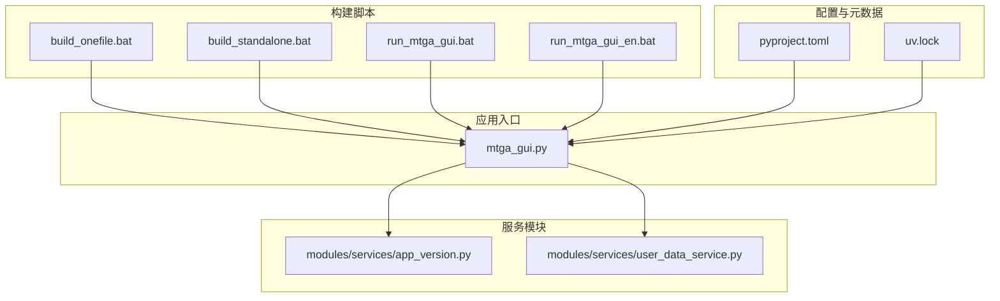
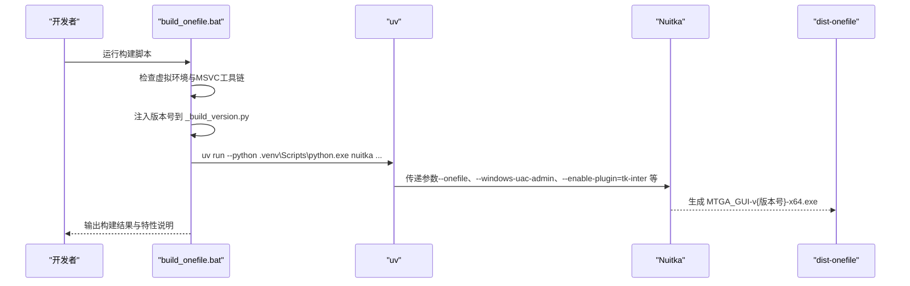
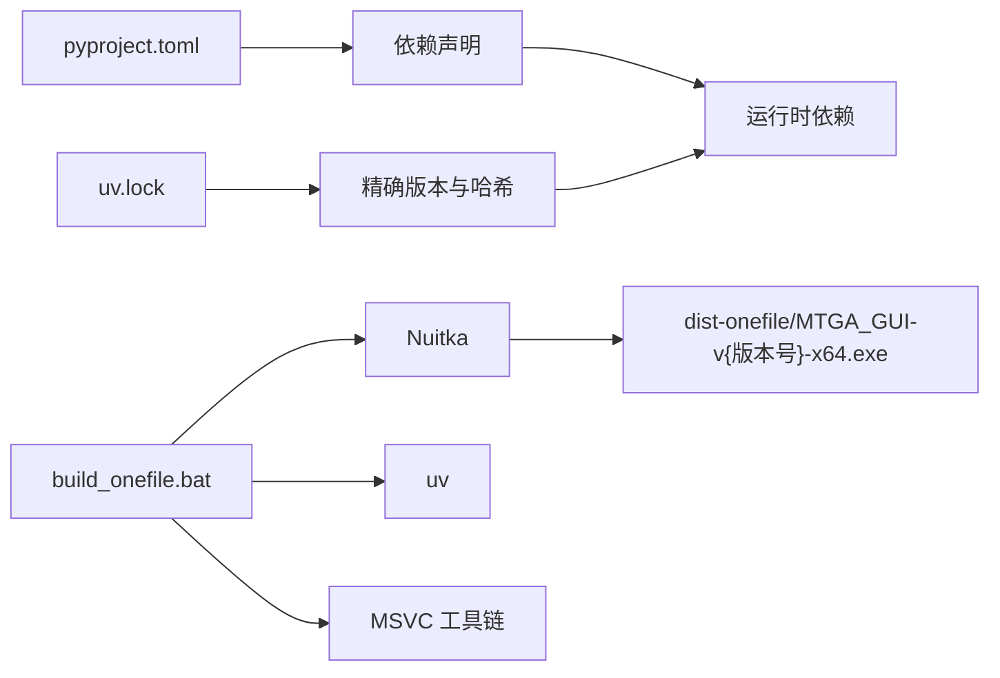

# Windows 单文件构建指南

<cite>
**本文引用的文件列表**
- [build_onefile.bat](file://build_onefile.bat)
- [docs/Windows_Onefile_Build.md](file://docs/Windows_Onefile_Build.md)
- [pyproject.toml](file://pyproject.toml)
- [modules/services/app_version.py](file://modules/services/app_version.py)
- [modules/services/user_data_service.py](file://modules/services/user_data_service.py)
- [build_standalone.bat](file://build_standalone.bat)
- [run_mtga_gui.bat](file://run_mtga_gui.bat)
- [run_mtga_gui_en.bat](file://run_mtga_gui_en.bat)
- [mtga_gui.py](file://mtga_gui.py)
- [uv.lock](file://uv.lock)
</cite>

## 目录
1. [简介](#简介)
2. [项目结构概览](#项目结构概览)
3. [核心构建组件](#核心构建组件)
4. [架构总览](#架构总览)
5. [详细组件分析](#详细组件分析)
6. [依赖关系分析](#依赖关系分析)
7. [性能考量](#性能考量)
8. [故障排除指南](#故障排除指南)
9. [结论](#结论)

## 简介
本指南面向使用 Nuitka 在 Windows 上构建 MTGA GUI 单文件可执行程序的开发者与运维人员。文档覆盖从环境准备、构建脚本参数解析、版本号管理、用户数据持久化机制，到常见问题排查与单文件版本与独立版本的对比分析，帮助读者高效完成生产级发行构建。

## 项目结构概览
仓库采用模块化组织，核心入口为 GUI 应用入口文件，构建脚本位于根目录，文档位于 docs 目录，服务层模块位于 modules 目录，包含版本解析、用户数据管理、网络与证书处理等功能模块。

图表来源
- [build_onefile.bat](file://build_onefile.bat#L1-L212)
- [build_standalone.bat](file://build_standalone.bat#L1-L80)
- [run_mtga_gui.bat](file://run_mtga_gui.bat#L1-L132)
- [run_mtga_gui_en.bat](file://run_mtga_gui_en.bat#L1-L165)
- [mtga_gui.py](file://mtga_gui.py#L1-L145)
- [pyproject.toml](file://pyproject.toml#L1-L85)
- [uv.lock](file://uv.lock#L1-L800)

章节来源
- [build_onefile.bat](file://build_onefile.bat#L1-L212)
- [build_standalone.bat](file://build_standalone.bat#L1-L80)
- [run_mtga_gui.bat](file://run_mtga_gui.bat#L1-L132)
- [run_mtga_gui_en.bat](file://run_mtga_gui_en.bat#L1-L165)
- [mtga_gui.py](file://mtga_gui.py#L1-L145)
- [pyproject.toml](file://pyproject.toml#L1-L85)
- [uv.lock](file://uv.lock#L1-L800)

## 核心构建组件
- 单文件构建脚本：负责检查环境、注入版本号、调用 Nuitka 打包、输出命名与特性提示。
- 独立版本构建脚本：用于开发测试，避免单文件解压开销。
- 运行脚本：自动安装 uv、Python 3.13、虚拟环境与依赖，启动应用。
- 版本解析服务：优先从构建期注入的版本常量读取，其次从环境变量，最后回退到 pyproject.toml。
- 用户数据服务：提供备份、恢复、清理等数据持久化能力，统一存储于 %APPDATA%\MTGA\。

章节来源
- [build_onefile.bat](file://build_onefile.bat#L1-L212)
- [build_standalone.bat](file://build_standalone.bat#L1-L80)
- [run_mtga_gui.bat](file://run_mtga_gui.bat#L1-L132)
- [run_mtga_gui_en.bat](file://run_mtga_gui_en.bat#L1-L165)
- [modules/services/app_version.py](file://modules/services/app_version.py#L1-L53)
- [modules/services/user_data_service.py](file://modules/services/user_data_service.py#L1-L236)

## 架构总览
下图展示单文件构建流程的关键节点与依赖关系，包括版本注入、资源打包、输出命名与特性开关。

图表来源
- [build_onefile.bat](file://build_onefile.bat#L1-L212)

章节来源
- [build_onefile.bat](file://build_onefile.bat#L1-L212)

## 详细组件分析

### 单文件构建脚本（build_onefile.bat）
- 环境检查
  - 虚拟环境存在性检查：若不存在，提示先执行 uv sync --group win-build 安装依赖。
  - MSVC 工具链检测：支持外部传参指定目录，否则按默认路径扫描 VS2022/VS2019 安装目录。
- 版本号注入
  - 优先使用环境变量 MTGA_VERSION，否则使用脚本内部 VERSION。
  - 自动规范化版本前缀（无 v 则补 v），写入 modules/runtime/_build_version.py。
- Nuitka 参数详解
  - --onefile：单文件打包，便于分发。
  - --msvc=latest：使用最新 MSVC 编译器。
  - --show-progress/--show-memory：显示进度与内存使用。
  - --output-dir=dist-onefile：输出目录。
  - --assume-yes-for-downloads：跳过交互确认。
  - --include-data-files：包含 CA 证书配置、OpenSSL 可执行与库、图标等资源。
  - --windows-icon-from-ico：设置应用图标。
  - --enable-plugin=tk-inter：启用 tkinter 支持。
  - --windows-console-mode=attach：附加控制台（便于调试）。
  - --include-package=modules：包含模块化组件。
  - --windows-uac-admin：自动请求管理员权限。
  - --output-filename=MTGA_GUI-v%VERSION%-x64.exe：输出文件命名规范。
- 输出与校验
  - 等待目标 EXE 生成，若未找到则尝试扫描 dist-onefile 下的 .exe 并重命名为期望名称。
  - 成功后打印单文件版本特性说明（仅一个 .exe、首次运行解压、包含所有依赖、自动请求管理员权限等）。

章节来源
- [build_onefile.bat](file://build_onefile.bat#L1-L212)

### 独立版本构建脚本（build_standalone.bat）
- 与单文件版本类似，但使用 --standalone 生成独立目录结构，适合开发测试与多进程场景。
- 关键差异：输出目录为 dist-standalone，输出文件名为 MTGA_GUI.exe，移除 --onefile 与 --output-filename 的单文件命名约束。

章节来源
- [build_standalone.bat](file://build_standalone.bat#L1-L80)

### 版本管理与注入
- 版本来源优先级：MTGA_VERSION 环境变量 > 构建期注入的 _build_version.py > pyproject.toml 中的 project.version。
- 构建脚本在执行 Nuitka 前，将规范化后的版本写入 modules/runtime/_build_version.py，确保运行时可读取一致版本号。

章节来源
- [modules/services/app_version.py](file://modules/services/app_version.py#L1-L53)
- [pyproject.toml](file://pyproject.toml#L1-L85)
- [build_onefile.bat](file://build_onefile.bat#L75-L87)

### 用户数据持久化机制
- 存储位置：Windows 平台为 %APPDATA%\MTGA\。
- 包含内容：
  - 配置文件：mtga_config.yaml
  - 证书与配置：ca/ 目录
  - hosts 备份：hosts.backup
  - 备份目录：backups/
- 功能接口：
  - 备份数据：创建带时间戳的完整备份
  - 还原数据：从最新备份恢复
  - 清除数据：安全删除用户数据（保留备份）
  - 打开目录：直接访问用户数据目录

章节来源
- [modules/services/user_data_service.py](file://modules/services/user_data_service.py#L1-L236)

### 运行脚本（run_mtga_gui.bat / run_mtga_gui_en.bat）
- 自动检测并安装 uv 包管理器。
- 自动安装 Python 3.13、创建虚拟环境并同步依赖。
- 检查 OpenSSL 是否就绪，设置 PATH 与 PYTHONPATH。
- 使用 uv run 启动 mtga_gui.py，确保使用正确的 Python 环境。

章节来源
- [run_mtga_gui.bat](file://run_mtga_gui.bat#L1-L132)
- [run_mtga_gui_en.bat](file://run_mtga_gui_en.bat#L1-L165)

### 应用入口（mtga_gui.py）
- 入口文件在早期阶段设置 UTF-8 编码环境变量，确保跨平台一致性。
- 导入模块化服务与 UI 组件，构建应用上下文并启动主窗口。
- 提供权限检查与降级策略，避免不必要的权限请求。

章节来源
- [mtga_gui.py](file://mtga_gui.py#L1-L145)

## 依赖关系分析
- 构建依赖
  - Nuitka：用于编译与打包（win-build 依赖组）。
  - uv：Python 包管理器与虚拟环境管理。
  - Visual Studio 2022 C++ 构建工具：提供 MSVC 编译器。
- 运行时依赖
  - Flask、Requests、Werkzeug、Jinja2、PyYAML、tkinterweb 等。
  - OpenSSL：用于证书生成与加密通信。
- 版本与锁定
  - pyproject.toml 定义项目元数据与依赖。
  - uv.lock 记录精确版本与哈希，确保可复现构建。

图表来源
- [pyproject.toml](file://pyproject.toml#L1-L85)
- [uv.lock](file://uv.lock#L1-L800)
- [build_onefile.bat](file://build_onefile.bat#L95-L128)

章节来源
- [pyproject.toml](file://pyproject.toml#L1-L85)
- [uv.lock](file://uv.lock#L1-L800)
- [build_onefile.bat](file://build_onefile.bat#L95-L128)

## 性能考量
- 单文件构建耗时较长（约 30-40 分钟），首次构建更慢（需下载依赖）。
- 首次运行单文件版本需要解压到临时目录，后续运行更快。
- 独立版本启动更快，适合开发测试；单文件版本便于分发与部署。
- 建议在构建期间避免高 CPU 占用任务，确保稳定产出。

章节来源
- [docs/Windows_Onefile_Build.md](file://docs/Windows_Onefile_Build.md#L128-L136)

## 故障排除指南
- 未找到 Visual Studio 2022
  - 症状：提示未找到 MSVC 工具链。
  - 解决：安装 Visual Studio 2022 Community 版本，确保包含 C++ 构建工具。
- 虚拟环境不存在
  - 症状：提示虚拟环境不存在。
  - 解决：先执行 uv sync --group win-build 安装依赖。
- 构建失败返回码非零
  - 症状：构建脚本输出失败并显示返回码。
  - 解决：检查 MSVC、uv、Python 3.13 与依赖安装状态；查看 dist-onefile 目录是否存在 .exe。
- 输出文件命名不匹配
  - 症状：未生成期望的 MTGA_GUI-v{版本号}-x64.exe。
  - 解决：脚本会尝试扫描 dist-onefile 下的 .exe 并重命名为期望名称；若失败，检查输出目录与权限。
- 运行时权限不足
  - 症状：修改 hosts 文件或监听 443 端口失败。
  - 解决：以管理员身份运行；运行脚本会自动提权。

章节来源
- [docs/Windows_Onefile_Build.md](file://docs/Windows_Onefile_Build.md#L112-L136)
- [build_onefile.bat](file://build_onefile.bat#L12-L21)
- [build_onefile.bat](file://build_onefile.bat#L166-L183)
- [run_mtga_gui.bat](file://run_mtga_gui.bat#L5-L11)

## 结论
通过本指南，您可以在 Windows 上使用 Nuitka 与 uv 高效构建 MTGA GUI 的单文件可执行程序。构建脚本提供了完善的环境检查、版本注入、资源打包与输出命名规范；用户数据持久化机制确保配置与证书的安全存储与便捷管理。针对不同阶段的需求，单文件版本适合生产发行，独立版本适合开发测试。遇到问题时，可依据故障排除指南快速定位并解决问题。