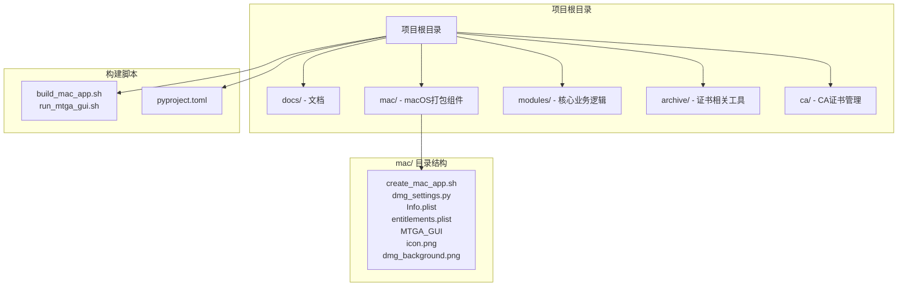
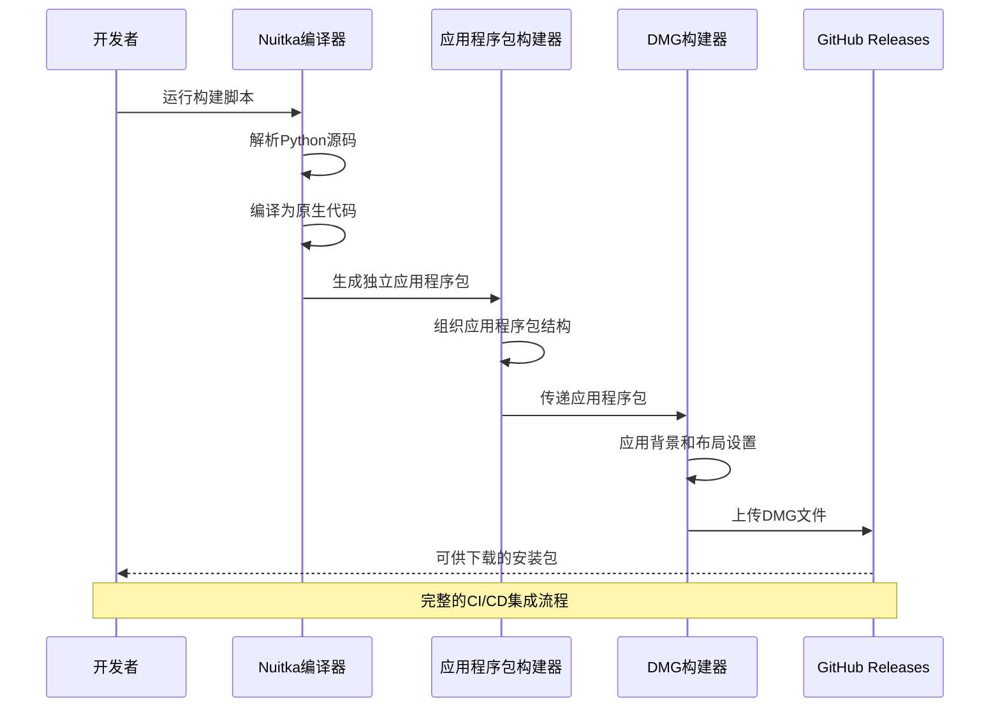
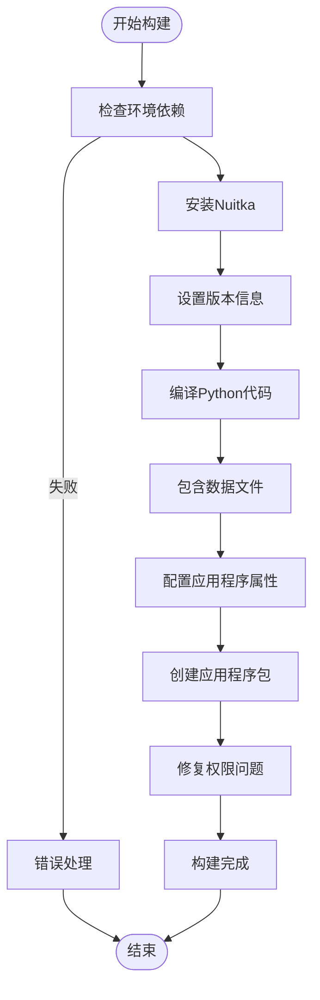
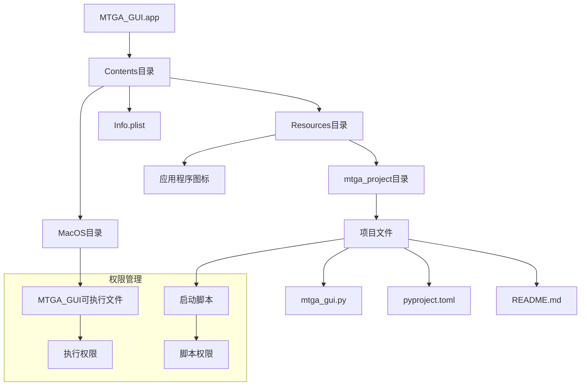
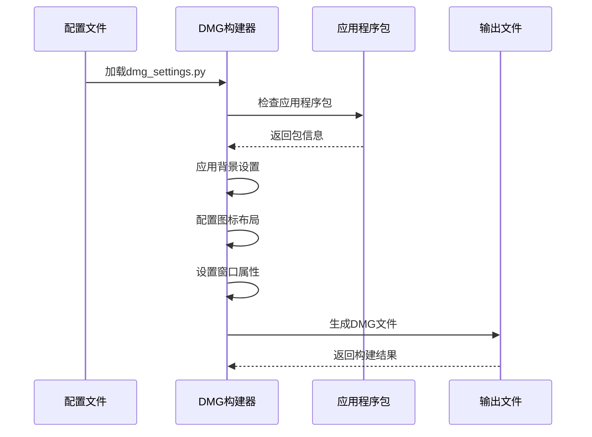
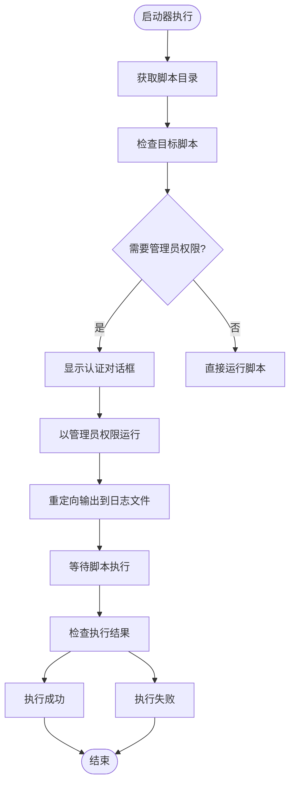
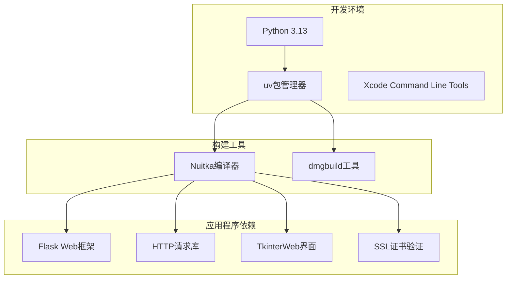
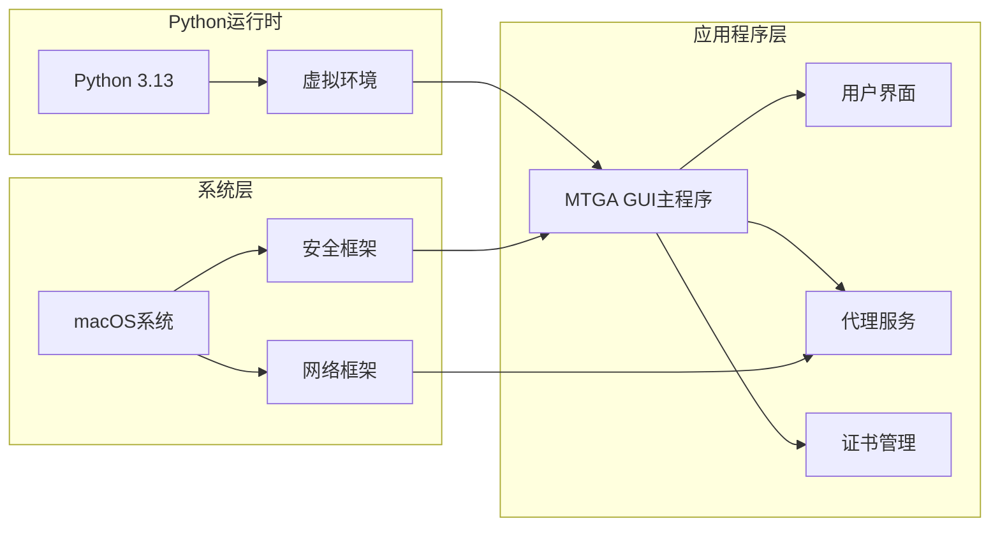

# macOS DMG打包指南

<cite>
**本文档引用的文件**
- [create_mac_app.sh](file://mac/create_mac_app.sh)
- [dmg_settings.py](file://mac/dmg_settings.py)
- [Info.plist](file://mac/Info.plist)
- [entitlements.plist](file://mac/entitlements.plist)
- [MTGA_GUI](file://mac/MTGA_GUI)
- [build_mac_app.sh](file://build_mac_app.sh)
- [run_mtga_gui.sh](file://run_mtga_gui.sh)
- [README_DMG.md](file://docs/README_DMG.md)
- [pyproject.toml](file://pyproject.toml)
</cite>

## 目录
1. [简介](#简介)
2. [项目结构](#项目结构)
3. [核心组件](#核心组件)
4. [架构概览](#架构概览)
5. [详细组件分析](#详细组件分析)
6. [依赖关系分析](#依赖关系分析)
7. [性能考虑](#性能考虑)
8. [故障排除指南](#故障排除指南)
9. [结论](#结论)
10. [附录](#附录)

## 简介

本指南系统阐述了MTGA GUI在macOS平台上的应用打包与分发完整流程。该流程采用现代工具链，结合Nuitka编译器和dmgbuild工具，实现了从源代码到最终DMG安装镜像的专业化打包过程。

整个流程的核心优势包括：
- **独立性**：通过Nuitka实现完全独立的应用程序包，无需外部依赖
- **专业性**：使用dmgbuild创建具有专业外观的DMG安装镜像
- **自动化**：完整的脚本化流程，支持CI/CD集成
- **可重复性**：基于配置文件的构建过程，确保结果一致性

## 项目结构

该项目采用模块化组织方式，macOS相关功能集中在`mac/`目录下：



**图表来源**
- [create_mac_app.sh](file://mac/create_mac_app.sh#L1-L220)
- [build_mac_app.sh](file://build_mac_app.sh#L1-L180)

**章节来源**
- [create_mac_app.sh](file://mac/create_mac_app.sh#L30-L108)
- [build_mac_app.sh](file://build_mac_app.sh#L1-L50)

## 核心组件

### Nuitka构建系统

Nuitka作为主要的编译器，负责将Python源代码转换为独立的原生应用程序包。其关键参数包括：

- **--standalone**：创建完全独立的应用程序包，包含所有依赖
- **--macos-create-app-bundle**：生成标准的macOS应用程序包结构
- **--macos-app-icon**：指定应用程序图标文件
- **--enable-plugin=tk-inter**：启用Tkinter图形界面支持
- **--macos-target-arch=arm64**：针对Apple Silicon架构优化

### 应用程序包结构

标准的macOS应用程序包遵循特定的目录结构：

```
MTGA_GUI.app/
├── Contents/
│   ├── Info.plist          # 应用程序元数据
│   ├── MacOS/             # 可执行文件
│   ├── Resources/         # 资源文件
│   └── mtga_project/      # 项目文件副本
```

### DMG构建工具链

dmgbuild提供了专业级的DMG镜像创建能力，支持：
- **UDZO压缩**：提供最佳压缩比
- **自定义背景**：支持SVG到PNG的背景图转换
- **精确布局**：通过icon_locations控制图标位置
- **拖拽安装**：直观的用户安装体验

**章节来源**
- [build_mac_app.sh](file://build_mac_app.sh#L87-L118)
- [create_mac_app.sh](file://mac/create_mac_app.sh#L34-L108)
- [dmg_settings.py](file://mac/dmg_settings.py#L27-L70)

## 架构概览

整个打包流程采用分层架构，从源代码到最终分发的完整生命周期：



**图表来源**
- [build_mac_app.sh](file://build_mac_app.sh#L87-L118)
- [create_mac_app.sh](file://mac/create_mac_app.sh#L110-L209)
- [dmg_settings.py](file://mac/dmg_settings.py#L27-L70)

## 详细组件分析

### Nuitka构建脚本分析

#### 关键构建参数详解

| 参数 | 作用 | 配置值 | 影响 |
|------|------|--------|------|
| --standalone | 创建独立包 | 启用 | 包含所有依赖，无需外部环境 |
| --macos-create-app-bundle | 应用程序包模式 | 启用 | 生成标准.app结构 |
| --macos-app-icon | 应用图标 | mac/icon.icns | 定义应用程序外观 |
| --enable-plugin=tk-inter | Tkinter支持 | 启用 | 支持图形界面 |
| --macos-target-arch=arm64 | 目标架构 | arm64 | 针对Apple Silicon优化 |

#### 构建流程时序图



**图表来源**
- [build_mac_app.sh](file://build_mac_app.sh#L38-L118)

**章节来源**
- [build_mac_app.sh](file://build_mac_app.sh#L87-L118)

### 应用程序包构建器分析

#### 目录结构创建流程

应用程序包构建器负责创建标准的macOS应用程序包结构：



**图表来源**
- [create_mac_app.sh](file://mac/create_mac_app.sh#L97-L130)

#### 文件复制策略

构建器采用智能文件复制策略，处理不同类型的资源文件：

| 文件类型 | 复制策略 | 权限处理 |
|----------|----------|----------|
| 可执行文件 | 直接复制并设置执行权限 | chmod +x |
| 配置文件 | 直接复制 | 保持默认权限 |
| 数据文件 | 直接复制 | 保持默认权限 |
| 目录结构 | 递归复制 | 处理权限问题 |

**章节来源**
- [create_mac_app.sh](file://mac/create_mac_app.sh#L120-L209)

### DMG构建配置分析

#### 配置参数详解

| 配置项 | 默认值 | 作用 | 自定义选项 |
|--------|--------|------|------------|
| volume_name | "MTGA GUI Installer" | DMG卷标名称 | 可修改为产品名称 |
| format | "UDZO" | 压缩格式 | 支持多种格式 |
| icon_locations | 应用程序图标位置 | 图标布局控制 | 精确坐标调整 |
| background | "mac/dmg_background.png" | 背景图像 | SVG到PNG转换 |
| window_rect | ((100, 100), (600, 400)) | 窗口尺寸和位置 | 自定义窗口大小 |

#### DMG构建流程



**图表来源**
- [dmg_settings.py](file://mac/dmg_settings.py#L7-L70)

**章节来源**
- [dmg_settings.py](file://mac/dmg_settings.py#L27-L70)

### 应用程序元数据配置

#### Info.plist配置详解

| 字段 | 值 | 作用 | 影响 |
|------|-----|------|------|
| CFBundleExecutable | MTGA_GUI | 主可执行文件名 | 应用程序入口点 |
| CFBundleIdentifier | com.mtga.gui | 唯一标识符 | 系统识别和权限管理 |
| CFBundleName | MTGA GUI | 显示名称 | Finder和Dock显示 |
| CFBundleVersion | 1.0 | 版本号 | 更新和分发标识 |
| LSMinimumSystemVersion | 10.15 | 最低系统要求 | 兼容性控制 |
| NSHighResolutionCapable | true | 高分辨率支持 | 显示质量优化 |

#### 权限配置

entitlements.plist定义了应用程序的特殊权限需求：

| 权限类型 | 配置 | 作用 | 安全影响 |
|----------|------|------|----------|
| 沙箱禁用 | false | 禁用应用沙箱 | 访问系统资源的能力 |
| 剪贴板访问 | true | 允许剪贴板操作 | 用户数据交互 |
| 网络访问 | true | 允许网络通信 | 互联网功能 |
| 文件访问 | true | 允许用户选择文件 | 文件系统交互 |

**章节来源**
- [Info.plist](file://mac/Info.plist#L4-L29)
- [entitlements.plist](file://mac/entitlements.plist#L4-L24)

### 启动脚本分析

#### MTGA_GUI启动器

启动器采用AppleScript技术实现管理员权限提升：



**图表来源**
- [MTGA_GUI](file://mac/MTGA_GUI#L17-L31)

**章节来源**
- [MTGA_GUI](file://mac/MTGA_GUI#L1-L40)

## 依赖关系分析

### 构建工具链依赖



**图表来源**
- [pyproject.toml](file://pyproject.toml#L22-L37)
- [pyproject.toml](file://pyproject.toml#L48-L51)

### 运行时依赖关系

应用程序的运行时依赖关系决定了其功能特性和系统要求：



**图表来源**
- [run_mtga_gui.sh](file://run_mtga_gui.sh#L103-L149)
- [pyproject.toml](file://pyproject.toml#L22-L37)

**章节来源**
- [pyproject.toml](file://pyproject.toml#L22-L37)
- [run_mtga_gui.sh](file://run_mtga_gui.sh#L103-L149)

## 性能考虑

### 构建性能优化

1. **增量构建**：利用Nuitka的缓存机制，避免重复编译
2. **并行处理**：合理配置编译参数，充分利用多核CPU
3. **内存管理**：监控构建过程中的内存使用情况
4. **磁盘空间**：确保有足够的临时空间进行编译

### 应用程序性能

1. **启动时间**：独立应用程序包避免了启动时的解压过程
2. **内存占用**：合理的资源管理和垃圾回收策略
3. **网络性能**：优化的代理服务和连接池管理
4. **界面响应**：异步处理和事件驱动的UI架构

### DMG构建优化

1. **压缩算法**：UDZO格式提供最佳压缩比
2. **背景图像**：优化PNG格式和尺寸
3. **图标布局**：精确的坐标控制减少渲染开销
4. **文件组织**：合理的文件结构提高访问效率

## 故障排除指南

### 常见构建问题

#### Nuitka构建失败

**问题症状**：构建过程中出现编译错误或链接失败

**可能原因**：
- 缺少Xcode Command Line Tools
- Python版本不兼容
- 依赖包安装失败
- 磁盘空间不足

**解决步骤**：
1. 验证Xcode Command Line Tools安装
2. 检查Python 3.13环境
3. 运行`uv sync --group mac-build`安装依赖
4. 清理构建缓存后重试

#### 应用程序包创建失败

**问题症状**：应用程序包结构不完整或缺少文件

**可能原因**：
- 必需文件缺失
- 权限问题
- 路径配置错误

**解决步骤**：
1. 检查必需文件的存在性
2. 验证文件权限设置
3. 确认路径配置正确
4. 查看详细的错误日志

#### DMG构建失败

**问题症状**：DMG文件创建失败或格式不正确

**可能原因**：
- 背景图像文件缺失
- 图标位置配置错误
- 磁盘空间不足
- 权限问题

**解决步骤**：
1. 确认dmg_background.png存在
2. 验证icon_locations配置
3. 检查可用磁盘空间
4. 重新运行构建脚本

### 运行时问题

#### 权限相关问题

**问题症状**：应用程序无法执行某些需要管理员权限的操作

**解决步骤**：
1. 检查entitlements.plist配置
2. 验证应用程序签名
3. 确认系统权限设置
4. 重新安装应用程序

#### 网络连接问题

**问题症状**：代理服务无法正常工作或连接超时

**解决步骤**：
1. 检查防火墙设置
2. 验证网络配置
3. 测试代理服务器连通性
4. 查看详细的错误日志

**章节来源**
- [build_mac_app.sh](file://build_mac_app.sh#L173-L180)
- [README_DMG.md](file://docs/README_DMG.md#L119-L136)

## 结论

本指南详细阐述了MTGA GUI在macOS平台上的完整打包与分发流程。通过结合Nuitka编译器和dmgbuild工具，实现了从源代码到最终DMG安装镜像的专业化构建过程。

关键成功因素包括：
- **工具链选择**：Nuitka提供高质量的独立应用程序包
- **配置管理**：基于文件的配置确保构建的一致性
- **用户体验**：专业的DMG安装界面提升用户满意度
- **自动化程度**：完整的脚本化流程支持持续集成

该流程为类似项目的macOS打包提供了标准化的参考模板，可以在保证质量的同时提高开发效率。

## 附录

### CI/CD集成最佳实践

#### GitHub Actions配置要点

1. **环境准备**：确保macOS runner环境
2. **依赖安装**：使用uv管理Python依赖
3. **构建流程**：分阶段执行构建和测试
4. **产物发布**：自动上传到GitHub Releases

#### 版本管理策略

1. **语义化版本**：遵循语义化版本控制原则
2. **标签管理**：使用Git标签标记发布版本
3. **变更日志**：维护详细的版本更新记录
4. **回滚机制**：支持快速版本回滚

#### 质量保证措施

1. **自动化测试**：集成单元测试和集成测试
2. **代码审查**：实施严格的代码审查流程
3. **安全扫描**：定期进行安全漏洞扫描
4. **性能监控**：建立性能基准测试体系