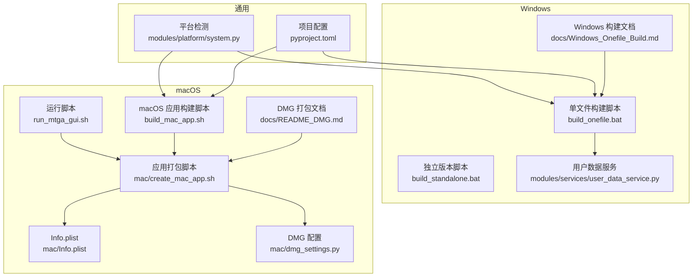
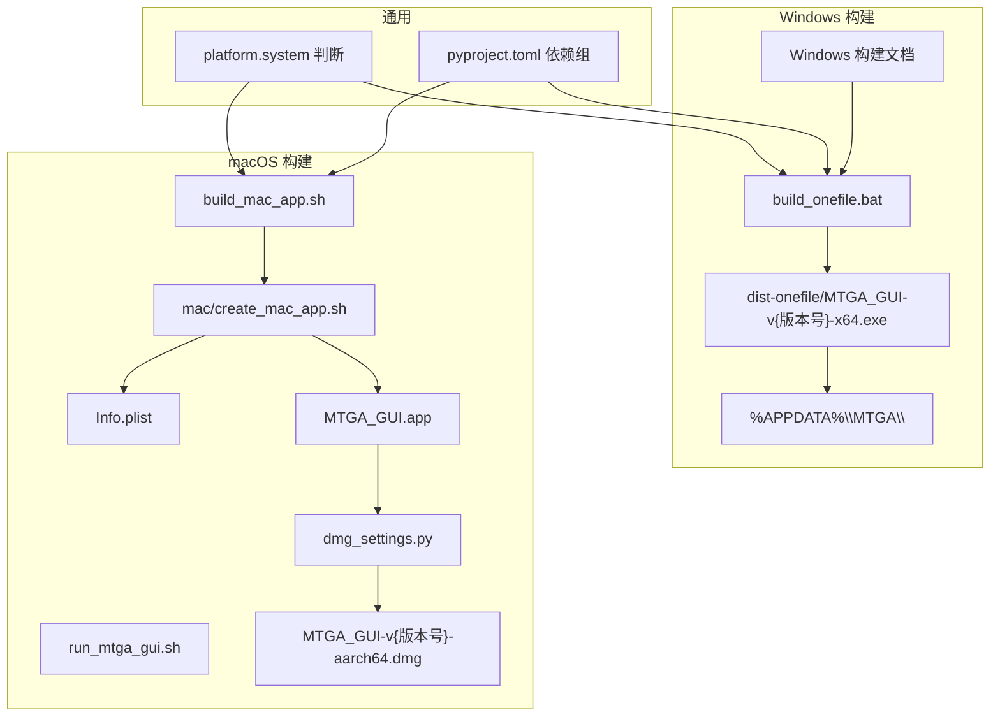
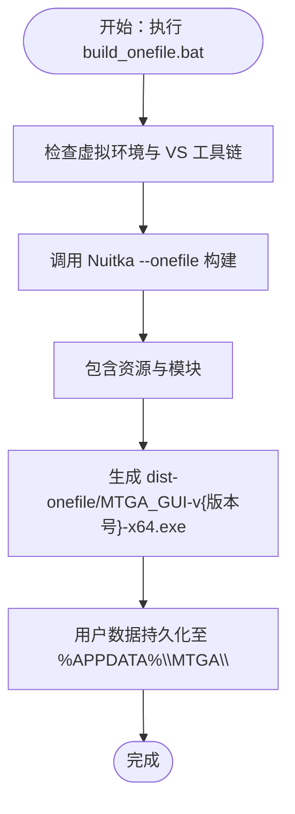
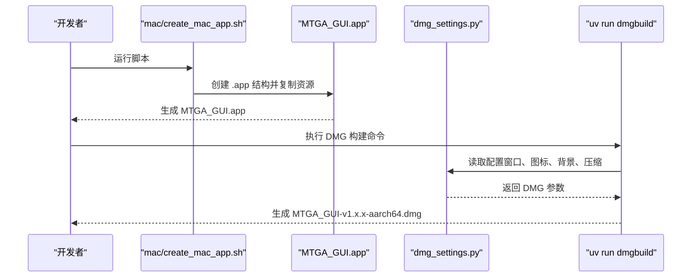
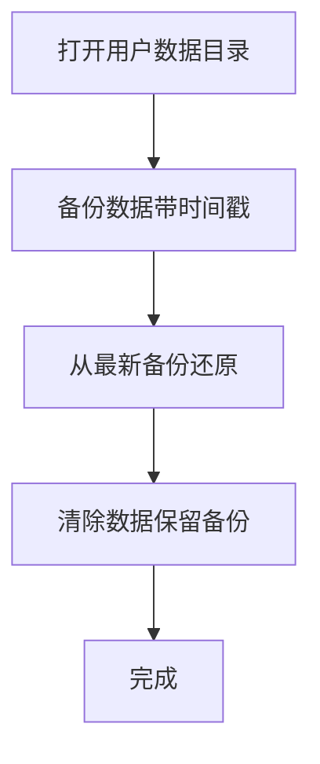
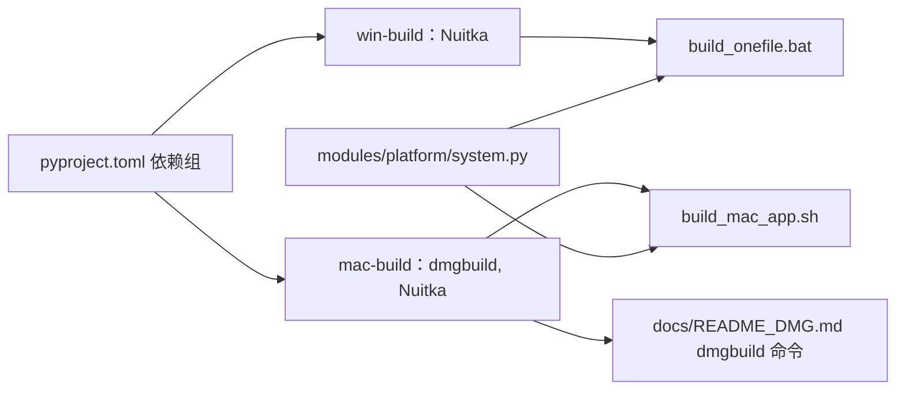

# 平台特定附加说明

<cite>
**本文引用的文件**
- [docs/Windows_Onefile_Build.md](file://docs/Windows_Onefile_Build.md)
- [docs/README_DMG.md](file://docs/README_DMG.md)
- [build_onefile.bat](file://build_onefile.bat)
- [build_standalone.bat](file://build_standalone.bat)
- [build_mac_app.sh](file://build_mac_app.sh)
- [mac/create_mac_app.sh](file://mac/create_mac_app.sh)
- [mac/dmg_settings.py](file://mac/dmg_settings.py)
- [mac/Info.plist](file://mac/Info.plist)
- [modules/services/user_data_service.py](file://modules/services/user_data_service.py)
- [modules/services/config_service.py](file://modules/services/config_service.py)
- [modules/platform/system.py](file://modules/platform/system.py)
- [pyproject.toml](file://pyproject.toml)
- [run_mtga_gui.sh](file://run_mtga_gui.sh)
</cite>

## 目录
1. [简介](#简介)
2. [项目结构](#项目结构)
3. [核心组件](#核心组件)
4. [架构总览](#架构总览)
5. [详细组件分析](#详细组件分析)
6. [依赖关系分析](#依赖关系分析)
7. [性能考量](#性能考量)
8. [故障排除指南](#故障排除指南)
9. [结论](#结论)
10. [附录](#附录)

## 简介
本文件整合并扩展平台专属的构建与分发指南，聚焦两大平台：
- Windows：使用 Nuitka 构建单文件可执行程序（--onefile），包含管理员权限提升、资源打包、输出命名规范与用户数据持久化机制。
- macOS：使用 create_mac_app.sh 打包 .app 应用，并通过 dmgbuild 与 dmg_settings.py 生成专业 DMG 安装镜像（UDZO 压缩、自定义背景与图标布局）。

同时提供两种构建方式的对比、CI/CD 集成建议，以及用户数据管理的最佳实践。

## 项目结构
围绕平台构建与分发的关键文件分布如下：
- Windows
  - 文档：docs/Windows_Onefile_Build.md
  - 构建脚本：build_onefile.bat、build_standalone.bat
  - 用户数据服务：modules/services/user_data_service.py
- macOS
  - 文档：docs/README_DMG.md
  - 应用打包：mac/create_mac_app.sh、mac/Info.plist
  - DMG 构建：mac/dmg_settings.py、build_mac_app.sh
  - 运行与环境：run_mtga_gui.sh
  - 项目配置：pyproject.toml

图表来源
- [docs/Windows_Onefile_Build.md](file://docs/Windows_Onefile_Build.md#L1-L172)
- [docs/README_DMG.md](file://docs/README_DMG.md#L1-L162)
- [build_onefile.bat](file://build_onefile.bat#L1-L212)
- [build_standalone.bat](file://build_standalone.bat#L1-L80)
- [build_mac_app.sh](file://build_mac_app.sh#L1-L180)
- [mac/create_mac_app.sh](file://mac/create_mac_app.sh#L1-L220)
- [mac/dmg_settings.py](file://mac/dmg_settings.py#L1-L70)
- [mac/Info.plist](file://mac/Info.plist#L1-L30)
- [modules/services/user_data_service.py](file://modules/services/user_data_service.py#L1-L236)
- [modules/platform/system.py](file://modules/platform/system.py#L1-L34)
- [pyproject.toml](file://pyproject.toml#L1-L85)
- [run_mtga_gui.sh](file://run_mtga_gui.sh#L1-L250)

章节来源
- [docs/Windows_Onefile_Build.md](file://docs/Windows_Onefile_Build.md#L1-L172)
- [docs/README_DMG.md](file://docs/README_DMG.md#L1-L162)
- [pyproject.toml](file://pyproject.toml#L1-L85)

## 核心组件
- Windows 单文件构建（Nuitka --onefile）
  - 环境依赖：Visual Studio 2022（MSVC 工具链）、Python 3.13（uv 管理）、uv
  - 关键参数：--onefile、--msvc=latest、--windows-uac-admin、--windows-console-mode=disable、--enable-plugin=tk-inter
  - 输出命名：dist-onefile/MTGA_GUI-v{版本号}-x64.exe
  - 用户数据持久化：%APPDATA%\MTGA\（包含配置、CA 证书、hosts 备份、备份目录）
- macOS 应用打包与 DMG 生成
  - 应用包：mac/create_mac_app.sh 创建 MTGA_GUI.app，包含 Info.plist、图标、模块与资源
  - DMG：dmg_settings.py 控制窗口尺寸、图标位置、背景图、压缩格式（UDZO）
  - DMG 构建：docs/README_DMG.md 提供 uv run dmgbuild 命令与依赖组
- 平台检测与配置
  - modules/platform/system.py 提供 is_windows/is_macos 等平台判断
  - pyproject.toml 定义依赖组（win-build、mac-build）与工具链

章节来源
- [build_onefile.bat](file://build_onefile.bat#L95-L128)
- [docs/Windows_Onefile_Build.md](file://docs/Windows_Onefile_Build.md#L16-L172)
- [modules/services/user_data_service.py](file://modules/services/user_data_service.py#L60-L158)
- [mac/create_mac_app.sh](file://mac/create_mac_app.sh#L34-L220)
- [mac/dmg_settings.py](file://mac/dmg_settings.py#L27-L70)
- [docs/README_DMG.md](file://docs/README_DMG.md#L56-L87)
- [modules/platform/system.py](file://modules/platform/system.py#L1-L34)
- [pyproject.toml](file://pyproject.toml#L42-L54)

## 架构总览
下图展示 Windows 与 macOS 平台的构建与分发流程，以及用户数据持久化路径。

图表来源
- [build_onefile.bat](file://build_onefile.bat#L95-L128)
- [docs/Windows_Onefile_Build.md](file://docs/Windows_Onefile_Build.md#L50-L76)
- [mac/create_mac_app.sh](file://mac/create_mac_app.sh#L34-L220)
- [mac/dmg_settings.py](file://mac/dmg_settings.py#L27-L70)
- [docs/README_DMG.md](file://docs/README_DMG.md#L56-L87)
- [pyproject.toml](file://pyproject.toml#L42-L54)
- [modules/platform/system.py](file://modules/platform/system.py#L1-L34)

## 详细组件分析

### Windows 单文件构建（Nuitka --onefile）
- 环境与依赖
  - Visual Studio 2022（MSVC 工具链）与 uv 管理 Python 3.13
  - 通过 uv sync --group win-build 安装构建所需依赖
- 构建参数与行为
  - --onefile：单文件可执行
  - --msvc=latest：使用最新 MSVC 编译器
  - --windows-uac-admin：自动请求管理员权限
  - --windows-console-mode=disable：禁用控制台窗口
  - --enable-plugin=tk-inter：启用 tkinter 支持
  - --include-data-files：打包 CA 配置、OpenSSL 可执行与 DLL、图标等资源
  - --include-package=modules：包含模块化组件
  - 输出文件名：dist-onefile/MTGA_GUI-v{版本号}-x64.exe
- 用户数据持久化
  - 存储位置：%APPDATA%\MTGA\
  - 包含：mtga_config.yaml、ca/、hosts.backup、backups/
  - UI 提供“用户数据管理”标签页：打开目录、备份数据、还原数据、清除数据

图表来源
- [build_onefile.bat](file://build_onefile.bat#L95-L128)
- [docs/Windows_Onefile_Build.md](file://docs/Windows_Onefile_Build.md#L50-L76)
- [modules/services/user_data_service.py](file://modules/services/user_data_service.py#L60-L158)

章节来源
- [docs/Windows_Onefile_Build.md](file://docs/Windows_Onefile_Build.md#L16-L172)
- [build_onefile.bat](file://build_onefile.bat#L95-L128)
- [modules/services/user_data_service.py](file://modules/services/user_data_service.py#L60-L158)

### macOS 应用打包与 DMG 生成
- 应用包结构
  - mac/create_mac_app.sh 创建 MTGA_GUI.app，包含：
    - Contents/Info.plist（CFBundleExecutable、CFBundleIdentifier、LSMinimumSystemVersion 等）
    - Contents/MacOS/MTGA_GUI（可执行文件）
    - Contents/Resources/icon.png（图标）
    - Contents/Resources/mtga_project/（项目文件与 modules/）
  - 依赖复制：ca/、openssl/、modules/ 等目录被复制到应用包内（部分文件可能因权限问题跳过）
- DMG 配置与构建
  - dmg_settings.py 定义：
    - volume_name、format=UDZO、files、symlinks、icon_locations、window_rect、background 等
  - docs/README_DMG.md 提供使用 uv run dmgbuild -s mac/dmg_settings.py "MTGA GUI Installer" MTGA_GUI-v1.x.x-aarch64.dmg 的命令
- 运行与环境
  - run_mtga_gui.sh 提供 uv 安装、虚拟环境创建与依赖同步、OpenSSL 检测、TCL/TK 路径设置、sudo 提权运行等

图表来源
- [mac/create_mac_app.sh](file://mac/create_mac_app.sh#L34-L220)
- [mac/dmg_settings.py](file://mac/dmg_settings.py#L27-L70)
- [docs/README_DMG.md](file://docs/README_DMG.md#L56-L87)

章节来源
- [mac/create_mac_app.sh](file://mac/create_mac_app.sh#L34-L220)
- [mac/Info.plist](file://mac/Info.plist#L1-L30)
- [mac/dmg_settings.py](file://mac/dmg_settings.py#L27-L70)
- [docs/README_DMG.md](file://docs/README_DMG.md#L56-L87)
- [run_mtga_gui.sh](file://run_mtga_gui.sh#L182-L250)

### 用户数据持久化机制（Windows）
- 存储位置：%APPDATA%\MTGA\
- 包含内容：mtga_config.yaml、ca/、hosts.backup、backups/
- 功能：备份、还原、清除、打开目录等，均由模块化服务实现

图表来源
- [modules/services/user_data_service.py](file://modules/services/user_data_service.py#L60-L158)

章节来源
- [modules/services/user_data_service.py](file://modules/services/user_data_service.py#L60-L158)
- [docs/Windows_Onefile_Build.md](file://docs/Windows_Onefile_Build.md#L77-L95)

### 配置与平台检测
- 配置文件：modules/services/config_service.py 提供 YAML 配置的加载与保存（config_groups、current_config_index、mapped_model_id、mtga_auth_key）
- 平台检测：modules/platform/system.py 提供 is_windows/is_macos 等判断，辅助跨平台逻辑

章节来源
- [modules/services/config_service.py](file://modules/services/config_service.py#L10-L81)
- [modules/platform/system.py](file://modules/platform/system.py#L1-L34)

## 依赖关系分析
- 依赖组（pyproject.toml）
  - win-build：Nuitka（Windows）
  - mac-build：dmgbuild、Nuitka（macOS）
- 构建脚本与工具链
  - Windows：build_onefile.bat 通过 uv run 调用 Nuitka
  - macOS：build_mac_app.sh 通过 uv run 调用 Nuitka；docs/README_DMG.md 通过 uv run 调用 dmgbuild
- 平台检测
  - modules/platform/system.py 为跨平台逻辑提供基础

图表来源
- [pyproject.toml](file://pyproject.toml#L42-L54)
- [build_onefile.bat](file://build_onefile.bat#L95-L128)
- [build_mac_app.sh](file://build_mac_app.sh#L87-L118)
- [docs/README_DMG.md](file://docs/README_DMG.md#L64-L66)
- [modules/platform/system.py](file://modules/platform/system.py#L1-L34)

章节来源
- [pyproject.toml](file://pyproject.toml#L42-L54)
- [build_onefile.bat](file://build_onefile.bat#L95-L128)
- [build_mac_app.sh](file://build_mac_app.sh#L87-L118)
- [docs/README_DMG.md](file://docs/README_DMG.md#L64-L66)
- [modules/platform/system.py](file://modules/platform/system.py#L1-L34)

## 性能考量
- Windows 单文件构建
  - 首次运行需要解压，启动较慢；后续运行较快
  - 构建时间较长（约 30-40 分钟），建议在空闲时段执行
- macOS 应用包
  - 独立运行，启动快，无需解压
  - DMG 使用 UDZO 压缩，体积较小，安装体验好
- CI/CD 建议
  - 使用缓存（uv cache、Nuitka 编译缓存）
  - 并行构建不同平台产物
  - 为 DMG 与 EXE 生成校验和，便于分发验证

## 故障排除指南
- Windows
  - Visual Studio 未找到：安装 Visual Studio 2022（含 C++ 构建工具）
  - 虚拟环境问题：执行 uv sync --group win-build
  - 构建时间过长：首次构建更慢，避免高负载任务
  - 运行时解压慢：可考虑独立版本（build_standalone.bat）用于开发测试
- macOS
  - 依赖安装问题：执行 uv sync --group mac-build；确保 Xcode Command Line Tools 已安装
  - 背景图问题：确保 dmg_background.png 存在且尺寸匹配 window_rect；SVG 修改后需重新转换为 PNG
  - DMG 构建失败：检查 MTGA_GUI.app 是否完整；确认磁盘空间与文件权限

章节来源
- [docs/Windows_Onefile_Build.md](file://docs/Windows_Onefile_Build.md#L112-L172)
- [docs/README_DMG.md](file://docs/README_DMG.md#L119-L136)

## 结论
- Windows 推荐使用单文件构建（--onefile）以简化分发，配合管理员权限与用户数据持久化机制满足生产需求。
- macOS 推荐使用 .app 应用包与 DMG 安装镜像，结合 UDZO 压缩与自定义背景/图标布局，提供专业用户体验。
- 两种方式各有优势：单文件便于分发但首次运行较慢；独立应用包启动快、便于系统集成；DMG 安装体验佳、适合最终用户交付。
- 建议在 CI/CD 中引入缓存、并行构建与校验和，提升效率与可靠性。

## 附录
- 与独立版本对比（Windows）
  - 单文件版本：1 个 exe，便于分发；首次运行较慢；包含所有依赖；自动请求管理员权限
  - 独立版本：多文件目录；启动快；便于调试；适合开发测试
- CI/CD 集成建议
  - Windows：在构建前执行 uv sync --group win-build；使用缓存 .venv 与 dist-onefile；生成 SHA256 校验和
  - macOS：在构建前执行 uv sync --group mac-build；使用缓存 .venv 与 dist-onefile；生成 DMG 校验和；在 Apple 签名与公证流程中保持一致性

章节来源
- [docs/Windows_Onefile_Build.md](file://docs/Windows_Onefile_Build.md#L146-L172)
- [build_standalone.bat](file://build_standalone.bat#L1-L80)
- [docs/README_DMG.md](file://docs/README_DMG.md#L104-L118)