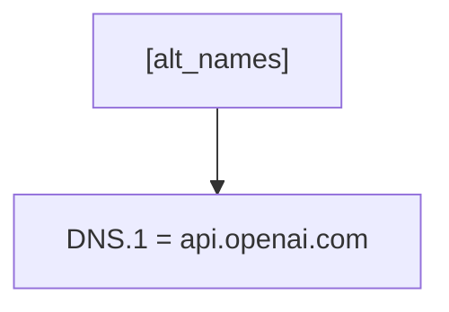
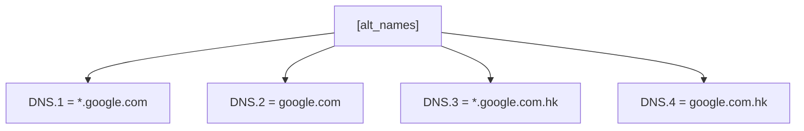
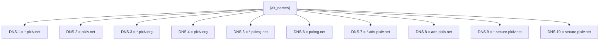
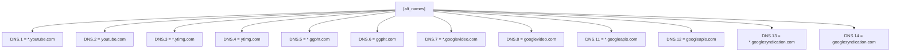
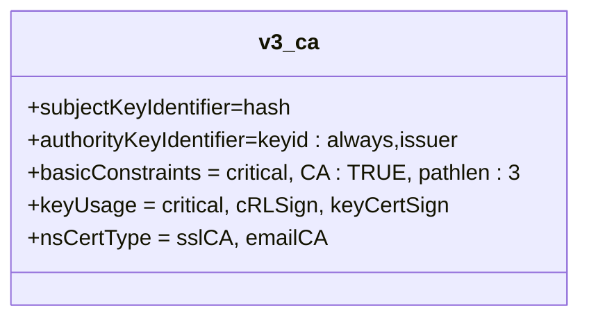
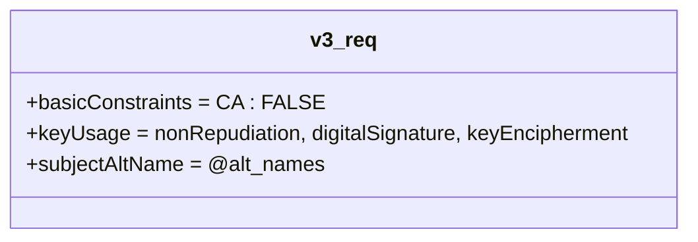
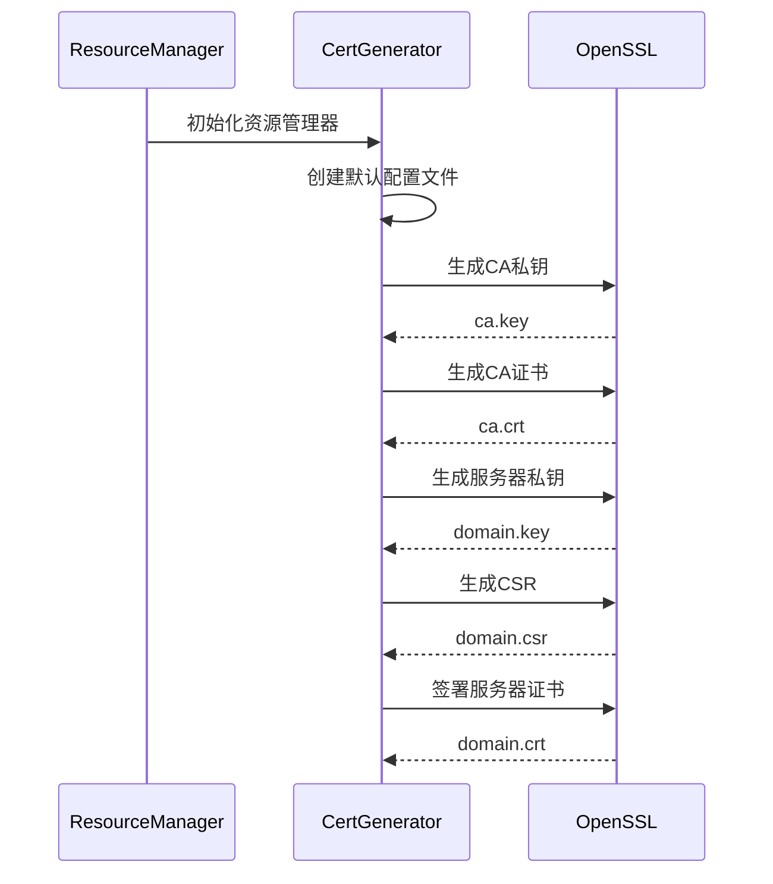
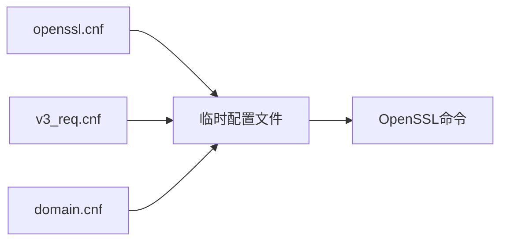
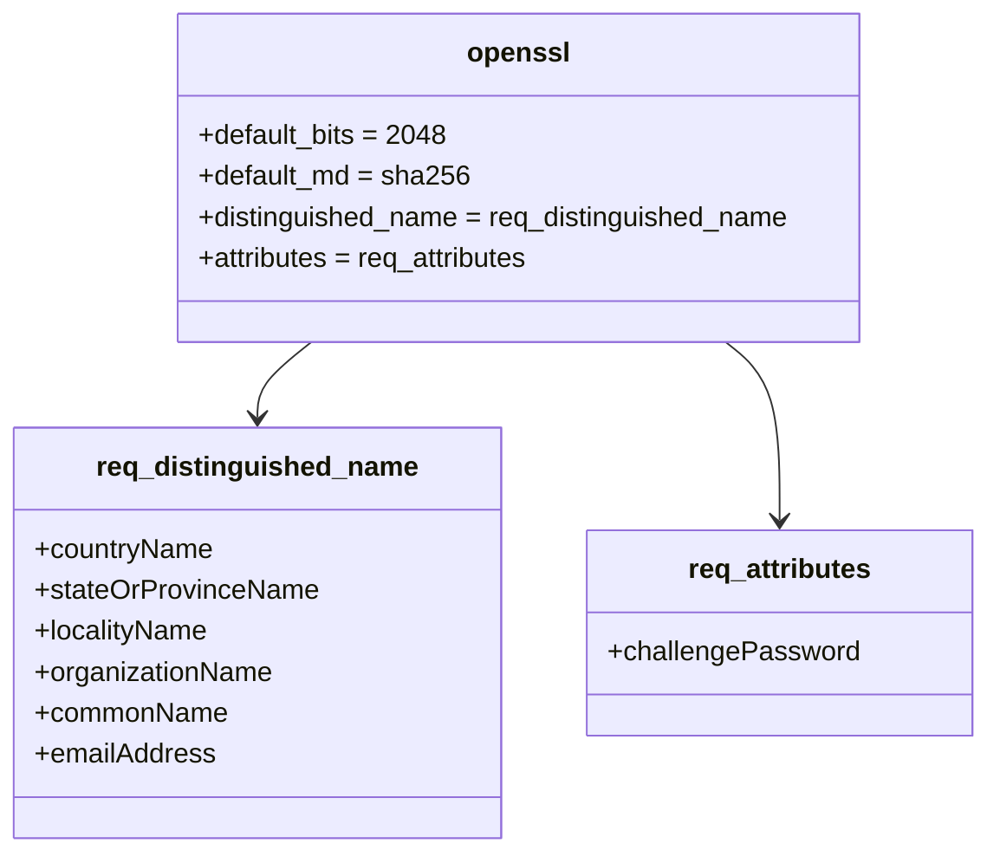
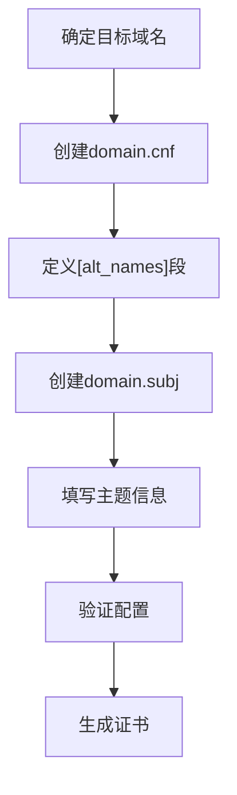

# 服务商配置模板

<cite>
**本文档中引用的文件**   
- [v3_ca.cnf](file://ca/v3_ca.cnf)
- [v3_req.cnf](file://ca/v3_req.cnf)
- [openssl.cnf](file://ca/openssl.cnf)
- [api.openai.com.cnf](file://ca/api.openai.com.cnf)
- [google.cnf](file://ca/google.cnf)
- [pixiv.cnf](file://ca/pixiv.cnf)
- [youtube.cnf](file://ca/youtube.cnf)
- [cert_generator.py](file://modules/cert/cert_generator.py)
- [api.openai.com.subj](file://ca/api.openai.com.subj)
- [google.subj](file://ca/google.subj)
- [pixiv.subj](file://ca/pixiv.subj)
- [youtube.subj](file://ca/youtube.subj)
</cite>

## 目录
1. [简介](#简介)
2. [服务商证书配置模板](#服务商证书配置模板)
3. [通用证书扩展配置](#通用证书扩展配置)
4. [证书生成器实现](#证书生成器实现)
5. [配置模板集成](#配置模板集成)
6. [新服务商添加指南](#新服务商添加指南)
7. [实际配置示例](#实际配置示例)
8. [结论](#结论)

## 简介
本项目提供了一套完整的证书生成系统，用于为各种服务商（如OpenAI、Google、Pixiv、YouTube等）创建HTTPS代理所需的X.509证书。系统通过预置的配置模板和自动化脚本，实现了证书的批量生成和管理。核心机制基于OpenSSL配置文件，通过Subject Alternative Name（SAN）扩展支持多域名证书，确保代理能够正确处理目标服务商的HTTPS流量。

**Section sources**
- [cert_generator.py](file://modules/cert/cert_generator.py#L1-L446)

## 服务商证书配置模板
项目在`ca/`目录下为每个服务商提供了专门的`.cnf`和`.subj`配置文件。`.cnf`文件定义了证书的扩展属性，特别是`[alt_names]`段中的DNS条目，而`.subj`文件包含了证书的主题信息。

### OpenAI配置模板
OpenAI的配置模板定义了api.openai.com域名的证书配置。



**Diagram sources**
- [api.openai.com.cnf](file://ca/api.openai.com.cnf#L1-L3)

**Section sources**
- [api.openai.com.cnf](file://ca/api.openai.com.cnf#L1-L3)
- [api.openai.com.subj](file://ca/api.openai.com.subj#L1-L2)

### Google配置模板
Google的配置模板使用通配符覆盖了Google的主要域名和服务。



**Diagram sources**
- [google.cnf](file://ca/google.cnf#L1-L6)

**Section sources**
- [google.cnf](file://ca/google.cnf#L1-L6)
- [google.subj](file://ca/google.subj#L1-L2)

### Pixiv配置模板
Pixiv的配置模板覆盖了Pixiv网络的主要子域，包括图片托管和广告服务。



**Diagram sources**
- [pixiv.cnf](file://ca/pixiv.cnf#L1-L12)

**Section sources**
- [pixiv.cnf](file://ca/pixiv.cnf#L1-L12)
- [pixiv.subj](file://ca/pixiv.subj#L1-L2)

### YouTube配置模板
YouTube的配置模板不仅包括主域名，还涵盖了视频托管、图片服务和Google的API及广告网络。



**Diagram sources**
- [youtube.cnf](file://ca/youtube.cnf#L1-L14)

**Section sources**
- [youtube.cnf](file://ca/youtube.cnf#L1-L14)
- [youtube.subj](file://ca/youtube.subj#L1-L2)

## 通用证书扩展配置
项目提供了两个通用的证书扩展配置文件：`v3_ca.cnf`和`v3_req.cnf`，分别用于CA证书和服务器证书的生成。

### v3_ca.cnf - CA证书配置
该配置文件定义了CA证书的扩展属性，使其能够作为根证书颁发机构。



**Diagram sources**
- [v3_ca.cnf](file://ca/v3_ca.cnf#L1-L7)

**Section sources**
- [v3_ca.cnf](file://ca/v3_ca.cnf#L1-L7)

### v3_req.cnf - 服务器证书请求配置
该配置文件定义了服务器证书请求的扩展属性，特别是通过`subjectAltName`引用`alt_names`段。



**Diagram sources**
- [v3_req.cnf](file://ca/v3_req.cnf#L1-L5)

**Section sources**
- [v3_req.cnf](file://ca/v3_req.cnf#L1-L5)

## 证书生成器实现
`cert_generator.py`模块实现了证书生成的核心逻辑，将原有的shell脚本功能模块化，支持直接函数调用。

### 证书生成流程
证书生成器通过一系列步骤创建CA证书和服务器证书。



**Diagram sources**
- [cert_generator.py](file://modules/cert/cert_generator.py#L206-L383)

**Section sources**
- [cert_generator.py](file://modules/cert/cert_generator.py#L206-L383)

### 配置文件合并机制
证书生成器动态合并多个配置文件以创建临时的OpenSSL配置。



**Diagram sources**
- [cert_generator.py](file://modules/cert/cert_generator.py#L237-L238)

**Section sources**
- [cert_generator.py](file://modules/cert/cert_generator.py#L237-L238)

## 配置模板集成
`openssl.cnf`是OpenSSL的主配置文件，定义了证书生成的基本参数。



**Diagram sources**
- [openssl.cnf](file://ca/openssl.cnf#L1-L24)

**Section sources**
- [openssl.cnf](file://ca/openssl.cnf#L1-L24)

## 新服务商添加指南
添加新服务商时，需要遵循特定的命名规范和字段要求。

### 命名规范
- 配置文件名必须与目标域名完全匹配，后缀为`.cnf`
- 主题文件名必须与目标域名完全匹配，后缀为`.subj`
- 文件应放置在`ca/`目录下

### 字段要求
- `.cnf`文件必须包含`[alt_names]`段
- 每个DNS条目必须以`DNS.`开头，后跟递增的数字
- `.subj`文件必须包含完整的X.509主题信息



**Diagram sources**
- [cert_generator.py](file://modules/cert/cert_generator.py#L217-L218)

**Section sources**
- [cert_generator.py](file://modules/cert/cert_generator.py#L217-L218)

## 实际配置示例
以下是为新服务商创建配置文件的实际示例。

### 示例：添加GitHub支持
```ini
# ca/github.com.cnf
[alt_names]
DNS.1 = github.com
DNS.2 = *.github.com
DNS.3 = api.github.com
DNS.4 = *.githubusercontent.com
```

```ini
# ca/github.com.subj
/C=US/ST=California/L=San Francisco/O=GitHub/OU=Platform/CN=github.com
```

**Section sources**
- [api.openai.com.cnf](file://ca/api.openai.com.cnf#L1-L3)
- [api.openai.com.subj](file://ca/api.openai.com.subj#L1-L2)

## 结论
本项目的证书配置模板系统提供了一种灵活且可扩展的方式来管理多个服务商的HTTPS证书。通过标准化的配置文件结构和自动化生成流程，开发者可以轻松地为新的API端点添加支持。`[alt_names]`段中的DNS字段是关键，它确保了代理能够正确处理目标域名的HTTPS流量，而通用的`v3_ca.cnf`和`v3_req.cnf`配置文件则保证了证书符合行业标准。