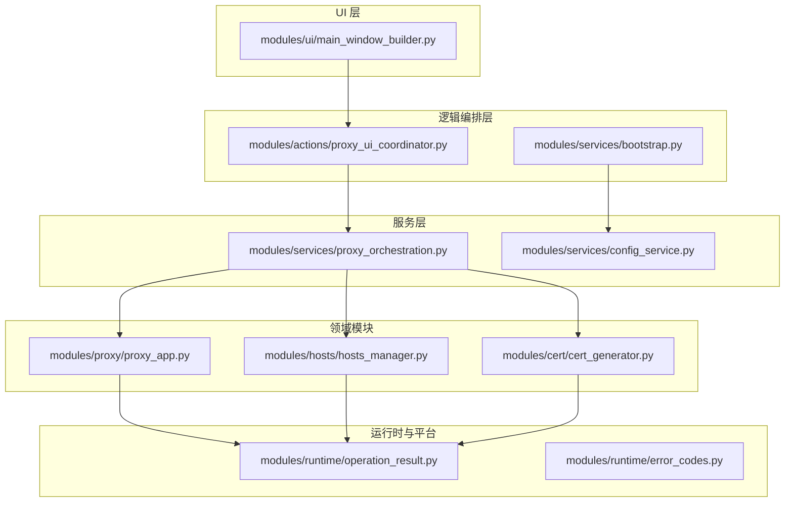
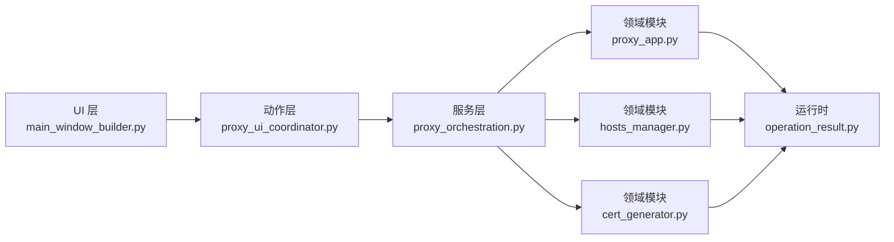
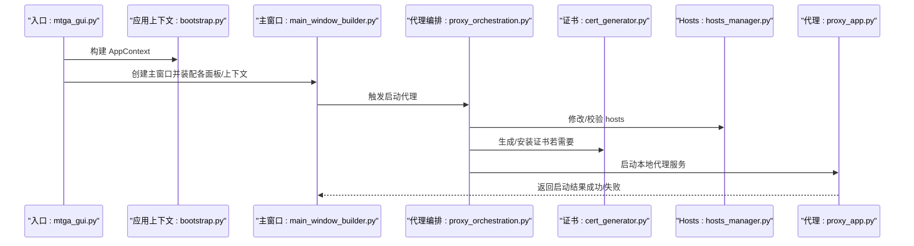
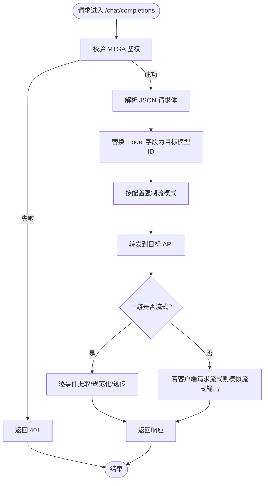
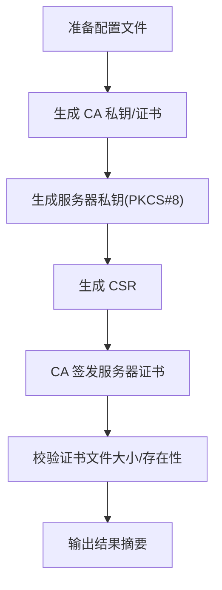
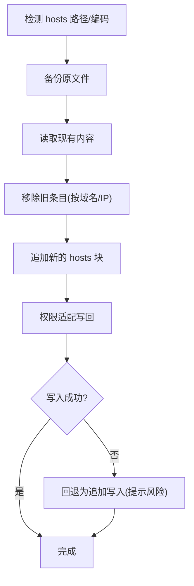
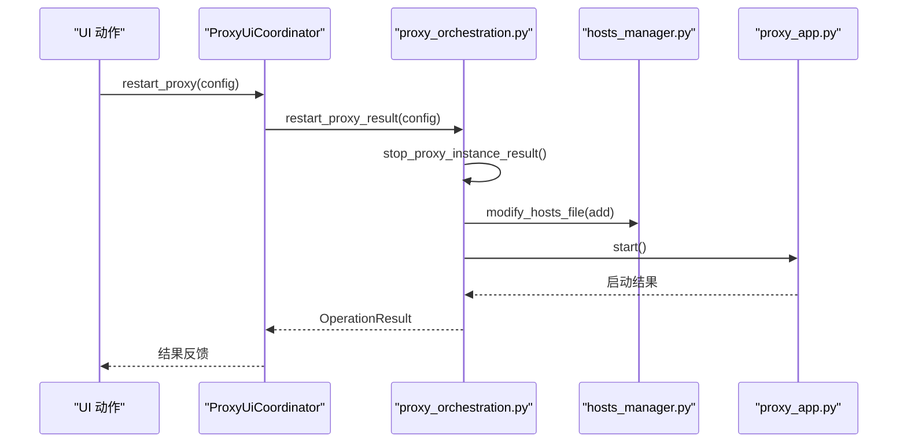
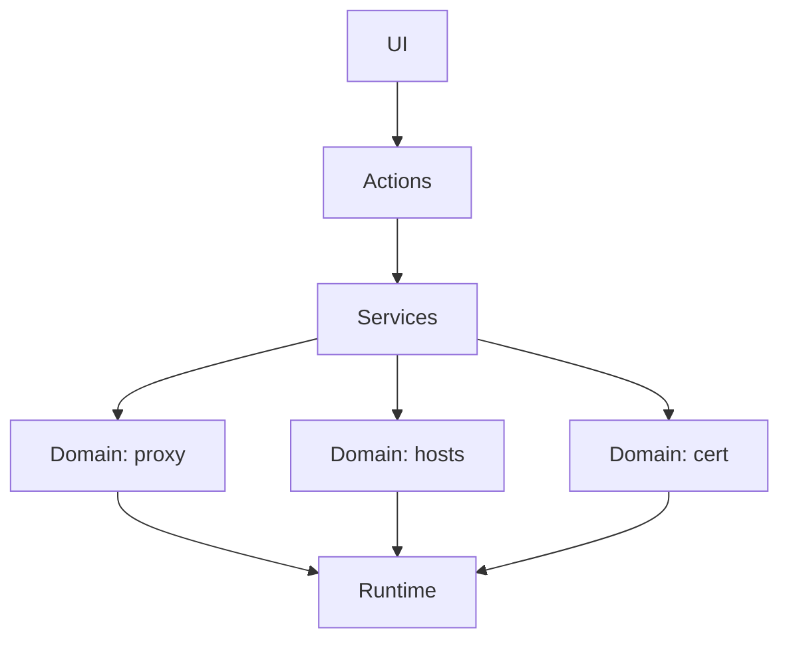

# 项目概述

<cite>
**本文引用的文件**
- [README.md](file://README.md)
- [mtga_gui.py](file://mtga_gui.py)
- [docs/ARCHITECTURE.md](file://docs/ARCHITECTURE.md)
- [modules/services/bootstrap.py](file://modules/services/bootstrap.py)
- [modules/runtime/operation_result.py](file://modules/runtime/operation_result.py)
- [modules/proxy/proxy_app.py](file://modules/proxy/proxy_app.py)
- [modules/cert/cert_generator.py](file://modules/cert/cert_generator.py)
- [modules/hosts/hosts_manager.py](file://modules/hosts/hosts_manager.py)
- [modules/actions/proxy_ui_coordinator.py](file://modules/actions/proxy_ui_coordinator.py)
- [modules/ui/main_window_builder.py](file://modules/ui/main_window_builder.py)
- [modules/services/proxy_orchestration.py](file://modules/services/proxy_orchestration.py)
- [modules/runtime/error_codes.py](file://modules/runtime/error_codes.py)
- [modules/services/config_service.py](file://modules/services/config_service.py)
</cite>

## 目录
1. [引言](#引言)
2. [项目结构](#项目结构)
3. [核心组件](#核心组件)
4. [架构总览](#架构总览)
5. [详细组件分析](#详细组件分析)
6. [依赖关系分析](#依赖关系分析)
7. [性能考量](#性能考量)
8. [故障排查指南](#故障排查指南)
9. [结论](#结论)
10. [附录](#附录)

## 引言
ModelRelay（MTGA）是一个面向开发者与企业用户的本地 HTTPS 代理与证书管理工具，旨在将自定义 OpenAI 格式 API 无缝接入 Trae IDE 等开发环境。通过在本机生成并安装受信任的 CA 证书、修改系统 hosts 将 api.openai.com 指向 127.0.0.1，再启动本地代理服务，Trae IDE 会将 OpenAI 风格的请求透明转发至用户自定义的目标 API，从而实现私有化部署、绕过服务商限制、统一模型 ID 映射与流式兼容等能力。项目同时提供图形化 GUI 与脚本化启动两种方式，覆盖 Windows 与 macOS 平台。

## 项目结构
项目采用“UI -> actions -> services -> 领域模块（cert/hosts/network/proxy/update）-> runtime/platform”的分层架构，强调依赖倒置与职责分离，避免 UI 直接依赖领域模块，所有副作用通过 services 层统一编排。

图表来源
- [modules/ui/main_window_builder.py](file://modules/ui/main_window_builder.py#L59-L208)
- [modules/actions/proxy_ui_coordinator.py](file://modules/actions/proxy_ui_coordinator.py#L25-L123)
- [modules/services/proxy_orchestration.py](file://modules/services/proxy_orchestration.py#L1-L200)
- [modules/services/bootstrap.py](file://modules/services/bootstrap.py#L18-L29)
- [modules/services/config_service.py](file://modules/services/config_service.py#L10-L81)
- [modules/cert/cert_generator.py](file://modules/cert/cert_generator.py#L1-L446)
- [modules/hosts/hosts_manager.py](file://modules/hosts/hosts_manager.py#L1-L492)
- [modules/proxy/proxy_app.py](file://modules/proxy/proxy_app.py#L1-L462)
- [modules/runtime/operation_result.py](file://modules/runtime/operation_result.py#L9-L41)
- [modules/runtime/error_codes.py](file://modules/runtime/error_codes.py#L6-L20)

章节来源
- [README.md](file://README.md#L283-L292)
- [docs/ARCHITECTURE.md](file://docs/ARCHITECTURE.md#L1-L250)

## 核心组件
- GUI 启动入口与上下文装配：mtga_gui.py 负责环境初始化、平台辅助（macOS 权限助手）、应用上下文构建与主窗口创建。
- 代理服务核心：ProxyApp 提供 OpenAI 风格路由（/models、/chat/completions），负责鉴权、模型 ID 映射、流式 SSE 处理与上游转发。
- 证书管理：cert_generator 提供 CA 与服务器证书生成、配置文件准备、OpenSSL 子进程调用与日志输出。
- Hosts 管理：hosts_manager 提供跨平台 hosts 文件备份、原子写入、权限适配、回退策略与打开编辑器能力。
- 代理编排：proxy_orchestration 负责网络环境检查、端口占用检测、启动/停止代理实例、与 hosts/证书动作的协调。
- 配置存储：config_service 提供 YAML 配置组与全局配置（映射模型 ID、鉴权 Key）的读写。
- 运行时结果与错误码：operation_result 与 error_codes 统一错误处理契约，便于 UI 与服务层传递结构化结果。

章节来源
- [mtga_gui.py](file://mtga_gui.py#L114-L145)
- [modules/proxy/proxy_app.py](file://modules/proxy/proxy_app.py#L18-L66)
- [modules/cert/cert_generator.py](file://modules/cert/cert_generator.py#L386-L446)
- [modules/hosts/hosts_manager.py](file://modules/hosts/hosts_manager.py#L459-L492)
- [modules/services/proxy_orchestration.py](file://modules/services/proxy_orchestration.py#L153-L200)
- [modules/services/config_service.py](file://modules/services/config_service.py#L10-L81)
- [modules/runtime/operation_result.py](file://modules/runtime/operation_result.py#L9-L41)
- [modules/runtime/error_codes.py](file://modules/runtime/error_codes.py#L6-L20)

## 架构总览
下图展示 GUI、动作编排、服务层与领域模块之间的交互关系，体现依赖倒置与分层约束。

图表来源
- [modules/ui/main_window_builder.py](file://modules/ui/main_window_builder.py#L118-L135)
- [modules/actions/proxy_ui_coordinator.py](file://modules/actions/proxy_ui_coordinator.py#L25-L123)
- [modules/services/proxy_orchestration.py](file://modules/services/proxy_orchestration.py#L153-L200)
- [modules/cert/cert_generator.py](file://modules/cert/cert_generator.py#L386-L446)
- [modules/hosts/hosts_manager.py](file://modules/hosts/hosts_manager.py#L459-L492)
- [modules/proxy/proxy_app.py](file://modules/proxy/proxy_app.py#L18-L66)
- [modules/runtime/operation_result.py](file://modules/runtime/operation_result.py#L9-L41)

## 详细组件分析

### GUI 启动流程与入口点
- 入口：mtga_gui.py 在早期设置语言环境与 UTF-8 编码，随后构建应用上下文（资源管理、线程管理、配置存储），并根据平台特性处理 macOS 权限助手参数。
- 主窗口装配：通过 main_window_builder 构建主窗口，注入配置面板、全局配置面板、代理上下文、更新检查控制器与页签布局，最终进入事件循环。

图表来源
- [mtga_gui.py](file://mtga_gui.py#L70-L82)
- [modules/services/bootstrap.py](file://modules/services/bootstrap.py#L18-L29)
- [modules/ui/main_window_builder.py](file://modules/ui/main_window_builder.py#L118-L135)
- [modules/services/proxy_orchestration.py](file://modules/services/proxy_orchestration.py#L153-L200)
- [modules/cert/cert_generator.py](file://modules/cert/cert_generator.py#L386-L446)
- [modules/hosts/hosts_manager.py](file://modules/hosts/hosts_manager.py#L459-L492)
- [modules/proxy/proxy_app.py](file://modules/proxy/proxy_app.py#L18-L66)

章节来源
- [mtga_gui.py](file://mtga_gui.py#L114-L145)
- [modules/ui/main_window_builder.py](file://modules/ui/main_window_builder.py#L59-L208)
- [docs/ARCHITECTURE.md](file://docs/ARCHITECTURE.md#L246-L250)

### 代理服务与模型 ID 映射
- 路由与鉴权：ProxyApp 注册 /models 与 /chat/completions 路由，使用 ProxyAuth 校验 Authorization 头，确保只有持有正确 MTGA 鉴权 Key 的请求才能访问。
- 模型 ID 映射：在 /models 接口中返回用户配置的映射模型 ID；在 /chat/completions 中，将客户端请求中的 model 字段替换为目标模型 ID，并可强制流模式。
- 流式处理：当上游返回 SSE 时，逐事件提取、规范化并透传；当上游非流式而客户端请求流式时，模拟流式输出，保证 Trae 体验一致。
- 上游转发：通过 ProxyTransport 使用 requests 会话发起 HTTPS 请求，支持禁用严格 SSL 校验（调试场景）。

图表来源
- [modules/proxy/proxy_app.py](file://modules/proxy/proxy_app.py#L164-L462)

章节来源
- [modules/proxy/proxy_app.py](file://modules/proxy/proxy_app.py#L18-L66)
- [modules/proxy/proxy_app.py](file://modules/proxy/proxy_app.py#L164-L462)

### 证书生成与安装（CA 与服务器证书）
- 配置准备：在 ca 目录生成 openssl.cnf、v3_ca.cnf、v3_req.cnf、api.openai.com.cnf 与 subj 文件，确保 OpenSSL 命令可复用。
- CA 证书：生成 ca.key 与 ca.crt，支持自定义 CN（默认 MTGA_CA）。
- 服务器证书：生成 api.openai.com.key（PKCS#8 格式）与 csr，使用 CA 签发 api.openai.com.crt，并进行完整性校验。
- OpenSSL 调用：通过子进程执行 OpenSSL 命令，捕获 stdout/stderr 并输出日志；对序列号文件权限问题进行特殊处理。
- GUI 集成：GUI 侧通过 generate_certificates 与 install_ca_cert（由入口注入）完成一键生成与安装。

图表来源
- [modules/cert/cert_generator.py](file://modules/cert/cert_generator.py#L45-L123)
- [modules/cert/cert_generator.py](file://modules/cert/cert_generator.py#L125-L204)
- [modules/cert/cert_generator.py](file://modules/cert/cert_generator.py#L206-L384)
- [modules/cert/cert_generator.py](file://modules/cert/cert_generator.py#L386-L446)

章节来源
- [modules/cert/cert_generator.py](file://modules/cert/cert_generator.py#L1-L446)

### Hosts 文件管理（备份、原子写入、权限适配）
- 跨平台路径：Windows 通过 WinAPI 获取系统目录，Unix 系列默认 /etc/hosts。
- 原子写入：先备份，再移除旧条目，追加新块，最后以权限适配的方式写回，保证一致性与可恢复性。
- 回退策略：当原子写入受限时，回退为追加写入，明确提示无法保证去重/原子性。
- 打开编辑器：根据平台调用 notepad/gedit/nano/vim/open 等工具打开 hosts 文件。
- GUI 集成：通过 hosts_runner 调用 modify_hosts_file，支持 add/remove/backup/restore。

图表来源
- [modules/hosts/hosts_manager.py](file://modules/hosts/hosts_manager.py#L264-L358)
- [modules/hosts/hosts_manager.py](file://modules/hosts/hosts_manager.py#L360-L407)
- [modules/hosts/hosts_manager.py](file://modules/hosts/hosts_manager.py#L409-L457)
- [modules/hosts/hosts_manager.py](file://modules/hosts/hosts_manager.py#L459-L492)

章节来源
- [modules/hosts/hosts_manager.py](file://modules/hosts/hosts_manager.py#L1-L492)

### 代理编排与生命周期
- 全局配置校验：确保映射模型 ID 与 MTGA 鉴权 Key 已配置，否则提示缺失字段。
- 启停控制：stop_proxy_instance_result 负责停止运行中的实例；start_proxy_instance_result 在前置检查（端口占用、hosts 修改）通过后启动 ProxyServer。
- 重启流程：restart_proxy_result 先停止旧实例，再启动新实例，支持日志与错误码传递。

图表来源
- [modules/actions/proxy_ui_coordinator.py](file://modules/actions/proxy_ui_coordinator.py#L64-L123)
- [modules/services/proxy_orchestration.py](file://modules/services/proxy_orchestration.py#L70-L200)
- [modules/hosts/hosts_manager.py](file://modules/hosts/hosts_manager.py#L459-L492)
- [modules/proxy/proxy_app.py](file://modules/proxy/proxy_app.py#L18-L66)

章节来源
- [modules/actions/proxy_ui_coordinator.py](file://modules/actions/proxy_ui_coordinator.py#L1-L123)
- [modules/services/proxy_orchestration.py](file://modules/services/proxy_orchestration.py#L1-L200)

### 配置存储与模型 ID 映射机制
- 配置文件：YAML 格式，包含 config_groups、current_config_index、mapped_model_id、mtga_auth_key 等字段。
- 加载与保存：load_config_groups 返回当前配置组与索引；save_config_groups 支持更新配置组与全局字段；get_current_config 返回当前生效配置。
- 模型 ID 映射：在 GUI 中填写映射模型 ID（如 my-custom-local-model），在代理服务中通过 ProxyApp 的 _get_mapped_model_id 返回该 ID，使 Trae 认为该模型存在。

章节来源
- [modules/services/config_service.py](file://modules/services/config_service.py#L10-L81)
- [modules/proxy/proxy_app.py](file://modules/proxy/proxy_app.py#L85-L87)

## 依赖关系分析
- 分层依赖：UI -> actions -> services -> 领域模块 -> runtime/platform，避免 UI 直接依赖领域模块。
- 依赖倒置：services 作为副作用边界，封装平台差异（macOS 权限、Windows hosts 写入）。
- 错误处理契约：统一使用 OperationResult 与 ErrorCode，失败时携带 code 与 details，便于 UI 与日志系统消费。

图表来源
- [docs/ARCHITECTURE.md](file://docs/ARCHITECTURE.md#L1-L250)
- [modules/runtime/operation_result.py](file://modules/runtime/operation_result.py#L9-L41)
- [modules/runtime/error_codes.py](file://modules/runtime/error_codes.py#L6-L20)

章节来源
- [docs/ARCHITECTURE.md](file://docs/ARCHITECTURE.md#L1-L250)

## 性能考量
- 本地代理：请求在本机完成 TLS 终止、模型 ID 映射与转发，延迟主要取决于上游 API 响应时间与网络状况。
- 流式兼容：代理对 SSE 事件进行逐事件处理与规范化，避免一次性缓冲大响应；当上游非流式而客户端请求流式时，采用分片模拟，兼顾体验与内存占用。
- 端口占用检测：启动前检查 443 端口占用，避免冲突导致的启动失败与资源浪费。
- 平台差异：macOS 通过特权助手进行文件写入，Windows 通过权限检查与只读属性处理，减少失败重试与 IO 开销。

## 故障排查指南
- 端口冲突：若 443 被占用（如浏览器、VPN、IIS 等），代理启动会失败。请释放端口或调整服务。
- 证书问题：确保 CA 证书已安装到系统受信任的根证书颁发机构，且代理加载的服务器证书与私钥路径正确。
- hosts 修改：确认 hosts 中包含 api.openai.com 指向 127.0.0.1 的条目且未被注释；若写入受限，回退策略会提示风险。
- Trae 添加模型失败：检查 hosts 条目、端口占用与代理日志；必要时重新启动代理并刷新缓存。
- macOS “包已损坏”：可通过 Sentinel 或 xattr 命令移除 quarantine 属性后启动。

章节来源
- [README.md](file://README.md#L143-L157)
- [README.md](file://README.md#L160-L268)

## 结论
ModelRelay 通过本地 HTTPS 代理、证书生成与 Hosts 修改，实现了将任意 OpenAI 格式 API 接入 Trae IDE 的能力。其分层架构与 OperationResult 模式确保了可维护性与可观测性；模型 ID 映射与流式兼容提升了用户体验；跨平台支持与平台特权适配保障了部署一致性。对于初学者，项目提供了 GUI 与脚本两种入门路径；对于高级用户，其模块化设计与清晰的依赖约束便于二次开发与扩展。

## 附录
- 快速开始（Windows/GUI）：下载 GUI 可执行文件，填写 API URL 与模型 ID，一键启动全部服务，自动完成证书生成/安装、hosts 修改与代理启动。
- 快速开始（macOS）：安装 DMG 应用，启动后填写 API URL，点击启动，按提示在钥匙串中信任 CA 证书，再启动代理。
- 脚本启动（Windows）：生成 CA 与服务器证书，安装 CA 到受信任根，修改 hosts，运行代理脚本，配置 Trae IDE。

章节来源
- [README.md](file://README.md#L61-L113)
- [README.md](file://README.md#L160-L273)